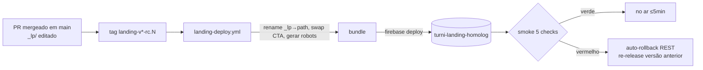

# Runbook — Landing institucional `turni.com.br`

> Versão: STORY-032 (EPIC-006). Ambiente atual: **homologação** —
> `landing.homolog.turni.com.br`. Produção (`turni.com.br`) só existe **após o
> go-public** (P6), que está gated por `landing_prod_enabled = false` no Terraform.
>
> Este runbook fixa **como cada operação é feita tecnicamente**. **Quem decide o
> quê** está em **PDR-015**; **a mecânica do gate** está em **ADR-012**. Onde houver
> dúvida de processo (quem autoriza, qual SLA), PDR-015 manda; onde houver dúvida de
> mecânica (por que sem rewrite, por que `no-cache`), ADR-012 manda.

## Índice

- [Contexto e topologia](#contexto-e-topologia)
- [Pré-requisitos (CLIs e acessos)](#pré-requisitos-clis-e-acessos)
- [Glossário de placeholders](#glossário-de-placeholders)
- [P1 — Publicar conteúdo da landing (marketing)](#p1--publicar-conteúdo-da-landing-marketing)
- [P2 — Rollback emergencial (engenharia)](#p2--rollback-emergencial-engenharia)
- [P3 — Rotacionar o `<path-secreto>` (engenharia, gatilho do comercial)](#p3--rotacionar-o-path-secreto-engenharia-gatilho-do-comercial)
- [P4 — Trocar/adicionar domínio](#p4--trocaradicionar-domínio)
- [P5 — Remover `sw.js` de emergência (kill-switch)](#p5--remover-swjs-de-emergência-kill-switch)
- [P6 — Go-public (comercial autoriza, engenharia executa)](#p6--go-public-comercial-autoriza-engenharia-executa)
- [P7 — Verificações de saúde periódicas](#p7--verificações-de-saúde-periódicas)
- [Apêndice — descobertas operacionais](#apêndice--descobertas-operacionais)

---

## Contexto e topologia

A landing é um **site estático** servido por Firebase Hosting, com pipeline
**isolado** do WebApp/API/Admin (ADR-003/ADR-004/ADR-012). Há **um site por
ambiente**, com **rotas explícitas e sem rewrite genérico** — qualquer path
desconhecido cai no `404.html` institucional (ADR-012 §1).

| Site Firebase | Ambiente | Serve | Domínio | Existe hoje? |
|---|---|---|---|---|
| `turni-landing-homolog` | homolog | apex "Em breve" `/`, landing `/<path-secreto>/`, `robots.txt`, `404.html` | `landing.homolog.turni.com.br` (CNAME) | ✅ sim |
| `turni-landing-prod` | prod | idem | `turni.com.br` (A/AAAA) | ❌ só no go-public (P6) |
| `turni-www-redirect-prod` | prod | redirect 301 `www → apex` | `www.turni.com.br` | ❌ só no go-public (P6) |

- **Projeto Firebase/GCP:** `turni-mvp` (homolog e prod no mesmo projeto, sites distintos).
- **O `<path-secreto>` nunca está no repositório.** A pasta-placeholder estável
  `apps/landing/public/_lp/` é renomeada **em build-time** para o valor do secret
  `LANDING_SECRET_PATH` (ADR-012 §2). O `robots.txt` é gerado do template
  `__LANDING_PATH__` no mesmo passo. Veja [glossário](#glossário-de-placeholders).
- **O gate é obfuscação, não segurança** (ADR-012 §2, PDR-015 §6). O path é
  descobrível por URL, log, referrer, Wayback e pelo próprio `robots.txt`. A garantia
  real de não-indexação é o `<meta name="robots" content="noindex,nofollow">` no HTML
  da landing.



---

## Pré-requisitos (CLIs e acessos)

Para os procedimentos manuais (P2 rollback, P3/P4/P6 em parte, P7):

1. **gcloud CLI** autenticado numa conta com acesso ao projeto `turni-mvp`:
   `gcloud auth login`. As chamadas REST do Firebase Hosting usam
   `gcloud auth print-access-token` + header `x-goog-user-project: turni-mvp`.
2. **firebase-tools** (`npm i -g firebase-tools`) — usado para `deploy`, `hosting:clone`,
   `hosting:sites:list`. O pipeline fixa a versão `13.29.1`; localmente qualquer 13.x+ serve.
   ⚠️ **`firebase hosting:rollback` NÃO existe** (ver [Apêndice](#apêndice--descobertas-operacionais)) — rollback é via REST/Console/`hosting:clone`.
3. **`jq`** e **`curl`** — parsing das respostas REST e smoke tests.
4. **`gh` CLI** (opcional) — criar tags/releases e ler o estado do GitHub Environment.
5. **terraform ≥ 1.9** — apenas P4 (domínio) e P6 (go-public).
6. **Permissão de push de tag** no repositório (marketing para P1; engenharia para tudo).
7. **Aprovador do GitHub Environment `landing-prod`** configurado (gate humano de prod, ADR-004).

---

## Glossário de placeholders

Neste runbook, escrito com path-secreto **mascarado** (CA-5 — o valor real nunca é
commitado):

| Placeholder | Significado | De onde vem |
|---|---|---|
| `<path-secreto>` | o segmento de URL real da landing (ex.: `turni.com.br/<path-secreto>/`) | secret `LANDING_SECRET_PATH` (GitHub Actions) |
| `<path-secreto-antigo>` / `<path-secreto-novo>` | valores antes/depois de uma rotação (P3) | comercial define o novo |
| `_lp/` | pasta-placeholder estável no repo; vira `<path-secreto>/` no build | `apps/landing/public/_lp/` |
| `__WEBAPP_URL__` | placeholder de CTA, trocado em build-time | `app.homolog.turni.com.br` (rc) / `app.turni.com.br` (prod) |
| `__LANDING_PATH__` | placeholder no `robots.txt`, trocado em build-time | mesmo valor do `LANDING_SECRET_PATH` |

> **Nota de nomenclatura (descoberta STORY-032):** o **secret real** usado pelo
> workflow chama-se **`LANDING_SECRET_PATH`** (`.github/workflows/landing-deploy.yml`).
> A ADR-012 §2, o `apps/landing/README.md` e o cabeçalho do `robots.txt` ainda se
> referem a ele como `FIREBASE_LANDING_PATH` (nome proposto na fase de design). **O
> nome autoritativo para operar é `LANDING_SECRET_PATH`** — é o que o pipeline lê.

---

## P1 — Publicar conteúdo da landing (marketing)

**Objetivo:** colocar no ar conteúdo novo da landing AS IS (`_lp/`).

**Pré-condições:**
- PR com o conteúdo novo **já mergeado em `main`** (aprovação por CODEOWNERS
  `@turni/marketing` no path `_lp/**` — PDR-015 §1).
- CI de lint da landing verde no push da `main` (job `lint` do `landing-deploy.yml`).

**Quem executa:** marketing (com permissão de push de tag) **ou** engenharia (sempre).

**Passos:**

```bash
# 1. A partir do commit de merge na main (atualize seu local):
git checkout main && git pull

# 2. Crie a tag de release-candidate (homolog dispara automático, SEM gate):
#    Convenção: landing-vX.Y.Z-rc.N (incremente N a cada publicação).
git tag landing-v0.1.0-rc.5
git push origin landing-v0.1.0-rc.5
```

3. O workflow `landing-deploy.yml` dispara sozinho na tag `landing-v*-rc.*`:
   renomeia `_lp/` → `<path-secreto>`, troca `__WEBAPP_URL__` por
   `https://app.homolog.turni.com.br`, gera o `robots.txt`, faz
   `firebase deploy --only hosting:landing-homolog` e roda o **smoke test de 5 checks**.
4. Acompanhe em **GitHub → Actions → "Landing Deploy"**. Se o smoke falhar, o workflow
   **reverte sozinho** para a versão anterior (auto-rollback via REST) e fica vermelho.

**Verificação pós-execução:**

```bash
BASE=https://landing.homolog.turni.com.br
curl -sI "$BASE/" | head -1                 # HTTP/2 200  (apex "Em breve")
# Substitua <path-secreto> pelo valor real (peça à engenharia / veja o GitHub secret):
curl -s "$BASE/<path-secreto>/" | grep -o 'TURNI · MVP Demo'   # marcador da landing
```
Confirme o conteúdo novo no navegador em `https://landing.homolog.turni.com.br/<path-secreto>/`.

**SLA:** deploy em homolog **≤ 5 min** após o push da tag. O HTML é `no-cache`
(ADR-012 §4), então a copy aparece imediatamente; **assets não-hasheados** (imagens,
css/js do AS IS) têm cache de **1 h** no CDN e podem levar até esse tempo para propagar.

**Cortesia operacional (PDR-015 §5):** evite push grande (redesign, troca de muitos
assets) **depois das 17h de sexta** sem combinar antes — não há on-call no fim de semana.

> Para **prod** (após go-public), a tag é **sem `-rc`** (`landing-v0.1.0`) e passa pelo
> **gate humano** do Environment `landing-prod` (1 clique). Ver P6.

---

## P2 — Rollback emergencial (engenharia)

**Objetivo:** reverter a landing para a release anterior em minutos.

**Pré-condições (qualquer uma):**
- O smoke test do deploy falhou e o workflow **já auto-reverteu** (confirmar e parar aqui), **ou**
- defeito detectado **pós-deploy** (smoke passou, mas um humano vê problema).

**Quem executa:** **qualquer engenheiro** com acesso ao Firebase Hosting do projeto
`turni-mvp`, seguindo este runbook — **não precisa de aprovação adicional**. Rollback é
reversão segura (PDR-015 §4).

**SLA:** **best-effort, sem número fixo** (PDR-015 §4 — time solo, sem on-call). Rollback
tem prioridade sobre trabalho não-urgente. O risco é baixo: a "Em breve" no apex não
depende do conteúdo AS IS.

> ⚠️ **`firebase hosting:rollback` não existe** na firebase-tools (testado na 13.x e
> na 15.x). Use **uma** das três vias abaixo. A **via REST** é a recomendada (é
> exatamente o que o auto-rollback do pipeline faz — caminho mais exercitado).

### Via A — REST API (recomendada; idêntica ao auto-rollback do pipeline)

```bash
set -euo pipefail
SITE=turni-landing-homolog               # ou turni-landing-prod
TOKEN="$(gcloud auth print-access-token)"

# 1. Liste as últimas releases e ache a última BOA (anterior à ruim):
curl -fsS -H "Authorization: Bearer ${TOKEN}" -H "x-goog-user-project: turni-mvp" \
  "https://firebasehosting.googleapis.com/v1beta1/sites/${SITE}/releases?pageSize=5" \
  | jq -r '.releases[] | "\(.releaseTime)  type=\(.type)  version=\(.version.name)  msg=\(.message // "-")"'

# 2. Re-release da versão anterior (cria uma release type=ROLLBACK apontando para ela):
PREV="sites/${SITE}/versions/XXXXXXXXXXXXXXXX"   # ajuste com o version.name da última boa
curl -fsS -X POST -H "Authorization: Bearer ${TOKEN}" -H "x-goog-user-project: turni-mvp" \
  "https://firebasehosting.googleapis.com/v1beta1/sites/${SITE}/releases?versionName=${PREV}" \
  | jq -r '"rollback OK → type=\(.type) version=\(.version.name)"'
```

### Via B — Console web (sem CLI)

1. [Firebase Console](https://console.firebase.google.com/) → projeto `turni-mvp` →
   **Hosting** → escolha o site (`turni-landing-homolog`).
2. Na lista de **Versões/Releases**, encontre a última boa → menu **⋮** → **Rollback**
   (ou **Reverter para esta versão**). Confirma em 1 clique.

### Via C — `firebase hosting:clone` (promover versão de um site/canal)

```bash
# Clona a versão "@viva" (ou um version id) para o canal live do mesmo site.
firebase hosting:clone turni-landing-homolog:<VERSION_ID> turni-landing-homolog:live \
  --project turni-mvp
```

**Verificação pós-execução:**

```bash
BASE=https://landing.homolog.turni.com.br
sleep 8                                   # propagação do CDN
curl -sL -o /dev/null -w 'apex=%{http_code}\n' "$BASE/"
# topo da release list deve ser type=ROLLBACK apontando para a versão boa:
curl -fsS -H "Authorization: Bearer $(gcloud auth print-access-token)" \
  -H "x-goog-user-project: turni-mvp" \
  "https://firebasehosting.googleapis.com/v1beta1/sites/turni-landing-homolog/releases?pageSize=1" \
  | jq -r '.releases[0] | "type=\(.type) version=\(.version.name)"'
```

**Comunicar** o marketing pelo canal acordado (PDR-015 §4/§7), informando o que quebrou
e que o rollback foi aplicado. Em seguida, abra o caminho normal (corrigir → PR → nova
tag rc) para reaplicar a mudança corrigida.

---

## P3 — Rotacionar o `<path-secreto>` (engenharia, gatilho do comercial)

**Objetivo:** trocar o segmento secreto da landing (vazamento ou rotação preventiva).

**Pré-condição:** o **comercial** confirma vazamento ou agenda rotação preventiva
(PDR-015 §6 — comercial decide *quando*, é dono da lista de convidados). Como o gate é
**obfuscação, não segurança**, um vazamento **não** é incidente cronometrado.

**SLA:** **sob demanda, sem prazo fixo** (PDR-015 §6).

**Quem executa:** engenharia (passos b–g); comercial (passos a, h).

**Passos:**

**a.** Comercial define o **novo path** e registra no canal acordado.

**b.** Engenharia atualiza o secret no GitHub (homolog primeiro). Via `gh` CLI:

```bash
# O valor NÃO aparece no histórico do shell se vier por prompt/arquivo:
gh secret set LANDING_SECRET_PATH --repo <org>/mvpturni-mvp   # cola o novo valor no prompt
# (alternativa: GitHub → Settings → Secrets and variables → Actions → LANDING_SECRET_PATH)
```

**c.** Terraform: **nenhuma mudança necessária** — o path **não** é referenciado em
`firebase.json` nem no Terraform (ADR-012 §1/§2). A rotação é só secret + redeploy.

**d.** O conteúdo no repo **continua em `_lp/`** (pasta-placeholder estável) — **não**
há `git mv`. O rename para o path real acontece em build-time a partir do secret novo.
*(A STORY-032 originalmente sugeria `git mv` do diretório; a implementação da STORY-030/031
tornou isso desnecessário — o path vive só no secret. Ver [Apêndice](#apêndice--descobertas-operacionais).)*

**e.** `robots.txt`: **nenhuma edição** — é template (`__LANDING_PATH__`), regenerado do
secret no build.

**f.** Dispare o redeploy (não precisa de PR de conteúdo — só uma tag nova):

```bash
git checkout main && git pull
git tag landing-v0.1.0-rc.6
git push origin landing-v0.1.0-rc.6     # workflow renomeia _lp → <path-secreto-novo>
```

**g.** Mesmo procedimento em **prod** (após go-public): atualizar o secret e taggear
`landing-v0.1.0` (passa pelo gate humano `landing-prod`).

**h.** Comercial **recompartilha** o novo path com a lista de convidados. O path antigo
deixa de existir → Firebase serve **404 institucional**.

**Verificação pós-execução:**

```bash
BASE=https://landing.homolog.turni.com.br
curl -sL -o /dev/null -w '%{http_code}\n' "$BASE/<path-secreto-antigo>/"   # → 404
curl -sL -o /dev/null -w '%{http_code}\n' "$BASE/<path-secreto-novo>/"     # → 200 (landing)
curl -s "$BASE/robots.txt" | grep Disallow                                 # → Disallow: /<path-secreto-novo>/
```

> O histórico git preserva conteúdo, **não o path** (ele nunca foi commitado). Logs,
> referrers e Wayback do path antigo continuam existindo — é o limite aceito da
> obfuscação (ADR-012 §2).

---

## P4 — Trocar/adicionar domínio

**Objetivo:** apontar um novo domínio/subdomínio para a landing (ex.:
`marketing.turni.com.br`).

**Pré-condição:** comercial autoriza; domínio existe/registrado; PR aprovado pelo PO.

**Quem executa:** engenharia.

**SLA:** depende da janela de propagação DNS (TTL) — planeje **≥ 1 h** de antecedência.

**Passos:**

1. **DNS (Terraform):** adicione o registro no módulo `infra/modules/dns` e/ou na
   chamada do ambiente (`infra/envs/<env>/main.tf`). Para subdomínio é **CNAME**; para
   apex é **A/AAAA** (ver `firebase_apex_a_records` em `infra/envs/prod/variables.tf`).
2. **Firebase custom domain:** adicione o domínio à lista de `additional_sites` /
   `custom_domain` do módulo `infra/modules/firebase` para o site da landing.
3. Revise e aplique:

```bash
cd infra/envs/homolog          # ou prod
terraform init
terraform plan                 # revise: deve mostrar só os registros novos
terraform apply
```

4. Aguarde o Firebase **validar** o custom domain (alguns minutos; o console mostra o
   status e os registros DNS exigidos). Se o WebApp não precisa atualizar conteúdo, o
   site já passa a responder; senão, redeploy via tag.
5. **Verificação:**

```bash
dig +short novo.dominio.com.br
curl -sI https://novo.dominio.com.br/ | head -1     # HTTP/2 200
```

> Referência: o `runbook-homolog.md` documenta o bootstrap de DNS/zona (`turni-com-br`
> em Cloud DNS). A zona já existe; P4 só adiciona registros.

---

## P5 — Remover `sw.js` de emergência (kill-switch)

**Objetivo:** matar um service worker que esteja cacheando agressivamente (push do
marketing não aparece) ou vazando HTML antigo da landing no apex.

**Contexto:** ADR-012 §5 **já removeu** o `sw.js` na importação (STORY-030) — o bundle
da landing **não** tem service worker. P5 é **kill-switch pós-fato**: caso algum cliente
ainda tenha um SW de `turni.com.br` registrado de uma versão anterior.

**Quem executa:** engenharia. **SLA:** best-effort (mesmo regime do rollback).

**Passos:**

1. Confirme que não há `sw.js` no bundle nem registro no HTML:

```bash
find apps/landing/public -name 'sw.js'                              # deve ser vazio
grep -rn 'serviceWorker' apps/landing/public/_lp/index.html         # deve ser vazio
```

2. **Se** algum cliente persistir um SW antigo, publique um `sw.js` **kill-switch** que
   desinstala e limpa caches. Crie `apps/landing/public/_lp/sw.js`:

```js
// kill-switch: desregistra qualquer SW e limpa todos os caches (ADR-012 §5)
self.addEventListener('install', () => self.skipWaiting());
self.addEventListener('activate', (e) => {
  e.waitUntil((async () => {
    const keys = await caches.keys();
    await Promise.all(keys.map((k) => caches.delete(k)));
    await self.registration.unregister();
    const clients = await self.clients.matchAll();
    clients.forEach((c) => c.navigate(c.url));
  })());
});
```

3. Garanta que o `sw.js` é servido **sem cache** (o catch-all `**` da landing já aplica
   `no-cache` a tudo — `firebase.json`). Merge + tag + deploy (P1).
4. **Após confirmar** que os clientes desinstalaram (telemetria/relato), remova o
   `sw.js` num PR de seguimento — o kill-switch é temporário.

**Verificação:** num cliente que tinha o SW, recarregar duas vezes deve passar a buscar
o HTML novo da rede; DevTools → Application → Service Workers deve mostrar o SW
removido.

---

## P6 — Go-public (comercial autoriza, engenharia executa)

> **Procedimento de maior risco do épico.** Requer chancela informal do Alexandro (PO/CEO)
> sobre este passo-a-passo (CA-6). PDR-015 §7 atribui a **decisão** ao comercial; a
> **execução** é da engenharia.

**Pré-condições:**
- Comercial comunica autorização via **artefato registrado** (issue/PR no monorepo) com
  **data alvo** e **≥ 24h de antecedência** (PDR-015 §7). Conversa verbal **não** basta.
- **WebApp de produção já no ar** (`app.turni.com.br`) — o swap de CTA depende do cutover
  de produção (WAVE-2026-02). Sem ele, o go-public está bloqueado **pelo cutover**, não
  pela landing.

**Quem executa:** engenharia (passos técnicos); comercial (autorização + comunicação T+0).

**SLA:** janela mínima **24h** entre autorização e go-public.

### T ≥ 24h — PR de preparação (engenharia)

Abra **um PR** com:

1. **Flip do Terraform** — ligar a landing prod:

```hcl
# infra/envs/prod/terraform.tfvars   (criar se não existir)
landing_prod_enabled = true
# Confirme os IPs do apex no console Firebase (required DNS) antes do apply;
# o default em variables.tf é ["151.101.1.195","151.101.65.195"].
# firebase_apex_a_records    = [...]
# firebase_apex_aaaa_records = [...]
```
   Isso materializa `turni-landing-prod` + `turni-www-redirect-prod` e os registros DNS
   apex A/AAAA + www (módulo `dns_landing`, gated por `count`).

2. **CTAs da landing** — já são automáticos: o workflow troca `__WEBAPP_URL__` por
   `https://app.turni.com.br` quando a tag é **sem `-rc`** (job `detect-env`). **Nada a
   editar no conteúdo** — confirme apenas que os CTAs usam o placeholder `__WEBAPP_URL__`.

3. **`robots.txt`** — remova o `Disallow: /__LANDING_PATH__/` (o path vira apex
   indexável). Edite o template `apps/landing/public/robots.txt`.

4. **`<meta noindex>`** — remova `<meta name="robots" content="noindex,nofollow">` do
   `apps/landing/public/_lp/index.html` (a landing passa a ser indexável).
   *(Exceção declarada à fronteira AS IS — PDR-015 §1: é uma das adaptações de
   engenharia, registrada no `CHANGELOG.md`.)*

### Após revisão

5. PR aprovado pelo PO → **merge** em `main`.

### T-1h — aplicar a infra de prod

```bash
cd infra/envs/prod
terraform init
terraform plan      # revise: deve criar turni-landing-prod, turni-www-redirect-prod, DNS apex/www
terraform apply
```

### T-0 — deploy com gate humano

```bash
git checkout main && git pull
git tag landing-v0.1.0           # SEM -rc → dispara o job deploy-prod
git push origin landing-v0.1.0
```
- O job `deploy-prod` para no **GitHub Environment `landing-prod`** aguardando
  **1 clique de aprovação** (ADR-004). Aprove em **Actions → run → Review deployments**.

**Verificação pós-deploy:**

```bash
curl -s  https://turni.com.br/            | grep -o 'TURNI · MVP Demo'   # apex serve a LANDING (não mais "Em breve")
curl -sI https://www.turni.com.br/ | head -1                            # HTTP/2 301 → https://turni.com.br
curl -s  https://turni.com.br/<path-secreto>/ | grep -o 'TURNI · MVP Demo'  # path ainda serve (mesmo conteúdo)
curl -s  https://turni.com.br/robots.txt  | grep -i disallow            # vazio (indexável)
```

### T+0 — comunicação

6. **Comercial** comunica marketing/parceiros que a landing está pública.

### Destino do `<path-secreto>` após go-public (PDR-015 §7)

7. PR de seguimento: configure **301 do `<path-secreto>` para `/` por 90 dias**
   (preserva links já compartilhados com parceiros/imprensa). Via `redirects` no
   `firebase.json` do site `landing-prod`:

```json
{ "redirects": [
  { "source": "/<path-secreto>/**", "destination": "/", "type": 301 }
] }
```

8. **Após 90 dias:** troque o 301 por **410 Gone** (aposenta formalmente o path). Como o
   Firebase Hosting não serve 410 por configuração estática direta, sirva uma página
   `410.html` via rota explícita ou remova a regra e deixe cair no 404 institucional —
   decida no PR conforme a necessidade de SEO da época.

---

## P7 — Verificações de saúde periódicas

**Quem executa:** engenharia (rotação on-call). **SLA:** **semanal**. Sem pré-condição.

```bash
BASE=https://landing.homolog.turni.com.br
# Substitua <path-secreto> pelo valor real (GitHub secret LANDING_SECRET_PATH).

# a. apex "Em breve" responde 200
curl -sI "$BASE/" | head -1

# b. landing no path responde 200
curl -sI "$BASE/<path-secreto>/" | head -1

# c. robots.txt tem o Disallow do path
curl -s "$BASE/robots.txt" | grep Disallow

# d. path aleatório cai no 404 institucional (sem rewrite genérico — ADR-012 §1)
curl -sI "$BASE/zzz-nao-existe-$(date +%s)/" | head -1     # → 404

# e. último deploy (data + autor + tipo) no Firebase Hosting
curl -fsS -H "Authorization: Bearer $(gcloud auth print-access-token)" \
  -H "x-goog-user-project: turni-mvp" \
  "https://firebasehosting.googleapis.com/v1beta1/sites/turni-landing-homolog/releases?pageSize=1" \
  | jq -r '.releases[0] | "\(.releaseTime)  type=\(.type)  msg=\(.message // "-")"'
```

**f. Lighthouse mobile** (manual): Performance ≥ 70 na landing AS IS / ≥ 90 na "Em breve".

```bash
npx --yes lighthouse https://landing.homolog.turni.com.br/ \
  --only-categories=performance --form-factor=mobile --quiet --chrome-flags="--headless"
```

**g. Gate de prod:** confira que o GitHub Environment **`landing-prod`** ainda tem um
**revisor configurado** (Settings → Environments → `landing-prod` → Required reviewers).

**h. Quando prod estiver no ar:** repita **a–f** para `https://turni.com.br/` (apex serve
a landing; `www` → 301; path ainda serve).

---

## Apêndice — descobertas operacionais

Divergências entre o que estava planejado (STORY/ADR) e o que a implementação
(STORY-030/031) realmente entregou — registradas para quem operar não tropeçar:

1. **`firebase hosting:rollback` não existe.** Testado nas firebase-tools 13.x e 15.15.0:
   não há esse subcomando. A STORY-032 (P2) e o `runbook-homolog.md` mencionavam-no. O
   rollback real é via **REST** (re-release de versão — o que o auto-rollback do pipeline
   faz), **Console** (botão Rollback) ou **`firebase hosting:clone`**. P2 acima usa a via REST.
   *(Pendência menor: o `runbook-homolog.md` ainda cita `firebase hosting:rollback` para o
   webapp — corrigir num passe futuro.)*

2. **Nome do secret:** o workflow usa **`LANDING_SECRET_PATH`**, não `FIREBASE_LANDING_PATH`
   (nome de design da ADR-012/README/robots.txt). O nome autoritativo para operar é
   `LANDING_SECRET_PATH`.

3. **Rotação de path não usa `git mv`** (contra o passo (d) original da STORY-032): o path
   vive **só no secret**; o conteúdo fica em `_lp/` e o rename é build-time. Rotacionar =
   trocar o secret + taggear. Mais simples do que a estória antecipava.

4. **`robots.txt` é template** (`__LANDING_PATH__`), regenerado no build — não se edita o
   path nele à mão (só no go-public, para remover o `Disallow`).

---

### Exercício de validação — P2 (rollback) em homolog · 2026-05-29

P2 exercitado de ponta a ponta contra `turni-landing-homolog` (CA-7), via REST API:

```
Estado inicial: live = landing-v0.1.0-rc.4 (version 669a15851b894c1d), apex / → 200 "Em breve"

1) Rollback para a versão anterior (rc.3, version 4763dbf1246e681e):
   POST .../sites/turni-landing-homolog/releases?versionName=.../versions/4763dbf1246e681e
   → type=ROLLBACK version=.../4763dbf1246e681e  (2026-05-29T15:48:50Z)
   verificação: apex / → 200; topo da release list = ROLLBACK → rc.3  ✅

2) Restauração ao estado original (rc.4, version 669a15851b894c1d):
   POST .../releases?versionName=.../versions/669a15851b894c1d
   → type=ROLLBACK version=.../669a15851b894c1d  (2026-05-29T15:49:08Z)
   verificação: apex / → 200; topo da release list = ROLLBACK → rc.4  ✅

Tempo total do exercício: ~1 min (dois re-releases REST + 2× sleep 8 de propagação).
Conclusão: a via REST do P2 funciona; homolog ficou 200 o tempo todo; estado restaurado.
```
