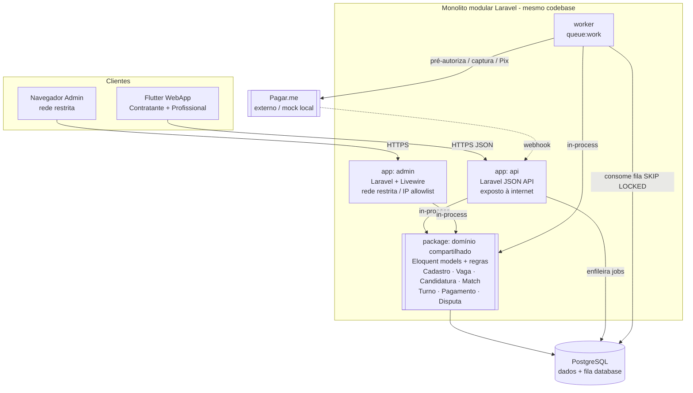

# ADR-002 — Topologia

## Contexto

Definida a stack (ADR-001 — Laravel no backend, Livewire no Backoffice, Flutter no WebApp), falta decidir a **topologia**: quantos processos/deploys existem, quem fala com quem, onde mora o domínio de negócio e como o trabalho assíncrono (Pix em ≤ 15 min, webhooks Pagar.me — PDR-004) é executado.

Duas restrições moldam a resposta. **Princípio #2 ("tudo começa em monolito")**: a arquitetura nasce monolítica; microsserviços só com dor concreta e medida. **PDR-003 (duas interfaces)**: WebApp e Backoffice têm deploy independente e **superfície de ataque separada** — "o admin não compartilha código do público". Na sessão de deliberação de 2026-05-27, Alexandro (PO/liderança técnica) decidiu honrar essa segregação com **dois deploys Laravel** (api + admin) em vez de um app único.

A tensão a resolver com cuidado: "dois deploys" **não** pode virar "microsserviços". A decisão precisa deixar nítido que o **domínio de negócio é um só** (um monolito modular, um Postgres, uma fonte de verdade) e que api e admin são apenas **duas camadas finas de entrega** sobre esse domínio — separadas por motivo de **segurança e cadência de deploy**, não por decomposição de domínio.

## Forças (drivers) da decisão

- **F1 — Monolito primeiro (princípio #2):** peso **alto**. Nada justifica microsserviços num MVP de time minúsculo.
- **F2 — Segregação de superfície do admin (PDR-003):** peso **alto**. O admin não pode compartilhar superfície de ataque/processo com o público; deploy independente.
- **F3 — Simplicidade operacional (princípio #1, #11):** peso **alto**. Menos peças móveis; sem orquestração pesada.
- **F4 — Domínio único, sem duplicação (princípio #5, #1):** peso **alto**. Regras de negócio (habitualidade, máquina de estados do turno, pagamento) vivem num só lugar, consumidas por api e admin.
- **F5 — Assíncrono sobre Postgres (princípio #3, PDR-004):** peso **médio**. Pix/webhooks via fila `database` + worker, sem broker externo.

## Opções consideradas

### Opção A — Monolito modular, domínio compartilhado, duas camadas de entrega (api + admin) + worker — **escolhida**
- **Resumo:** Um único **domínio modular** (models Eloquent, regras de negócio, serviços) vive num **package interno compartilhado**. Sobre ele, **dois apps Laravel finos**: `api` (controllers/resources JSON, exposto à internet para o Flutter WebApp) e `admin` (Livewire, em rede restrita). Um **worker** (`queue:work` do mesmo código) executa jobs assíncronos. Todos falam com **o mesmo Postgres**. Não há rede no caminho do domínio: api e admin **importam** o domínio como biblioteca, não chamam um ao outro por HTTP.
- **Como atende aos princípios:**
  - ✅ **Monolito (2):** é um monolito modular; a separação api/admin é de *entrega/deploy*, não de domínio. Sem rede no caminho crítico, sem transações distribuídas, sem sagas.
  - ✅ **Simplicidade (1):** três processos do mesmo codebase (api, admin, worker), um banco. Sem orquestração, sem service mesh.
  - ✅ **Postgres-first (3):** fila `database` + worker; único armazenamento.
  - ✅ **Coesão/acoplamento (5):** módulos nomeados por razão de mudança (Cadastro, Vaga, Candidatura, Match, Turno, Pagamento, Disputa); contratos internos explícitos; api e admin só conhecem o domínio pela API pública do package.
  - ✅ **Funcionamento local (6):** os três processos + Postgres sobem em Docker Compose.
  - ✅ **PDR-003:** admin é deploy separado, em rede restrita, sem expor a superfície pública.
- **Prós concretos:** honra PDR-003 sem fragmentar domínio; deploy do admin independente do público (cadências e janelas distintas); superfície de ataque do admin isolável por rede; domínio testável isoladamente (princípio #10).
- **Contras concretos:** dois (ou três, com worker) artefatos de deploy para manter — mais setup de infra que um app único.

### Opção B — Monolito Laravel único (api + admin Livewire no mesmo deploy)
- **Resumo:** Um app Laravel serve `/api/*` (Flutter) e `/admin/*` (Livewire), separados por middleware/guards; deploy único.
- **Como atende aos princípios:** ✅ ainda mais simples (princípio #1), um deploy só; ⚠️ relaxa PDR-003 — mesma superfície/processo serve público e admin.
- **Razão da rejeição:** Alexandro (PO) optou por **não** relaxar PDR-003 nesta sessão. A separação de superfície do admin é tratada como requisito. (Mantida aqui como alternativa real, barata de retomar se o overhead de dois deploys incomodar — ver sinais de revisão.)

### Opção C — Serviços separados desde já (FE/BE/worker como serviços independentes) / microsserviços por domínio
- **Resumo:** Decompor em serviços com deploy e/ou datastore independentes desde o MVP.
- **Como atende aos princípios:** ❌ **Monolito (2):** viola sem dor concreta; ❌ **Simplicidade (1):** rede no caminho crítico, transações distribuídas, orquestração — pedágio fatal para time minúsculo.
- **Razão da rejeição:** nenhuma evidência de necessidade de escala/isolamento independente. Princípio #2 a descarta de origem.

## Matriz comparativa

| Critério (força) | Peso | A — modular + 2 entregas + worker | B — monolito único | C — serviços separados |
|---|---|---|---|---|
| F1 — Monolito primeiro | alto | ✅ é monolito (entrega dupla) | ✅ monolito puro | ❌ viola sem dor |
| F2 — Segregação do admin (PDR-003) | alto | ✅ admin isolado por deploy/rede | ❌ mesma superfície | ✅ (mas custo alto) |
| F3 — Simplicidade operacional | alto | ⚠️ 2-3 deploys do mesmo código | ✅ 1 deploy | ❌ N serviços |
| F4 — Domínio único | alto | ✅ package compartilhado | ✅ mesmo app | ❌ domínio fragmentado |
| F5 — Assíncrono sobre Postgres | médio | ✅ fila `database` + worker | ✅ idem | ⚠️ tende a broker externo |

## Decisão proposta

> **Optamos pela Opção A.**

A topologia do Turni é um **monolito modular** cujo **domínio de negócio vive num package interno compartilhado**, consumido por **duas camadas finas de entrega** — `api` (Laravel, JSON, pública) e `admin` (Laravel + Livewire, restrita) — e por um **worker** (`queue:work`) para trabalho assíncrono. Todos compartilham **um único PostgreSQL**. A comunicação entre api/admin e o domínio é **in-process** (importam o package), nunca por rede. O WebApp Flutter e o navegador do admin são **clientes**, não serviços.

## Diagrama

## Consequências

### Positivas (o que ganhamos)
- PDR-003 honrado: admin com deploy e superfície isolados do público.
- Domínio único e coeso — regras de negócio sem duplicação, testáveis isoladamente.
- Sem complexidade de microsserviços (rede, sagas, orquestração) num MVP.
- Tudo sobre Postgres, inclusive a fila — um só armazenamento (princípio #3).

### Negativas / trade-offs aceitos
- **2–3 artefatos de deploy** do mesmo código (api, admin, worker) — mais configuração de infra/pipeline que um app único (cabe à STORY-002/007 absorver).
- Build/deploy precisa garantir que o bundle do admin não vaze para a superfície pública e vice-versa (reforçado por ADR-003).

### Neutras
- O worker pode, no limite do MVP, rodar como o mesmo deploy do `api` com um processo `queue:work` ao lado; promovê-lo a deploy separado é trivial e reversível (princípio #7). A decisão fina (worker junto vs separado) é operacional e cabe à STORY-002/007.

### Para o time
- **Impacto em estórias existentes:** molda STORY-002 (hospedar 2-3 processos Laravel + estático Flutter + Postgres), STORY-006 (Docker Compose sobe api + admin + worker + db), STORY-007 (pipeline com deploys independentes por app), STORY-009 (hello world do admin Livewire).
- **ADRs relacionados:** ADR-001 (stack) e ADR-003 (monorepo — onde o package de domínio e os apps coexistem).
- **Necessidade de spike de validação:** não. Topologia padrão de Laravel; sem incerteza empírica.

## Plano de verificação

- **Como verificar conformidade:**
  - Teste/lint arquitetural: nenhum app de entrega (api/admin) contém regra de negócio que deveria estar no package de domínio (princípio #9 — automatizável > documentável; ferramenta a definir pelo Programador, ex.: Deptrac/Pest arch tests).
  - Nenhuma chamada HTTP de api↔admin para lógica de domínio (devem importar o package, não se chamar por rede).
  - Pipeline produz artefatos de deploy distintos para api e admin (ADR-003).
- **Sinais de revisão (quando reabrir esta decisão):**
  - Se manter dois deploys custar > 10% do tempo do time em infra duplicada (gatilho idêntico ao sinal de revisão do PDR-003) → reavaliar consolidação na Opção B (relaxar PDR-003).
  - Se um módulo precisar **escalar independente** com evidência medida (consome >80% do recurso) ou tiver **isolamento de falha** com SLA documentado → considerar promovê-lo a serviço (princípio #2). Não antes.
- **Spike de validação proposto:** nenhum.

---

## Aprovação humana

- **Status final:** ✅ aceita
- **Aprovado por:** Alexandro
- **Data:** 2026-05-27
- **Forma do aceite:** aprovado em chat (sessão de 2026-05-27)
- **Condicionantes do aceite:** nenhuma.

---

## Histórico

- 2026-05-27 — criada como `proposed` por Arquiteto. Topologia derivada de ADR-001 e da decisão de Alexandro (sessão 2026-05-27) por dois deploys Laravel honrando PDR-003.
- 2026-05-27 — `accepted` por Alexandro (aprovação em chat, junto de ADR-001 e ADR-003).
