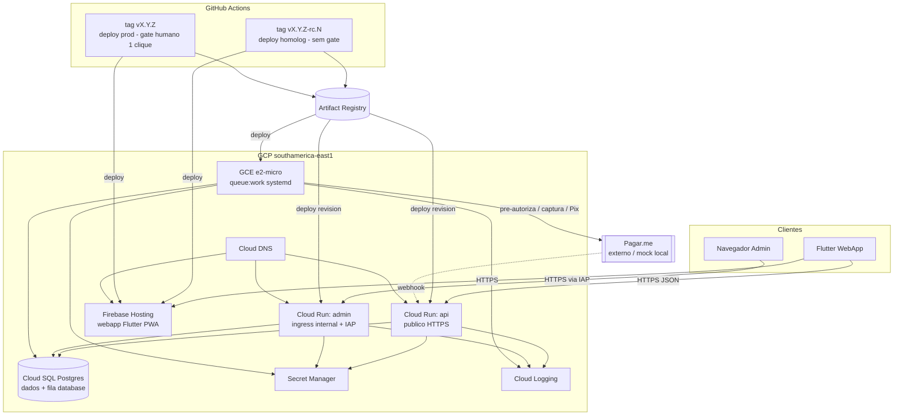

# ADR-004 — Hospedagem, Infra-as-Code e estratégia de deploy

## Contexto

O EPIC-000 Foundation só fecha quando `app.homolog.turni.com.br` e `admin.homolog.turni.com.br` estão no ar com deploy automático a cada promoção de código, com health-check verde (`epic.md`). Definidas a stack (ADR-001 — Laravel no backend, Livewire no Backoffice, Flutter no WebApp), a topologia (ADR-002 — monolito modular com **três artefatos de entrega**: `api` público, `admin` em rede restrita, `worker` `queue:work`) e a estratégia de repositório (ADR-003 — monorepo poliglota com deploy independente por app via path filters), falta decidir **onde** isso roda, **como** o ambiente é provisionado (Infra-as-Code — exigência do PO em `quality-standards.md` 2.3) e **como** o deploy promove código de homologação a produção (promoção tag-based com gate humano de 1 clique — `quality-standards.md` 2.2).

O que precisa ser hospedado, derivado de ADR-001/002/003:

| Artefato | Natureza | Superfície |
|---|---|---|
| `api` (Laravel JSON) | processo PHP de requisição | público (`api.homolog.turni.com.br`) — cliente é o WebApp Flutter; recebe webhook Pagar.me (PDR-004) |
| `admin` (Laravel + Livewire) | processo PHP de requisição | **rede restrita** (`admin.homolog.turni.com.br`) — PDR-003 / ADR-002 |
| `worker` (`queue:work`) | processo PHP contínuo (polling da fila `database`, `FOR UPDATE SKIP LOCKED`) | sem porta pública |
| `webapp` (Flutter Web) | **bundle estático** (HTML/JS/CanvasKit) + PWA | público (`app.homolog.turni.com.br`) |
| PostgreSQL | um único banco (dados + fila `database`) | gerenciado, privado |

As restrições que moldam a decisão: **time minúsculo** (1–3 devs, princípio #1) e **fase pré-receita** (princípio #11) — operação pesada é desqualificada por padrão; **produto Brasil-first** — região com presença no Brasil importa para o SLO de latência (`non-functional.md`: p95 ≤ 800ms no caminho crítico) e para o já-pesado FCP 3G do Flutter Web (ADR-001); **IaC obrigatório e recriação do zero viável** (`quality-standards.md` 2.3); **promoção tag-based + gate humano de 1 clique em produção** (`quality-standards.md` 2.2, não-negociável); **HTTPS obrigatório** e **suporte a PWA** (`non-functional.md`); **segredos nunca no código** (`quality-standards.md` 4). Produção entra só no EPIC-006 (próxima onda), mas o pipeline e o IaC **nascem multi-ambiente** (`epic.md` — "pipeline já deve ser desenhado pensando em produção").

Um insumo de contexto pesou na deliberação: o Turni tem **parceria com o Google e ~US$2.000 em créditos GCP** (informado por Alexandro na sessão de 2026-05-27). Isso altera materialmente o balanço custo×complexidade entre provedores para o horizonte do MVP.

## Forças (drivers) da decisão

- **F1 — Custo no MVP (princípio #11):** peso **alto**. Fase pré-receita; cada custo recorrente precisa se justificar. Créditos disponíveis pesam diretamente aqui.
- **F2 — Simplicidade operacional para time minúsculo (princípio #1):** peso **alto**. Menos peças móveis, menos cerimônia de rede/IAM, menos coisa para um time de 1–3 operar.
- **F3 — Região no Brasil (NFR de latência + FCP 3G):** peso **alto**. São Paulo evita ~120-200ms de RTT transcontinental que comeriam o orçamento de latência e piorariam o FCP do Flutter Web.
- **F4 — IaC e recriação do zero (`quality-standards.md` 2.3):** peso **alto**. Provedor precisa de provider Terraform maduro; recriar homolog/prod do código é runbook viável.
- **F5 — Promoção tag-based + gate humano de 1 clique (`quality-standards.md` 2.2):** peso **alto**. Não-negociável; o CI escolhido precisa oferecer aprovação manual.
- **F6 — Rollback sem intervenção fora do git (CA-5):** peso **médio**. Reverter deploy ruim deve ser scriptado e rápido.
- **F7 — Escala para produção sem migrar de provedor (CA-3):** peso **médio**. O que sobe homologação tem que crescer para produção sem refazer fundação (princípio #7).
- **F8 — Deploy independente por superfície + segregação do admin (PDR-003, ADR-002/003):** peso **médio**. URLs distintas, artefatos separados, admin isolável de rede.

## Opções consideradas

### Opção A — GCP: Cloud Run + Cloud SQL + Firebase Hosting — **escolhida**
- **Resumo:** `api` e `admin` como serviços **Cloud Run** (containers Laravel) na região **`southamerica-east1`** (São Paulo); `admin` com `ingress=internal` + **IAP** (Identity-Aware Proxy) para satisfazer a rede restrita do ADR-002. `worker` como processo `queue:work` contínuo em **GCE `e2-micro`** (systemd). PostgreSQL gerenciado em **Cloud SQL**. WebApp Flutter como estático em **Firebase Hosting** (CDN global, HTTPS, controle de headers de cache/PWA). Segredos em **Secret Manager**; logs JSON em stdout coletados pelo **Cloud Logging**; DNS em **Cloud DNS**. CI/CD em **GitHub Actions** com **Workload Identity Federation** (OIDC, sem chave de serviço de longa duração) e gate de produção via **GitHub Environments** (revisor obrigatório = 1 clique). Tudo provisionado por **Terraform** (provider Google), multi-ambiente.
- **Como atende aos princípios** (`references/architecture-principles.md`):
  - ✅ **Custo (#11):** Cloud Run escala a zero em homologação (cai no free tier); sem taxa fixa de load balancer; Firebase Hosting grátis. ~US$20-30/mês sem créditos → **~US$0 com os US$2K** pelo horizonte do MVP.
  - ✅ **Simplicidade (#1):** modelo gerenciado/serverless; pouca operação de SO no caminho de `api`/`admin`. ⚠️ exceção honesta: o `worker` exige uma VM à parte (ver Negativas).
  - ✅ **Reversibilidade (#7):** Cloud Run (containers) e Cloud SQL (Postgres padrão) são portáveis; Firebase Hosting é substituível. Lock-in moderado.
  - ✅ **Observabilidade (#8):** Cloud Logging parseia JSON do stdout automaticamente — base para ADR-008.
  - ✅ **Automatizável (#9):** Terraform + GitHub Actions; nenhum clique manual no provedor.
- **Prós concretos:** créditos cobrem o MVP; região São Paulo; rollback instantâneo por *revision* do Cloud Run; provider Terraform muito madura; Firebase Hosting é first-class para Flutter Web/PWA com deploy independente; CI sem chave (WIF); sinergia futura com Vertex AI/Gemini se o "Match IA" for por aí.
- **Contras concretos:** mais peças que um PaaS minimalista (Cloud Run + Cloud SQL + VPC connector + Secret Manager + Artifact Registry + Firebase + Cloud DNS); o **`worker` não cai limpo no Cloud Run** (que exige servidor HTTP) → caminho limpo é VM `e2-micro` à parte (peça extra ~US$6-8/mês); custo pós-créditos passa a ter o piso do Cloud SQL como linha a observar.

### Opção B — AWS: ECS Fargate + RDS + CloudFront (alternativa documentada)
- **Resumo:** `api`/`admin` como tasks **ECS Fargate** atrás de **ALB**, na **`sa-east-1`** (São Paulo); `worker` como task Fargate long-running; **RDS** Postgres; WebApp em **S3 + CloudFront**; segredos em SSM/Secrets Manager; logs em CloudWatch; CI GitHub Actions + OIDC→IAM; gate via GitHub Environments; Terraform (provider AWS, o mais maduro do mercado).
- **Como atende aos princípios:** ✅ região BR; ✅ IaC padrão-ouro; ✅ escala para produção sem dúvida; ✅ **melhor fit do `worker`** — Fargate roda o `queue:work` como serviço long-running limpo, sem VM à parte; ⚠️ **custo maior** (Fargate always-on + **~US$16-18/mês fixos de ALB** + RDS), sem créditos; ⚠️ mais cerimônia de VPC/ALB/IAM para um time pequeno (#1).
- **Prós:** worker elegante; provider Terraform impecável; ecossistema vasto.
- **Contras:** ~2-3× mais caro em homologação que a GCP **e** sem abater os US$2K; taxa fixa de ALB independente de tráfego; mais superfície operacional.
- **Razão de não ser a escolhida:** perde em F1 de forma decisiva — não usa os créditos Google e ainda é mais cara em homologação (scale-to-zero do Cloud Run + ausência de taxa de ALB favorecem a GCP). Sua única vantagem real neste cenário (fit do `worker`) não compensa US$2K + homologação 2-3× mais barata. Mantida como alternativa de primeira classe: se a parceria Google mudar, se surgir expertise/exigência AWS, ou se o atrito do `worker` na GCP incomodar, a migração para esta opção é o caminho natural.

### Opção C — Fly.io (GRU/São Paulo)
- **Resumo:** `api`/`admin`/`worker` como apps Fly (o `worker` é só mais um processo, sem VM à parte); Postgres gerenciado Fly; estático Flutter no Fly/CDN; HTTPS automático; Terraform (recursos) + `fly.toml` + GitHub Actions.
- **Como atende aos princípios:** ✅ **menos peças móveis** (worker trivial); ✅ região São Paulo; ✅ barato (~US$20-40/mês); ⚠️ provider Terraform menos maduro (parte do deploy fica em `fly.toml`); ❌ **não usa os US$2K de crédito Google**.
- **Razão de não ser a escolhida:** é a opção mais simples no quesito `worker`, mas deixa os créditos na mesa (F1) e tem IaC menos uniforme que GCP/AWS (F4). Boa para reabertura se a complexidade da GCP se mostrar gargalo real para o time.

### Opção D — Status quo (sem hospedagem)
- **Consequência se mantivermos:** o entregável central do EPIC-000 (deploy automático em duas URLs públicas) não pode ser perseguido; bloqueia STORY-006/007/008/009/011 e o EPIC-000 inteiro.
- **Custo de adiar:** trava a WAVE-2026-01. Descartada — a decisão é necessária agora.

## Matriz comparativa

| Critério (força) | Peso | A — GCP | B — AWS | C — Fly.io |
|---|---|---|---|---|
| F1 — Custo no MVP (com créditos US$2K) | alto | ✅ ~US$0 (créditos cobrem) | ❌ sem crédito, ~US$60-80/mês | ⚠️ barato mas não usa créditos |
| F1' — Custo homologação sem créditos | — | ✅ ~US$20-30/mês | ⚠️ ~US$60-80/mês (ALB fixo) | ✅ ~US$20-40/mês |
| F2 — Simplicidade p/ time minúsculo | alto | ⚠️ várias peças; worker em VM | ⚠️ VPC/ALB/IAM | ✅ menos peças |
| F3 — Região no Brasil | alto | ✅ southamerica-east1 | ✅ sa-east-1 | ✅ gru |
| F4 — IaC madura / recriar do zero | alto | ✅ provider Google madura | ✅ padrão-ouro | ⚠️ Terraform parcial + fly.toml |
| F5 — Tag-based + gate 1 clique | alto | ✅ GH Actions + Environments | ✅ idem | ✅ idem |
| F6 — Rollback scriptado | médio | ✅ traffic→revision (instantâneo) | ⚠️ revision de task | ✅ deploy de imagem anterior |
| F7 — Escala p/ prod sem migrar | médio | ✅ | ✅ | ✅ |
| F8 — Deploy indep. + segregação admin | médio | ✅ Cloud Run + IAP + path filters | ✅ Fargate + SG + path filters | ✅ apps + path filters |
| **Fit do `worker` (`queue:work`)** | — | ❌ exige VM à parte | ✅ Fargate long-running | ✅ processo nativo |

> A GCP vence pelo peso alto de **F1**: os créditos a tornam praticamente gratuita no MVP, e mesmo sem créditos é mais barata que a AWS em homologação (scale-to-zero + ausência de taxa de ALB). Empata em F3/F5/F7, ganha leve em F6, e perde apenas no **fit do `worker`** — o asterisco aceito desta decisão.

## Decisão proposta

> **Optamos pela Opção A — GCP (Cloud Run + Cloud SQL + Firebase Hosting), provisionada por Terraform, com promoção tag-based via GitHub Actions.** A AWS (Opção B) fica registrada como alternativa de primeira classe.

As especificações exigidas pela estória (CA-2):

**(a) Provedor e região.** Google Cloud Platform, região **`southamerica-east1` (São Paulo)** para todos os recursos com estado/latência (Cloud Run, Cloud SQL, GCE worker). Escolha justificada por: créditos da parceria Google (custo), presença no Brasil (latência/FCP), runtime de container suportando PHP 8.4+/Laravel (ADR-001), e provider Terraform madura.

**(b) Infra-as-Code.** **Terraform** (provider `google` + `google-beta`), estado remoto em bucket **GCS** versionado. Justificativa: provider madura, declarativo, casa com o requisito de recriação do zero; é o padrão neutro de IaC e evita amarrar a fundação a um SDK proprietário. Toda a infra (APIs habilitadas, Cloud SQL, Cloud Run, GCE worker, Secret Manager, Cloud DNS, Firebase Hosting site, Artifact Registry, pool WIF, IAM) vive em Terraform — **nenhum clique manual no console** (`quality-standards.md` 2.3).

**(c) Provisionamento de homologação + produção a partir do código.** Terraform organizado **multi-ambiente** desde o dia 1 (ex.: `infra/envs/homolog` e `infra/envs/prod` compartilhando módulos em `infra/modules/`), parametrizado por ambiente. Um `terraform apply` por ambiente sobe o ambiente inteiro do zero. **Produção é escrita agora mas só aplicada no EPIC-006** (`epic.md` — fora de escopo desta onda); o código multi-ambiente nasce junto para não retrabalhar o pipeline depois.

**(d) Estratégia de promoção (tag-based).** Em **GitHub Actions**:
  - Push em branch de feature → **CI leve** (lint, lint de commit, deps vulneráveis, detecção de segredos, build da imagem) — sem subir banco/browser (esses são cobrados pelo hook de pré-push local, `quality-standards.md` 2.2).
  - Tag **`vX.Y.Z-rc.N`** → build + push da imagem ao Artifact Registry + **deploy automático em homologação, sem gate humano**.
  - Tag **`vX.Y.Z`** (sem `-rc`) → **deploy em produção com gate humano de 1 clique** via **GitHub Environments** (revisor obrigatório). O gate é o único ato humano; tudo que ele aciona é workflow versionado em git.

**(e) WebApp e Backoffice em URLs distintas com deploy independente.** Cloud DNS gerencia `turni.com.br`. `app.homolog.turni.com.br` → Firebase Hosting (Flutter estático); `admin.homolog.turni.com.br` → Cloud Run `admin` (ingress internal + IAP); `api.homolog.turni.com.br` → Cloud Run `api` (público). **Deploys independentes** via **path filters** do monorepo (ADR-003): commit que toca só `apps/admin` não redeploya `api`/`webapp`, e vice-versa. Os mesmos subdomínios em produção trocam `homolog.` por raiz no EPIC-006.

**(f) Variáveis de ambiente / cofre de segredos.** Segredos em **Secret Manager**, referenciados pelos serviços Cloud Run e pela VM do worker (sem valor em claro no código ou no Terraform state — referências, não literais). O CI usa **Workload Identity Federation** (OIDC GitHub↔GCP) — **sem chave de service account de longa duração** no repositório. Dev local usa `.env` não versionado (STORY-006). Config não-secreta vai como env var declarada no Terraform.

**(g) Logs estruturados (modelo mínimo).** Aplicações emitem **log JSON estruturado em stdout/stderr**; o Cloud Run/GCE encaminha ao **Cloud Logging**, que parseia o JSON automaticamente (severidade, trace, payload). Destino = Cloud Logging; formato = JSON com campos mínimos (timestamp, nível, mensagem, contexto de turno/pagamento quando aplicável — `non-functional.md`). O **detalhamento de observabilidade** (campos canônicos, métricas RED, alertas de Pix/disputa, retenção) fica para **ADR-008** (STORY-004); esta ADR fixa apenas o destino e o formato base.

**Rollback (CA-5).** `api`/`admin`: rollback **instantâneo e scriptado** redirecionando tráfego para a *revision* anterior (`gcloud run services update-traffic --to-revisions <prev>=100`), encapsulado em workflow GitHub Actions — sem clique manual no console. `webapp`: `firebase hosting:rollback` (ou release anterior). **Banco:** política **forward-only** — migrações idempotentes e não-destrutivas no mesmo deploy (`quality-standards.md` 2.4); reverter schema é nova migração de correção, não down-migration; restore de dados via runbook de backup/restore do Cloud SQL (point-in-time recovery habilitado).

**Recriar do zero (CA-4).** Runbook: (1) `terraform apply` no ambiente alvo sobe toda a infra; (2) pipeline publica a última tag aplicável; (3) migrações rodam no deploy; (4) health-checks verdes confirmam. Idealmente exercitado na STORY-007 (homologação) e novamente no EPIC-006 (produção).

## Diagrama

## Consequências

### Positivas (o que ganhamos)
- Custo de homologação efetivamente **zero pelo horizonte do MVP** (créditos US$2K); região São Paulo atende latência e melhora o FCP do Flutter Web.
- **Rollback instantâneo** de `api`/`admin` por troca de tráfego de *revision* — scriptado, sem console.
- IaC uniforme em Terraform; recriação do zero é runbook real; CI **sem chave** (WIF).
- Firebase Hosting é first-class para Flutter Web/PWA, com deploy do `webapp` totalmente independente do backend e controle dos headers de cache exigidos pelo ADR-001.
- Cloud Logging entrega base de observabilidade de graça (JSON parseado) para o ADR-008.

### Negativas / trade-offs aceitos
- **`worker` em VM à parte:** Cloud Run exige servidor HTTP; o `queue:work` contínuo (fila `database`, ADR-002) roda numa GCE `e2-micro` via systemd — peça extra (~US$6-8/mês) com SO a manter. Alternativa managed registrada (ver Plano de verificação): Cloud Scheduler → Cloud Run job `queue:work --stop-when-empty` por minuto, que troca elegância por até ~1 min de latência de pickup (cabe no SLO de Pix de 15 min). A escolha fina é operacional e cabe à STORY-006/007.
- **Mais peças móveis** que um PaaS minimalista — curva de GCP (IAM, VPC connector, Cloud SQL proxy) é custo one-time de setup para o time.
- **Custo pós-créditos:** ao fim dos US$2K, o piso do Cloud SQL + `min-instances` viram a linha a observar — sem migração, mas é sinal de revisão.
- **Cold start** no Cloud Run se `api` ficar em scale-to-zero; irrelevante em homologação, exige `min-instances=1` em produção (custo pequeno) para o p95 ≤ 800ms.

### Neutras
- Lock-in moderado: containers + Postgres padrão são portáveis; a alternativa AWS (Opção B) está desenhada e é o caminho de saída se a parceria mudar.
- O `admin` atrás de IAP é o mecanismo de *infra* da rede restrita; o **modelo de autenticação e roteamento por papel** é ADR-007 (STORY-004) — esta ADR não o decide.

### Para o time
- **Impacto em estórias:** destrava **STORY-004** (observabilidade — define destino/formato base de log e dá o terreno para ADR-008; auth do admin via IAP entra como insumo do ADR-007), **STORY-006** (setup: variáveis de ambiente alinhadas ao Secret Manager; mock Pagar.me local), **STORY-007** (pipeline com path filters, deploy por app, gate de produção, rollback scriptado), **STORY-008/009** (hello world publicado nas duas URLs).
- **ADRs/PDRs relacionados:** consome ADR-001 (runtime PHP/Flutter), ADR-002 (3 artefatos + worker), ADR-003 (path filters / deploy independente); honra PDR-003 (URLs distintas, admin restrito), PDR-004 (endpoint público de webhook no `api`), PDR-011 (orçamento da onda). Antecede ADR-007 (auth) e ADR-008 (observabilidade).
- **Necessidade de spike de validação:** não como pré-condição do accept. A viabilidade ponta-a-ponta (provisionar do zero + deploy + health verde) é exercida na STORY-007.

## Plano de verificação

- **Como verificar conformidade:**
  - Nenhum recurso de infra criado fora do Terraform (auditável: `terraform plan` sem drift).
  - Nenhum segredo literal no código ou no state (detecção de segredos no CI; referências a Secret Manager).
  - Pipeline com path filters: commit que toca só um app não redeploya os outros (verificável nos jobs — STORY-007).
  - Promoção: tag `-rc.N` sobe homologação sem gate; tag sem `-rc` exige aprovação no GitHub Environment antes do deploy de produção.
  - HTTPS obrigatório em `app`/`admin`/`api` (cert gerenciado; redirecionamento de HTTP).
- **Sinais de revisão (quando reabrir esta decisão):**
  - Se a parceria/créditos Google terminarem e o custo recorrente da GCP superar a Opção B/C → reabrir provedor.
  - Se a operação da GCP (incl. VM do worker) custar > 10% do tempo do time → reavaliar Fly.io (Opção C, menos peças) ou consolidar o worker.
  - Se o `worker` na VM se mostrar frágil/oneroso → migrar para o caminho Cloud Scheduler + Cloud Run job (registrado acima) ou para Fargate (Opção B).
  - Se o SLO de disponibilidade (≥99.5% webapp / ≥99% backoffice) não for atingido na configuração escolhida → revisar `min-instances` / topologia de borda.
- **Spike de validação proposto:** nenhum dedicado; STORY-007 valida empiricamente (provisionar do zero + 3 deploys consecutivos verdes).

---

## Aprovação humana

> Esta seção é o registro formal do aceite. Não preencher sozinho — preencher quando o humano aprovar no chat ou via PR.

- **Status final:** ✅ aceita
- **Aprovado por:** Alexandro
- **Data:** 2026-05-27
- **Forma do aceite:** aprovado em chat (sessão de 2026-05-27); commit direto na `main`
- **Condicionantes do aceite:** nenhuma.

### Em caso de rejeição
- **Motivo:** ...
- **Próximos passos sugeridos:** abrir nova ADR com a Opção B (AWS) ou C (Fly.io).

---

## Histórico

- 2026-05-27 — criada como `proposed` por Arquiteto (STORY-002). Provedor GCP escolhido por Alexandro na sessão de 2026-05-27 (créditos US$2K + parceria Google + região São Paulo), com AWS registrada como alternativa de primeira classe. Fly.io avaliada e mantida como alternativa de menor footprint.
- 2026-05-27 — `accepted` por Alexandro (aprovação em chat; commit direto na `main`).
