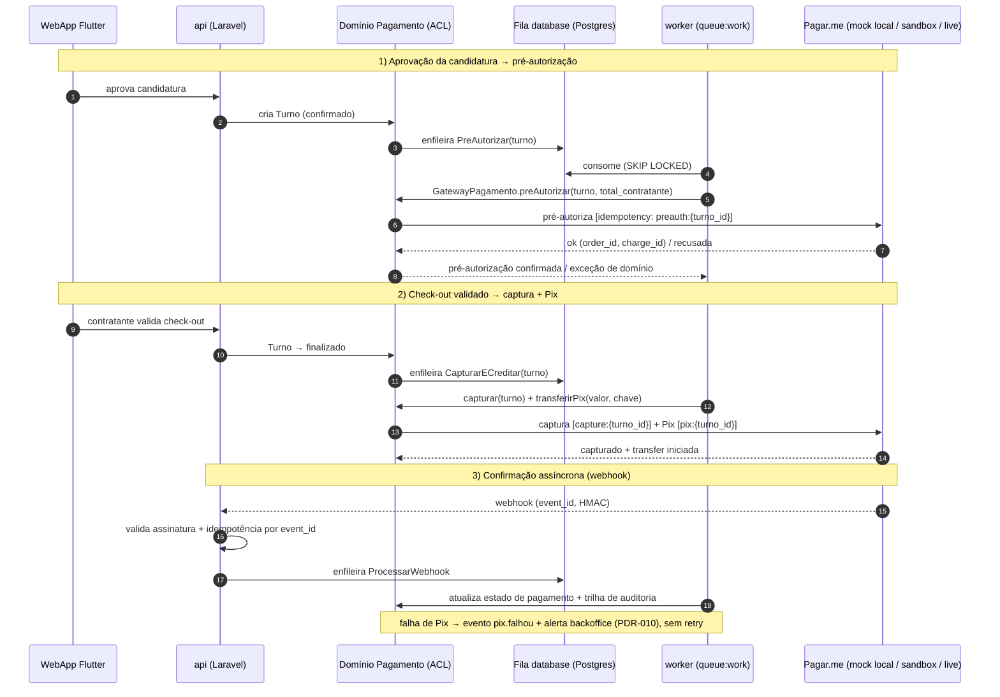

# ADR-005 — Estratégia de integração Pagar.me em alto nível

## Contexto

O Turni tem **um único PSP no MVP**: Pagar.me (PDR-004, `domain/pagamento.md`). Toda movimentação financeira passa por ele, num fluxo de três tempos atrelado à máquina de estados do turno (`domain/turno.md`): **pré-autorização** do `total_contratante` na aprovação da candidatura (`confirmado`), **captura** do valor pré-autorizado no check-out validado (`finalizado`), e **Pix** do `valor` integral para a chave do profissional em **≤ 15 min** após a captura (promessa pública, `non-functional.md`). A disputa (PDR-006) adiciona **captura parcial / estorno parcial** (`finalizado_ajustado`, `disputa_resolvida_sem_pagamento`), e o cancelamento antes de `ativo` exige **liberação** da pré-autorização (PDR-007).

Pagar.me foi apontado pelo relatório de abertura da onda como **risco técnico nº 1** do MVP: a variabilidade do provedor pode atrasar o EPIC-003 se a abordagem não estiver desenhada antes. Esta ADR decide a **estratégia de alto nível** — não o schema, não a biblioteca cliente, não os contratos exatos de endpoint, que são decisões locais do Programador no EPIC-003 (IDR). O objetivo é dar ao EPIC-003 (PIN + Pix) e ao EPIC-005 (disputa) uma fundação que respeite os princípios e os PDRs, e garantir que **o ambiente local sobe em 1 comando sem chamar o Pagar.me real** (princípio #6, `quality-standards.md` 2.1, STORY-006).

As restrições que moldam a decisão já estão majoritariamente fixadas por ADRs aceitas. **ADR-002** define onde a integração roda: o **`worker`** (`queue:work` sobre fila `database`) executa as chamadas a Pagar.me de forma assíncrona, e o **`api`** (Cloud Run público) recebe o **webhook entrante**. **ADR-004** confirma o webhook aterrissando no `api` em `southamerica-east1` e os **segredos no Secret Manager** (nunca no código). **ADR-008** já fixou o mecanismo de observabilidade (log JSON em stdout, `request_id` propagado `api`→fila→`worker`, log-based metrics e alertas de negócio "wirados quando os fluxos existirem") — esta ADR diz **quais eventos financeiros** alimentam esse mecanismo. **ADR-001** dá o ferramental: cliente HTTP do Laravel (`Http`), fila `database` (`FOR UPDATE SKIP LOCKED`), e Pest/Dusk para testes. **PDR-010** limita o escopo de falha de Pix: uma única tentativa, alerta no backoffice, sem motor de retry.

## Forças (drivers) da decisão

- **F1 — Isolar o externo do domínio (princípio #5, `integration-architecture.md`):** peso **alto**. Conceitos do Pagar.me (`order_id`, `charge_id`, status do provedor) **não podem vazar** para o modelo de Turno/Pagamento; trocar de PSP no futuro não pode ser refatoração massiva.
- **F2 — Local 100% funcional sem internet (princípio #6, STORY-006):** peso **alto**. Dev/agente roda pré-autorização → captura → Pix localmente sem tocar Pagar.me real.
- **F3 — Segurança do dinheiro: idempotência e não-duplicação (PDR-004, `security-architecture.md`):** peso **alto**. Pré-autorização, captura e Pix são operações que **não podem executar duas vezes** sob retry; webhook reenviado não pode reprocessar.
- **F4 — Respeitar o escopo de falha do MVP (PDR-010):** peso **alto**. Falha de Pix → alerta no backoffice + trilha de auditoria, **sem** retry automático, fallback ou comunicação proativa.
- **F5 — Confiança de que o mock corresponde ao real (`integration-architecture.md` — contract testing):** peso **médio**. Mock que diverge silenciosamente vira mentira e quebra o EPIC-003 em produção.
- **F6 — Observabilidade financeira (ADR-008, `non-functional.md`):** peso **médio**. A sequência pré-autorização → captura → Pix precisa ser rastreável por `request_id`, com erro de transação visível (SLO ≤ 1%).
- **F7 — Simplicidade / não-antecipação (princípio #1):** peso **alto**. Decidir o alto nível agora; **não** trazer schema, lib específica, nem cenários de borda do EPIC-003/005 para esta spike.

## Opções consideradas

A decisão de **provedor** já é PDR-004 (Pagar.me, único) — não se reabre. A decisão de **onde roda** já é ADR-002 (worker assíncrono + webhook no `api`). O que esta ADR escolhe é **como encapsular e testar** a integração. Há duas tensões reais: (1) **como o domínio fala com o Pagar.me** (acoplamento) e (2) **como o dev roda local** (mock).

### Opção A — ACL dedicada no módulo Pagamento + mock dedicado em container + contract test contra sandbox no CI noturno — **escolhida**
- **Resumo:** Uma **Anti-Corruption Layer** vive dentro do módulo de domínio `Pagamento` (ADR-002): uma **interface limpa** (`GatewayPagamento` com operações `preAutorizar`, `capturar`, `capturarParcial`, `liberar`, `transferirPix`) que o domínio chama falando **seu** vocabulário; um **adapter Pagar.me** implementa essa interface, traduzindo para/da API do provedor e isolando `order_id`/`charge_id`/status do provedor numa tabela de correlação interna. O dev local usa um **mock dedicado em container** (serviço no Docker Compose) que simula os endpoints de pré-autorização/captura/Pix e **emite o webhook** de volta — selecionável por env var (`PAGARME_DRIVER=mock|sandbox|live`). A fidelidade do mock é guardada por um **contract test consumer-driven** que roda contra o **sandbox real do Pagar.me** no **CI noturno**; divergência notifica Alexandro pelo canal do ADR-008.
- **Como atende aos princípios** (`references/architecture-principles.md`):
  - ✅ **Coesão/acoplamento (5, F1):** o externo fica atrás de uma interface; o domínio não conhece Pagar.me. Trocar de PSP = reescrever um adapter.
  - ✅ **Local funcional (6, F2):** mock em container sobe junto no `docker compose up`; zero internet.
  - ✅ **Simplicidade (1, F7):** um módulo, uma interface, um adapter, um mock — sem broker externo, sem orquestração. Idempotência sobre o Postgres que já temos.
  - ✅ **Postgres-first (3):** tabela de correlação e log de transação no Postgres; fila `database` para os jobs; nenhum armazenamento novo.
  - ✅ **Opinativo (4):** usa `Http` client, fila `database` e jobs do Laravel; nada montado à mão.
- **Prós concretos:** isolamento real do provedor; local sem internet; mock fiel guardado por contract test; idempotência e observabilidade centralizadas num só lugar; caminho de troca de PSP preservado (princípio #7).
- **Contras concretos:** o mock dedicado **precisa ser mantido** quando o contrato Pagar.me mudar (mitigado pelo contract test que detecta divergência); duas formas de rodar (mock/sandbox) a documentar.

### Opção B — Cliente Pagar.me direto no serviço de domínio, sem ACL; mock via `Http::fake()` nos testes
- **Resumo:** O serviço de Pagamento chama a API Pagar.me diretamente; em testes, usa o `Http::fake()` do Laravel; não há mock de runtime para `php artisan serve`.
- **Como atende aos princípios:** ✅ menos código no curto prazo; ❌ **F1:** o formato do Pagar.me vaza pelo domínio — mudança do provedor atinge vários pontos; ❌ **F2:** `Http::fake()` só existe em teste — **o ambiente local interativo não roda o fluxo sem internet** (viola princípio #6 e STORY-006); ⚠️ idempotência espalhada.
- **Razão de não ser a escolhida:** falha nos dois drivers de maior peso (F1 e F2). `Http::fake()` é ferramenta de teste, não substitui mock de runtime para o "1 comando local".

### Opção C — Sandbox público do Pagar.me como ambiente local (sem mock próprio)
- **Resumo:** Dev local aponta direto para o sandbox do Pagar.me.
- **Como atende aos princípios:** ✅ fidelidade máxima (é quase o real); ❌ **F2/princípio #6:** depende de internet e de credencial de sandbox — quebra "100% local sem internet" e trava o dev offline / o CI hermético.
- **Razão de não ser a escolhida:** viola o princípio #6 inegociável. O sandbox tem papel — **é o alvo do contract test** (Opção A) —, mas **não** é o ambiente de desenvolvimento padrão.

### Opção D — Status quo (decidir só no EPIC-003)
- **Consequência se mantivermos:** o EPIC-003 entra sem fundação; o risco nº 1 da onda permanece aberto; o setup local (STORY-006) não sabe como mockar o pagamento.
- **Custo de adiar:** alto — a estória existe justamente para tirar esse risco do caminho crítico antes da implementação. Descartada.

## Matriz comparativa

| Critério (força) | Peso | A — ACL + mock container + contract test | B — cliente direto + Http::fake | C — sandbox como local |
|---|---|---|---|---|
| F1 — Isolar externo do domínio | alto | ✅ interface + adapter | ❌ vaza no domínio | ⚠️ ainda acopla ao real |
| F2 — Local sem internet | alto | ✅ mock em container | ❌ fake só em teste | ❌ depende de internet |
| F3 — Idempotência / não-duplicação | alto | ✅ centralizada na ACL | ⚠️ espalhada | ⚠️ espalhada |
| F4 — Escopo de falha PDR-010 | alto | ✅ tratado na ACL/worker | ⚠️ tratável | ⚠️ tratável |
| F5 — Mock fiel ao real | médio | ✅ contract test no CI noturno | ⚠️ fake pode divergir do real | ✅ é o próprio real |
| F6 — Observabilidade financeira | alto | ✅ um ponto de log/trace | ⚠️ disperso | ⚠️ disperso |
| F7 — Simplicidade / não-antecipar | alto | ✅ um módulo, sem broker | ✅ menos código | ⚠️ depende de infra externa |

> A Opção A vence por dominar F1 e F2 (os de maior peso) sem perder em nenhum outro. O custo aceito — manter o mock — é exatamente o que o contract test (F5) torna barato e seguro.

## Decisão proposta

> **Optamos pela Opção A.**

A integração com Pagar.me é encapsulada por uma **Anti-Corruption Layer dentro do módulo de domínio `Pagamento`** (ADR-002): o domínio fala com uma **interface `GatewayPagamento`** em vocabulário próprio; um **adapter Pagar.me** a implementa e é o **único** lugar que conhece o provedor. As chamadas acontecem em **jobs assíncronos no `worker`** (fila `database`), e o **webhook entrante** chega no `api`, é validado e **enfileirado** para processamento. Idempotência, tradução de erro, retry controlado e observabilidade financeira vivem na ACL/worker. O dev roda **localmente contra um mock dedicado em container**, e a fidelidade do mock é guardada por **contract test contra o sandbox no CI noturno**.

Em alto nível (detalhe de schema/lib/contrato fica para o EPIC-003):

**(a) Anti-Corruption Layer (ACL).** Interface de domínio `GatewayPagamento` com operações em vocabulário Turni: `preAutorizar(turno, totalContratante)`, `capturar(turno)`, `capturarParcial(turno, valorRevisado)`, `liberar(turno)`, `transferirPix(turno, valorProfissional, chavePix)`. Erros do provedor viram **exceções de domínio** (`PreAutorizacaoNegada`, `CapturaFalhou`, `PixFalhou`), nunca `HTTP 4xx/5xx` do Pagar.me vazando para cima. Os identificadores do provedor (`order_id`, `charge_id`, `transaction_id`, `recipient_id`) ficam numa **tabela de correlação interna** (`pagamento_externo_ref` — schema no EPIC-003), associada ao turno por id Turni; o modelo de Turno **não carrega** campos do Pagar.me. A chave Pix do profissional é dado sensível: trafega para a ACL, **nunca** aparece em log em claro (ADR-008 / `security-architecture.md`).

**(b) Mock local em container.** Um serviço de mock no Docker Compose (`pagarme-mock`) simula os endpoints usados (pré-autorização, captura, captura parcial, estorno, Pix/transfer) e **dispara o webhook** de volta ao `api` local. Seleção por env var: `PAGARME_DRIVER=mock` (default local), `sandbox`, `live`. O mock loga `[MOCK]` no payload (`integration-architecture.md`) e versiona qual versão do contrato simula. Isso é o que viabiliza `docker compose up` rodando o ciclo financeiro **sem internet** (princípio #6). Credenciais (mesmo de mock) via `.env` não versionado local / Secret Manager em homolog/prod (ADR-004).

**(c) Contract testing.** Um teste **consumer-driven** define o que o Turni espera de cada endpoint (request/response/erros) e roda contra o **sandbox real do Pagar.me** no **CI noturno** (schedule do GitHub Actions, fora do caminho de PR para não depender de internet no push). Divergência → notificação a Alexandro pelo **mesmo canal de alerta do ADR-008** (e-mail no MVP). O contrato é **versionado junto da ACL** (`schema.md` / JSON Schema), com a anotação "simula API vX capturada em <data>". Atualizar o mock quando o sandbox diverge é **parte da estória** que toca o contrato, não dívida futura.

**(d) Idempotência.** Toda operação que move dinheiro carrega uma **chave idempotente determinística** derivada de `(turno_id, operação, tentativa-lógica)` — ex.: `preauth:{turno_id}`, `capture:{turno_id}`, `pix:{turno_id}` —, enviada ao Pagar.me como idempotency key **e** registrada localmente antes da chamada. Assim, retry do job (worker) ou reexecução **não duplica** pré-autorização/captura/Pix. **Modelo de erro:** a ACL classifica falhas em **recuperáveis** (timeout, 5xx, rede) → o job é **retentado pelo worker com backoff** (limite pequeno de tentativas, dentro do ferramental de fila do Laravel); e **fatais** (recusa de pré-autorização, dados inválidos, 4xx de negócio) → **sem retry**, marca o evento de pagamento como falho e segue o tratamento do item (f). **Webhook entrante** é idempotente por **`event_id` do Pagar.me**: duplicata responde `200 OK` com o resultado anterior, sem reprocessar (`integration-architecture.md`).

**(e) Fluxo pré-autorização → captura → Pix.** Ver diagrama de sequência abaixo. Gatilhos e atores:
  - **Aprovação da candidatura** (`api` → domínio): turno nasce `confirmado` e **enfileira** job `PreAutorizar`. O `worker` chama a ACL; sucesso confirma a pré-autorização (mantida bloqueada); recusa → exceção de domínio que **impede** a confirmação efetiva (tratamento de UX no EPIC-003).
  - **Check-out validado** (`api` → domínio): turno vai a `finalizado` e **enfileira** job `CapturarECreditar`. O `worker` **captura** o `total_contratante` e dispara a **transferência Pix** do `valor` ao profissional; a `taxa_turni` fica na conta Turni (PDR-004).
  - **Confirmação assíncrona** (Pagar.me → `api`): o **webhook** confirma liquidação/transfer; o `api` valida assinatura, responde rápido e **enfileira** o processamento, que atualiza o estado de pagamento e a trilha de auditoria.
  - **Cancelamento antes de `ativo`** → job `Liberar` (libera a pré-autorização). **Disputa** (PDR-006): `em_disputa` mantém a pré-autorização bloqueada; resolução do admin dispara `Capturar` (integral), `CapturarParcial` (ajustado) ou `Liberar` (sem pagamento) — esta ADR fixa que **a ACL expõe captura parcial e estorno**; o detalhe do fluxo de disputa é EPIC-005.

**(f) Estratégia de erro / falha de Pix (PDR-010).** O Pix é executado **uma única vez** após a captura. Falha de transferência (chave inválida, indisponibilidade do provedor) **não** dispara retry automático: marca o evento de pagamento como `falhou`, **registra na trilha de auditoria** do turno (`domain/compliance.md`) e **emite um alerta para o backoffice** (mecanismo do ADR-008 — evento logado → log-based metric → alert policy, wirado no EPIC-003). Resolução é **manual** pela equipe Turni. Falhas **transientes na captura** (antes do Pix) podem ser retentadas pelo worker (recuperáveis, item d) — isso é distinto da "falha de Pix pós-tentativa" que o PDR-010 tira de escopo.

**(g) Observabilidade financeira mínima (ADR-008).** Cada transição emite **uma linha JSON** com `request_id` propagado `api`→fila→`worker` (ADR-008 item f), com eventos canônicos: `pagamento.preautorizado`, `pagamento.preautorizacao_negada`, `pagamento.capturado`, `pagamento.captura_parcial`, `pagamento.liberado`, `pix.enviado`, `pix.falhou`. Campos no `context`: `turno_id`, ids de correlação do Pagar.me (`order_id`/`charge_id` — identificadores, **não** PII), `valor`, `taxa_turni`, `total_contratante`, `duration_ms`. **Mascarados/omitidos:** chave Pix, dados bancários, qualquer documento (lista de redação do formatter, ADR-008). Esses eventos são a base do **trace da sequência financeira** e do **alerta de erro de transação** (SLO ≤ 1%, `non-functional.md`) — o mecanismo existe no ADR-008; os eventos específicos são **wirados no EPIC-003**.

## Diagrama

## Consequências

### Positivas (o que ganhamos)
- Provedor isolado atrás de uma interface — troca de PSP futura é reescrever um adapter, não o domínio (princípio #7).
- Ciclo financeiro completo roda **local sem internet** (mock em container) — destrava STORY-006 e o "1 comando".
- Idempotência e tratamento de erro **centralizados** — dinheiro não duplica sob retry; webhook reenviado não reprocessa.
- Mock guardado por contract test contra sandbox — confiança de que o EPIC-003 não quebra em produção por divergência silenciosa.
- Observabilidade financeira encaixa direto no mecanismo já aceito (ADR-008), com PII mascarada por padrão.

### Negativas / trade-offs aceitos
- **Manutenção do mock** quando o contrato Pagar.me muda — custo real, mitigado pelo contract test que detecta a divergência e pela regra de atualizar o mock na estória que toca o contrato.
- **Falha de Pix sem rede de segurança automática** (PDR-010): em caso real, o profissional pode esperar mais que 15 min com resolução manual — trade-off de produto já aceito no PDR-010, herdado aqui.
- Uma camada de indireção (ACL) a mais que "chamar o cliente direto" — custo pequeno e pago de volta em testabilidade e troca de provedor.

### Neutras
- O `worker` que executa os jobs roda hoje numa GCE `e2-micro` (ADR-004); promover para outro modelo de execução é decisão operacional já registrada em ADR-004, sem impacto nesta ADR.
- Captura parcial / estorno parcial ficam **expostos na ACL** desde já (para o EPIC-005), mas só são exercitados quando a disputa for implementada.

### Para o time
- **Impacto em estórias existentes:** destrava **STORY-006** (setup precisa subir o `pagarme-mock` no Docker Compose e definir `PAGARME_DRIVER`); informa **STORY-007** (CI noturno do contract test contra sandbox; segredos via Secret Manager/WIF). **Não** bloqueia STORY-008/009 (hello world não toca pagamento).
- **ADRs/PDRs relacionados:** consome ADR-002 (worker + webhook no `api`), ADR-004 (webhook público, Secret Manager), ADR-008 (eventos financeiros → log/trace/alerta); implementa PDR-004 (modelo financeiro) e respeita PDR-010 (escopo de falha) e PDR-006 (captura/estorno parcial para disputa).
- **Necessidade de spike de validação:** **não** como pré-condição do accept. A viabilidade empírica (pré-autorização → captura → Pix ponta a ponta contra o sandbox) é exercida no EPIC-003; o contract test passa a guardá-la continuamente.

## Plano de verificação

- **Como verificar conformidade:**
  - **Teste/lint arquitetural:** nenhum import de SDK/cliente Pagar.me fora do módulo `Pagamento`/adapter (ferramenta a definir pelo Programador — ex.: Deptrac/Pest arch test); o modelo de Turno não tem coluna `order_id`/`charge_id` (ficam na tabela de correlação).
  - **Idempotência:** teste que reexecuta o job de pré-autorização/captura/Pix com a mesma chave e confirma **uma** operação no provedor (mock); webhook duplicado por `event_id` não reprocessa.
  - **Local sem internet:** `docker compose up` com `PAGARME_DRIVER=mock` roda o ciclo financeiro **sem rede externa** (verificável no CI hermético / STORY-006).
  - **Observabilidade:** os eventos `pagamento.*`/`pix.*` aparecem no log JSON com `request_id` correlacionado api→worker e **sem** chave Pix/dados bancários (teste do formatter, ADR-008).
- **Sinais de revisão (quando reabrir esta decisão):**
  - Se a **taxa de falha de Pix > 1%** das transferências (`non-functional.md` / PDR-010) → antecipar motor de retry/fallback (reabre o escopo de PDR-010, não esta ACL).
  - Se o **erro de transação Pagar.me > 1%** → revisar política de retry/circuit breaker na ACL (`integration-architecture.md`).
  - Se surgir **2º PSP** ou necessidade de split entre múltiplas chaves → a interface `GatewayPagamento` é o ponto de extensão; avaliar se vira ADR de evolução.
  - Se o **mock divergir** do sandbox de forma recorrente (contract test falhando) → revisar cadência/estratégia de manutenção do mock.
- **Spike de validação proposto:** nenhum dedicado; o EPIC-003 valida ponta a ponta e o contract test noturno passa a guardar a fidelidade.

---

## Aprovação humana

> Esta seção é o registro formal do aceite. Não preencher sozinho — preencher quando o humano aprovar no chat ou via PR.

- **Status final:** ✅ aceita
- **Aprovado por:** Alexandro
- **Data:** 2026-05-27
- **Forma do aceite:** aprovado em chat (sessão de 2026-05-27); commit direto na `main`
- **Condicionantes do aceite:** nenhuma.

### Em caso de rejeição
- **Motivo:** ...
- **Próximos passos sugeridos:** ...

### Em caso de superseding
- **Substituída por:** ADR-YYY
- **Razão da substituição:** ...

---

## Histórico

- 2026-05-27 — criada como `proposed` por Arquiteto (STORY-003). ACL no módulo Pagamento + mock dedicado em container + contract test contra sandbox no CI noturno; idempotência por chave determinística; webhook entrante no `api` validado e enfileirado; falha de Pix conforme PDR-010 (uma tentativa + alerta backoffice); eventos financeiros sobre o mecanismo do ADR-008. Schema, lib cliente e contratos exatos delegados ao EPIC-003.
- 2026-05-27 — `accepted` por Alexandro (aprovação em chat, junto de ADR-006; commit direto na `main`).
