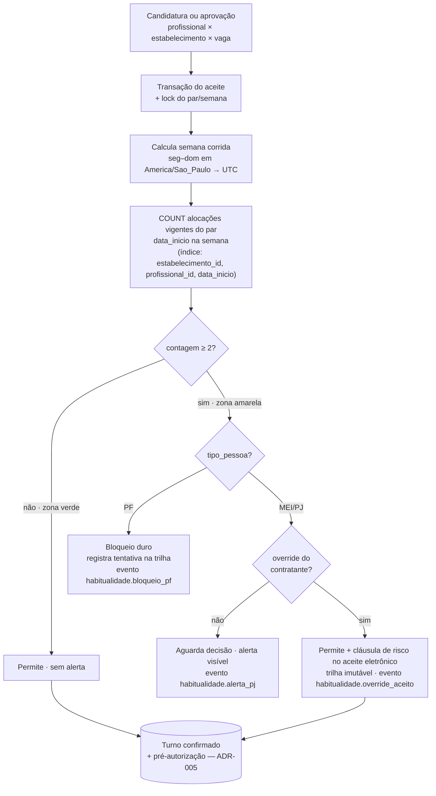

# ADR-006 — Estratégia de consulta de habitualidade

## Contexto

A regra de habitualidade (PDR-002, `domain/compliance.md`) limita a **2 alocações por semana corrida (segunda a domingo)** o mesmo profissional no mesmo estabelecimento. Na 3ª tentativa o comportamento **diverge por tipo de pessoa** (PDR-001): **PF → bloqueio duro** (impede candidatura/aceite); **MEI/PJ → alerta + override** do contratante, registrado no aceite eletrônico como aceite consciente de risco. Essa verificação é uma **pré-condição da candidatura** e do aceite (`domain/candidatura.md` item 5), e o relatório de abertura da onda a apontou como **risco técnico nº 3**: a consulta de histórico por par profissional × estabelecimento por semana **pode virar gargalo** se a base crescer.

Esta ADR decide **como** essa consulta é feita de forma durável — não o schema da tabela de alocação (decisão local do EPIC-001, IDR), não a UX do bloqueio/alerta (Designer, no épico de compliance), não a regra numérica (PDR-002 trava). O objetivo é dar ao EPIC-001 (cadastro/aceite com habitualidade aplicada) uma fundação de consulta que respeite os princípios e não precise ser refeita quando a base crescer.

O que conta como "alocação" e qual data ancora a semana são pontos que a deliberação precisa fixar com cuidado. Pela máquina de estados (`domain/turno.md`), uma alocação nasce quando a candidatura é aprovada (turno `confirmado`) e a semana relevante é a do **trabalho efetivo** — isto é, a janela em que cai o **`data_inicio` do turno/vaga** —, não a data em que a candidatura foi enviada. Alocações **canceladas antes de `ativo`** (`cancelado_pro`/`cancelado_emp`) e `no_show_pro` **não** representam trabalho realizado e, portanto, não contam para o limite (refinamento fino do conjunto de status fica para o EPIC-001; esta ADR fixa o princípio: conta-se trabalho efetivo/agendado-vigente, não cancelado).

As restrições que moldam a decisão já estão fixadas. **ADR-000/ADR-001:** Postgres é o banco e **Eloquent** é a camada de query (não substituir por ORM de terceiro); fila/cache idiomáticos sobre Postgres, **sem Redis no MVP**. **ADR-002:** o domínio (regra de habitualidade) vive no **package compartilhado**, consumido por `api` e `admin` in-process — a verificação é a mesma para candidatura (WebApp) e para aprovação (painel do contratante). **ADR-008:** há mecanismo pronto para emitir eventos estruturados e derivar métricas — esta ADR diz **qual sinal** de habitualidade observar. **Volume MVP:** ordem de **≤ 1k vagas/dia** inicialmente (`epic.md`/estória) — pequeno.

## Forças (drivers) da decisão

- **F1 — Simplicidade / não-antecipação (princípio #1):** peso **alto**. A solução mais simples que resolve o problema **no volume atual**; complexidade só com dor medida.
- **F2 — Postgres-first, sem armazenamento novo (princípio #3, ADR-001):** peso **alto**. Nada de Redis/cache externo no MVP; usar índice e a query que o Postgres já dá.
- **F3 — Correção sob concorrência (PDR-002, `security-architecture.md`):** peso **alto**. Duas aprovações quase simultâneas não podem furar o limite de 2; a checagem precisa ser confiável no momento do aceite.
- **F4 — Performance no caminho do aceite (`non-functional.md`):** peso **médio**. A consulta entra no fluxo de candidatura/aprovação; não pode pesar no p95, mas não é o caminho crítico de 500ms (PIN).
- **F5 — Custo de implementação e manutenção (princípios #1, #11):** peso **médio**. Time minúsculo; menos peças para manter coerentes (invalidações, refresh) é melhor.
- **F6 — Decisão PF×PJ e trilha de auditoria (PDR-001, PDR-002, `domain/compliance.md`):** peso **alto**. A mesma consulta precisa alimentar bloqueio (PF) e alerta+override (PJ), e o override precisa virar registro imutável.

## Opções consideradas

A regra (2/semana, PF bloqueia, PJ alerta+override) é PDR-002 — não se reabre. O que esta ADR escolhe é **como obter a contagem** de alocações do par (profissional × estabelecimento) na semana corrida.

### Opção A — Query direta com índice composto e plano garantido — **escolhida**
- **Resumo:** No momento da candidatura/aprovação, uma **contagem** (`COUNT`) das alocações vigentes do par `(profissional_id, estabelecimento_id)` cujo `data_inicio` cai na **semana corrida** da vaga-alvo. A tabela de alocação (turno) ganha um **índice composto** `(estabelecimento_id, profissional_id, data_inicio)` — incluindo o status quando ajudar a filtrar canceladas — que torna a consulta um *range scan* estreito. A contagem (0/1/2/≥2) é calculada **on-demand**; não há estrutura derivada a manter.
- **Como atende aos princípios** (`references/architecture-principles.md`):
  - ✅ **Simplicidade (1, F1):** uma query indexada; zero infraestrutura nova, zero invalidação a sincronizar.
  - ✅ **Postgres-first (3, F2):** índice nativo; nada além do Postgres que já temos (ADR-000).
  - ✅ **Correção (F3):** a checagem é feita **dentro da transação** do aceite, com **lock de concorrência** (advisory lock por par profissional×estabelecimento×semana, ou checagem + constraint) que serializa duas aprovações simultâneas do mesmo par — o número não fura.
  - ✅ **Opinativo (4):** Eloquent expressa a query e o índice via migration nativa (ADR-001).
- **Prós concretos:** mais simples possível; sempre **consistente** (sem janela de cache stale); barato de manter (uma migration de índice); plano de execução previsível e auditável (`EXPLAIN`).
- **Contras concretos:** a query roda a cada candidatura/aprovação (mas é trivial no volume MVP e por muito tempo); exige disciplina de **garantir o uso do índice** (verificável por `EXPLAIN` em teste).

### Opção B — Materialized view (contagem por par×semana) atualizada por trigger/job
- **Resumo:** Uma *materialized view* agrega contagens por `(profissional, estabelecimento, semana)`, atualizada por trigger no insert/update de alocação ou por job periódico; a checagem lê a view.
- **Como atende aos princípios:** ⚠️ **Simplicidade (1):** adiciona objeto derivado + estratégia de refresh + risco de staleness; ✅ Postgres-first (fica no Postgres); ⚠️ **Correção (F3):** refresh assíncrono abre janela em que a view não reflete a última alocação — perigoso para uma **regra de bloqueio** (poderia liberar a 3ª por leitura velha). `REFRESH CONCURRENTLY` mitiga performance mas não a janela lógica.
- **Razão de não ser a escolhida:** resolve um problema de escala que **não temos** (princípio #1) e introduz risco de staleness numa regra que precisa ser exata no instante do aceite (F3). É a evolução natural **se e quando** a contagem on-demand virar gargalo medido — registrada como sinal de revisão.

### Opção C — Cache aplicacional invalidado por evento de aceite/cancelamento
- **Resumo:** Manter em cache a contagem por par×semana, invalidando ao aceitar/cancelar.
- **Como atende aos princípios:** ❌ **Postgres-first (3, F2):** cache de runtime tende a Redis/segundo armazenamento — proibido no MVP (ADR-001); ❌ **Simplicidade (1):** invalidação correta sob concorrência é das coisas mais difíceis de acertar, para um ganho inexistente no volume atual; ⚠️ **Correção (F3):** cache stale fura a regra de bloqueio.
- **Razão de não ser a escolhida:** custo e risco altos, ganho nulo no MVP. Pior dos mundos para uma regra que precisa ser exata e barata.

### Opção D — Status quo (sem consulta dedicada / decidir no EPIC-001)
- **Consequência se mantivermos:** o EPIC-001 implementa a habitualidade sem direção arquitetural, podendo escolher um caminho frágil (ex.: full scan) ou caro (cache prematuro); o risco nº 3 da onda fica aberto.
- **Custo de adiar:** médio — a estória existe para dar essa direção antes do EPIC-001. Descartada.

## Matriz comparativa

| Critério (força) | Peso | A — query + índice composto | B — materialized view | C — cache aplicacional |
|---|---|---|---|---|
| F1 — Simplicidade / não-antecipar | alto | ✅ uma query | ⚠️ objeto + refresh | ❌ invalidação complexa |
| F2 — Postgres-first, sem store novo | alto | ✅ índice nativo | ✅ no Postgres | ❌ tende a Redis |
| F3 — Correção sob concorrência | alto | ✅ checagem na transação + lock | ⚠️ janela de staleness | ❌ cache stale fura regra |
| F4 — Performance no aceite | médio | ✅ range scan estreito | ✅ leitura O(1) | ✅ leitura O(1) |
| F5 — Custo de manutenção | médio | ✅ uma migration | ⚠️ refresh a manter | ❌ invalidação a manter |
| F6 — PF×PJ + auditoria | alto | ✅ contagem alimenta ambos | ✅ idem | ✅ idem |

> A Opção A vence em todos os critérios de maior peso. As Opções B e C otimizam latência de leitura — um problema que **não existe** no volume MVP — ao custo de complexidade e de risco de staleness numa regra que precisa ser **exata no instante do aceite**.

## Decisão proposta

> **Optamos pela Opção A.**

A habitualidade é verificada por uma **query direta com índice composto sobre o Postgres**, executada **on-demand** no momento da candidatura e da aprovação, **dentro da transação do aceite** e protegida por **lock de concorrência** por par profissional×estabelecimento×semana. Não há estrutura derivada (materialized view ou cache) no MVP. Em alto nível:

**(a) A consulta.** Conta as alocações **vigentes** (não canceladas, não `no_show_pro`) do par `(profissional_id, estabelecimento_id)` cujo **`data_inicio` cai na semana corrida** da vaga-alvo. O resultado (0, 1, 2, ≥2) classifica a zona de compliance (`domain/compliance.md`): **verde** (< 2), **amarela** (= 2, 3ª em curso). A tabela de alocação (turno) recebe o índice composto **`(estabelecimento_id, profissional_id, data_inicio)`** (a ordem coloca primeiro os campos de igualdade e por último o de range), criado via **migration Eloquent** (ADR-001). O conjunto exato de status que conta e o nome físico da tabela/coluna são **IDR do Programador no EPIC-001**; esta ADR fixa a **estratégia**, o **índice** e o **predicado lógico**.

**(b) Volume e gatilho de revisão.** No **volume MVP (≤ 1k vagas/dia)** a tabela de alocação cresce na ordem de centenas de milhares de linhas por ano; a consulta é um *range scan* sobre um índice estreito (par + janela de 7 dias) que toca **poucas linhas** e responde em **sub-milissegundo** — folgado para F4. Em **horizonte de 1 ano** (ordem de 10⁵–10⁶ linhas), o custo do *range scan* indexado **não cresce com o tamanho da tabela**, só com o nº de alocações daquele par na semana (≤ punhado). **Gatilho de revisão:** se a contagem on-demand aparecer no perfil de queries lentas (p95 da checagem > ~50 ms) **ou** a tabela ultrapassar ordens de milhões com plano degradado → avaliar a Opção B (materialized view). Não antes (princípio #1).

**(c) Decisão PF×PJ — na mesma consulta, em duas etapas lógicas.** A consulta de contagem é **única e agnóstica ao tipo de pessoa** — ela só responde "quantas alocações vigentes na semana". A **decisão** (bloquear vs alertar+override) é aplicada **depois**, no serviço de domínio, ramificando pelo `tipo_pessoa` do profissional (PDR-001): contagem ≥ 2 **e** PF → **bloqueio duro**; contagem ≥ 2 **e** MEI/PJ → **alerta**, com o aceite só prosseguindo mediante **override explícito** do contratante. Manter contagem e decisão separadas evita duplicar a query e mantém a regra de tipo num único ponto auditável (princípio #5).

**(d) Timezone da "semana corrida" — America/Sao_Paulo.** A semana é **segunda 00:00:00 até domingo 23:59:59.999 no fuso `America/Sao_Paulo`** (produto Brasil-first, `non-functional.md`). Timestamps são **armazenados em UTC (`timestamptz`)** — padrão do Postgres/Eloquent; a **janela da semana é calculada no fuso de São Paulo** e convertida para UTC para casar com a coluna. Isso evita a armadilha de "virada de semana" deslocada por fuso (uma alocação de domingo 22h em São Paulo não pode cair na semana seguinte por ser segunda 01h UTC). Decisão operacional registrada aqui; o cálculo da janela vive no domínio (package compartilhado, ADR-002), não duplicado em `api`/`admin`.

**(e) Alimentação do aceite eletrônico e da trilha (PDR-002, `domain/compliance.md`).** Quando MEI/PJ excede com **override aceito**, o serviço registra a decisão **dentro da transação do aceite**: o `AceiteEletronico` do turno recebe `{{habitualidade.override_aceito}} = true` (cláusula adicional de aceite consciente de risco), e a **trilha de auditoria** do turno registra o evento com contagem-no-momento, timestamp, IP e fingerprint — **imutável** após criação (a mesma garantia jurídica do aceite, `domain/compliance.md`). O bloqueio de PF também é registrado na trilha (tentativa bloqueada), sem gerar turno.

**(f) Observabilidade da regra (PDR-002 — sinal de revisão).** Cada decisão emite **evento estruturado** (ADR-008): `habitualidade.bloqueio_pf`, `habitualidade.alerta_pj`, `habitualidade.override_aceito`, com `context` `{ profissional_id, estabelecimento_id, contratante_id, contagem_semana, tipo_pessoa }` (sem PII em claro). Sobre `habitualidade.override_aceito` e `habitualidade.alerta_pj` deriva-se a **taxa de override por contratante** — o sinal que o PDR-002 definiu para reabrir a regra (**> 20%** das alocações vira ritual, não controle). O mecanismo (log-based metric / consulta no backoffice) é o do ADR-008; o **wiring** acontece no EPIC-001/compliance, quando os eventos existirem. A **zona vermelha** (3+ semanas consecutivas — heurística de `domain/compliance.md`) é sinal ao admin, calibrável; **não** é otimização de consulta e fica fora do escopo de performance desta ADR.

## Diagrama

## Consequências

### Positivas (o que ganhamos)
- A solução mais simples que resolve o problema — uma query indexada, **zero infraestrutura nova** (princípios #1, #3).
- **Sempre consistente:** a checagem lê o estado real dentro da transação do aceite; não há janela de cache/refresh que fure a regra de bloqueio.
- Barato de manter: uma migration de índice; sem refresh nem invalidação a sincronizar.
- Decisão PF×PJ e trilha de auditoria num único ponto de domínio, reutilizado por `api` e `admin` (ADR-002).
- Sinal de override pronto para alimentar a revisão do PDR-002 via mecanismo já aceito (ADR-008).

### Negativas / trade-offs aceitos
- A consulta roda **a cada candidatura/aprovação** — custo trivial no volume MVP e por muito tempo, mas é trabalho repetido (aceito; otimizar agora seria antecipação).
- Exige **disciplina de índice**: a query precisa comprovadamente usar o índice composto (verificável por `EXPLAIN` em teste) — se a tabela ou o predicado mudarem, revalidar o plano.
- O **lock de concorrência** por par×semana adiciona uma serialização fina no caminho do aceite — necessária para a correção (F3), com impacto desprezível no volume MVP.

### Neutras
- O conjunto exato de status que conta como "alocação vigente" e o schema físico ficam para o EPIC-001 (IDR) — esta ADR fixa o predicado lógico, não a coluna.
- A zona vermelha (heurística multi-semana) é tratada como sinal ao admin, não como consulta de performance — pode virar um job/relatório no backoffice quando o épico de compliance existir.

### Para o time
- **Impacto em estórias existentes:** orienta **EPIC-001** (habitualidade aplicada no cadastro/aceite: migration do índice, serviço de domínio com a query + decisão PF×PJ, registro no aceite eletrônico) e **EPIC-002** (a mesma checagem é pré-condição da candidatura, `domain/candidatura.md`). **Não** bloqueia STORY-006/007/008/009 do Foundation.
- **ADRs/PDRs relacionados:** consome ADR-000/ADR-001 (Postgres + Eloquent), ADR-002 (regra no package compartilhado), ADR-008 (eventos/observabilidade da regra); implementa PDR-002 e respeita PDR-001 (decisão por `tipo_pessoa`).
- **Necessidade de spike de validação:** **não**. Padrão de query indexada sobre Postgres, sem incerteza empírica no volume MVP; o `EXPLAIN` no teste do EPIC-001 confirma o plano.

## Plano de verificação

- **Como verificar conformidade:**
  - **Plano de execução:** teste que roda `EXPLAIN` na consulta de habitualidade e confirma uso do **índice composto** (range scan), não *seq scan* (EPIC-001).
  - **Correção da regra:** testes de domínio cobrindo verde (< 2), amarela PF (bloqueio), amarela PJ sem override (espera), amarela PJ com override (passa + cláusula no aceite); cobertura de **núcleo ≥ 98%** (`quality-standards.md`, é regra de negócio crítica).
  - **Concorrência:** teste que dispara duas aprovações simultâneas do mesmo par na mesma semana e confirma que **só uma** ultrapassa o limite conforme a regra (lock funciona).
  - **Timezone:** teste de borda com alocação no domingo 22h–23h em São Paulo confirmando que cai na semana correta (não vaza para a seguinte por UTC).
  - **Auditoria:** override aceito grava cláusula imutável no aceite eletrônico e evento na trilha; bloqueio de PF registra tentativa.
- **Sinais de revisão (quando reabrir esta decisão):**
  - **Performance:** p95 da checagem de habitualidade > ~50 ms **ou** tabela de alocação na ordem de milhões com plano degradado → avaliar materialized view (Opção B).
  - **Produto:** taxa de override por contratante > **20%** (PDR-002) → reabre o **PDR**, não esta ADR (a consulta continua válida).
  - **Escopo:** se "estabelecimentos do mesmo grupo empresarial" entrar em escopo (`domain/compliance.md` lacunas) → revisar o predicado do par (estabelecimento vs grupo) — provável ADR de evolução.
- **Spike de validação proposto:** nenhum; o EPIC-001 valida com `EXPLAIN` + testes de concorrência.

---

## Aprovação humana

> Esta seção é o registro formal do aceite. Não preencher sozinho — preencher quando o humano aprovar no chat ou via PR.

- **Status final:** ✅ aceita
- **Aprovado por:** Alexandro
- **Data:** 2026-05-27
- **Forma do aceite:** aprovado em chat (sessão de 2026-05-27); commit direto na `main`
- **Condicionantes do aceite:** nenhuma.

### Em caso de rejeição
- **Motivo:** ...
- **Próximos passos sugeridos:** ...

### Em caso de superseding
- **Substituída por:** ADR-YYY
- **Razão da substituição:** ...

---

## Histórico

- 2026-05-27 — criada como `proposed` por Arquiteto (STORY-003). Query direta com índice composto `(estabelecimento_id, profissional_id, data_inicio)` sobre Postgres, on-demand na transação do aceite com lock por par×semana; janela de semana corrida seg–dom em America/Sao_Paulo; contagem única + decisão PF (bloqueio) × MEI/PJ (alerta+override) no domínio; override registrado imutável no aceite eletrônico; observabilidade da taxa de override via ADR-008. Materialized view e cache descartados por antecipação (princípio #1); reabríveis por gatilho de performance medido. Schema físico e conjunto de status delegados ao EPIC-001.
- 2026-05-27 — `accepted` por Alexandro (aprovação em chat, junto de ADR-005; commit direto na `main`).
