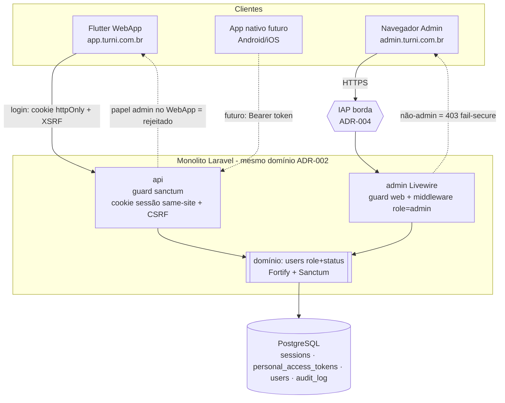

# ADR-007 — Modelo de autenticação base e roteamento por papel

## Contexto

PDR-003 estabelece **duas interfaces sobre uma base de usuários compartilhada**: o WebApp (Flutter Web, Contratante + Profissional) e o Backoffice (Laravel + Livewire, Admin). O **papel** do usuário decide qual interface ele acessa (`domain/usuario.md`: um usuário tem exatamente um papel — `admin`, `contratante` ou `profissional`). `non-functional.md` fixa o mecanismo de identidade do MVP: **e-mail + senha, sessão segura, multi-fator fora do escopo**, recuperação de senha por e-mail, HTTPS obrigatório, e **log auditável de toda ação do admin**. Sem uma ADR cobrindo isso, o EPIC-001 implementaria login ad-hoc — exatamente a dívida de segurança que a régua alta do produto (CPF, CNPJ, chave Pix, dados bancários, contrato eletrônico) não tolera.

A stack já está decidida e restringe fortemente as opções. ADR-001 fixou **Laravel** no backend com **Sanctum** como mecanismo de autenticação de cliente first-party (deixando o detalhe explicitamente para esta estória), **Livewire** no Backoffice e **Flutter Web** no WebApp — que evolui para **apps nativos Android/iOS** a partir do mesmo codebase. ADR-002 define a topologia: `api` (Laravel JSON, público, cliente é o Flutter), `admin` (Livewire, rede restrita) e `worker`, todos importando **um domínio único** sobre **um Postgres**. ADR-004 colocou o `admin` atrás de **Cloud Run `ingress=internal` + IAP**, mas deixou claro que **IAP é mecanismo de *infra* — o modelo de autenticação da aplicação é esta ADR**, não aquela.

Duas características da stack moldam a decisão de sessão. Primeiro: WebApp e API são **first-party** e compartilham o domínio de topo `turni.com.br` (`app.…`, `api.…`, `admin.…` — ADR-004), o que viabiliza autenticação baseada em **cookie de sessão same-site** sem expor token a JavaScript. Segundo: o WebApp **vira app nativo no futuro** (ADR-001), e app nativo não lida bem com cookies de navegador — o desenho precisa **caber em token Bearer depois** sem reescrita do backend. Sanctum atende os dois modos nativamente; esta ADR escolhe qual usar agora e registra o caminho do futuro.

O modelo de **papéis** cruza com o funil de aprovação de `domain/usuario.md`: cadastro público nasce `pendente_aprovacao`; o admin aprova → `liberado`; o usuário vê welcome e completa cadastro → `ativo`. Admins são criados internamente, já `ativo`. O papel não é auto-declarado livremente: o usuário escolhe `profissional`/`contratante` no cadastro, mas só opera após aprovação manual; o papel `admin` **nunca** é atribuível por cadastro público.

## Forças (drivers) da decisão

- **F1 — Idiomático ao Laravel / baterias incluídas (princípio #4):** peso **alto**. ADR-001 manda seguir o ecossistema; auth montada à mão é dívida. Sanctum + Fortify entregam login, sessão, CSRF, throttling, reset de senha e tokens prontos.
- **F2 — Segurança da credencial e da sessão (`security-architecture.md`, `non-functional.md`):** peso **alto**. Senha com hash adequado a 2026; sessão sem token exposto a XSS no web; logout que invalida no servidor; throttling de força bruta.
- **F3 — Segregação de superfície WebApp × Backoffice (PDR-003, `security-architecture.md`):** peso **alto**. Cookies, CSP e sessão do admin **não** compartilham com os do público; requisição cruzada entre hosts é fail-secure.
- **F4 — Caminho para app nativo sem reescrever o backend (ADR-001):** peso **alto**. O mecanismo do MVP (web) não pode pintar o backend num canto que impeça Bearer token no nativo depois.
- **F5 — Compatível com PWA / Flutter Web (ADR-001, `non-functional.md`):** peso **médio**. Cookie same-site funciona em PWA instalado; o esquema escolhido precisa sobreviver ao service worker e à auto-atualização.
- **F6 — Recuperação de senha e evolução para MFA (`non-functional.md`):** peso **médio**. Reset por e-mail no MVP; MFA fora do MVP **mas previsível** — não fechar a porta.
- **F7 — Auditabilidade de ação do admin (`non-functional.md`, `security-architecture.md`):** peso **alto**. Login do admin e toda ação no backoffice são eventos auditáveis (cruza com ADR-008 e com o futuro ADR de persistência do audit log).

## Opções consideradas

A decisão tem **duas dimensões**: (1) mecanismo de sessão do **WebApp** (cliente JSON sobre a `api`); (2) mecanismo de sessão do **Backoffice** (Livewire server-rendered). As opções abaixo são para a dimensão (1) — o WebApp, onde mora a tensão real. Para o Backoffice a escolha é praticamente óbvia (ver nota ao fim) e segue a dimensão (1) por coerência.

### Opção A — Sanctum em modo SPA (sessão por cookie same-site) no WebApp, com caminho para token Bearer no nativo futuro — **escolhida**
- **Resumo:** O WebApp Flutter Web autentica via **Sanctum SPA authentication**: a `api` emite um **cookie de sessão `httpOnly` + `Secure` + `SameSite=Lax`** após login, escopado em `.turni.com.br`, protegido por **CSRF token** (cookie `XSRF-TOKEN` lido e reenviado no header `X-XSRF-TOKEN`). Nenhum token de acesso fica em `localStorage`/JS — imune a roubo por XSS. Quando o WebApp virar **app nativo**, troca-se o modo para **Sanctum personal access tokens (Bearer)**, guardados em *secure storage* do device; o **mesmo backend** suporta ambos sem mudança de domínio.
- **Como atende aos princípios** (`references/architecture-principles.md`):
  - ✅ **Simplicidade (1):** um único pacote (Sanctum) cobre web agora e nativo depois; zero infra de auth extra.
  - ✅ **Opinativo (4):** Sanctum é o caminho oficial do Laravel para SPA/mobile first-party; Fortify provê os fluxos (login, reset, throttle) sem código artesanal.
  - ✅ **Postgres-first (3):** sessões na tabela `sessions` (driver `database`) e tokens na tabela `personal_access_tokens` — sem Redis no MVP.
  - ✅ **Reversibilidade (7):** alternar SPA↔token é configuração, não rearquitetura; logout no servidor é real (invalida sessão/token).
  - ✅ **Segurança (F2):** sem token em JS no web; CSRF tratado pelo próprio Sanctum; cookie `httpOnly`.
- **Prós concretos:** XSS não captura credencial de sessão no web; CSRF resolvido pelo framework; caminho nativo nativo (trocadilho intencional) já mapeado; logout server-side; tudo no Postgres.
- **Contras concretos:** exige **mesmo domínio de topo** entre `app.` e `api.` (já garantido por ADR-004) e configuração correta de `SANCTUM_STATEFUL_DOMAINS` + `session.domain=.turni.com.br` + CORS com credenciais; o service worker do PWA precisa **não** cachear respostas autenticadas (cruza com a política de cache do ADR-001).

### Opção B — Sanctum API tokens (Bearer) também no WebApp Flutter Web
- **Resumo:** Tratar o Flutter Web já como cliente mobile: login retorna um **token Bearer** que o app guarda e envia em `Authorization: Bearer`. Um só modo para web e nativo.
- **Como atende aos princípios:** ✅ um modo só para web e futuro nativo (uniformidade); ✅ stateless do lado do cookie; ❌ **F2:** no **navegador**, o token precisa morar em `localStorage`/memória JS → **alvo de XSS**; revogação depende de TTL/lista; ⚠️ CSRF deixa de ser problema, mas o ganho não compensa a exposição a XSS no web.
- **Prós:** simetria total web/nativo; sem dependência de mesmo domínio de topo.
- **Contras:** **superfície de XSS** no navegador — credencial roubável por script injetado, justamente onde a defesa em profundidade do `security-architecture.md` pede o contrário; é o anti-padrão conhecido de SPA com token em storage.
- **Razão de não ser a escolhida:** perde em F2 (segurança) no único cliente que hoje existe (web). A simetria com o nativo (F4) é alcançada pela Opção A **quando o nativo existir** — não há motivo para pagar o risco de XSS agora por uma uniformidade que só importa no futuro.

### Opção C — OIDC com provedor externo (Keycloak/Auth0/Cognito) desde o MVP
- **Resumo:** Delegar identidade a um Identity Provider externo via OpenID Connect; a aplicação consome tokens do IdP.
- **Como atende aos princípios:** ⚠️ traz MFA/social/SSO de graça (bom para o futuro); ❌ **Simplicidade (1):** mais uma peça móvel e/ou custo recorrente (Auth0) ou um Keycloak a operar (time minúsculo — princípio #1); ❌ **Custo (11):** SaaS pago ou VM extra sem necessidade no MVP; ⚠️ overkill para "e-mail + senha, sem MFA" do `non-functional.md`.
- **Razão de não ser a escolhida:** resolve um problema que o MVP **não tem** (federação/SSO) ao custo de operação/dinheiro que o MVP **não quer**. Fica como evolução natural se MFA obrigatório ou login social entrarem em escopo — Sanctum não impede migrar para um IdP depois (a base de usuários continua nossa).

### Opção D — Status quo (sem modelo definido; EPIC-001 decide ad-hoc)
- **Consequência se mantivermos:** cada estória de login inventa seu esquema; risco alto de cookie inseguro, token em storage, ausência de throttling, logout fake.
- **Custo de adiar:** bloqueia EPIC-001 com dívida de segurança difícil de reverter depois de telas no ar. Descartada — a decisão é necessária agora e é barata de tomar dado o suporte nativo do Laravel.

## Matriz comparativa

| Critério (força) | Peso | A — Sanctum SPA (→ token no nativo) | B — Sanctum token no web | C — OIDC externo |
|---|---|---|---|---|
| F1 — Idiomático Laravel | alto | ✅ caminho oficial | ✅ também Sanctum | ⚠️ integra, mas sai do framework |
| F2 — Segurança credencial/sessão | alto | ✅ sem token em JS, CSRF nativo | ❌ token em storage = XSS | ✅ forte (mas complexo) |
| F3 — Segregação WebApp × admin | alto | ✅ cookies/escopo distintos | ⚠️ neutro | ⚠️ neutro |
| F4 — Caminho app nativo | alto | ✅ troca para token Bearer | ✅ já é token | ✅ tokens do IdP |
| F5 — PWA / Flutter Web | médio | ✅ cookie same-site + SW disciplinado | ✅ | ⚠️ redirects de OIDC em PWA dão atrito |
| F6 — Reset de senha / MFA futuro | médio | ✅ Fortify; MFA plugável | ✅ idem | ✅ MFA de graça |
| F7 — Auditabilidade admin | alto | ✅ eventos de auth no nosso banco | ✅ | ⚠️ eventos no IdP, fora do nosso log |
| Simplicidade / custo (1, 11) | — | ✅ zero peça extra | ✅ zero peça extra | ❌ SaaS pago ou Keycloak a operar |

> A Opção A vence por dominar **F2** sem perder F1/F4: entrega o modo seguro para o cliente que existe hoje (web) e mantém o caminho de token Bearer mapeado para o cliente de amanhã (nativo), tudo dentro do Sanctum, sem peça nova.

## Decisão proposta

> **Optamos pela Opção A.**

O modelo de autenticação base do Turni é construído sobre **Laravel Sanctum + Fortify**, com identidade **e-mail + senha** e **uma única tabela `users` compartilhada** pelas duas interfaces. Concretamente:

**(a) Identidade e armazenamento de senha.** E-mail é a chave única do sistema (`domain/usuario.md`). Senha com hash **Argon2id** (`HASH_DRIVER=argon2id`), parâmetros mínimos alinhados ao OWASP 2026: **memória 64 MiB, iterações (time cost) 3, paralelismo 1**, ajustáveis para ~250–500 ms por hash no hardware de produção. Bcrypt com `cost ≥ 12` fica registrado como fallback aceitável caso o build PHP não traga libsodium/Argon — ambos são "adequados para 2026". Senha **nunca** aparece em log nem é retornada em API (cruza com ADR-008, mascaramento).

**(b) Sessão.**
  - **WebApp (Flutter Web sobre a `api`):** **Sanctum SPA** — cookie de sessão `httpOnly` + `Secure` + `SameSite=Lax`, escopado em `session.domain=.turni.com.br`, com proteção **CSRF** via `XSRF-TOKEN` (chamada inicial a `/sanctum/csrf-cookie`). `SANCTUM_STATEFUL_DOMAINS` inclui `app.turni.com.br` (e os equivalentes de homologação). Driver de sessão `database` (Postgres). **Logout invalida a sessão no servidor**, não só apaga o cookie.
  - **Backoffice (Livewire):** sessão **web padrão do Laravel** (guard `web`), cookie `httpOnly` + `Secure` + `SameSite=Lax`, escopado **apenas** no host do admin — **cookie distinto e não compartilhado** com o do WebApp (F3). Tempo de vida de sessão **mais curto** que o do WebApp (sugestão: `SESSION_LIFETIME` 120 min com expiração em inatividade), por ser superfície de alto privilégio.
  - **Nativo (futuro):** quando o WebApp virar app Android/iOS, o mesmo backend passa a emitir **personal access tokens (Bearer)** do Sanctum, guardados em *secure storage* do device. Sem mudança de domínio nem de backend — só de modo do cliente.

**(c) Modelo de papéis.** Coluna **`role`** na tabela `users` com enum `admin | contratante | profissional` (RBAC simples — `security-architecture.md`); um usuário tem **um** papel (`domain/usuario.md`). Atribuição: cadastro público define `contratante`/`profissional` e nasce `status = pendente_aprovacao`; o **admin aprova** (transição para `liberado` → `ativo` pelo funil de `domain/usuario.md`); o papel **`admin` nunca é auto-atribuível** — admins são criados internamente (seeder/comando artisan), já `ativo`. Verificação de propriedade de recurso (profissional só vê seus turnos, contratante suas vagas) fica para os ADRs/estórias de domínio do EPIC-001+ — aqui registra-se apenas que o modelo é **RBAC + ownership**, não ABAC.

**(d) Roteamento pós-login (PDR-003).**
  - A `api` de login retorna o usuário autenticado com seu **`role`** e seu **`status`** de funil. O **WebApp** roteia `contratante`/`profissional` para suas visões; um usuário `admin` **não tem fluxo no WebApp** e é rejeitado ali. O funil pós-aprovação (`liberado` sem welcome / sem cadastro completo) é **enforced no roteamento do WebApp** (bloqueia rotas internas — `domain/usuario.md`).
  - O **Backoffice** exige `role = admin` via middleware/guard; qualquer não-admin recebe **403 fail-secure**. Defesa em profundidade: além do middleware da aplicação, o `admin` está atrás de **IAP** na borda (ADR-004) — duas camadas independentes (`security-architecture.md`).
  - **Fail-secure de host (`security-architecture.md`):** requisição destinada ao WebApp que chega no host do admin (ou vice-versa) **bloqueia**, não tenta servir.

**(e) Logs de admin auditáveis (`non-functional.md`).** Login do admin (sucesso e falha), troca de senha e **toda ação no backoffice** geram **evento auditável** (quem, quando, o quê — e, para ações destrutivas/financeiras, motivo textual conforme `security-architecture.md`). O **audit log é distinto do log de aplicação** (ADR-008): é uma trilha em **tabela append-only no Postgres**, imutável, retenção longa. O **modelo de tabela** do audit log é detalhado num ADR de persistência do EPIC-001; aqui fixa-se **que ele existe, o que registra e que é separado do log de observabilidade**.

**(f) Recuperação de senha.** Fluxo padrão **Fortify**: link assinado por e-mail, com **expiração** (sugestão 60 min) e **throttling** de solicitação. O envio usa o `Mail` do Laravel; o **provedor de e-mail transacional concreto fica para o EPIC-001** (`non-functional.md`/escopo desta estória) — o desenho apenas garante que cabe (driver de mail plugável). **Throttling de login** (bloqueio após N tentativas, sugestão 5 por minuto por e-mail+IP) via rate limiter do Laravel/Fortify, fail-secure.

**O que fica para o EPIC-001 (CA-4):** telas de login/cadastro/recuperação (WebApp Flutter e Backoffice Livewire), integração concreta de e-mail transacional, o funil "completar cadastro" pós-aprovação, e a modelagem fina do audit log. **O que precisa existir no Foundation:** apenas o **mecanismo base configurado** — Sanctum/Fortify instalados, guards `web`/`sanctum` e `session.domain` corretos, tabela `users` com `role`+`status`, `HASH_DRIVER=argon2id`, throttling e CSRF ligados. **STORY-008/009 (hello world) são páginas públicas — não exigem login real**; consomem desta ADR apenas a garantia de que a fundação de auth não as bloqueia.

## Justificativa

A Opção A é a única que entrega o **modo seguro para o cliente que existe hoje** (Flutter Web sem token exposto a XSS) **sem fechar a porta** do cliente de amanhã (app nativo com Bearer) — e faz isso dentro do Sanctum, sem peça de infra nova, honrando F1 (idiomático), F2 (segurança), F4 (nativo futuro) e F5 (PWA) ao mesmo tempo. O trade-off honesto é operacional, não estrutural: SPA-cookie exige **mesmo domínio de topo** (já garantido por ADR-004) e **disciplina no service worker** para não cachear resposta autenticada (já uma diretriz do ADR-001). A segregação do admin (F3) é tratada por cookie/escopo/host distintos **mais** o IAP da borda — duas camadas, como o `security-architecture.md` exige para a superfície de maior trauma. MFA e login social ficam de fora (`non-functional.md`) mas o caminho está aberto: Fortify pluga MFA, e migrar para um IdP OIDC depois não exige abandonar a base de usuários própria.

## Diagrama

## Consequências

### Positivas (o que ganhamos)
- Credencial de sessão do WebApp **fora do alcance de XSS** (cookie `httpOnly`), com CSRF resolvido pelo framework.
- Um único mecanismo (Sanctum) cobre **web hoje e nativo amanhã** — sem reescrever backend na transição.
- Tudo no Postgres (sessões, tokens, audit log) — coerente com princípio #3, sem Redis.
- Segregação WebApp × Backoffice em duas camadas (cookie/host + IAP), honrando PDR-003 e `security-architecture.md`.
- EPIC-001 herda um terreno de auth seguro e idiomático — sem login ad-hoc.

### Negativas / trade-offs aceitos
- SPA-cookie **acopla** WebApp e API ao mesmo domínio de topo `turni.com.br` (já garantido por ADR-004) e exige `SANCTUM_STATEFUL_DOMAINS`/`session.domain`/CORS-com-credenciais corretos — erro de config quebra login.
- **Dois modos de cliente ao longo do tempo** (cookie no web, token no nativo): a transição futura tem custo de teste, ainda que o backend não mude.
- Service worker do PWA precisa de **disciplina** para não cachear respostas autenticadas (já é diretriz do ADR-001, mas vira requisito de auth também).

### Neutras
- IAP no admin (ADR-004) e o middleware `role=admin` da aplicação são **redundantes de propósito** (defesa em profundidade) — não é desperdício, é design.
- O audit log de admin é citado aqui mas **modelado** no EPIC-001 (ADR de persistência) — fronteira consciente.

### Para o time
- **Impacto em estórias existentes:** destrava EPIC-001 (login/cadastro reais); informa STORY-006 (setup já instala/configura Sanctum, Fortify, `HASH_DRIVER`, `session.domain`); é neutro para STORY-008/009 (hello world público). Cruza com ADR-008 (eventos de auth viram log estruturado + o audit log é distinto).
- **ADRs/PDRs relacionados:** consome ADR-001 (Sanctum/Laravel/Flutter), ADR-002 (api/admin/worker), ADR-003 (domínio compartilhado), ADR-004 (IAP de borda, domínios). Honra PDR-003 (auth compartilhada, roteamento por papel) e PDR-001 (papel `profissional` com `tipo_pessoa`). Antecede o futuro ADR de persistência do audit log e um eventual ADR de autorização fina (ownership/policies) no EPIC-001.
- **Necessidade de spike de validação:** **não**. Sanctum SPA é caminho documentado e maduro; a validação empírica do fluxo real acontece no EPIC-001 com as telas de login.

## Plano de verificação

- **Como verificar conformidade:**
  - Teste de configuração: cookie de sessão sai `httpOnly` + `Secure` + `SameSite` em ambiente deployado; `HASH_DRIVER=argon2id` ativo; senha nunca serializada em resposta/log (teste + mascaramento do ADR-008).
  - Teste de autorização: não-admin recebe **403** no `admin`; `admin` é rejeitado nos fluxos do WebApp; requisição cruzada de host é bloqueada (fail-secure).
  - Teste de auth: logout invalida a sessão no servidor (request subsequente com o mesmo cookie falha); throttling bloqueia após N tentativas.
  - **Segurança (F2/F3):** dependências de auth no scanner de vulnerabilidade do CI (`quality-standards.md` 4); nenhum segredo de sessão/app key no código (Secret Manager — ADR-004).
- **Sinais de revisão (quando reabrir esta decisão):**
  - Se **MFA obrigatório** entrar em escopo (produto/compliance) → avaliar Fortify 2FA ou migração para IdP OIDC (Opção C).
  - Se **login social/SSO** for exigido → reabrir para OIDC.
  - Se o acoplamento de domínio do SPA-cookie causar atrito real (ex.: necessidade de domínios distintos) → migrar o WebApp para token Bearer (Opção B) antecipando o modo nativo.
  - Se a tabela `sessions` no Postgres virar gargalo medido → avaliar driver de sessão alternativo (ADR específico; não reabre esta).
- **NFR tocados:** dados pessoais (e-mail) e credencial (hash) — tratados conforme `security-architecture.md`; HTTPS obrigatório (ADR-004); auditabilidade de admin (F7).
- **Spike de validação proposto:** nenhum; EPIC-001 valida com as telas de login.

---

## Aprovação humana

> Esta seção é o registro formal do aceite. Não preencher sozinho — preencher quando o humano aprovar no chat ou via PR.

- **Status final:** ✅ aceita
- **Aprovado por:** Alexandro
- **Data:** 2026-05-27
- **Forma do aceite:** aprovado em chat (sessão de 2026-05-27); commit direto na `main`
- **Condicionantes do aceite:** nenhuma.

### Em caso de rejeição
- **Motivo:** ...
- **Próximos passos sugeridos:** ...

### Em caso de superseding
- **Substituída por:** ADR-YYY
- **Razão da substituição:** ...

---

## Histórico

- 2026-05-27 — criada como `proposed` por Arquiteto (STORY-004). Decisão de sessão SPA-cookie (Sanctum) para o WebApp com caminho de token Bearer para o nativo futuro; Argon2id para hash; RBAC por coluna `role`; segregação de admin em duas camadas (cookie/host + IAP).
- 2026-05-27 — `accepted` por Alexandro (aprovação em chat, junto de ADR-008; commit direto na `main`).
