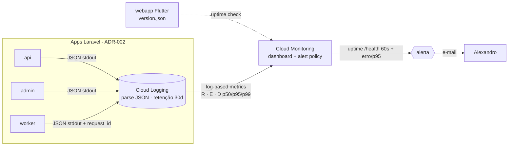

# ADR-008 — Observabilidade mínima

## Contexto

O EPIC-000 só fecha quando o validador (STORY-011) consegue confirmar que `app.homolog.turni.com.br` e `admin.homolog.turni.com.br` estão **realmente operando** — e "deploy verde" só é verificável com **health-check + logs estruturados** no ar. `quality-standards.md` seção 3 exige, por serviço entregue: endpoint de saúde, logs estruturados, métricas básicas (RPS, latência p50/p95/p99, taxa de erro) e **alerta de indisponibilidade**. `non-functional.md` reforça: logs estruturados para tudo que afeta turno e pagamento, alertas para falha de Pix / geofencing / disputa, e trace da sequência financeira pré-autorização → captura → Pix. O hello world de STORY-008/009 já precisa do health-check para o validador aprovar.

A decisão de infra-base já foi tomada e **restringe fortemente** esta ADR. ADR-004 fixou: aplicações **emitem log JSON em stdout/stderr**; Cloud Run/GCE encaminha ao **Cloud Logging**, que **parseia o JSON automaticamente** (severidade, trace, payload); destino = Cloud Logging; e delegou **explicitamente a esta ADR** o detalhamento (campos canônicos, métricas RED, alertas, retenção, propagação de request_id). ADR-002 define os três serviços a observar — `api` (público), `admin` (restrito) e `worker` (`queue:work`) — todos sobre **um Postgres**; o `webapp` é bundle estático no Firebase Hosting. ADR-001 mencionou **Telescope/Pulse** como observabilidade local/dev e fixou o `version.json` do WebApp.

As restrições que moldam a decisão: **time minúsculo** e **fase pré-receita** (princípios #1/#11) — **sem SaaS pago de observabilidade no MVP** (Datadog/New Relic estão fora; CA-7); **tudo recriável por IaC** (ADR-004 — alertas e métricas viram Terraform, não clique no console); e o **escopo deliberadamente enxuto** do `epic.md` — sem trace distribuído sofisticado, sem APM completo, sem dashboards consolidados nesta onda (CA-8). O princípio #8 ("observabilidade é requisito") e o #9 ("automatizável > documentável") são o pano de fundo: o sinal precisa existir e ser barato de manter.

Há ainda uma fronteira a deixar nítida: **log de aplicação (observabilidade) ≠ audit log (trilha jurídica)**. `security-architecture.md` separa os dois — o audit log de admin (ADR-007) é tabela append-only no Postgres, fonte de verdade jurídica; o log de observabilidade desta ADR é efêmero, vai para o Cloud Logging e serve para operar/diagnosticar. Esta ADR cobre **só o segundo**.

## Forças (drivers) da decisão

- **F1 — Custo zero de SaaS no MVP (princípios #11, CA-7):** peso **alto**. Tem que caber no GCP já contratado (créditos), sem ferramenta paga.
- **F2 — Idiomático ao Laravel + nativo do GCP (princípio #4, ADR-004):** peso **alto**. Reaproveitar o que Laravel (Monolog) e Cloud Logging/Monitoring já dão de graça; não construir pipeline de métricas à mão.
- **F3 — Verificável pelo validador (STORY-011) e suficiente para o hello world (STORY-008/009):** peso **alto**. Health-check + log estruturado precisam existir e ser checáveis já no Foundation.
- **F4 — Rastreabilidade end-to-end de uma requisição (`non-functional.md`):** peso **alto**. Correlacionar logs de `api` → `worker` (Pix, webhook Pagar.me) por um id comum, sem trace distribuído sofisticado.
- **F5 — Automatizável por IaC (ADR-004, princípio #9):** peso **médio**. Métricas, dashboards e alertas declarados em Terraform; recriáveis do zero.
- **F6 — Enxuto, sem overengineering (princípios #1, escopo do `epic.md`):** peso **alto**. Nada de APM/trace distribuído/RUM nesta onda; o mínimo que cumpre `quality-standards.md` 3.

## Opções consideradas

A decisão de **destino** (Cloud Logging) já está fixada por ADR-004; o que esta ADR escolhe é **como produzir e consumir** os sinais. A tensão real é a fonte das **métricas RED** sem SaaS pago.

### Opção A — Log JSON em stdout → Cloud Logging; RED via *log-based metrics* + uptime check; alerta no Cloud Monitoring — **escolhida**
- **Resumo:** Toda app emite **uma linha JSON por evento/requisição** em stdout (Monolog com formatter JSON, severidade mapeada para o padrão do Cloud Logging). Um **middleware de requisição** loga método, rota, status, `duration_ms` e `request_id`. As **métricas RED** (Requests/Errors/Duration) são derivadas por **log-based metrics** do Cloud Logging (counter de requests, counter de 5xx, distribution de `duration_ms` → p50/p95/p99). **Health-check** `/health` em `api` e `admin`. **Alerta** via Cloud Monitoring: *uptime check* batendo `/health` + *alert policy* sobre a métrica de erro, notificando Alexandro por e-mail. Tudo declarado em **Terraform**.
- **Como atende aos princípios:**
  - ✅ **Custo (11, F1):** Cloud Logging (free tier ~50 GB/mês) + Cloud Monitoring (uptime checks e alertas no free tier) → **R$0** no volume do MVP.
  - ✅ **Opinativo/nativo (4, F2):** Monolog é nativo do Laravel; Cloud Logging parseia JSON sozinho (ADR-004); zero pipeline próprio.
  - ✅ **Automatizável (9, F5):** log-based metrics, uptime check, alert policy e dashboard são recursos Terraform.
  - ✅ **Simplicidade (1, F6):** nenhum coletor/agente extra; a app só escreve em stdout, como ADR-004 já previu.
  - ✅ **Postgres-first (3):** não introduz armazenamento novo (nem Prometheus, nem TSDB).
- **Prós concretos:** zero peça nova; cumpre `quality-standards.md` 3 inteiro; RED sem instrumentar Prometheus; recriável por IaC; correlação por `request_id` no JSON.
- **Contras concretos:** métricas derivadas de log têm **granularidade/latência** menores que um sistema de métricas dedicado (suficiente no MVP, registrado como sinal de revisão); percentis vêm da *distribution* do Cloud Logging, não de histograma de alta resolução.

### Opção B — Stack self-hosted Prometheus + Grafana + Loki
- **Resumo:** Subir Prometheus (métricas), Loki (logs) e Grafana (dashboards/alertas) em VMs/containers próprios.
- **Como atende aos princípios:** ✅ métricas RED de primeira classe, dashboards ricos; ❌ **Simplicidade/custo (1, 11):** três serviços a operar e pagar (VMs), em time minúsculo — exatamente a operação pesada que os princípios desqualificam; ❌ **F6:** overkill para o Foundation.
- **Razão de não ser a escolhida:** entrega mais do que o MVP precisa ao custo de operação que o MVP não pode pagar. Fica como evolução natural quando o volume/maturidade justificar (Cloud Logging não impede migrar depois).

### Opção C — SaaS de APM (Datadog / New Relic / Sentry pago)
- **Resumo:** Plugar um APM gerenciado com tracing, métricas e alertas prontos.
- **Como atende aos princípios:** ✅ poderosíssimo, pouco esforço; ❌ **CA-7 / Custo (11):** custo recorrente por host/volume, proibido no MVP por esta estória.
- **Razão de não ser a escolhida:** **viola CA-7** (sem SaaS pago no MVP). Reabrível quando houver orçamento e necessidade (ex.: Sentry para erros de frontend pode entrar como evolução barata).

### Opção D — Status quo (logs de texto livre, sem health-check/métricas/alerta)
- **Consequência se mantivermos:** o validador não consegue confirmar "health-check em verde nas duas URLs"; STORY-008/009 e STORY-011 ficam sem como provar operação.
- **Custo de adiar:** bloqueia o fechamento do EPIC-000. Descartada — o mínimo é exigência de `quality-standards.md` 3.

## Matriz comparativa

| Critério (força) | Peso | A — Cloud Logging + log-based metrics | B — Prometheus/Grafana/Loki | C — SaaS APM |
|---|---|---|---|---|
| F1 — Custo zero no MVP | alto | ✅ free tier GCP | ❌ VMs a pagar/operar | ❌ assinatura |
| F2 — Idiomático Laravel + nativo GCP | alto | ✅ Monolog + Cloud Logging | ⚠️ exporters a montar | ⚠️ SDK próprio |
| F3 — Verificável no Foundation | alto | ✅ /health + log já checável | ✅ | ✅ |
| F4 — Rastreabilidade end-to-end | alto | ✅ request_id no JSON | ✅ | ✅ (trace nativo) |
| F5 — Automatizável por IaC | médio | ✅ recursos Terraform | ⚠️ Terraform + config dos serviços | ⚠️ parcial |
| F6 — Enxuto / sem overengineering | alto | ✅ nada novo a operar | ❌ 3 serviços | ⚠️ poderoso demais p/ MVP |

> A Opção A vence por cumprir `quality-standards.md` 3 **sem introduzir nenhuma peça nova** — reusa o que ADR-004 já montou (stdout → Cloud Logging) e o free tier do Cloud Monitoring, ao custo aceito de métricas derivadas de log em vez de um sistema de métricas dedicado.

## Decisão proposta

> **Optamos pela Opção A.**

A observabilidade mínima do Turni é construída sobre **Monolog (JSON em stdout) → Cloud Logging → Cloud Monitoring**, sem SaaS pago, tudo declarado em Terraform. Concretamente:

**(a) Formato dos logs estruturados.** Uma **linha JSON por evento**, com campos canônicos:

```json
{
  "timestamp": "2026-05-27T18:42:10.512Z",
  "severity": "INFO",
  "service": "api",
  "env": "homolog",
  "version": "a1b2c3d",
  "request_id": "01J9Z…",
  "user_id": 4821,
  "role": "profissional",
  "event": "request.handled",
  "message": "POST /v1/candidaturas 201",
  "method": "POST",
  "path": "/v1/candidaturas",
  "status_code": 201,
  "duration_ms": 87,
  "context": { "vaga_id": 1190 }
}
```

`severity` usa os níveis do Cloud Logging (`DEBUG/INFO/WARNING/ERROR/CRITICAL`), mapeados a partir do Monolog. `service` ∈ `{api, admin, worker}`. `version` é o git sha do deploy. **Dados pessoais e credenciais nunca aparecem em claro** (`security-architecture.md`, ADR-007): senha, token, chave Pix, CPF/CNPJ e dados bancários são **mascarados/omitidos** por uma lista de campos redatados aplicada no formatter — automatizado, não "lembre de mascarar" (princípio #9).

**(b) Destino dos logs.** **stdout/stderr do container** (ADR-004) → coletado automaticamente pelo **Cloud Logging**, que parseia o JSON (severidade, trace, payload). **Sem agente/coletor extra.** Em **dev local**, `Telescope`/`Pulse` (ADR-001) cobrem inspeção; o formatter JSON também roda local para paridade. **Retenção**: bucket `_Default` do Cloud Logging (sugestão **30 dias** no MVP, ajustável por Terraform) — distinta e bem menor que a retenção do **audit log** (Postgres, ADR-007), que é jurídica e longa.

**(c) Health-check.** Endpoint **`/health`** em `api` e `admin`, retornando **200** quando OK, rápido (< 100 ms), com corpo JSON mínimo:

```json
{ "status": "ok", "version": "a1b2c3d", "timestamp": "2026-05-27T18:42:10Z" }
```

`/health` é **liveness** (o processo responde). Uma variante **readiness** (`/health?deep=1` ou `/ready`) verifica conectividade com o **Postgres** e retorna **503** se o banco estiver inacessível (fail-secure — não reportar "ok" sem o banco). Laravel 11+ já expõe `/up`; padronizamos **`/health`** com versão+timestamp por cima dele. O **`webapp`** (Flutter estático) não tem processo de backend: sua "saúde" é o Firebase Hosting servir o `index.html` + o **`version.json`** (ADR-001), checado pelo uptime check.

**(d) Métricas mínimas (RED).** Derivadas por **log-based metrics** do Cloud Logging sobre o log de requisição:
  - **Requests (R):** counter por `service`/`status_code` → RPS.
  - **Errors (E):** counter de `status_code >= 500` → taxa de erro = E/R.
  - **Duration (D):** *distribution metric* de `duration_ms` → **p50/p95/p99** por serviço.
  Expostas num **dashboard do Cloud Monitoring** (free tier), declarado em Terraform. Sem Prometheus, sem TSDB própria.

**(e) Alerta de indisponibilidade.** No **Cloud Monitoring**, declarado em Terraform:
  - **Uptime check** batendo `/health` de `api` e `admin` (e a raiz do `webapp`) a cada **60 s** de múltiplas regiões; falha sustentada dispara alerta.
  - **Alert policy** sobre a taxa de erro (5xx) e sobre p95 acima do SLO (`non-functional.md`: p95 ≤ 800 ms no caminho crítico).
  - **Canal de notificação:** **e-mail para Alexandro** no MVP (gatilho humano único); o canal é um recurso Terraform — Slack/PagerDuty plugáveis depois sem mudar a policy.
  - Os **alertas de negócio** de `non-functional.md` (falha de Pix > 15 min — PDR-010; geofencing fora do raio — PDR-008; disputa aberta — PDR-006) usam **o mesmo mecanismo** (evento logado com `event` próprio → log-based metric → alert policy), mas são **wirados quando os fluxos existirem** (EPICs 003/005), não no Foundation. Esta ADR fixa o **mecanismo**; o Foundation entrega apenas o **alerta de indisponibilidade de infra**.

**(f) Propagação de `request_id`.** Um **middleware** na `api`/`admin` lê o header de correlação entrante — preferindo o **`X-Cloud-Trace-Context`** que o Cloud Run já injeta (reaproveita o trace do GCP), com fallback para gerar um ULID quando ausente — e o coloca em **todo log** da requisição. Ao **enfileirar um job**, o `request_id` é anexado ao payload do job; o **`worker`** o relê e loga com o **mesmo** `request_id`, tornando rastreável a cadeia `api` → fila → `worker` (essencial para a sequência **pré-autorização → captura → Pix** de `non-functional.md`, mesmo sem trace distribuído sofisticado). O WebApp Flutter envia/loga o `request_id` em erros para casar relatos de usuário com o servidor.

**Fora de escopo (CA-8):** trace distribuído sofisticado (spans OpenTelemetry correlacionados entre serviços além do `request_id`), dashboards consolidados além do RED básico, APM completo (Datadog/New Relic), e **Real User Monitoring** do frontend — todos conforme a seção "Fora de escopo" do `epic.md`. Reabríveis por evolução; nada aqui impede adicioná-los depois (ex.: Sentry para erros de FE pode entrar barato no futuro).

## Justificativa

A Opção A é a única que cumpre **integralmente** `quality-standards.md` 3 (health-check + logs estruturados + RED + alerta) **sem adicionar peça móvel nem custo de SaaS** — ela apenas dá conteúdo ao terreno que ADR-004 já preparou (stdout → Cloud Logging) e usa o free tier do Cloud Monitoring para uptime e alerta. As alternativas perdem por excesso: Prometheus/Grafana/Loki (B) faz o time minúsculo operar três serviços, e APM pago (C) viola o CA-7. O preço honesto da Opção A é que **métricas vêm de log-based metrics**, com granularidade/latência menores que um sistema de métricas dedicado — aceitável no volume do MVP e registrado como sinal de revisão. A rastreabilidade end-to-end (F4) é resolvida de forma simples e suficiente pelo `request_id` propagado api→fila→worker, reusando o trace que o Cloud Run já injeta, sem o peso de tracing distribuído. E a fronteira com o audit log fica explícita: observabilidade é efêmera e operacional; trilha jurídica é Postgres append-only (ADR-007).

## Diagrama



## Consequências

### Positivas (o que ganhamos)
- Cumpre `quality-standards.md` 3 inteiro com **R$0 de SaaS** e **nenhuma peça nova** — só conteúdo sobre o que ADR-004 já montou.
- Health-check + log estruturado **checáveis já no hello world** (STORY-008/009) — destrava o veredito do validador (STORY-011).
- Rastreabilidade `api`→`worker` por `request_id` cobre a cadeia financeira sem trace distribuído.
- Tudo recriável por IaC (métricas, dashboard, uptime, alerta em Terraform).
- Mascaramento de PII/credencial automatizado no formatter (princípio #9; cruza ADR-007).

### Negativas / trade-offs aceitos
- **Métricas derivadas de log** têm granularidade/latência inferiores a um sistema de métricas dedicado — suficiente no MVP, sinal de revisão registrado.
- **Sem trace distribuído** sofisticado: correlação fica no `request_id`; cadeias muito profundas exigem leitura manual de logs.
- Dependência do **Cloud Logging/Monitoring** (lock-in moderado, coerente com ADR-004 e portável depois).

### Neutras
- `Telescope`/`Pulse` (ADR-001) seguem como ferramenta **local/dev**; o caminho deployado é Cloud Logging — duas ferramentas com papéis distintos, sem conflito.
- Retenção de 30 dias do log é separada e independente da retenção (longa) do audit log (ADR-007).

### Para o time
- **Impacto em estórias existentes:** destrava STORY-008/009 (hello world precisa expor `/health` e logar JSON) e STORY-011 (validador checa health verde + logs). Informa STORY-006 (setup configura o canal de log JSON + Telescope/Pulse local) e STORY-007 (pipeline/Terraform criam log-based metrics, uptime check, alert policy, dashboard).
- **ADRs/PDRs relacionados:** consome ADR-004 (stdout→Cloud Logging, destino) e ADR-002 (3 serviços); cruza ADR-007 (eventos de auth viram log; audit log é distinto); prepara o mecanismo dos alertas de PDR-010/008/006 (wirados nos épicos de Pix/disputa).
- **Necessidade de spike de validação:** **não**. O hello world (STORY-008/009) é a validação empírica do health-check + log; o RED é exercitado a partir do primeiro tráfego real em homologação.

## Plano de verificação

- **Como verificar conformidade:**
  - `/health` retorna **200 + version + timestamp** em `api`/`admin`; readiness retorna **503** com banco caído (teste).
  - Cada requisição produz **uma linha JSON** com os campos canônicos e `request_id`; um job processado pelo `worker` carrega o **mesmo** `request_id` da requisição que o enfileirou (teste de correlação).
  - Campos sensíveis (senha, token, chave Pix, CPF/CNPJ, dados bancários) **não aparecem** no log (teste do formatter + lista de redação).
  - log-based metrics, dashboard, uptime check e alert policy existem **no Terraform** (sem clique no console — `terraform plan` sem drift).
- **NFR / sinais de revisão (quando reabrir esta decisão):**
  - **Disponibilidade:** uptime check sustenta o SLO de ≥99.5% (webapp) / ≥99% (admin) de `non-functional.md`; se não, revisar `min-instances`/topologia.
  - **Latência:** p95 do caminho crítico ≤ 800 ms (`non-functional.md`); alerta dispara acima disso.
  - **Custo/volume:** se o volume de log ultrapassar o free tier do Cloud Logging (≈50 GB/mês) → revisar nível de log/retenção (princípio #11; "logando demais" do `nfr-architecture.md`).
  - **Maturidade:** se a granularidade das log-based metrics ficar insuficiente (necessidade de histograma de alta resolução, tracing distribuído, RUM) → reabrir para Prometheus/Grafana (Opção B) ou um SaaS pontual (ex.: Sentry para FE).
- **Spike de validação proposto:** nenhum; STORY-008/009 cumprem o papel.

---

## Aprovação humana

> Esta seção é o registro formal do aceite. Não preencher sozinho — preencher quando o humano aprovar no chat ou via PR.

- **Status final:** ✅ aceita
- **Aprovado por:** Alexandro
- **Data:** 2026-05-27
- **Forma do aceite:** aprovado em chat (sessão de 2026-05-27); commit direto na `main`
- **Condicionantes do aceite:** nenhuma.

### Em caso de rejeição
- **Motivo:** ...
- **Próximos passos sugeridos:** ...

### Em caso de superseding
- **Substituída por:** ADR-YYY
- **Razão da substituição:** ...

---

## Histórico

- 2026-05-27 — criada como `proposed` por Arquiteto (STORY-004). Observabilidade mínima sobre Monolog (JSON stdout) → Cloud Logging → Cloud Monitoring; RED por log-based metrics; health-check `/health` com versão; alerta de indisponibilidade por uptime check + e-mail; request_id propagado api→worker. Sem SaaS pago (CA-7); APM/trace distribuído/RUM fora de escopo (CA-8).
- 2026-05-27 — `accepted` por Alexandro (aprovação em chat, junto de ADR-007; commit direto na `main`).
