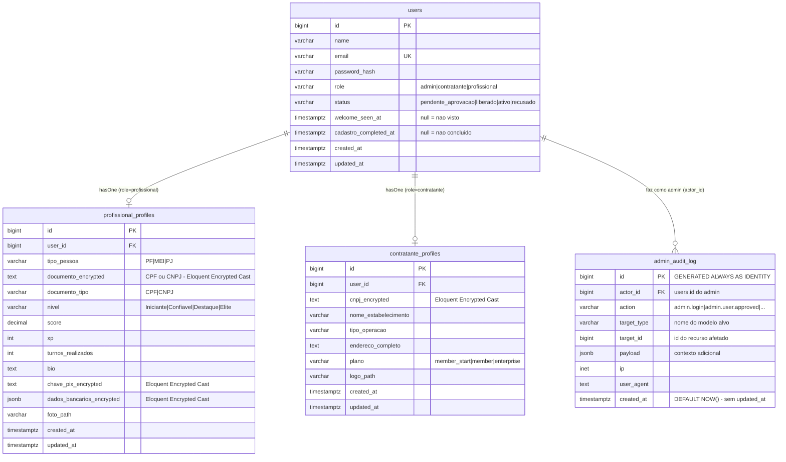
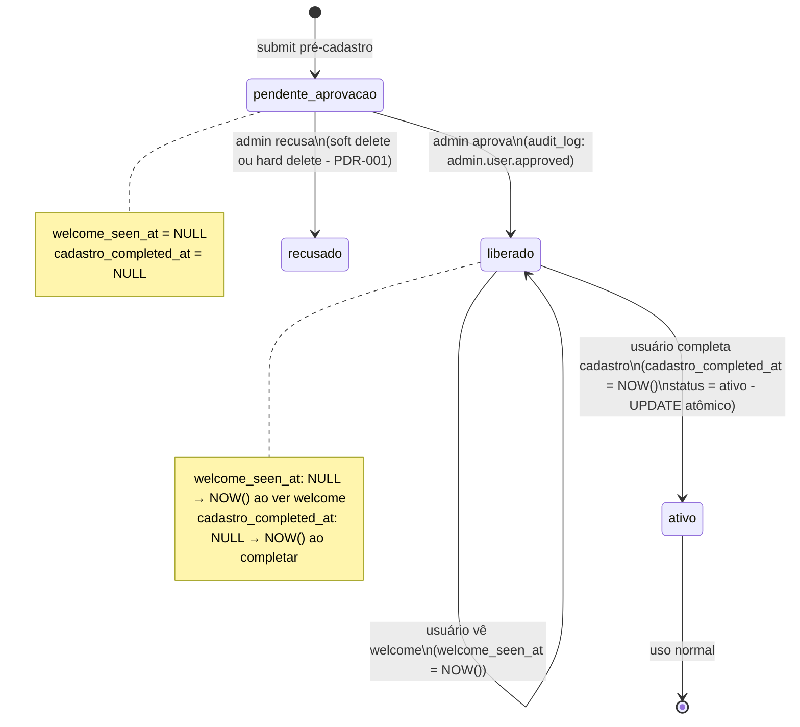
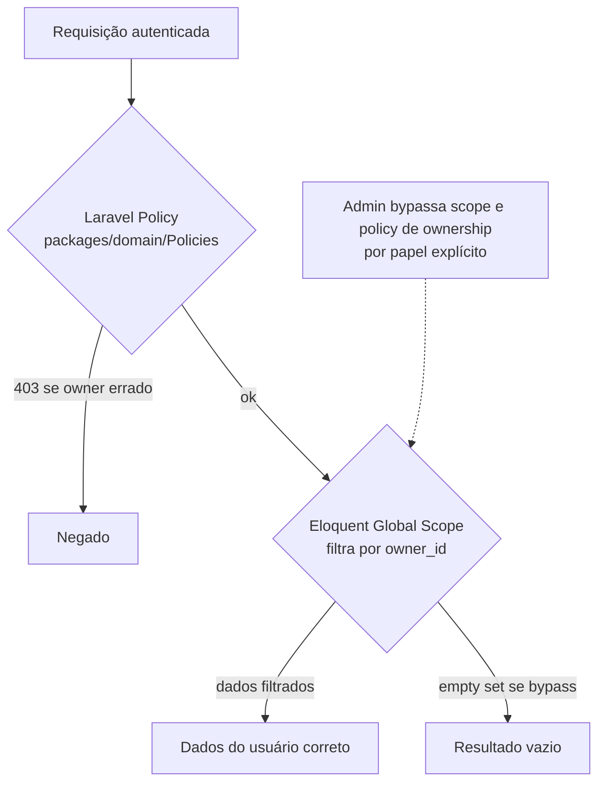

# ADR-009 — Modelo de dados de identidade do EPIC-001

## Contexto

O EPIC-001 introduz o primeiro domínio com lógica de negócio real: identidade de profissional polimórfico (PF/MEI/PJ — PDR-001), identidade de contratante (sempre PJ/CNPJ), funil de aprovação obrigatório (`pendente_aprovacao → liberado → ativo`), controle de acesso com ownership e audit log de toda ação de admin.

ADR-007 estabeleceu o mecanismo de autenticação (Sanctum SPA + guard web, Argon2id, coluna `role`+`status` em `users`) e deixou explicitamente para esta ADR: **(a)** a modelagem fina do polimorfismo e dos dados específicos por papel; **(b)** a representação do funil pós-aprovação como estados, flags ou timestamps; **(c)** ownership/policies para RBAC vivo; **(d)** o modelo da tabela append-only de audit log. Decidir essas quatro peças ad-hoc nas estórias de implementação produziria incoerência estrutural impossível de reverter: cada PR inventaria o seu esquema, e o validador do épico (STORY-025) não teria referência arquitetural para cobrar.

As restrições que chegam consolidadas:

- **PDR-001** — `tipo_pessoa ∈ {PF, MEI, PJ}` para profissionais; CPF para PF, CNPJ para MEI/PJ; validação manual em 24h (sem consulta à Receita no MVP). Dois templates de contrato eletrônico (autônomo eventual para PF; B2B PJ↔PJ para MEI/PJ — STORY-013/ADR-010 detalha isso).
- **PDR-003** — Auth compartilhada entre WebApp e Backoffice; roteamento por papel após login. Contratante e Profissional operam no WebApp; Admin apenas no Backoffice.
- **ADR-007** — Tabela `users` já decidida com `role` (admin|contratante|profissional) e `status`. Esta ADR define os demais campos e as tabelas associadas. **Não reabre nada de ADR-007.**
- **ADR-000 + ADR-001 + ADR-002** — PostgreSQL, Laravel/Eloquent, monolito modular com `packages/domain`.
- **ADR-008** — Log estruturado JSON em stdout para observabilidade. O audit log de admin é **distinto** e complementar: é trilha de evidência legal/operacional em tabela Postgres, não log de sistema.
- **non-functional.md §Segurança** — Dados sensíveis (documento CPF/CNPJ, dados bancários, chave Pix, foto de documento) criptografados em repouso. Toda ação do admin gera log auditável.
- **Critério herdado EPIC-000 (F-NB-1)** — A primeira migração com lógica de negócio deve ser reversível com `php artisan migrate:rollback` em homologação. A modelagem aqui deve permitir isso.
- **compliance.md** — `AceiteEletronico` é trilha por turno (a partir do EPIC-003). Esta ADR cobre apenas o audit log de ação de admin — são duas trilhas distintas com propósito e granularidade diferentes.

## Forças (drivers) da decisão

- **F1 — Limpeza de schema (sem nullable explosion):** Profissional tem ~15 atributos específicos; Contratante tem ~12; Admin tem apenas o núcleo. Um modelo que mistura tudo em `users` com colunas nullable por papel resulta em tabela com 30+ colunas, metade NULL para qualquer usuário. Peso: **alto**.
- **F2 — Eloquent idiomático, sem magia (princípio #4):** A solução precisa ser natural para o Programador trabalhar sem abstrações inventadas. Eloquent suporta relações 1:1, polimórficas, scopes e policies de forma nativa. Peso: **alto**.
- **F3 — Reversibilidade de migração (ADR-007 critério F-NB-1):** O desenho deve permitir `migrate:rollback` da primeira migração com lógica de negócio sem destruir dados ou deixar banco inconsistente. Peso: **alto**.
- **F4 — Fail-secure de ownership:** Qualquer dúvida de propriedade de recurso deve resultar em negação. A arquitetura não pode depender de "lembrar de filtrar" — a regra de ownership precisa estar encode nas camadas de domínio. Peso: **alto**.
- **F5 — Imutabilidade do audit log garantida em nível de banco:** O audit log precisa ser inviolável mesmo se houver bug no código de aplicação (SQL injetado, modelo errado, bug de lógica). Garantia apenas por convenção de código não é suficiente. Peso: **alto**.
- **F6 — Criptografia de dados sensíveis sem aumentar complexidade operacional:** CPF/CNPJ, dados bancários e chave Pix precisam estar criptografados em repouso. A solução precisa ser transparente para queries que não exigem o valor decriptado, e a chave gerenciada centralmente. Peso: **médio**.
- **F7 — Viabilidade com volume do MVP:** O MVP terá na ordem de centenas a poucos milhares de usuários. Soluções corretas para milhões de usuários (sharding, particionamento agressivo, índices muito especializados) são prematuras. Peso: **médio**.

---

## Decisão 1 — Identidade polimórfica do profissional

### Opção 1A — Tabela única `users` com todas as colunas + nullable por papel
- **Resumo:** `users` recebe colunas para profissional (`tipo_pessoa`, `documento`, `nivel`, `score`, `xp`, `bio`, `chave_pix`, etc.) e para contratante (`cnpj`, `nome_estabelecimento`, `tipo_operacao`, etc.) — tudo nullable, discriminado por `role`.
- **Como atende aos princípios:**
  - ✅ Simplicidade (1): uma tabela, um modelo Eloquent.
  - ✅ Postgres-first (3): sem tabelas extras.
  - ❌ Coesão/acoplamento (5): o modelo `User` acumula atributos de três papéis distintos — viola single-reason-to-change. Adicionar um campo de contratante muda o modelo `User`, afetando código de profissional e admin.
  - ⚠️ Reversibilidade (7): adicionar/remover colunas numa tabela única com muitas colunas nullable é trivial, mas o risco de `ALTER TABLE` em tabela grande em produção aumenta com o tempo.
- **Prós:** Join-free para maioria dos acessos; modelo simples no início.
- **Contras:** 30+ colunas na tabela `users` ao fim do EPIC-001; constraints por tipo (ex: `documento` obrigatório para profissional `ativo`) precisam ser implementadas em código, não no banco; adicionar atributo de contratante no futuro implica migration em `users` — sem isolamento. Teste unitário do modelo `User` precisa saber de todos os papéis.

### Opção 1B — Single Table Inheritance (STI) com subclasses Eloquent
- **Resumo:** `users` ganha coluna `type` (STI discriminator) e subclasses Eloquent: `Profissional extends User`, `Contratante extends User`, `Admin extends User`. Cada subclasse acessa as mesmas colunas mas com lógica de acesso específica.
- **Como atende aos princípios:**
  - ⚠️ Simplicidade (1): STI é padrão menos idiomático em Laravel (Eloquent tem suporte parcial via `newFromBuilder`/`resolveRouteBinding` customizados); cria complexidade de resolução de tipo em queries genéricas.
  - ✅ Eloquent idiomático (4): parcialmente — Eloquent não tem STI first-class; requer overrides que envelhecem mal.
  - ❌ Coesão (5): mesma tabela wide de 1A, mesmo problema de nullable explosion.
- **Prós:** Subclasses separadas na camada de objeto.
- **Contras:** STI é padrão não-oficial no Laravel; a comunidade desencoraja porque a tabela cresce igual ao 1A e o modelo de resolução de tipo vira overhead; nullable explosion idêntica.

### Opção 1C — Tabelas de perfil 1:1 por papel (escolhida)
- **Resumo:** `users` mantém apenas o núcleo de identidade (id, name, email, password_hash, role, status, welcome_seen_at, cadastro_completed_at, timestamps). Cada papel com dados adicionais tem uma tabela de perfil 1:1 vinculada por `user_id`: `profissional_profiles` (tipo_pessoa, documento, documento_tipo, nivel, score, xp, bio, chave_pix, foto_path, ...) e `contratante_profiles` (cnpj, nome_estabelecimento, tipo_operacao, endereco, plano, ...). Admin não tem tabela de perfil — opera só com dados de `users`.
- **Como atende aos princípios:**
  - ✅ Simplicidade (1): `users` permanece enxuta; cada perfil tem sua tabela com razão única para mudar. A complexidade é proporcional ao problema.
  - ✅ Postgres-first (3): sem armazenamento extra; FK e integridade referencial nativos.
  - ✅ Eloquent idiomático (4): `User::hasOne(ProfissionalProfile::class)` e `User::hasOne(ContratanteProfile::class)` — padrão oficial e recomendado pelo Laravel.
  - ✅ Coesão/acoplamento (5): atributos de profissional ficam em `profissional_profiles`; mudar campo do contratante não toca o modelo de profissional. Single-reason-to-change preservado.
  - ✅ Reversibilidade (7): migração de `profissional_profiles` pode ser revertida com `drop table profissional_profiles` sem tocar `users`. F-NB-1 satisfeito com clareza.
  - ✅ TDD (10): testar regras do profissional não requer montar atributos de contratante.
- **Prós:** Schema limpo; constraints de banco específicas por papel (ex: `UNIQUE (documento, tipo_pessoa)` em `profissional_profiles`); evolução independente por papel; admin não carrega dados de outros papéis; carregamento lazy por padrão (só carrega perfil quando necessário).
- **Contras:** Queries que precisam de dados do perfil requerem JOIN ou eager loading (`with('profissionalProfile')`); dois modelos a conhecer em vez de um.

### Opção 1D — Coluna JSONB `profile_data` em `users`
- **Resumo:** Uma coluna `profile_data JSONB` em `users` guarda todos os atributos específicos do papel em JSON sem schema fixo.
- **Como atende aos princípios:**
  - ❌ Simplicidade (1): JSON sem schema perde a capacidade de constraints nativas do banco; qualquer validação é na aplicação.
  - ⚠️ Postgres-first (3): Postgres tem JSONB poderoso, mas não é a solução certa quando o schema é bem definido — é a solução certa para dados verdadeiramente heterogêneos.
  - ❌ Coesão (5): o modelo não tem clareza de quais campos existem por papel.
- **Prós:** Flexibilidade máxima; sem migrations para adicionar campo.
- **Contras:** Sem type safety; sem constraints nativas; serialization/deserialization via Eloquent cast requer código extra; indexação de campos internos do JSON é possível mas trabalhosa; "flexibilidade sem propósito é só decisão adiada" (princípio #4).

### Decisão 1 — **Optamos pela Opção 1C: tabelas de perfil 1:1 por papel.**

Tabela `users` contém apenas o núcleo de identidade compartilhado. Profissional e Contratante têm tabelas de perfil dedicadas com atributos específicos. Admin opera apenas com `users`.

---

## Decisão 2 — Representação do estado e funil

### Opção 2A — `status` enum + colunas de timestamp de transição (escolhida)
- **Resumo:** Coluna `status` ∈ {`pendente_aprovacao`, `liberado`, `ativo`, `recusado`} (já decidida em ADR-007). Adicionamos duas colunas nullable na tabela `users`: `welcome_seen_at TIMESTAMPTZ NULL` (null = welcome não visto ainda) e `cadastro_completed_at TIMESTAMPTZ NULL` (null = cadastro não concluído). A transição `liberado → ativo` é disparada quando `cadastro_completed_at` é preenchido. O funnel guard do WebApp checa `status`, `welcome_seen_at` e `cadastro_completed_at` para rotear.
- **Como atende aos princípios:**
  - ✅ Simplicidade (1): dois timestamps adicionais; sem tabela nova; sem biblioteca de máquina de estados.
  - ✅ Reversibilidade (7): rollback remove as duas colunas (ADD COLUMN reversível com DROP COLUMN).
  - ✅ Observabilidade (8): os timestamps permitem medir funil: quanto tempo entre aprovação e welcome visto, entre welcome e cadastro completo.
  - ✅ Postgres-first (3): sem armazenamento adicional.
- **Prós:** Captura o QUANDO de cada transição (auditabilidade temporal embutida sem tabela extra); null é semanticamente correto para "não aconteceu ainda"; funnel guard é leitura direta sem JOIN adicional; extensível (adicionar novo passo do funil = nova coluna nullable).
- **Contras:** Estado `liberado` internamente tem dois sub-estados inferidos pelos timestamps; transição `liberado → ativo` é triggada por `cadastro_completed_at` não-null mas o `status` continua `liberado` até ser explicitamente atualizado — precisa de atenção na STORY-016 para garantir que a transição é atômica (UPDATE users SET status='ativo', cadastro_completed_at=now() WHERE id=?).

### Opção 2B — Enum mais granular (4+ valores)
- **Resumo:** `status` ∈ {`pendente_aprovacao`, `liberado_sem_welcome`, `liberado_sem_cadastro`, `ativo`, `recusado`}. Sem colunas de timestamp extras — o estado carrega implicitamente a posição no funil.
- **Como atende aos princípios:**
  - ⚠️ Simplicidade (1): enum maior complica o switch/match em qualquer lugar que checa status; adicionar sub-estados futuros requer ALTER TABLE para mudar enum (em Postgres, isso bloqueia a tabela momentaneamente).
  - ❌ Observabilidade (8): sem captura temporal das transições — não dá para medir funil.
  - ✅ Legibilidade de query: `WHERE status = 'liberado_sem_welcome'` é mais legível que `WHERE status = 'liberado' AND welcome_seen_at IS NULL`.
- **Prós:** Estado auto-descritivo; sem ambiguidade de sub-estado.
- **Contras:** Perda de dado temporal (quando aconteceu cada transição?); ALTER TABLE ENUM em Postgres é operação não-trivial em produção; `recusado` continua sendo estado que na prática representa remoção lógica — mais um estado no enum.

### Opção 2C — Tabela de histórico de estados
- **Resumo:** Tabela `user_status_history (user_id, from_status, to_status, created_at, created_by)` registra cada transição. O estado atual é calculado pelo último registro.
- **Como atende aos princípios:**
  - ❌ Simplicidade (1): adiciona uma tabela e lógica de "último estado" para toda query de autorização — overhead sem retorno para o MVP.
  - ⚠️ Reversibilidade (7): mais uma tabela para gerenciar no rollback.
- **Prós:** Histórico completo de transições auditável; quem mudou o status fica registrado.
- **Contras:** Overengineering para o MVP; o audit log de admin já registra a ação de aprovação com o admin que a fez; duplicidade de evidência. O estado atual de cada usuário já é consultado com alta frequência (guard no router), e calcular via MAX/subquery seria overhead desnecessário.

### Decisão 2 — **Optamos pela Opção 2A: `status` enum (4 valores) + timestamps de transição.**

`welcome_seen_at` e `cadastro_completed_at` são colunas TIMESTAMPTZ nullable em `users`. Nulas = transição ainda não ocorreu. O funnel guard do WebApp avalia `status`, `welcome_seen_at IS NULL` e `cadastro_completed_at IS NULL`. Admin é criado diretamente com `status = 'ativo'` e ambos os timestamps NULL (não participa do funil — ver ADR-007 §c).

---

## Decisão 3 — RBAC com ownership

### Opção 3A — Laravel Policies + Eloquent Global Scopes (escolhida)
- **Resumo:** Dois mecanismos complementares em `packages/domain`:
  1. **Laravel Policies** (`Policies/TurnoPolicy.php`, `Policies/UserPolicy.php`, etc.) para autorização de ação: "este usuário pode executar ESTA ação NESTE recurso?". Cada model do domínio tem uma Policy associada. As regras de ownership estão codificadas nas policies.
  2. **Eloquent Global Scopes** como camada de defesa em profundidade: modelos que possuem ownership (ex: `Turno`) têm um Global Scope que filtra automaticamente por `profissional_id = auth()->id()` ou `contratante_id = auth()->id()` quando o usuário autenticado não é admin. Admin bypassa os scopes.
- **Como atende aos princípios:**
  - ✅ Simplicidade (1): Policies e Global Scopes são padrões oficiais do Laravel — zero abstração inventada.
  - ✅ Eloquent idiomático (4): `Gate::authorize('view', $turno)` e `$turno->where(...)` com scope — caminho natural do Laravel.
  - ✅ Coesão (5): cada Policy fica colocada junto ao modelo que protege em `packages/domain`.
  - ✅ Fail-secure (F4): dúvida → nega. Policies devem retornar `false` como default; Global Scope deve filtrar agressivamente. Se um scope for bypassed por engano, a Policy ainda bloqueia a ação.
- **Regras concretas de ownership:**
  - `profissional`: só acessa `Turno`, `Candidatura`, `Vaga`, `AceiteEletronico` onde `profissional_id = auth()->id()`.
  - `contratante`: só acessa `Turno`, `Candidatura`, `Vaga` onde `contratante_id = auth()->id()`.
  - `admin`: acessa tudo; bypassa scopes e policies de ownership (mas não policies de ação destrutiva que exijam confirmação).
- **Prós:** Defense in depth (Policy + Scope = duas barreiras independentes); padrão oficial documentado; testável com `$this->actingAs($user)->assertCan('view', $resource)`; rules em um lugar (packages/domain), não espalhadas nos controllers.
- **Contras:** Risco de esquecer de registrar a Policy no AuthServiceProvider → ação sem policy = Laravel por default permite (se Policy não registrada, `Gate` pode falhar open dependendo da config `Gate::denyIfNobodyPoliciesFor`). Mitigação: configurar `Gate::denyIfNobodyPoliciesFor()` para fail-secure.

### Opção 3B — ABAC (Attribute-Based Access Control) com biblioteca dedicada
- **Resumo:** Biblioteca como `spatie/laravel-permission` ou similar com roles, permissions, e regras compostas por atributos.
- **Como atende aos princípios:**
  - ❌ Simplicidade (1): adiciona uma dependência e um modelo de dados extra (roles_permissions, model_has_permissions, etc.) para resolver um problema que o Laravel nativo já resolve com Policies.
  - ⚠️ Custo (11): dependência de pacote terceiro; mais superfície de atualização.
- **Prós:** Rico em features; popular na comunidade.
- **Contras:** Overkill para RBAC simples de 3 papéis fixos onde o `role` já está na coluna `users.role`; a library gerencia sua própria tabela de roles/permissions que duplica o que já temos; o problema de ownership (profissional vê só os seus) não é sobre roles/permissions mas sobre filtros de dados — o que Policies + Scopes resolvem melhor.

### Opção 3C — Middleware por rota sem abstração de domínio
- **Resumo:** Cada rota/controller aplica manualmente `if ($user->id !== $resource->profissional_id) abort(403)`.
- **Como atende aos princípios:**
  - ❌ Coesão (5): lógica de autorização espalhada em controllers e routes.
  - ❌ Automatizável (9): sem mecanismo que garante que toda rota aplica o check; depende 100% de disciplina de code review.
- **Razão de não ser a escolhida:** o "esquecer de verificar" é inevitável em sprints de alta velocidade; a abordagem não escala em coerência conforme as estórias avançam.

### Decisão 3 — **Optamos pela Opção 3A: Laravel Policies + Eloquent Global Scopes.**

Policies ficam em `packages/domain/src/Policies/`. Global Scopes ficam no próprio Model em `packages/domain/src/Models/`. O `AuthServiceProvider` do monolito registra todas as policies. `Gate::denyIfNobodyPoliciesFor()` configurado como fail-secure.

---

## Decisão 4 — Audit log de admin

### Opção 4A — Tabela append-only com trigger de imutabilidade + REVOKE no role de runtime (escolhida)
- **Resumo:** Tabela `admin_audit_log` no Postgres com esquema fixo. Dois mecanismos de imutabilidade em camadas:
  1. **TRIGGER `prevent_admin_audit_log_mutation`:** `BEFORE UPDATE OR DELETE ON admin_audit_log → RAISE EXCEPTION 'Audit log is immutable'`. Impede UPDATE/DELETE na tabela independente de quem tenta.
  2. **REVOKE no role de runtime:** `REVOKE UPDATE, DELETE ON admin_audit_log FROM turni_app_runtime`. O usuário do banco usado pela aplicação em produção/homolog não tem permissão de UPDATE/DELETE nessa tabela mesmo se o trigger falhar (ex: por DROP TRIGGER acidental).
- **Como atende aos princípios:**
  - ✅ Postgres-first (3): tudo no Postgres nativo; sem biblioteca externa.
  - ✅ Fail-secure (F5): dupla camada — trigger + revoke. Bugou o código de aplicação? Trigger segura. Trigger foi dropped? REVOKE segura.
  - ✅ Reversibilidade (7): a tabela pode ser `DROP TABLE`d no rollback da migração que a criou; o trigger e o revoke são parte da mesma migração.
  - ⚠️ Custo (11): trigger tem custo de execução por INSERT — negligível para o volume de ações de admin do MVP.
- **Prós:** Imutabilidade garantida no nível de banco independente de bugs na aplicação; auditável por qualquer ferramenta de banco sem precisar de API da aplicação; fácil de exportar e arquivar.
- **Contras:** Trigger adiciona um componente a testar separadamente; `REVOKE` precisa de atenção no setup do banco (o usuário de migrations tem permissão de DML para poder criar a tabela; o usuário de runtime não tem UPDATE/DELETE — são dois usuários distintos).

### Opção 4B — Contrato de aplicação apenas (sem trigger ou REVOKE)
- **Resumo:** Convenção: o código da aplicação nunca chama `AdminAuditLog::update()` ou `AdminAuditLog::delete()`. Enforced por code review e linter (ex: proibir chamada de `update`/`delete` em `AdminAuditLog` via regra de linter personalizada).
- **Como atende aos princípios:**
  - ❌ Fail-secure (F5): depende 100% de disciplina de código. SQL injection, bug de ORM mal configurado, ou desenvolvedor esquecendo a regra — qualquer um desses pode corromper o log.
  - ⚠️ Automatizável (9): um linter personalizado é possível mas não cobre SQL raw.
- **Razão de não ser a escolhida:** dado sensível com requisito legal de imutabilidade não pode depender apenas de convenção de código. O Postgres é capaz de garantir isso mecanicamente — não usar é desperdiçar a ferramenta.

### Opção 4C — Tabela em banco separado ou serviço externo de log imutável
- **Resumo:** Usar Cloud Logging, BigQuery, ou banco separado para o audit log.
- **Como atende aos princípios:**
  - ❌ Simplicidade (1) + Postgres-first (3): adiciona serviço externo sem necessidade; princípio #3 exige provar que o Postgres não dá conta antes de sair dele.
  - ❌ Custo (11): serviço adicional com custo recorrente.
  - ⚠️ Funcionamento local (6): requer mock de serviço externo; mais overhead de setup.
- **Razão de não ser a escolhida:** Postgres com trigger + REVOKE resolve o problema completamente. Volume de ações de admin no MVP é de centenas por dia — muito abaixo de qualquer limite do Postgres.

### Decisão 4 — **Optamos pela Opção 4A: tabela append-only + trigger de imutabilidade + REVOKE no role de runtime.**

---

## Decisão 5 — Criptografia de dados sensíveis em repouso

### Opção 5A — Eloquent Encrypted Casts com chave dedicada em Secret Manager (escolhida)
- **Resumo:** Laravel 9+ possui `Crypt` e `encrypted` cast nativos. Campos sensíveis (`documento` no `profissional_profiles`, `cnpj` no `contratante_profiles`, `chave_pix`, `dados_bancarios_json`) recebem cast `'encrypted'` no Eloquent model. A chave de criptografia é distinta da `APP_KEY` (prevenção de vazamento cruzado) e armazenada no GCP Secret Manager (ADR-004). Em repouso, o campo aparece como ciphertext; em leitura pelo ORM, o cast decripta transparentemente para o atributo PHP.
- **Como atende aos princípios:**
  - ✅ Eloquent idiomático (4): cast nativo do Laravel — zero biblioteca extra.
  - ✅ Simplicidade (1): uma linha no model por campo sensível (`'documento' => 'encrypted'`).
  - ✅ Funcionamento local (6): `APP_KEY` local substitui o Secret Manager no ambiente Docker.
  - ✅ Reversibilidade (7): cast pode ser removido (com migration de re-criptografia ou decriptografia); não bloqueia evolução.
  - ⚠️ Observabilidade (8): campos criptografados não podem ser indexados nativamente para busca exata; queries de lookup por documento precisam passar pelo ORM com desempenho aceitável para o volume do MVP.
- **Prós:** Transparente para o Programador; gerenciamento de chave centralizado no Secret Manager; rotação de chave possível com re-criptografia via job artisan; campo criptografado é opaco para ferramentas de banco sem a chave.
- **Contras:** Não é possível fazer `WHERE documento = ?` direto no SQL sem passar pelo ORM (o valor criptografado é diferente a cada geração por causa do IV). Para o MVP (admin busca por nome ou e-mail, não por CPF diretamente), isso é aceitável. Se busca por CPF/CNPJ se tornar requisito de performance, a solução é armazenar um hash determinístico separado para lookup (`documento_hash = SHA256(documento || salt)`) — registrado como evolução, não bloqueante agora.

### Opção 5B — pgcrypto (criptografia no banco)
- **Resumo:** Extensão pgcrypto com `pgp_sym_encrypt`/`pgp_sym_decrypt` nas queries.
- **Como atende aos princípios:**
  - ❌ Eloquent idiomático (4): requer SQL raw ou adaptadores especiais no Eloquent; cada query precisa envolver a função pgcrypto — foge do padrão idiomático.
  - ⚠️ Postgres-first (3): usa extensão nativa do Postgres — vantagem; mas obriga o desenvolvedor a escrever SQL com funções específicas em vez de usar o ORM normalmente.
- **Razão de não ser a escolhida:** A vantagem de pgcrypto sobre Eloquent Encrypted Cast é marginal para este caso de uso, e o custo em ergonomia de desenvolvimento é alto (cada query com campo criptografado requer atenção especial).

### Opção 5C — Envelope encryption com KMS (chave de dados criptografada por KMS)
- **Resumo:** Cada registro sensível tem sua própria Data Encryption Key (DEK); a DEK é criptografada por uma Key Encryption Key (KEK) no GCP KMS.
- **Como atende aos princípios:**
  - ⚠️ Simplicidade (1): envelope encryption exige lógica de gerenciamento de DEK por registro — mais complexidade.
  - ✅ Segurança máxima: comprometimento de uma DEK expõe um registro; comprometimento do APP_KEY/chave de Secret Manager expõe todos.
- **Razão de adiar:** Para o MVP com dados de centenas de usuários, o risco de comprometimento total da chave do Secret Manager é baixo e gerenciável via rotação periódica. Envelope encryption (granularidade por registro) é evolução justificada quando a base de usuários atingir escala onde comprometimento da chave mestra seria catastrófico. Registrado como evolução futura, não bloqueante para EPIC-001.

### Decisão 5 — **Optamos pela Opção 5A: Eloquent Encrypted Casts com chave dedicada em Secret Manager.**

---

## Decisão proposta (consolidada)

> **Modelo de dados de identidade do EPIC-001 consiste em 5 decisões interdependentes.**

**(1) Polimorfismo do profissional:** Tabela `users` contém apenas o núcleo de identidade compartilhado. Cada papel com dados específicos tem uma tabela de perfil 1:1: `profissional_profiles` (vinculada por `user_id FK`) e `contratante_profiles` (vinculada por `user_id FK`). Admin não tem tabela de perfil. Relacionamentos via `hasOne` no Eloquent.

**(2) Estado e funil:** Coluna `status VARCHAR(30)` (ADR-007) + duas colunas nullable em `users`: `welcome_seen_at TIMESTAMPTZ NULL` e `cadastro_completed_at TIMESTAMPTZ NULL`. Transição `liberado → ativo` é atômica: `UPDATE users SET status='ativo', cadastro_completed_at=NOW() WHERE id=?`. Funnel guard do WebApp avalia os três campos. Admin nasce `status='ativo'`, timestamps NULL.

**(3) RBAC com ownership:** Laravel Policies em `packages/domain/src/Policies/` para autorização de ação. Eloquent Global Scopes nos models de domínio para filtro automático de dados por owner. `Gate::denyIfNobodyPoliciesFor()` configurado para fail-secure. Regra: dúvida sobre ownership → nega.

**(4) Audit log de admin:** Tabela `admin_audit_log` append-only com trigger `BEFORE UPDATE OR DELETE → RAISE EXCEPTION` + `REVOKE UPDATE, DELETE ON admin_audit_log FROM turni_app_runtime`. Dois usuários de banco: `turni_app_migrations` (pleno para rodar migrations) e `turni_app_runtime` (sem UPDATE/DELETE em `admin_audit_log`). A distinção entre esse audit log (evidência legal/operacional de ações de admin) e o log estruturado ADR-008 (observabilidade de sistema) é explícita: fins, granularidade e armazenamento são distintos.

**(5) Criptografia em repouso:** Eloquent Encrypted Cast com chave dedicada (separada de `APP_KEY`) armazenada no GCP Secret Manager. Campos criptografados: `documento`, `chave_pix`, `dados_bancarios_json` em `profissional_profiles`; `cnpj` em `contratante_profiles`.

## Justificativa

A combinação das cinco opções escolhidas honra o princípio #4 (frameworks opinativos) ao usar apenas mecanismos oficiais do Laravel e do Postgres sem dependências extras. O princípio #5 (coesão/acoplamento) é satisfeito porque cada modelo tem razão única para mudar — `profissional_profiles` muda quando o domínio do profissional muda, `contratante_profiles` quando o do contratante muda, `users` quando o núcleo de identidade muda. O princípio #7 (reversibilidade) é satisfeito: cada tabela de perfil pode ser dropped no rollback da sua migração; as colunas de timestamp podem ser dropped separadamente; tudo compatível com F-NB-1 do EPIC-000.

A escolha de imutabilidade dupla (trigger + REVOKE) para o audit log vai além do princípio #9 (automatizável > documentável): a garantia está no banco, não no código, o que é a forma mais robusta de enformar uma invariante de domínio dessa natureza.

A opção de Encrypted Cast foi escolhida em detrimento de KMS envelope encryption pelo princípio #1 (simples é o belo): o risco de comprometimento da chave no MVP é aceitável com rotação periódica, e a complexidade de DEK por registro não tem evidência de ser necessária neste volume.

## Diagrama

### Fluxo do funil pós-aprovação

### Ownership — camadas de defesa

## Consequências

### Positivas (o que ganhamos)
- `users` permanece enxuta durante todo o MVP; evolução de atributos de profissional não afeta o modelo de contratante e vice-versa.
- Timestamps `welcome_seen_at` e `cadastro_completed_at` permitem análise do funil (conversão entre etapas) sem tabela extra.
- Imutabilidade do audit log garantida mecanicamente no banco — sem dependência de disciplina de code review para essa invariante crítica.
- Ownership codificado em Policies e Global Scopes (packages/domain) — testável de forma isolada e difícil de "esquecer" por configuração de fail-secure.
- Dados sensíveis criptografados com transparência total para o Programador (cast no model).
- Migração da primeira tabela de negócio (`profissional_profiles` ou `users` com as novas colunas) é reversível com `drop` simples — F-NB-1 satisfeito.

### Negativas / trade-offs aceitos
- Queries que precisam de `tipo_pessoa` ou `documento` requerem JOIN ou eager loading (`with('profissionalProfile')`). Para o volume do MVP, o overhead é negligível.
- Campos com Encrypted Cast **não são queryáveis diretamente por valor** no SQL. Lookup por CPF/CNPJ requer que a aplicação decripte e compare — ou que armazenemos um hash determinístico para lookup futuro (registrado como evolução, não bloqueante).
- Dois usuários de banco (`turni_app_migrations` + `turni_app_runtime`) requerem setup explícito no Terraform (ADR-004) e nos Docker Compose de desenvolvimento.
- `Gate::denyIfNobodyPoliciesFor()` é estrito — toda nova rota/controller que acessa recurso protegido **precisa** de Policy registrada, caso contrário bloqueia. Isso é intencional (fail-secure) mas exige atenção nas estórias de implementação.

### Neutras
- A distinção explícita entre `admin_audit_log` (evidência legal/operacional) e log estruturado ADR-008 (observabilidade de sistema) é arquitetural, não visual — os dois coexistem e se complementam. Não é redundância; são propósitos distintos.
- `recusado` no enum `status` representa usuário que o admin rejeitou. PDR-001 indica "remove o usuário" — na prática, `status = 'recusado'` é soft-delete lógico (o registro existe no banco para o audit log referenciá-lo como `target_id`); hard delete pode ser feito depois por job de retenção. Esta ADR não define o job — deixa para a política de retenção a ser definida com assessoria jurídica (non-functional.md §Lacunas).

### Para o time
- **Impacto em estórias existentes:** STORY-016 (RBAC vivo) deve criar as migrações de `profissional_profiles`, `contratante_profiles`, `admin_audit_log` e adicionar `welcome_seen_at`/`cadastro_completed_at` à `users`. Essa é a primeira migração com lógica de negócio — onde F-NB-1 é exercido.
- **STORY-017/018** (pré-cadastros) consomem o modelo `profissional_profiles` / `contratante_profiles` para salvar dados.
- **STORY-019** (fila de aprovação) consome `status` e registra em `admin_audit_log` com `action = 'admin.user.approved'`.
- **ADRs que esta ADR destrava:** STORY-013/ADR-010 (Template/TemplateVersao — referencia `user_id` e `tipo_pessoa` do profissional).
- **Necessidade de spike de validação:** não. As escolhas são extensamente usadas no ecossistema Laravel; evidência de funcionamento vem da implementação na STORY-016.

## Lista canônica de eventos auditáveis no MVP

Definida como contrato entre esta ADR e as estórias de implementação. Toda estória que implementa ação de admin **deve** registrar o evento correspondente:

| Evento (`action`) | Quando disparar | `target_type` | `target_id` | `payload` mínimo |
|---|---|---|---|---|
| `admin.login` | Login bem-sucedido de admin no Backoffice | null | null | `{ "email": "..." }` |
| `admin.login_failed` | Tentativa de login com credencial inválida | null | null | `{ "email": "..." }` |
| `admin.user.approved` | Admin aprova usuário pendente | `"User"` | user.id | `{ "role": "...", "tipo_pessoa": "..." }` |
| `admin.user.removed` | Admin remove/recusa usuário | `"User"` | user.id | `{ "previous_status": "..." }` |
| `admin.template.version_created` | Admin cria nova versão de template | `"TemplateVersao"` | versao.id | `{ "template_slug": "...", "versao": N }` |
| `admin.template.version_activated` | Admin ativa versão de template | `"TemplateVersao"` | versao.id | `{ "template_slug": "...", "versao": N }` |

Eventos futuros (a registrar conforme novas ações de admin forem implementadas em outros épicos):
- `admin.turno.dispute_resolved`, `admin.user.password_reset_forced`, etc.

## Plano de verificação

- **Conformidade do schema:** migration do STORY-016 cria `profissional_profiles`, `contratante_profiles`, `admin_audit_log` conforme este ADR. Teste de migration (`php artisan migrate:rollback` em homolog — F-NB-1) confirma reversibilidade.
- **Imutabilidade do audit log:** teste de integração: tentar `AdminAuditLog::find(1)->update([...])` e `AdminAuditLog::find(1)->delete()` deve lançar exception de banco. Teste adicional: conectar com `turni_app_runtime` e verificar que `UPDATE admin_audit_log` retorna `ERROR: permission denied`.
- **Ownership — fail-secure:** teste de autorização: profissional A tenta acessar `Turno` do profissional B → 403. Admin acessa → 200. Testa via `$this->actingAs($profissionalA)->get("/turnos/{$turnoDeProfissionalB}")`.
- **Funnel guard:** teste de controller: usuário com `status='liberado'` e `welcome_seen_at=NULL` tenta acessar rota interna do WebApp → redirecionado para welcome.
- **Encrypted cast:** teste unitário: `$profissional->profissionalProfile->documento` retorna CPF em plaintext; `DB::select('SELECT documento FROM profissional_profiles WHERE id = ?', [1])` retorna ciphertext opaco.
- **Sinais de revisão:**
  - Se busca por CPF/CNPJ virar requisito de performance → adicionar `documento_hash` para lookup.
  - Se `welcome_seen_at`/`cadastro_completed_at` precisarem de mais granularidade (ex: histórico de tentativas) → STORY futura de status_history.
  - Se base de usuários atingir escala onde comprometimento da chave de Encrypted Cast seria catastrófico → migrar para envelope encryption KMS.
- **Observabilidade deste ADR:** o audit log em si é o principal artefato observável. Grafana pode ser consultado sobre frequência de `admin.user.approved` para monitorar throughput de aprovação vs SLA de 24h (non-functional.md).

---

## Aprovação humana

> Esta seção é o registro formal do aceite. Não preencher sozinho — preencher quando Alexandro aprovar no chat ou via PR.

- **Status final:** ✅ aceita
- **Aprovado por:** Alexandro
- **Data:** 2026-05-28
- **Forma do aceite:** aprovado em chat (sessão de 2026-05-28); commit direto na `main`
- **Condicionantes do aceite:** nenhuma.

### Em caso de rejeição
- **Motivo:** ...
- **Próximos passos sugeridos:** ...

### Em caso de superseding
- **Substituída por:** null
- **Razão da substituição:** ...

---

## Histórico

- 2026-05-28 — criada como `proposed` por Arquiteto (STORY-012, claude-sonnet-4-6-arquiteto-2026-05-28). Cobre: polimorfismo via profile tables 1:1; funil com status enum + timestamps; RBAC via Policies + Global Scopes; audit log append-only com trigger + REVOKE; Encrypted Cast para dados sensíveis.
- 2026-05-28 — `accepted` por Alexandro (aprovação em chat, sessão de 2026-05-28; commit direto na `main`).
