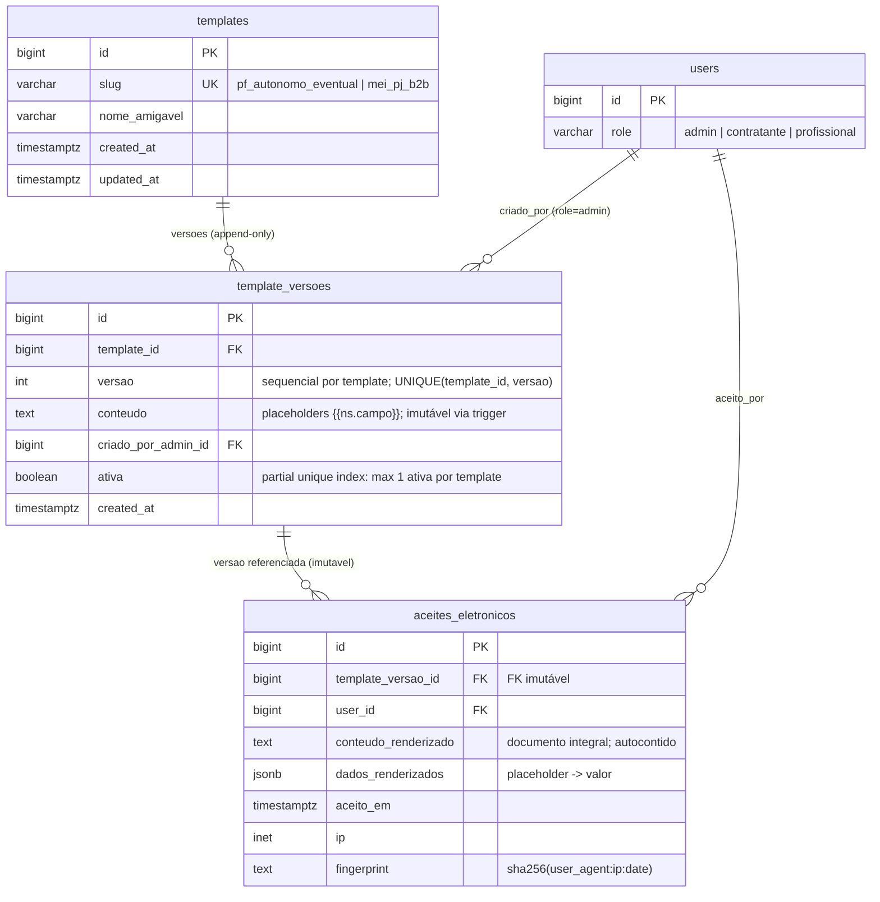
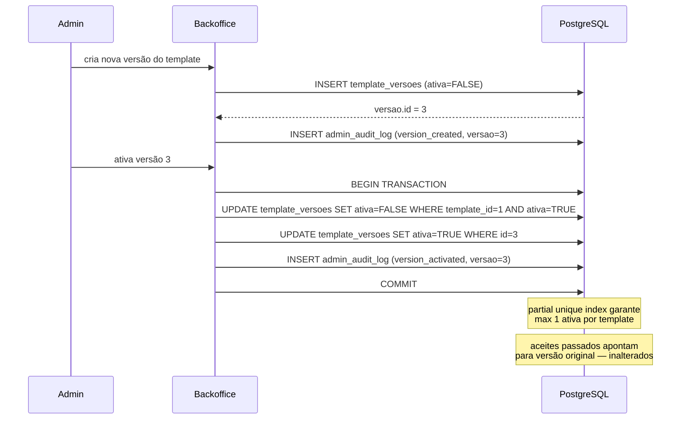

# ADR-010 — Modelo de Template/TemplateVersao e renderização imutável do AceiteEletronico

## Contexto

PDR-012 estabeleceu que os templates de contrato eletrônico do Turni são **entidades de dados editáveis pelo admin no backoffice**, com versionamento append-only. Existem dois templates fixos no MVP (PDR-001): `pf_autonomo_eventual` (contrato de prestação de serviço autônomo eventual, para profissional PF) e `mei_pj_b2b` (contrato B2B PJ↔PJ, para profissional MEI ou PJ).

Cada aceite eletrônico gerado pelo sistema referencia a **versão específica do template vigente no momento da assinatura** — mudanças posteriores criam nova versão, mas nunca afetam contratos já firmados. `compliance.md` §"Estrutura do template no banco" descreve o desenho conceitual das três entidades (`Template`, `TemplateVersao`, `AceiteEletronico`) e a lista completa de placeholders esperados (§"Placeholders esperados").

O aceite eletrônico é evidência jurídica do que foi exibido e aceito pelo usuário — sua imutabilidade é a garantia de defensibilidade do aceite. ADR-009 estabeleceu o padrão de imutabilidade para o `admin_audit_log` (trigger BEFORE UPDATE OR DELETE + REVOKE no role de runtime); esta ADR adota o mesmo padrão para `AceiteEletronico` por coerência arquitetural e defesa em profundidade.

No EPIC-001, o aceite é gerado quando o profissional ou contratante completa o cadastro (STORY-023 e STORY-024). O mesmo modelo é reutilizado no EPIC-003 para o aceite por turno (detalhamento fora do escopo desta ADR). Sem esta ADR, cada estória inventaria o esquema ad-hoc — produzindo incoerência estrutural impossível de reverter antes do EPIC-003.

**Restrições consolidadas:**
- **PDR-001**: dois tipos de profissional (PF, MEI/PJ) → dois templates distintos.
- **PDR-012**: templates editáveis pelo admin; versionamento append-only; aceite imutável aponta para a versão vigente na criação.
- **ADR-007**: admin autenticado no Backoffice (Livewire + guard `web`); toda ação de admin é auditável.
- **ADR-009**: `admin_audit_log` append-only com trigger + REVOKE; lista canônica de eventos auditáveis já inclui `admin.template.version_created` e `admin.template.version_activated`; dois usuários de banco (`turni_app_migrations` + `turni_app_runtime`) já estabelecidos.
- **ADR-000 + ADR-001 + ADR-002**: PostgreSQL, Laravel/Eloquent, monolito modular `packages/domain`.
- **compliance.md §"Placeholders esperados"**: ~15 placeholders com namespace `contratante.`, `profissional.`, `turno.`, `aceite.`, `habitualidade.` — incluindo `{{habitualidade.override_aceito}}` que marca a cláusula de aceite de risco na 3ª alocação semanal de profissional PJ.

## Forças (drivers) da decisão

- **F1 — Imutabilidade jurídica do aceite (nível banco):** O aceite eletrônico é prova jurídica. Sua integridade não pode depender de disciplina de código — precisa ser garantida mecanicamente. Peso: **alto**.
- **F2 — Unicidade de versão ativa por template (nível banco):** O sistema não pode ter duas versões ativas do mesmo template simultaneamente. A invariante precisa ser no banco, não no ORM. Peso: **alto**.
- **F3 — Motor de renderização simples e auditável:** O conteúdo é texto jurídico com placeholders bem definidos. O motor precisa ser previsível para o admin (sem lógica oculta) e robusto sob edições de conteúdo. Peso: **alto**.
- **F4 — Conteúdo renderizado autocontido:** O `AceiteEletronico` deve carregar o documento integral renderizado — se o template ou a versão forem deletados por bug, o aceite ainda reproduz exatamente o que foi mostrado. Peso: **alto**.
- **F5 — Extensibilidade para EPIC-003 (aceite por turno):** O modelo deve acomodar a extensão para aceite por turno sem reescrita do schema. Peso: **médio**.
- **F6 — Idiomático ao Laravel/Eloquent (princípio #4):** Soluções que seguem o caminho oficial do framework são mantidas pelo ecossistema. Peso: **médio**.
- **F7 — Coerência com padrões estabelecidos no ADR-009:** Um padrão de imutabilidade para dados de evidência reduz surpresas e facilita a manutenção. Peso: **médio**.

---

## Decisão 1 — Esquema de `Template` (catálogo)

### Decisão óbvia — sem comparação pesada

A entidade `Template` é um catálogo estático no MVP: dois registros fixos, schema simples, sem comportamento complexo. Alternativas teóricas (slug como enum Postgres, JSONB para metadados heterogêneos) adicionam complexidade sem benefício:
- Enum Postgres exige `ALTER TYPE` para novos valores — operação que bloqueia a tabela; VARCHAR com check é mais reversível (princípio #7) e o custo de reversibilidade não tem preço aqui.
- JSONB para metadados é overkill quando o schema é bem definido — "flexibilidade sem propósito é só decisão adiada" (princípio #4).

**Esquema de `templates`:**

```sql
CREATE TABLE templates (
    id            BIGINT GENERATED ALWAYS AS IDENTITY PRIMARY KEY,
    slug          VARCHAR(50)  NOT NULL UNIQUE,
    nome_amigavel VARCHAR(200) NOT NULL,
    created_at    TIMESTAMPTZ  NOT NULL DEFAULT NOW(),
    updated_at    TIMESTAMPTZ  NOT NULL DEFAULT NOW()
);

-- Seed inicial (dois registros canônicos do MVP — PDR-001):
-- INSERT INTO templates (slug, nome_amigavel) VALUES
--   ('pf_autonomo_eventual', 'Contrato PF — Prestação de Serviço Autônomo Eventual'),
--   ('mei_pj_b2b',           'Contrato MEI/PJ — B2B PJ↔PJ');
```

- `slug` é a **chave estável** referenciada em código (`pf_autonomo_eventual`, `mei_pj_b2b`) para selecionar o template correto pelo tipo de profissional (PDR-001).
- `nome_amigavel` é editável pelo admin (exibição no backoffice). O slug não é editável — é chave de negócio referenciada em código.

Modelo Eloquent: `Template` em `packages/domain/src/Models/Template.php` com `hasMany(TemplateVersao::class)`.

---

## Decisão 2 — Esquema de `TemplateVersao` e garantia de unicidade de versão ativa

### Opção 2A — Partial unique index `(template_id) WHERE ativa = TRUE` (escolhida)

- **Resumo:** O Postgres suporta índices únicos condicionais (partial unique indexes). `CREATE UNIQUE INDEX ... ON template_versoes (template_id) WHERE ativa = TRUE` garante que somente uma versão pode ter `ativa = TRUE` para cada `template_id` ao mesmo tempo — enforço mecânico, zero código de aplicação.
- **Como atende aos princípios:**
  - ✅ Postgres-first (3): feature nativa do Postgres, sem extensão.
  - ✅ Simplicidade (1): zero código de aplicação para enformar a invariante.
  - ✅ Automatizável (9): constraint no banco, não em code review.
  - ✅ Reversibilidade (7): o índice é criado e dropado na migração, independente da tabela.
- **Prós:** Enforço no nível de banco; INSERT/UPDATE que violaria a unicidade falha com erro claro; sem overhead de trigger por linha; o comportamento é óbvio para qualquer DBA inspecionando o schema.
- **Contras:** Nenhum material para o MVP.

### Opção 2B — Trigger `BEFORE INSERT OR UPDATE` na tabela `template_versoes`

- **Resumo:** Um trigger valida que, ao setar `ativa = TRUE`, nenhuma outra versão do mesmo template já está ativa. Se estiver, lança exception.
- **Como atende aos princípios:**
  - ⚠️ Simplicidade (1): trigger para unicidade duplica o trabalho do partial unique index com mais código para manter.
  - ✅ Postgres-first (3): nativo, mas mais complexo que um índice.
- **Razão de não ser a escolhida:** reinventa o que um índice já faz mecanicamente. Dois mecanismos para o mesmo fim sem ganho.

### Opção 2C — Constraint enforçada pela aplicação (service layer)

- **Resumo:** O `TemplateService` verifica a unicidade antes de ativar a versão.
- **Razão de não ser a escolhida:** mesma razão da Opção 4B do ADR-009 — invariante crítica não pode depender de disciplina de código. SQL direto ou bug no ORM bypassa o check.

### Decisão 2 — **Optamos pela Opção 2A: partial unique index.**

**Esquema de `template_versoes`:**

```sql
CREATE TABLE template_versoes (
    id                   BIGINT GENERATED ALWAYS AS IDENTITY PRIMARY KEY,
    template_id          BIGINT       NOT NULL REFERENCES templates(id),
    versao               INT          NOT NULL,
    conteudo             TEXT         NOT NULL,
    criado_por_admin_id  BIGINT       NOT NULL REFERENCES users(id),
    ativa                BOOLEAN      NOT NULL DEFAULT FALSE,
    created_at           TIMESTAMPTZ  NOT NULL DEFAULT NOW(),
    CONSTRAINT template_versoes_unique_versao UNIQUE (template_id, versao),
    CONSTRAINT template_versoes_versao_positiva CHECK (versao > 0)
);

CREATE UNIQUE INDEX template_versoes_active_per_template
    ON template_versoes (template_id) WHERE ativa = TRUE;
```

**Nota sobre `versao` sequencial:** o número de versão é gerenciado pela aplicação — ao criar uma nova versão, o service busca `MAX(versao) WHERE template_id = :id` e incrementa +1 na mesma transação. O `UNIQUE (template_id, versao)` garante não-repetição mesmo em condição de corrida (segundo INSERT concurrent falha com violação de unique).

**Sem `updated_at`:** `template_versoes` é append-only por natureza. Após a inserção, somente o campo `ativa` pode ser alterado (pela ativação/desativação de versão). O campo `conteudo` é imutável — toda edição é nova versão.

**Trigger de proteção de imutabilidade do conteúdo (coerente com PDR-012 append-only):**

```sql
CREATE OR REPLACE FUNCTION prevent_template_versao_content_mutation()
RETURNS TRIGGER LANGUAGE plpgsql AS $$
BEGIN
    IF NEW.conteudo IS DISTINCT FROM OLD.conteudo THEN
        RAISE EXCEPTION 'template_versoes.conteudo é imutável após criação — crie uma nova versão';
    END IF;
    IF NEW.template_id IS DISTINCT FROM OLD.template_id THEN
        RAISE EXCEPTION 'template_versoes.template_id é imutável após criação';
    END IF;
    IF NEW.versao IS DISTINCT FROM OLD.versao THEN
        RAISE EXCEPTION 'template_versoes.versao é imutável após criação';
    END IF;
    IF NEW.criado_por_admin_id IS DISTINCT FROM OLD.criado_por_admin_id THEN
        RAISE EXCEPTION 'template_versoes.criado_por_admin_id é imutável após criação';
    END IF;
    RETURN NEW;
END;
$$;

CREATE TRIGGER prevent_template_versao_content_mutation
    BEFORE UPDATE ON template_versoes
    FOR EACH ROW EXECUTE FUNCTION prevent_template_versao_content_mutation();
```

Este trigger deixa apenas `ativa` modificável via UPDATE. Edição direta do conteúdo de uma versão existente não é permitida — toda mudança de conteúdo requer criação de nova versão (PDR-012, CA-7).

Modelo Eloquent: `TemplateVersao` em `packages/domain/src/Models/TemplateVersao.php` com `belongsTo(Template::class)` e `belongsTo(User::class, 'criado_por_admin_id')`.

---

## Decisão 3 — Motor de renderização de placeholders

### Opção 3A — Substituição via regex própria no PHP (escolhida)

- **Resumo:** O service de renderização usa `preg_replace_callback('/\{\{([\w.]+)\}\}/', ...)` sobre um array flat de pares `namespace.campo → valor` construído pelo chamador antes da renderização. A lógica condicional da cláusula de habitualidade (o único caso não-trivial) é resolvida **pelo chamador** antes de acionar o motor: se `habitualidade.override_aceito` é `true`, o chamador injeta o texto completo da cláusula adicional no valor do placeholder `{{habitualidade.clausula_adicional}}`; se `false`, injeta string vazia. O template contém o placeholder exatamente onde a cláusula deve aparecer — o admin vê no editor o que será renderizado.
- **Como atende aos princípios:**
  - ✅ Simplicidade (1): ~20 linhas de PHP; zero dependência externa; comportamento totalmente auditável.
  - ✅ Funcionamento local (6): nenhuma dependência de serviço externo.
  - ✅ Automatizável (9): fácil de testar unitariamente com fixtures de template + contexto.
  - ✅ Coerente com a natureza do conteúdo: texto jurídico com placeholders bem definidos, sem loops, sem herança, sem partials.
- **Prós:** Zero dependência; explícito; fácil de auditar; fácil de testar; sem "magia" no template — o que o admin escreve é exatamente o que é renderizado, com substituição literal de placeholders.
- **Contras:** Para a cláusula de habitualidade, o admin precisa usar o placeholder `{{habitualidade.clausula_adicional}}` e entender que o valor vem do sistema. Mitigável: STORY-020 documenta os placeholders disponíveis no editor.
- **Comportamento de placeholder ausente:** **falha dura** — exception lançada se o template contém `{{chave.inexistente}}` e o contexto de renderização não tem esse valor. Nunca renderiza string vazia silenciosamente para texto jurídico. O `AceiteEletronico` só é criado se todos os placeholders do template forem resolvidos com sucesso.

### Opção 3B — Mustache (biblioteca `mustache/mustache` via Composer)

- **Resumo:** Adicionar `mustache/mustache` ao projeto. Templates usam sintaxe Mustache: `{{namespace.campo}}` para variáveis e `{{#habitualidade.override_aceito}}...{{/habitualidade.override_aceito}}` para a seção condicional de habitualidade. A lógica condicional fica visível no template, editável pelo admin.
- **Como atende aos princípios:**
  - ✅ Simplicidade (1): Mustache é logic-less by design — admins não podem introduzir lógica arbitrária.
  - ⚠️ Dependência externa: madura, estável, sem subdependências, mas mais uma dependência a gerenciar.
  - ✅ Expressa a condicionalidade de habitualidade nativamente no template.
- **Prós:** A cláusula de habitualidade fica legível no template com a sintaxe `{{#bool}}...{{/bool}}`; admin pode editar diretamente a cláusula condicional.
- **Contras:** Uma dependência a mais; admins precisam aprender a sintaxe Mustache (ainda que simples); testes precisam cobrir o comportamento do Mustache além da lógica de negócio.

### Opção 3C — Blade do Laravel (`Blade::render()`)

- **Resumo:** Usar o `Blade::render()` disponível em Laravel 9+ para compilar o template em tempo de renderização.
- **Como atende aos princípios:**
  - ❌ Segurança: `Blade::render()` com conteúdo fornecido pelo admin no banco é superfície de template injection se o admin inserir diretivas `@php`, `@include`, ou similar. Restringir via sanitização de conteúdo é possível mas frágil — a "restrição" é por convenção, não pela engine.
  - ⚠️ Simplicidade (1): Blade foi projetado para views completas; usá-lo apenas para substituição de placeholders é subutilização com risco de abuso por parte do admin.
- **Razão de não ser a escolhida:** risco de template injection com conteúdo fornecido pelo admin (princípio de segurança — `security-architecture.md`). A Blade não foi projetada para renderizar documentos cujo conteúdo vem de fontes não-confiáveis.

### Decisão 3 — **Optamos pela Opção 3A: substituição via regex própria.**

Para texto jurídico com ~15 placeholders bem definidos e uma única condicionalidade (habitualidade), a complexidade de uma engine externa não se justifica. A Opção 3A entrega exatamente o que o conteúdo exige — honrando o princípio #1 (simples é o belo).

**Nota sobre evolução:** se os admins precisarem de lógica condicional mais complexa (mais de uma cláusula condicional, aninhamento), a migração para Mustache (Opção 3B) é direta — a interface do service de renderização não muda, só a implementação interna.

---

## Decisão 4 — Esquema de `AceiteEletronico` e mecanismo de imutabilidade

### Opção 4A — Trigger `BEFORE UPDATE OR DELETE` + REVOKE no role de runtime (padrão ADR-009) (escolhida)

- **Resumo:** Tabela `aceites_eletronicos` com trigger que impede UPDATE/DELETE + REVOKE de UPDATE/DELETE no `turni_app_runtime`. Mesmo padrão adotado para `admin_audit_log` em ADR-009.
- **Como atende aos princípios:**
  - ✅ Postgres-first (3): tudo no banco nativo.
  - ✅ Fail-secure (F1): dupla camada — trigger + REVOKE. Bugou o código de aplicação? Trigger segura. Trigger foi dropped acidentalmente? REVOKE segura.
  - ✅ Coerência com ADR-009 (F7): mesmo padrão, menor surpresa para o time.
- **Prós:** Garantia mecânica no banco; nenhum bug de aplicação pode corromper o aceite; auditável por ferramentas de banco.
- **Contras:** Mais um trigger a testar. Custo negligível.

### Opção 4B — Contrato de aplicação apenas

- **Resumo:** Convenção de código: nunca chamar `AceiteEletronico::update()` ou `AceiteEletronico::delete()`.
- **Razão de não ser a escolhida:** evidência jurídica não pode depender de disciplina de código. O Postgres é capaz de garantir isso mecanicamente — não usar é desperdiçar a ferramenta. O aceite eletrônico tem consequências jurídicas mais severas que o audit log de admin.

### Decisão 4 — **Optamos pela Opção 4A: trigger + REVOKE (padrão ADR-009).**

**Esquema de `aceites_eletronicos`:**

```sql
CREATE TABLE aceites_eletronicos (
    id                   BIGINT GENERATED ALWAYS AS IDENTITY PRIMARY KEY,
    template_versao_id   BIGINT       NOT NULL REFERENCES template_versoes(id),
    user_id              BIGINT       NOT NULL REFERENCES users(id),
    conteudo_renderizado TEXT         NOT NULL,
    dados_renderizados   JSONB        NOT NULL,
    aceito_em            TIMESTAMPTZ  NOT NULL DEFAULT NOW(),
    ip                   INET         NOT NULL,
    fingerprint          TEXT         NOT NULL
    -- sem updated_at: imutável após criação
    -- sem turno_id: adicionado via ALTER TABLE na migration do EPIC-003
);

CREATE OR REPLACE FUNCTION prevent_aceite_eletronico_mutation()
RETURNS TRIGGER LANGUAGE plpgsql AS $$
BEGIN
    RAISE EXCEPTION 'aceites_eletronicos é imutável após criação';
    RETURN NULL;
END;
$$;

CREATE TRIGGER prevent_aceite_eletronico_mutation
    BEFORE UPDATE OR DELETE ON aceites_eletronicos
    FOR EACH ROW EXECUTE FUNCTION prevent_aceite_eletronico_mutation();

REVOKE UPDATE, DELETE ON aceites_eletronicos FROM turni_app_runtime;
```

**Campos e decisões de design:**

- **`template_versao_id`**: FK imutável para a versão exata vigente no momento do aceite. O aceite não é "retroativamente" afetado por novas versões — a versão específica permanece referenciada para sempre.
- **`conteudo_renderizado`**: texto integral do documento que foi exibido ao usuário (autocontido — valor F4). String longa em TEXT, sem compressão no MVP.
- **`dados_renderizados`**: JSONB com o mapa de todos os pares `namespace.campo → valor` usados na renderização. Permite reconstruir o contexto do aceite auditoriamente e verificar que o documento foi montado corretamente.
- **`ip`**: endereço IP do cliente no momento do aceite. Tipo INET do Postgres (suporta IPv4 e IPv6).
- **`fingerprint`**: SHA-256 de `user_agent . ':' . ip_address . ':' . date('Y-m-d')`, calculado pela aplicação antes da inserção, armazenado como string hexadecimal em TEXT. Identifica o contexto de sessão (device + rede + dia) para fins de evidência jurídica — simples e suficiente para o MVP sem biblioteca externa de fingerprinting.
- **`turno_id` (EPIC-003)**: o campo não é criado na migration do EPIC-001 porque a tabela `turnos` não existe neste escopo. O EPIC-003 adicionará `ALTER TABLE aceites_eletronicos ADD COLUMN turno_id BIGINT NULL REFERENCES turnos(id)` quando `turnos` existir. Esta é a migração mais simples e não-disruptiva.

---

## Decisão 5 — Fluxo de ativação de versão

Fluxo padrão de criação e ativação de versão pelo admin no backoffice (STORY-020):

**Etapa 1 — Criação:**
Admin escreve o novo conteúdo. Sistema faz INSERT em `template_versoes` com `ativa = FALSE`. Versão criada mas não ativa — sem impacto em usuários.

Evento auditável registrado no `admin_audit_log` (ADR-009):
- `action = 'admin.template.version_created'`
- `target_type = 'TemplateVersao'`, `target_id = versao.id`
- `payload = { "template_slug": "pf_autonomo_eventual", "versao": 3 }`

**Etapa 2 — Preview (responsabilidade da STORY-020):**
Admin visualiza o template renderizado com dados de exemplo antes de ativar. Fora do escopo desta ADR.

**Etapa 3 — Ativação (transação atômica):**

```sql
BEGIN;
  UPDATE template_versoes
     SET ativa = FALSE
   WHERE template_id = :template_id AND ativa = TRUE;

  UPDATE template_versoes
     SET ativa = TRUE
   WHERE id = :nova_versao_id AND template_id = :template_id;
COMMIT;
```

O partial unique index `template_versoes_active_per_template` garante que o estado intermediário (zero versões ativas, momentâneo dentro da transação) não viola nenhuma constraint — a constraint proíbe **mais de uma** ativa, não proíbe zero. Se o COMMIT falhar, o Postgres realiza rollback automático: a versão anterior continua como ativa.

Evento auditável registrado no `admin_audit_log`:
- `action = 'admin.template.version_activated'`
- `target_type = 'TemplateVersao'`, `target_id = nova_versao.id`
- `payload = { "template_slug": "pf_autonomo_eventual", "versao": 3 }`

**Invariante:** nenhum `AceiteEletronico` existente é afetado pela ativação de nova versão. A FK `aceites_eletronicos.template_versao_id` é imutável e aponta para a versão específica no momento da criação do aceite.

**Edição direta proibida:** toda mudança de conteúdo é nova versão (INSERT). A trigger `prevent_template_versao_content_mutation` (Decisão 2) garante que `conteudo` não pode ser alterado após INSERT — o banco retorna um erro explícito se tentado. Admins que quiserem "editar" uma versão existente criam uma nova versão e a ativam.

---

## Diagrama



### Fluxo de ativação de versão



---

## Decisão proposta (consolidada)

> **ADR-010 — Cinco decisões interdependentes sobre Template, TemplateVersao, AceiteEletronico, motor de renderização e fluxo de ativação.**

**(1) Schema de `Template`:** Tabela `templates` com `slug VARCHAR UNIQUE` (valores canônicos `pf_autonomo_eventual` e `mei_pj_b2b`), `nome_amigavel`. Dois registros fixos no MVP, seed via migration. Slug é imutável (chave estável de negócio).

**(2) Schema de `TemplateVersao`:** Tabela `template_versoes` com `versao INT` sequencial por template (`UNIQUE (template_id, versao)`), `conteudo TEXT` (imutável via trigger após INSERT — toda edição é nova versão), `criado_por_admin_id`, `ativa BOOLEAN`. Partial unique index `(template_id) WHERE ativa = TRUE` garante unicidade de versão ativa ao nível do banco.

**(3) Schema de `AceiteEletronico`:** Tabela `aceites_eletronicos` com FK imutável para `template_versao_id`, `user_id`, `conteudo_renderizado TEXT` (documento integral autocontido), `dados_renderizados JSONB` (mapa placeholder→valor), `aceito_em`, `ip INET`, `fingerprint TEXT` (SHA-256 de user_agent+ip+date). Imutabilidade por trigger BEFORE UPDATE OR DELETE + REVOKE no `turni_app_runtime` — padrão ADR-009. Campo `turno_id` omitido no EPIC-001; adicionado via ALTER TABLE na migration do EPIC-003.

**(4) Motor de renderização:** Substituição via `preg_replace_callback` no PHP sobre mapa flat `namespace.campo → valor`. Cláusula de habitualidade resolvida pelo chamador antes da renderização (injeta texto completo ou string vazia no placeholder `{{habitualidade.clausula_adicional}}`). Placeholder ausente → falha dura (exception) — nenhum aceite gerado com texto incompleto.

**(5) Fluxo de ativação:** Transação atômica: desativa versão atual (`ativa = FALSE`) e ativa nova versão (`ativa = TRUE`) em um único `BEGIN/COMMIT`. Partial unique index previne duplicatas. Versões antigas permanecem referenciáveis e inalteradas. Eventos `admin.template.version_created` e `admin.template.version_activated` registrados no `admin_audit_log` (ADR-009). Edição direta de versão já criada → não permitida (trigger rejeita UPDATE em `conteudo`).

## Justificativa

As cinco decisões honram os princípios arquiteturais centrais:
- **#1 (simples):** regex própria para substituição de placeholders em vez de engine externa; partial unique index em vez de trigger para unicidade de versão ativa; dois campos explícitos (`user_id` + `turno_id` diferido) em vez de polimorfismo.
- **#3 (Postgres-first):** partial unique index, triggers de imutabilidade e REVOKE são features nativas do Postgres — sem biblioteca externa para nenhuma dessas garantias.
- **#5 (coesão):** cada entidade tem razão única para mudar — `templates` quando o catálogo muda; `template_versoes` quando o admin cria conteúdo; `aceites_eletronicos` apenas na criação (imutável depois).
- **#7 (reversibilidade):** as migrations podem ser revertidas; índice parcial, triggers e REVOKEs são parte das mesmas migrations que os criam.
- **Coerência com ADR-009:** trigger + REVOKE para imutabilidade é o padrão estabelecido para dados de evidência no Turni — o time já conhece, o tooling de teste já existe, a documentação já foi escrita.

## Consequências

### Positivas
- Contratos eletrônicos passados são imutáveis por garantia mecânica — defensibilidade jurídica independente de bugs de aplicação.
- Admin pode editar templates sem release; aceites novos usam a nova versão; aceites antigos apontam para a versão original — invariante de negócio garantida no banco.
- O motor de renderização é uma função pura testável unitariamente com fixtures simples.
- `aceites_eletronicos` é extensível para EPIC-003 (aceite por turno) via ALTER TABLE — sem reescrita do schema existente.
- Coerência com ADR-009 reduz surpresas para o time: um padrão de imutabilidade para dados de evidência, não dois.

### Negativas / trade-offs aceitos
- O fluxo de ativação cria uma janela de sub-milissegundo onde nenhuma versão está ativa (dentro da transação, entre deactivar a antiga e ativar a nova). Aceitável para o MVP — não há requisito de zero-downtime para leitura de template durante ativação.
- A abordagem de regex para o placeholder de habitualidade exige que o chamador resolva a condicionalidade antes de acionar o motor. Isso é coupling leve e correto: a regra de negócio de habitualidade pertence ao domínio de compliance, não ao motor de template.
- Dois usuários de banco (`turni_app_migrations` + `turni_app_runtime`) já estabelecidos em ADR-009 — não há custo incremental aqui, mas o setup de banco local precisa manter essa separação.

### Neutras
- A omissão de `turno_id` no EPIC-001 e sua adição via ALTER TABLE no EPIC-003 é uma migração não-disruptiva padrão do Eloquent — sem reescrita de dados existentes.
- As funções trigger (`prevent_template_versao_content_mutation`, `prevent_aceite_eletronico_mutation`) são functions do Postgres armazenadas no banco — precisam de atenção no setup de testes de integração (banco de testes precisa ter as functions criadas pela migration).

### Para o time
- **STORY-016 (RBAC vivo):** recomenda-se criar as migrations de `templates` e `template_versoes` nesta estória junto das entidades de identidade, estabelecendo o schema completo do EPIC-001.
- **STORY-020 (editor de templates):** implementa o fluxo de criação e ativação de versão; deve documentar os placeholders disponíveis no editor para orientar o admin.
- **STORY-023/024 (completar cadastro com aceite):** implementam o service de renderização (motor de regex + criação do `AceiteEletronico`); criam a migration de `aceites_eletronicos`.
- **STORY-015 (texto-seed):** agora sabe o formato do `conteudo` (texto com placeholders `{{namespace.campo}}`).
- **ADRs que esta ADR destrava:** STORY-015, STORY-020, STORY-023, STORY-024, STORY-025.
- **EPIC-003:** ao implementar aceite por turno, adicionar via `ALTER TABLE aceites_eletronicos ADD COLUMN turno_id BIGINT NULL REFERENCES turnos(id)`. Nenhuma migration destrutiva.

## Plano de verificação

- **Conformidade do schema:** migrations do EPIC-001 criam `templates`, `template_versoes` e do STORY-023/024 criam `aceites_eletronicos` conforme este ADR. Teste de migration (`php artisan migrate:rollback` — F-NB-1 do EPIC-000) confirma reversibilidade.
- **Unicidade de versão ativa:** teste de integração: tentar ativar duas versões do mesmo template sem desativar a anterior deve falhar com violação do partial unique index.
- **Imutabilidade do conteúdo da versão:** teste de integração: `TemplateVersao::find(1)->update(['conteudo' => '...'])` deve lançar exception de banco com mensagem clara.
- **Imutabilidade do aceite:** teste de integração: `AceiteEletronico::find(1)->update([...])` e `AceiteEletronico::find(1)->delete()` devem lançar exception de banco. Teste adicional: conectar com `turni_app_runtime` e verificar que `UPDATE aceites_eletronicos` retorna `ERROR: permission denied`.
- **Motor de renderização:** teste unitário com fixture de template e contexto — (a) todos os placeholders resolvidos, documento correto; (b) placeholder ausente lança exception; (c) `habitualidade.override_aceito = true` → cláusula adicional presente; (d) `false` → cláusula ausente (string vazia no lugar do placeholder).
- **Fluxo de ativação:** teste de integração: criar 3 versões, ativar a versão 2, verificar `ativa=TRUE` apenas para versão 2; ativar versão 3, verificar `ativa=TRUE` apenas para versão 3; `AceiteEletronico` criado com versão 1 permanece com `template_versao_id` apontando para versão 1.
- **Sinais de revisão:**
  - Se admins precisarem de lógica condicional mais complexa nos templates (múltiplas seções condicionais, aninhamento) → migrar motor para Mustache (Opção 3B). Interface do service não muda.
  - Se surgir um terceiro tipo de contrato → avaliar generalização do catálogo (adicionar slug ao `templates`).
  - Se `fingerprint` SHA-256 simples se mostrar insuficiente para fins jurídicos → evoluir para fingerprinting mais robusto (canvas fingerprint via JS no cliente).
  - Se volume de `aceites_eletronicos` crescer e o campo `conteudo_renderizado TEXT` se tornar gargalo de armazenamento → avaliar compressão ou referência a objeto de storage (GCS).

---

## Aprovação humana

> Esta seção é o registro formal do aceite. Não preencher sozinho — preencher quando Alexandro aprovar no chat ou via PR.

- **Status final:** ✅ aceita
- **Aprovado por:** Alexandro
- **Data:** 2026-05-28
- **Forma do aceite:** aprovado em chat (sessão de 2026-05-28); commit direto na `main`
- **Condicionantes do aceite:** nenhuma.

### Em caso de rejeição
- **Motivo:** ...
- **Próximos passos sugeridos:** ...

### Em caso de superseding
- **Substituída por:** null
- **Razão da substituição:** ...

---

## Histórico

- 2026-05-28 — criada como `proposed` por Arquiteto (STORY-013, claude-sonnet-4-6-arquiteto-2026-05-28). Cobre: schema de Template/TemplateVersao/AceiteEletronico; partial unique index para unicidade de versão ativa; motor de renderização via regex própria; imutabilidade do aceite via trigger + REVOKE (padrão ADR-009); fluxo de ativação com transação atômica.
- 2026-05-28 — `accepted` por Alexandro (aprovação em chat, sessão de 2026-05-28; commit direto na `main`).
