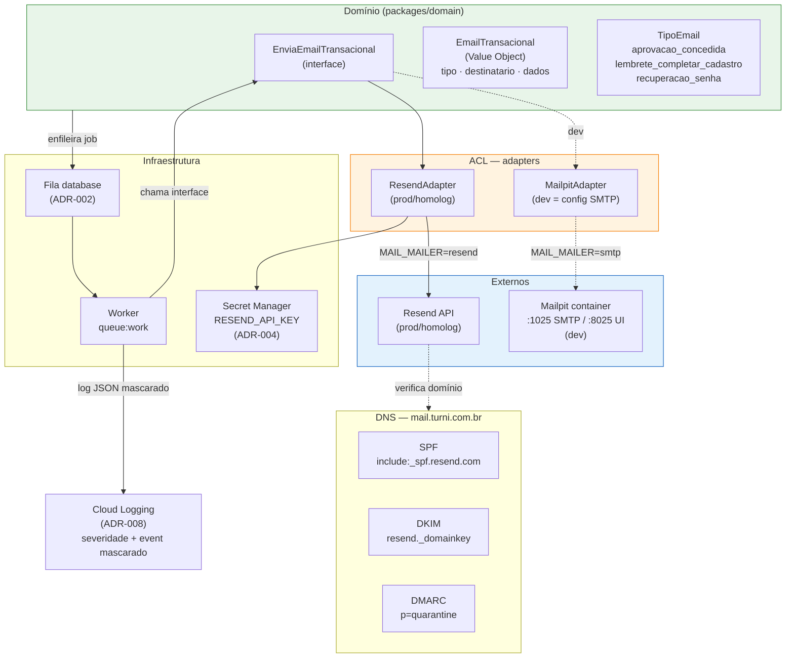

# ADR-011 — Provedor de e-mail transacional e Anti-Corruption Layer

## Contexto

O EPIC-001 introduz a primeira necessidade concreta de e-mail transacional no Turni. Três mensagens precisam sair em produção: **notificação de aprovação de cadastro** (`aprovacao_concedida` — gatilho do funil de identidade descrito em ADR-009), **lembrete para completar cadastro** quando um usuário no estado `liberado` não avança no funil após N horas (`lembrete_completar_cadastro`), e **recuperação de senha** gerada pelo Fortify (`recuperacao_senha`). ADR-007 §f decidiu que o envio usa o driver `Mail` do Laravel e que **o provedor concreto fica para o EPIC-001** — aqui está essa decisão.

Sem a presente ADR, o EPIC-001 escolheria provedor ad-hoc no PR da STORY-021 (e-mails transacionais), sem registro de SPF/DKIM/DMARC, sem padrão de ACL, e a troca de provedor posterior (seja por custo, seja por deliverability) exigiria refatoração que tocaria o domínio. A STORY-021 precisa da ADR aceita para começar.

As restrições consolidadas das ADRs vigentes moldam o espaço de decisão de forma significativa:

- **ADR-004** (GCP, Secret Manager): credenciais do provedor vão no Secret Manager; nenhum segredo em código ou env files versionados. O ambiente é Cloud Run em `southamerica-east1`.
- **ADR-007 §f** (Fortify): recuperação de senha usa o fluxo padrão do Fortify — link assinado por e-mail com expiração e throttling. O Fortify **não conhece o provedor**; ele apenas chama o canal `Mail` do Laravel. Esta ADR garante que o canal `Mail` tem um driver apontando para o provedor escolhido.
- **ADR-002** (fila `database`): não há Redis no MVP. Qualquer retry de e-mail usa a **fila `database`** existente (Laravel `queue:work` via `worker` no docker-compose e na GCE).
- **ADR-008** (log JSON, mascaramento): o endereço de e-mail do destinatário **não aparece em claro** nos logs de aplicação — é dado pessoal (LGPD, `non-functional.md §Segurança`); o mascaramento é automatizado no formatter de ADR-008.
- **ADR-005** (padrão de integração externa): toda integração com externo ganha uma **Anti-Corruption Layer** — interface limpa no domínio, adapter que traduz para o SDK do provedor. O padrão `pagarme-mock` em container é a referência de mock local.
- **`integration-architecture.md`** (princípio central): o externo não dita o modelo de domínio; a ACL encapsula; trocar de provedor = trocar de adapter, sem tocar o domínio.
- **`non-functional.md` §Segurança**: segredos nunca em código; HTTPS obrigatório.

O princípio arquitetural #6 (100% local sem internet) exige que o dev possa disparar e-mails localmente sem chamar o provedor real. A solução canônica para integrações externas no Turni é o mock em container — o `pagarme-mock` já está no `docker-compose.yml`.

## Forças (drivers) da decisão

- **F1 — Deliverability confiável para endereços no Brasil (volume MVP):** peso **alto**. E-mail de aprovação de cadastro que cai em spam quebra o funil de identidade e a promessa de SLA de 24h do `non-functional.md`. O provedor precisa de reputação de IP adequada para o Brasil, mesmo no free tier.
- **F2 — Custo zero ou quase zero no MVP (~centenas de e-mails/mês):** peso **alto**. Fase pré-receita (princípio #11); free tier suficiente para centenas de e-mails. Custo de saída do provedor precisa ser baixo (troca de adapter, não de domínio).
- **F3 — SPF/DKIM/DMARC documentados e configuráveis para `turni.com.br` (ou subdomínio):** peso **alto**. Sem esses registros, e-mail transacional ativa filtros de spam ou não passa em receivers corporativos. A reputação do domínio principal não pode ser contaminada por envios de homolog.
- **F4 — Webhooks de bounce e complaint:** peso **médio**. Importante para limpeza de lista futura e para não queimar a reputação do IP. Para o MVP (volume baixo), o alerta é suficiente; ação automática é EPIC-futuro.
- **F5 — Suporte nativo ao driver `Mail` do Laravel / ergonomia operacional:** peso **médio**. Evita código de glue personalizado para conectar o Fortify e o Laravel ao provedor (princípio #4).
- **F6 — Custo de saída (reversibilidade — princípio #7):** peso **médio**. Troca de provedor não pode exigir mudança no domínio; só na camada de adapter da ACL.
- **F7 — Funcionamento local sem internet (princípio #6):** peso **alto**. Dev local precisa de inbox visual para inspecionar e-mails disparados; o provedor real não é chamado em dev.

## Opções consideradas

### Opção A — Resend — **escolhida**

- **Resumo:** Resend (resend.com) é uma plataforma de e-mail transacional focada em desenvolvedores, fundada em 2023. Free tier: **3.000 e-mails/mês**, **100 e-mails/dia**. A SDK oficial `resend/resend-php` integra ao driver SMTP/API do Laravel via driver customizado (`resend/resend-laravel`). DKIM automático via DNS do subdomínio remetente. Webhooks de bounce e complaint nativos. Pay-as-you-go após o free tier: $0,80/1.000 e-mails.
- **Como atende aos princípios:**
  - ✅ **Custo (11, F2):** 3.000/mês grátis cobre com folga o volume MVP (centenas); escala linear após isso.
  - ✅ **Opinativo (4, F5):** `resend/resend-laravel` registra um driver `resend` no `config/mail.php` do Laravel — plugável de forma idiomática; Fortify usa sem modificação.
  - ✅ **Reversibilidade (7, F6):** trocar de provedor = trocar o adapter da ACL + a config `MAIL_MAILER`; o domínio não conhece Resend.
  - ✅ **Simplicidade (1):** API REST simples; sem configuração SMTP complexa; um pacote Composer; DKIM automático via painel do Resend.
- **Prós concretos:** DX excepcional; DKIM/SPF configurados automaticamente pelo painel ao verificar o domínio; webhooks nativos com assinatura HMAC; rate limits claros; free tier realista para o MVP; pacote Laravel oficial mantido pela equipe do Resend.
- **Contras concretos:** empresa mais recente (2023) — menos track record que SendGrid/Mailgun; no free tier usa IPs compartilhados (suficiente para o volume MVP e volume baixo não queima IP compartilhado); 100/dia pode ser limitante se houver burst de aprovações (ex: onboarding em massa — sinal de revisão).

### Opção B — Brevo (ex-Sendinblue)

- **Resumo:** Brevo tem free tier de **300 e-mails/dia** (~9.000/mês), empresa estabelecida (2012), boa deliverability, SMTP + API. O driver Laravel é via SMTP nativo ou via pacote `brevo/brevo-php`.
- **Como atende aos princípios:**
  - ✅ **Custo (F2):** 300/dia grátis é mais do que suficiente para o MVP.
  - ⚠️ **Opinativo (F5):** sem driver Laravel oficial da Brevo — usa SMTP padrão ou HTTP customizado; mais código de glue.
  - ✅ **Deliverability (F1):** empresa estabelecida com infraestrutura madura no Brasil.
  - ⚠️ **SPF/DKIM (F3):** configuração manual (não automática como Resend); mais passos operacionais.
- **Prós:** empresa estabelecida; free tier generoso; SMTP padrão do Laravel.
- **Contras:** UI operacional mais pesada; sem driver Laravel oficial; DKIM manual; webhooks menos ergonômicos que Resend.
- **Razão de não ser a escolhida:** DX inferior ao Resend sem ganho de deliverability relevante no volume do MVP; a ausência de driver Laravel oficial viola o princípio #4 (usar o que o ecossistema já deu, não montar à mão).

### Opção C — Amazon SES

- **Resumo:** SES cobra $0,10/1.000 e-mails — praticamente gratuito no volume MVP (~$0,05). Usa SMTP ou API; driver Laravel via SMTP nativo ou pacote `aws/aws-sdk-php`. Exige saída do modo sandbox (pedido formal à AWS) antes de enviar para endereços não verificados.
- **Como atende aos princípios:**
  - ✅ **Custo absoluto (F2):** o mais barato do mercado — frações de centavo no MVP.
  - ❌ **Simplicidade (F7):** requer conta AWS separada do GCP, políticas IAM, verificação de sandbox removal — custo operacional alto para o time minúsculo; viola princípio #2 (não adicionar complexidade sem necessidade).
  - ⚠️ **Webhooks (F4):** bounces via SNS — setup adicional, notificações via tópico SNS para processar, não nativo do Laravel.
  - ✅ **Deliverability (F1):** infraestrutura AWS com excelente reputação; DKIM/SPF configuráveis.
- **Prós:** custo quase zero; infraestrutura madura; boa deliverability com IPs dedicados.
- **Contras:** conta AWS necessária além do GCP; sandbox removal pode atrasar o início; webhooks via SNS adicionam complexidade; setup mais verboso para o time pequeno; não é a conta cloud principal do projeto (ADR-004 fixou GCP).
- **Razão de não ser a escolhida:** custo de setup e operação no MVP supera a economia de frações de centavo (centenas de e-mails no free tier do Resend custam $0). A complexidade (conta AWS, IAM, SNS, sandbox) viola princípio #1.

### Opção D — Postmark

- **Resumo:** Postmark é reconhecido como o provedor com melhor deliverability do mercado, focado exclusivamente em transacionais. Sem free tier permanente (apenas 100 e-mails de trial). A partir de $15/mês para 10k e-mails.
- **Como atende aos princípios:**
  - ✅ **Deliverability (F1):** benchmarks consistentemente superiores.
  - ❌ **Custo (F2):** $15/mês para centenas de e-mails no MVP — custo desproporcional ao volume. Viola princípio #11 nesta fase.
  - ✅ **Suporte Laravel (F5):** driver oficial `wildbit/swiftmailer-postmark` ou driver `postmark` via pacote.
- **Prós:** deliverability de classe mundial; suporte excelente a bounce/spam.
- **Contras:** sem free tier permanente; custo desproporcional ao volume MVP.
- **Razão de não ser a escolhida:** paga custo de produção ($15/mês) para resolver problema que o MVP ainda não tem (deliverability crítica em volume alto). Reabrível quando o volume justificar ou quando houver evidência de problemas de deliverability com o provedor atual.

### Opção E — SendGrid

- **Resumo:** SendGrid (Twilio) é o maior player do mercado — free tier de **100 e-mails/dia**, driver nativo no Laravel desde a versão 9, webhooks maduros.
- **Como atende aos princípios:**
  - ✅ **Suporte Laravel (F5):** driver nativo `config/mail.php` sem dependência extra.
  - ⚠️ **Free tier (F2):** 100/dia — mais restritivo que Resend (100/dia também) e Brevo (300/dia), mas praticável para o MVP.
  - ⚠️ **Deliverability free (F1):** IPs compartilhados no free tier podem ter reputação variável dependendo de outros usuários; historicamente relatado como problema para envios a determinados provedores BR no free tier.
  - ✅ **Maturidade:** empresa estabelecida, documentação extensa.
- **Prós:** driver nativo no Laravel; empresa estabelecida; webhooks maduros.
- **Contras:** free tier de 100/dia igual ao Resend mas com UI mais complexa; problemas históricos de reputação em IPs compartilhados; menos ergonômico que Resend para o dev.
- **Razão de não ser a escolhida:** mesma limitação de 100/dia do Resend, DX inferior, e o historico de problemas de reputação em IPs compartilhados no free tier é pior do que Resend (mais recente, reputação mais cuidada). O driver nativo do Laravel é a única vantagem real sobre Resend, e ela é mínima dado que `resend/resend-laravel` é igualmente simples.

## Matriz comparativa

| Critério (força) | Peso | A — Resend | B — Brevo | C — Amazon SES | D — Postmark | E — SendGrid |
|---|---|---|---|---|---|---|
| F1 — Deliverability no Brasil | alto | ✅ boa (infra AWS) | ✅ estabelecida | ✅ excelente | ✅ classe mundial | ⚠️ IPs compartilhados problemáticos |
| F2 — Custo MVP free tier | alto | ✅ 3k/mês grátis | ✅ 9k/mês grátis | ✅ ~$0.05 total | ❌ $15/mês pago | ⚠️ 100/dia |
| F3 — SPF/DKIM/DMARC | alto | ✅ DKIM automático | ⚠️ manual | ✅ configurável | ✅ automático | ✅ configurável |
| F4 — Webhooks bounce/complaint | médio | ✅ HMAC nativo | ⚠️ básico | ⚠️ via SNS | ✅ excelente | ✅ maduro |
| F5 — Suporte Laravel / ergonomia | médio | ✅ pacote oficial | ⚠️ SMTP manual | ⚠️ SMTP/SDK AWS | ✅ pacote oficial | ✅ driver nativo |
| F6 — Reversibilidade (troca de adapter) | médio | ✅ um pacote | ✅ idem | ✅ idem | ✅ idem | ✅ idem |
| F7 — Local sem internet (Mailpit) | alto | ✅ orthogonal | ✅ orthogonal | ✅ orthogonal | ✅ orthogonal | ✅ orthogonal |
| Custo operacional de setup | — | ✅ mínimo | ⚠️ médio | ❌ alto (IAM, SNS) | ✅ mínimo | ✅ mínimo |

> A Opção A (Resend) vence por dominar F2 (free tier amplo), F3 (DKIM automático) e F5 (pacote Laravel oficial) sem perder em nenhum critério relevante para o MVP. A vantagem do Postmark (F1) não se materializa neste volume; o custo do SES (Opção C) é irrisório mas o custo operacional de setup é desproporcionalmente alto para o time.

## Decisão proposta

> **Optamos pela Opção A — Resend como provedor de e-mail transacional do MVP.**

O e-mail transacional do Turni usa **Resend** como provedor externo, encapsulado por uma **Anti-Corruption Layer** no módulo de domínio. Em desenvolvimento local, todos os e-mails são capturados por **Mailpit** em container (sem sair da máquina do dev). A arquitetura concreta:

**(a) Provedor: Resend.** Integrado ao Laravel via pacote `resend/resend-laravel`, que registra o driver `resend` no `config/mail.php`. Credenciais (`RESEND_API_KEY`) armazenadas no **Secret Manager** (ADR-004); nunca em `.env` versionado. A conta Resend usa o **subdomínio remetente** `mail.turni.com.br` em produção e `mail.homolog.turni.com.br` em homologação — subdomínio dedicado para proteger a reputação do domínio raiz.

**(b) Anti-Corruption Layer.** Uma **interface** vive no módulo de domínio (em `packages/domain` ou equivalente no monorepo — localização exata é decisão do Programador na STORY-021, IDR):

```
EnviaEmailTransacional::enviar(EmailTransacional $email): void
```

`EmailTransacional` é um Value Object com:
- `destinatario: string` — endereço de e-mail (mascarado nos logs conforme ADR-008)
- `tipo: TipoEmail` — enum (`aprovacao_concedida | lembrete_completar_cadastro | recuperacao_senha`)
- `dados: array` — payload de renderização com contrato definido por mensagem (ver §d)

Um **adapter Resend** implementa a interface; ele é o único lugar que conhece `resend/resend-laravel`. Nenhuma camada acima do adapter importa o SDK do Resend. O **adapter Mailpit** (dev) é o driver SMTP do Laravel apontando para `mailpit:1025` — sem código próprio; é configuração de env, não troca de classe.

**(c) Configuração por ambiente.** Seleção via `MAIL_MAILER` no `.env`:

| Ambiente | `MAIL_MAILER` | `MAIL_HOST` / credencial |
|---|---|---|
| `dev` (local) | `smtp` | `mailpit:1025` (container) |
| `homolog` | `resend` | `RESEND_API_KEY` do Secret Manager |
| `prod` | `resend` | `RESEND_API_KEY` do Secret Manager |

**(d) Mensagens canônicas do MVP.** As três mensagens que o EPIC-001 envia:

| `tipo` | Remetente | Assunto | Contrato de `dados` |
|---|---|---|---|
| `aprovacao_concedida` | `no-reply@mail.turni.com.br` | "Seu cadastro foi aprovado — acesse o Turni" | `{nome: string, link_acesso: string}` |
| `lembrete_completar_cadastro` | `no-reply@mail.turni.com.br` | "Complete seu cadastro no Turni" | `{nome: string, link_completar: string, horas_pendente: int}` |
| `recuperacao_senha` | `no-reply@mail.turni.com.br` | "Redefina sua senha no Turni" | `{nome: string, link_redefinicao: string, expiracao_minutos: int}` |

**Conteúdo textual e visual definitivo dos e-mails:** responsabilidade da STORY-021 (implementação) e, para identidade visual, do Designer via DDR-001. Esta ADR fixa apenas o **contrato de dados** de renderização e os metadados fixos (remetente, assunto-placeholder).

O remetente `no-reply@mail.turni.com.br` é deliberado: e-mail sem caixa de resposta é adequado para os três casos (notificações sistêmicas); usar subdomínio `mail.` evita contaminar reputação de `turni.com.br` com volume transacional e permite SPF/DKIM/DMARC separados.

**(e) Configuração de domínio remetente.** Registros DNS para `mail.turni.com.br` (produção):

```
; SPF — autoriza os IPs do Resend a enviar em nome de mail.turni.com.br
mail.turni.com.br.  TXT  "v=spf1 include:_spf.resend.com ~all"

; DKIM — chave pública gerada pelo painel do Resend ao verificar o domínio
resend._domainkey.mail.turni.com.br.  TXT  "v=DKIM1; k=rsa; p=<chave_gerada_pelo_resend>"

; DMARC — política de quarentena com relatórios de falha para endereço interno
_dmarc.mail.turni.com.br.  TXT  "v=DMARC1; p=quarantine; rua=mailto:dmarc@turni.com.br; pct=100; adkim=r; aspf=r"

; MX — opcional para o subdomínio remetente (não recebe e-mail de retorno; sem MX ou MX null)
mail.turni.com.br.  MX  0  .
```

Registros análogos para `mail.homolog.turni.com.br` (homologação) — mesma estrutura, domínio separado para não contaminar a reputação do subdomínio de produção com e-mails de teste.

**O processo de verificação de domínio no Resend** (painel web + DNS) é responsabilidade operacional da STORY-021. A ADR documenta os registros esperados; o Programador aplica e verifica.

**(f) Estratégia de teste local — Mailpit.** Mailpit (substituto moderno do Mailhog) é adicionado ao `docker-compose.yml` como serviço `mailpit`:

```yaml
mailpit:
  image: axllent/mailpit:latest
  ports:
    - "8025:8025"   # UI web (inbox visual)
    - "1025:1025"   # SMTP
```

Em dev, `MAIL_MAILER=smtp`, `MAIL_HOST=mailpit`, `MAIL_PORT=1025`. Todo e-mail disparado (aprovação, lembrete, recuperação de senha) aparece na UI do Mailpit em `http://localhost:8025` — sem sair da máquina, sem conta em serviço externo. Coerente com o princípio #6 e com o padrão `pagarme-mock` em container (ADR-005).

**(g) Tratamento de falha.** O despacho de e-mail usa a **fila `database`** (ADR-002) — não envia de forma síncrona no request HTTP. Configuração do job de envio:

- **Tries:** 3 tentativas
- **Backoff exponencial:** 30 s → 5 min → 30 min
- **Dead letter:** tabela `failed_jobs` do Laravel (já existente com a fila `database`)
- **Timeout do job:** 30 s (adequado para API síncrona do Resend com SLA de segundos)

Para **falhas no fluxo crítico de aprovação** (job `aprovacao_concedida` vai para `failed_jobs` após 3 tentativas): um **evento de log estruturado** com `severity=ERROR` e `event=email.aprovacao.falhou` é emitido pelo worker — o mecanismo de alerta do ADR-008 (log-based metric → Cloud Monitoring → e-mail para Alexandro) captura sem instrumento adicional.

Para **recuperação de senha**: falha de envio não é crítica do ponto de vista do sistema (o Fortify já tem throttling e o usuário pode tentar novamente). O job vai para `failed_jobs` com log de `ERROR`; sem alerta especial.

Para **lembrete de cadastro**: falha é tolerável (notificação de conveniência); log de WARNING é suficiente.

O adapter captura exceções do Resend SDK e as relança como `EmailTransacionalException` (exceção do domínio) — o dispatcher de jobs do Laravel a trata como falha do job e aplica o backoff. Nenhuma camada fora do adapter conhece exceções do Resend.

## Justificativa

A Resend vence por ser a única opção que **satisfaz os cinco critérios de maior peso ao mesmo tempo**: free tier suficiente para o MVP sem pagar (F2), DKIM automático via verificação de domínio no painel (F3), deliverability adequada no Brasil para o volume de centenas de e-mails (F1), pacote Laravel oficial que elimina código de glue (F5), e custo de setup operacional mínimo para o time pequeno. A vantagem de deliverability do Postmark (Opção D) não se materializa neste volume e traz custo de $15/mês que o MVP não justifica. O SES (Opção C) cobra frações de centavo mas exige conta AWS adicional, IAM, sandbox removal e webhooks via SNS — custo operacional desproporcional. A Brevo (Opção B) tem free tier mais generoso mas DX inferior e sem driver oficial do Laravel.

O design de ACL com `EnviaEmailTransacional` + `TipoEmail` honra diretamente o `integration-architecture.md`: o domínio fala seu vocabulário (`aprovacao_concedida`), o adapter traduz para o formato do Resend (`from`, `to`, `subject`, `html`). Troca de provedor no futuro (para Postmark, se a deliverability em escala exigir) é reescrever o adapter, não o domínio.

O Mailpit como inbox local é consistente com o padrão `pagarme-mock` estabelecido (ADR-005): a filosofia do Turni é que **serviços externos têm representação local em container**, não são chamados em dev. Mailpit é o estado da arte em substituições do Mailhog (depreciado), com UI rica e suporte a inspeção de HTML.

O trade-off honesto: Resend é uma empresa jovem (2023). Para o MVP e os primeiros meses de produção, esse risco é baixo — o custo de saída é um adapter (1-3 dias de Programador). Se a empresa descontinuar ou a deliverability se degradar, a ACL garante que a migração é cirúrgica.

## Diagrama



## Consequências

### Positivas (o que ganhamos)
- Domínio permanece **agnóstico de provedor**: `EnviaEmailTransacional` é a única fronteira; nenhuma camada acima conhece Resend.
- Troca de provedor (Postmark, SES, Mailgun) = reescrever **1 adapter**, sem tocar domínio nem testes de negócio.
- Free tier do Resend (3.000/mês) **cobre o volume MVP com folga** — custo zero até escala real.
- **DKIM automático** via verificação de domínio no Resend elimina passo manual propenso a erro.
- **Mailpit** em container: dev inspeciona e-mails HTML sem internet, sem conta, coerente com o padrão de mock local do projeto.
- Tratamento de falha **centralizado no adapter** e no job da fila: backoff + dead letter + log estruturado + alerta para o admin no fluxo crítico — tudo sobre infra existente (ADR-002, ADR-008).
- Reputação do domínio `turni.com.br` **protegida** pelo subdomínio `mail.turni.com.br` para envios transacionais; separação homolog/prod evita contaminação cruzada.

### Negativas / trade-offs aceitos
- **Resend é empresa jovem (2023):** risco de descontinuidade existe. Mitigado pela ACL (custo de saída = 1 adapter). Sinal de revisão registrado.
- **Free tier 100/dia:** em bursts de aprovação em massa (onboarding de muitos profissionais num único dia), pode atingir o limite. Para o MVP (volume controlado) é aceitável; sinal de revisão explícito.
- **E-mail de aprovação não chega ao usuário nesta sprint (STORY-021 fora de escopo):** lacuna de UX consciente documentada no SPRINT-2026-W24. O admin aprova e o usuário precisa tentar logar ativamente. O Mailpit em dev permite verificar o fluxo localmente antes da STORY-021.
- **Subdomínio `mail.turni.com.br` exige configuração DNS:** passo operacional que o Programador precisa executar antes de homolog; documentado em §e.

### Neutras
- O adapter Mailpit (dev) não é código: é configuração SMTP padrão do Laravel (`MAIL_MAILER=smtp`, `MAIL_HOST=mailpit`) — o mesmo padrão que qualquer tutorial Laravel usa. Zero dependência de classe customizada em dev.
- A separação `aprovacao_concedida` / `lembrete_completar_cadastro` / `recuperacao_senha` como enum no domínio é intencional: o adapter pode mapear tipos para templates ou subjects diferentes sem expor essa lógica ao chamador.

### Para o time
- **Impacto em estórias:** destrava **STORY-021** (e-mails transacionais — implementação do adapter Resend, Mailables para cada `TipoEmail`, job de envio, STORY-021 depende de STORY-014 `accepted`). Informa a STORY-016 (RBAC / funil de aprovação) sobre o que é despachado no evento de aprovação: apenas um job na fila; sem chamada direta ao provedor no request HTTP.
- **ADRs/PDRs relacionados:** herda ADR-004 (Secret Manager), ADR-007 (Fortify usa `Mail` do Laravel), ADR-008 (mascaramento de destinatário), ADR-002 (fila `database`), ADR-005 (padrão de ACL e mock local). Esta ADR resolve a única pendência arquitetural que ADR-007 §f deixou em aberto.
- **Necessidade de spike de validação:** **não** — Resend tem SDK e documentação maduros; a validação empírica acontece na STORY-021 em homolog.

## Plano de verificação

- **Como verificar conformidade:**
  - Em dev (`docker compose up`): `mailpit` sobe na porta 8025; e-mail disparado por qualquer um dos três fluxos aparece na UI do Mailpit sem chamar Resend real.
  - Em homolog: `MAIL_MAILER=resend` + `RESEND_API_KEY` do Secret Manager; e-mail chega ao destinatário de teste; header `DKIM-Signature` presente na mensagem recebida (verificável via "ver cabeçalhos originais" do Gmail/Outlook).
  - Nenhum endereço de e-mail de destinatário aparece em claro nos logs do Cloud Logging (verificar mascaramento do ADR-008).
  - Credenciais do Resend acessíveis **apenas via Secret Manager** — `terraform plan` sem literal de API key no state; `git grep RESEND_API_KEY` não retorna valor (apenas referência).
  - Job de envio com falha simulada: após 3 tentativas, registro em `failed_jobs`; log com `severity=ERROR` e `event=email.aprovacao.falhou` visível no Cloud Logging.
  - Para aprovação concedida: alerta de Cloud Monitoring dispara quando job vai para dead letter (via log-based metric sobre `event=email.aprovacao.falhou` — ADR-008 mecanismo).
  - `EnviaEmailTransacional` no domínio **não importa** `Resend\ResendClient` nem nenhuma classe do SDK do Resend (verificável por teste de arquitetura ou grep).

- **Sinais de revisão (quando reabrir esta decisão):**
  - Se o limite de **100 e-mails/dia** do Resend for atingido com frequência em produção (burst de cadastros) → fazer upgrade para o plano pago do Resend ($20/mês para 50k/mês) ou avaliar migração para Postmark/SES — o adapter troca sem impacto no domínio.
  - Se o Resend apresentar **problemas de deliverability** para endereços específicos de provedores BR (Globo Mail, UOL) → avaliar IP dedicado no plano pago do Resend ou migração para Postmark.
  - Se a Resend for **descontinuada ou adquirida** com mudança de pricing → migrar para o adapter de Postmark (deliverability de primeira classe) ou SES (custo zero). O adapter é o único custo de saída.
  - Se o volume de e-mails transacionais crescer para **dezenas de milhares/mês** com custo crescente → reavaliar SES ($0,10/1.000) para economias de escala.
  - Se webhooks de bounce/complaint precisarem de **ação automática** (remoção de endereço, reativação de assinante) → ampliar o adapter para processar eventos de webhook do Resend; essa lógica fica **dentro do adapter**, não no domínio.

- **Spike de validação proposto:** nenhum. STORY-021 valida empiricamente em homolog.

---

## Aprovação humana

> Esta seção é o registro formal do aceite. Não preencher sozinho — preencher quando o humano aprovar no chat ou via PR.

- **Status final:** ⬜ pendente
- **Aprovado por:** —
- **Data:** —
- **Forma do aceite:** —
- **Condicionantes do aceite:** —

### Em caso de rejeição
- **Motivo:** ...
- **Próximos passos sugeridos:** avaliar Opção B (Brevo, sem driver oficial Laravel mas free tier 300/dia) ou Opção D (Postmark, se deliverability for prioridade mesmo com custo).

### Em caso de superseding
- **Substituída por:** —
- **Razão da substituição:** —

---

## Histórico

- 2026-05-28 — criada como `proposed` por Arquiteto (STORY-014). Resend como provedor; ACL `EnviaEmailTransacional` no domínio; Mailpit em container para dev; subdomínio `mail.turni.com.br`; tratamento de falha via fila `database` com retry 3×, backoff exponencial, dead letter, alerta Cloud Monitoring para falha crítica de aprovação.
