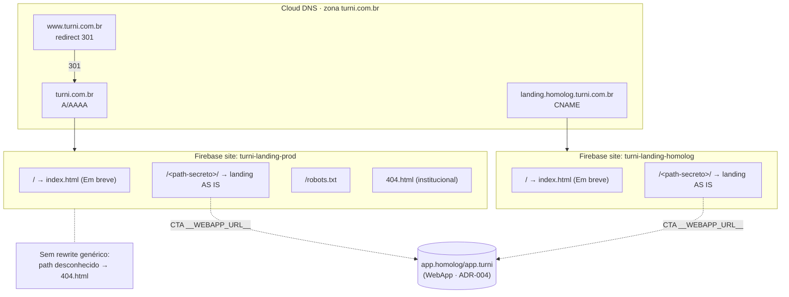

# ADR-012 — Landing institucional: gate "Em breve", path secreto, hosting dedicado e pipeline isolado

## Contexto

O EPIC-006 sobe a landing institucional em `turni.com.br`, mas o time comercial **não autorizou exposição pública** da landing completa enquanto orquestra a narrativa de lançamento. A solução fixada pelo PO (`epic.md`): o apex e `www` servem uma página **"Em breve"** minimalista (indexável, na identidade visual da landing); a landing completa **AS IS** (hoje em `docs/prototipo/index.html`) fica acessível apenas atrás de um `<path-secreto>` configurável. O gate é explicitamente declarado pelo épico como **obfuscação, não segurança** — proteção real (basic-auth, IP allowlist) está fora do escopo.

Esta ADR herda integralmente **ADR-004** (Firebase Hosting + Cloud DNS + Terraform + GitHub Actions tag-based + gate humano de 1 clique em prod) e **ADR-003** (monorepo poliglota com deploy independente por path filter). Ela **não reabre** provedor, IaC ou pipeline base; apenas estende namespace de sites Firebase, registros DNS e o filtro de path para a nova superfície `apps/landing/**`. **PDR-003** posiciona a landing como **terceira superfície pública**, isolada do WebApp e do Backoffice. **PDR-011** coloca o épico na WAVE-2026-01 em paralelo ao ciclo do turno.

Sem esta ADR, as estórias de implementação (028 página "Em breve", 029 Terraform, 030 scaffolding/import, 031 firebase.json/workflow) decidiriam ad-hoc no código a mecânica do gate, o tratamento de 404, a política de cache e o destino do `sw.js` — gerando refactor com ciclo de deploy+verificação a cada iteração. As quatro dimensões (mecânica do gate, política do path, política de 404, política de cache) formam um **subsistema único de governança da landing**: decidir o gate sem decidir o 404 deixa lacuna que vira lateral leak; decidir o path sem decidir cache do `index.html` cria janelas em que o push do marketing fica invisível ou o path antigo vaza via CDN. Por isso uma ADR coesa cobre as nove decisões.

Restrições materiais observadas no insumo:
- O `firebase.json` atual do WebApp usa rewrite genérico `** → /index.html` (SPA Flutter). **Esse rewrite não pode existir no site da landing** — com ele, qualquer path desconhecido cairia na landing, vazando-a. O épico já fixa isso.
- O `infra/modules/firebase/main.tf` hoje cria **um** site fixo (`turni-webapp-${env}`) com **um** domínio customizado. Precisa generalizar para servir a landing.
- O `infra/modules/dns/main.tf` hoje só cria CNAMEs (webapp/api). O apex `turni.com.br` exige registros **A/AAAA** apontando para os IPs do Firebase Hosting — capacidade que o módulo ainda não tem.
- O `docs/prototipo/sw.js` cacheia `app.html`, `index.html` e `manifest.json` com estratégia *cache-first* para assets — risco direto de pin de versão antiga e de servir HTML cacheado da landing a quem digita o apex.
- A landing AS IS referencia assets **sem content-hash** (`img/...`, `turnioficial_files/...`, fontes externas em `fonts.gstatic.com`, `unpkg.com`) — isso restringe a política de cache imutável e a CSP.

## Forças (drivers) da decisão

- **F1 — Simplicidade / menos peças móveis (princípio #1):** peso **alto**. Time minúsculo; cada componente extra (Cloud Function, site adicional, build step) precisa se pagar.
- **F2 — Custo recorrente (princípio #11):** peso **alto**. Pré-receita; nada de linha de custo por requisição (Cloud Function de gate) sem benefício claro.
- **F3 — Risco de leak da landing:** peso **alto**. O gate precisa garantir que paths desconhecidos **não** caiam na landing; nenhum link interno ou cache pode vazar o path.
- **F4 — Isolamento de deploy (ADR-003, PDR-003):** peso **alto**. Alterar a landing não pode tocar/redeployar WebApp/API/Admin.
- **F5 — Propagação de push do marketing (≤ 5 min):** peso **médio-alto**. Mudança de copy precisa aparecer rápido; cache agressivo de HTML é inimigo.
- **F6 — Honestidade arquitetural:** peso **médio**. As limitações (obfuscação ≠ segurança; cache pode atrasar push; robots.txt auto-revela path) devem ser declaradas, não escondidas.
- **F7 — Reversibilidade (princípio #7):** peso **médio**. Hosting de estáticos declarativo é portável; rotação de path e go-public devem ser operações baratas.
- **F8 — Esforço do go-public futuro:** peso **médio**. O swap homolog→prod e a promoção ao apex devem ser operação de minutos, não refactor.

## Decisões

São nove decisões. Cada uma traz as opções avaliadas e a escolha. Onde a decisão é óbvia, uso uma frase em vez de matriz (conforme `templates/adr.md`).

### §1 — Mecânica do gate "Em breve" + path secreto

**Opções avaliadas:**

- **(a) Site Firebase único com rotas explícitas, sem rewrite genérico — ESCOLHIDA.** Um site por ambiente serve o `index.html` ("Em breve") no apex, a landing AS IS em `<path-secreto>/index.html`, `robots.txt` e `404.html`. **Sem** `** → /index.html`. O Firebase Hosting serve arquivos estáticos diretamente; sem rewrite, todo path que não casa com arquivo existente cai no `404.html`. `/` → "Em breve"; `/<path>/` → landing (Firebase resolve `index.html` do diretório); `/qualquer-coisa` → 404 institucional.
- **(b) Dois sites Firebase separados** (apex/"Em breve" num site; landing num subdomínio dedicado `<path>.turni.com.br`). Rejeitada: subdomínio dedicado **revela estrutura** (o próprio nome do host vira pista), exige DNS + verificação de domínio + Terraform adicionais, e não traz benefício de isolamento que (a) já não dê — a landing AS IS é estática e convive trivialmente no mesmo bundle. Mais peças (F1), sem ganho.
- **(c) Site único com rewrite genérico + Cloud Function/middleware fazendo o gate.** Rejeitada: adiciona **linha de custo por requisição e latência** (F2), e com rewrite genérico ativo qualquer falha do gate vira leak (F3). Viola #1 e #11 sem dor real que justifique.

**Decisão:** **(a)**. É a opção com menos peças móveis (F1), custo zero adicional (F2), risco de leak mínimo (sem rewrite genérico, F3) e isolamento total (site dedicado, F4). É também a que o `epic.md` já antecipa ("rotas explícitas; fallback 404 → 404.html; sem rewrite genérico").

> Decisão claramente favorável: (a) domina (b) e (c) em todas as forças de peso alto sem trade-off relevante. A única "perda" — não ter SPA-routing — é irrelevante: a landing é uma página única de scroll e a "Em breve" é trivial.

### §2 — Política do `<path-secreto>`

**Opções avaliadas:**

- **(a) Path commitado no repositório** (em `firebase.json` ou como nome de pasta). Rejeitada como default: qualquer pessoa com acesso ao repo conhece, e o histórico git preserva paths antigos mesmo após rotação — rotação não "apaga".
- **(b) Path injetado em build-time via secret de deploy — ESCOLHIDA.** O conteúdo da landing vive no repo sob um nome de pasta **neutro e estável** (`apps/landing/public/_lp/`); o workflow de deploy renomeia `_lp/` → `$FIREBASE_LANDING_PATH` (GitHub Actions secret) antes do `firebase deploy`. `robots.txt` é **gerado no build** a partir do mesmo secret. O `firebase.json` **não referencia o path** (decisão §1 dispensa rewrite). O repo e clones locais só contêm o placeholder `_lp`.
- **(c) Path duplo (alias estável + sufixo rotacionável injetado).** Rejeitada por ora: adiciona complexidade (dois níveis de path, lógica de composição) sem dor concreta — a rotação simples de (b) já resolve o caso "vazou, troque". Fica registrada como evolução se a frequência de rotação justificar.

**Decisão:** **(b)**. Mantém o path fora do repo (e fora de clones locais), permite rotação sem PR de conteúdo (troca o secret + redeploy), e casa com o CODEOWNERS por wildcard de pasta estável (§9) e com o swap de CTA (§7), que usa o mesmo build step.

**Procedimento de rotação:** (1) comercial/PO sinaliza vazamento ou rotação programada; (2) engenharia atualiza o secret `FIREBASE_LANDING_PATH` (homolog e prod); (3) redeploy via tag — o path antigo deixa de existir (404 institucional); (4) comercial recompartilha o novo path com a lista de convidados. **Quem aprova rotação:** comercial decide *quando*, engenharia executa (handoff detalhado em PDR-015 / STORY-027). **Log de quem tem acesso ao path corrente:** responsabilidade do comercial (lista de convidados), fora desta ADR.

**Limitação declarada (F6):** isto é **obfuscação, não segurança**. Quem tiver a URL, achar em log/referrer/Wayback, ou ler o `robots.txt` (ver §3/Descobertas) consegue ver a landing. Aceito explicitamente pelo `epic.md`. Proteção real (basic-auth/IP allowlist) é ampliação separada.

### §3 — Política de tratamento de 404

**Opções avaliadas:**

- **(a) Página 404 institucional na identidade da landing, sem link para o path secreto — ESCOLHIDA.** Mensagem genérica ("página não encontrada"), logo TURN**I.**, link apenas para o apex ("Em breve"). Distingue "site existe, página não" de "site quebrado" e não vaza o path.
- **(b) Redirect 302 de qualquer 404 para `/`.** Rejeitada: esconde a estrutura mas também **mascara bugs reais** (um asset quebrado vira "tudo ok, vai pro apex"), dificultando diagnóstico; e um redirect em vez de 404 confunde crawlers.
- **(c) 404 cru do Firebase.** Rejeitada: off-brand, passa imagem de site quebrado.

**Decisão:** **(a)**. Melhor UX, não esconde bug real, não vaza path.

### §4 — Política de cache

**Decisão:**
- **HTML (`index.html` do apex/"Em breve" e `index.html` da landing):** `Cache-Control: no-cache, no-store, must-revalidate`. Garante que push de copy aparece em ≤ 5 min (F5) — mesmo padrão já usado no `firebase.json` do WebApp.
- **Assets COM content-hash:** `public, max-age=31536000, immutable`.
- **Assets da landing AS IS SEM content-hash** (`img/*`, `turnioficial_files/*`, css/js do protótipo): `public, max-age=3600` (1 h). Não podem ser `immutable` — pinariam versão antiga, e o protótipo não versiona por hash. 1 h equilibra propagação (F5) × custo de CDN miss (F2). A "Em breve", por ser nova, pode ter assets com hash e cair na regra `immutable`.

**Opção rejeitada:** `immutable` para todos os assets — quebraria o push do marketing em assets não-hasheados (stale pinado por 1 ano). Trade-off honesto (F6): mudança em asset não-hasheado da landing pode levar até 1 h para propagar no CDN; mudança em HTML/copy é imediata.

### §5 — Destino do `sw.js` AS IS

**Opções avaliadas:**

- **(a) Fica AS IS.** Rejeitada: o `sw.js` do protótipo cacheia `app.html` (fora do escopo da landing) e faz *cache-first* em assets — pode servir versão antiga após deploy (atrapalha F5) e, pior, servir HTML cacheado da landing a um visitante que digita o apex (risco de leak, F3).
- **(b) Sai na importação — ESCOLHIDA.** O engenheiro não inclui `sw.js` no bundle da landing (nem o registro no HTML). Como `turni.com.br` é domínio novo (sem service worker previamente registrado em clientes), não há SW legado a "matar".
- **(c) Fica neutralizado** (registra mas não cacheia). Rejeitada: complexidade sem benefício — não há requisito de PWA na landing AS IS (épico marca PWA da landing como fora de escopo).

**Decisão:** **(b)**. Remove na importação (STORY-030). **Gatilho de remoção emergencial** (caso algum SW persista): publicar um `sw.js` kill-switch que faz `unregister()` e limpa caches — documentado no runbook (STORY-032). PWA da landing, se o marketing quiser depois, é estória separada.

### §6 — Redirect `www → apex`

**Opções avaliadas:**

- **(a) Regra `redirects` no `firebase.json` do site.** Limitação técnica: os `redirects` do Firebase casam por **path**, não por **host** — com apex e www no mesmo site, não dá para redirecionar só o www via `firebase.json`. Inviável isolada.
- **(b) Redirect nativo de domínio do Firebase Hosting — ESCOLHIDA (com fallback).** Adicionar `www.turni.com.br` como domínio customizado do site da landing **configurado como redirect** para o apex (`turni.com.br`), retornando **301**. É capacidade nativa do Firebase Hosting (domain-level redirect), sem site extra nem path-matching. **Fallback:** se o provider Terraform não expuser o redirect de domínio de forma estável, usar um **micro-site dedicado** (`turni-www-redirect-${env}`) cujo `firebase.json` tem um único redirect `** → https://turni.com.br/` (301). A escolha fina do mecanismo Terraform é **deferida a STORY-029**.
- **(c) Servidor de redirect externo via DNS.** Rejeitada: adiciona infra fora do Firebase (F1), custo e ponto de falha (F2).

**Decisão:** **(b)** — redirect nativo de domínio (301), com micro-site dedicado como fallback documentado. O épico fixa **301** (apex canônica → "Em breve", nunca o path secreto).

### §7 — Swap de URL de CTA `homolog → prod`

**Opções avaliadas:**

- **(a) Substituição build-time com placeholder `__WEBAPP_URL__` — ESCOLHIDA.** Os CTAs da landing AS IS usam `__WEBAPP_URL__/#/...`; o workflow substitui pelo valor do ambiente (`https://app.homolog.turni.com.br` em homolog; `https://app.turni.com.br` em prod) no build. Mesma família de mecanismo do §2 (injeção build-time), um único build step.
- **(b) PR manual do marketing trocando strings hardcoded.** Rejeitada: error-prone, faz o marketing tocar conteúdo a cada cutover, e a landing AS IS divergiria entre homolog e prod no repo.
- **(c) Redirect HTTP `app.homolog → app.turni`.** Rejeitada: mantém a infra de homolog viva indefinidamente e acopla o cutover do WebApp ao da landing (F4/F8).

**Decisão:** **(a)**. O go-public do swap vira mudança de uma variável por ambiente; a landing AS IS no repo é única (sem fork homolog/prod).

### §8 — Topologia final dos sites Firebase Hosting

Decorrente de §1 (site único por ambiente), os sites são:

| Site Firebase | Ambiente | Serve | Domínios |
|---|---|---|---|
| `turni-landing-homolog` | homolog | apex "Em breve" `/`, landing `/<path>/`, `robots.txt`, `404.html` | `landing.homolog.turni.com.br` (CNAME) |
| `turni-landing-prod` | prod | idem | `turni.com.br` (A/AAAA) + `www.turni.com.br` (redirect 301) |
| *(condicional)* `turni-www-redirect-prod` | prod | só fallback do §6, se o redirect nativo não for viável via Terraform | `www.turni.com.br` |

Coexistem com os sites `turni-webapp-{homolog,prod}` do ADR-004, **sem cruzamento** (sites e tags distintos).

**Impacto no Terraform:**
- **`infra/modules/firebase`** hoje fixa `site_id = "turni-webapp-${env}"` e um único `custom_domain`. Generalizar: aceitar `site_id`/nome como variável e uma **lista** de domínios customizados (apex precisa de A/AAAA; subdomínios de CNAME). Recomendação: parametrizar o módulo e chamá-lo N vezes (webapp, landing) por ambiente — preserva coesão (#5) e evita ramificação interna. Detalhe de implementação (lista vs. N chamadas) **deferido a STORY-029**.
- **`infra/modules/dns`** hoje só cria CNAMEs. Adicionar suporte a **registros A/AAAA do apex** apontando para os IPs do Firebase Hosting, ao **www** (redirect/CNAME conforme §6), e ao CNAME `landing.homolog`. **Deferido a STORY-029.**

### §9 — Política de CODEOWNERS

Como o path **não é commitado** (§2(b)), os patterns usam a pasta-placeholder estável `_lp/`, sem vazar o path real:

```
# Conteúdo da landing — propriedade do marketing
apps/landing/public/_lp/**            @turni/marketing

# "Em breve", 404, infra de routing e deploy — engenharia
apps/landing/public/index.html        @turni/engenharia
apps/landing/public/404.html          @turni/engenharia
apps/landing/public/robots.txt        @turni/engenharia   # template (path injetado no build)
apps/landing/firebase.json            @turni/engenharia
.firebaserc                           @turni/engenharia
.github/workflows/landing-*.yml       @turni/engenharia
infra/modules/firebase/**             @turni/engenharia
infra/modules/dns/**                  @turni/engenharia
```

Aliases (`@turni/marketing`, `@turni/engenharia`) e a estrutura final de `CODEOWNERS` são fixados em **PDR-015 (STORY-027)** + aplicados em **STORY-030**. Esta ADR fixa **o padrão de pattern** (placeholder estável → zero vazamento de path).

## Matriz comparativa (decisão central §1)

| Critério (força) | Peso | (a) Site único, rotas explícitas | (b) Dois sites | (c) Cloud Function gate |
|---|---|---|---|---|
| F1 — Simplicidade | alto | ✅ menos peças | ⚠️ +DNS/domínio/TF | ❌ +função +deploy |
| F2 — Custo | alto | ✅ zero adicional | ⚠️ ~igual | ❌ custo/req + latência |
| F3 — Risco de leak | alto | ✅ sem rewrite → 404 | ⚠️ host revela estrutura | ❌ falha do gate vaza |
| F4 — Isolamento deploy | alto | ✅ site dedicado | ✅ sites dedicados | ⚠️ função acopla |
| F7 — Reversibilidade | médio | ✅ declarativo | ✅ declarativo | ⚠️ código a manter |

## Diagrama — topologia Firebase + DNS resultante



## Consequências

### Positivas
- Gate com **zero custo recorrente adicional** e mínimo de peças móveis (#1, #11).
- Sem rewrite genérico → path desconhecido cai em 404 institucional, **não** na landing (F3).
- Deploy da landing totalmente isolado do WebApp/API/Admin (site e tag próprios — F4).
- Path fora do repo e de clones locais; rotação = trocar secret + redeploy (F7).
- Swap de CTA e go-public viram **mudança de variável**, não refactor (F8).
- Push de copy propaga em ≤ 5 min (HTML `no-cache`).

### Negativas / trade-offs aceitos
- **Obfuscação, não segurança:** o path é descobrível (URL, log, referrer, Wayback, `robots.txt`). Aceito pelo épico.
- **`robots.txt` auto-revela o path** se mantivermos `Disallow: /<path>/` (ver Descobertas). A garantia real de não-indexação é o `<meta name="robots" content="noindex,nofollow">` na landing.
- **Asset não-hasheado** da landing pode levar até 1 h para propagar (cache 1 h) — débito do AS IS, não da infra.
- **Terraform precisa generalizar** dois módulos (firebase, dns) — trabalho real em STORY-029.
- **CSP estrita pode quebrar a landing AS IS** (fontes externas, unpkg) — a CSP concreta é calibrada em STORY-031 (provavelmente report-only no início).

### Neutras
- Domínio `turni.com.br` novo no apex (A/AAAA) — primeiro uso de registro de apex na zona (até aqui só CNAMEs).
- A "Em breve" tem ciclo de vida próprio: no go-public é descartada ou vira 301 para `/` servindo a landing.

### Para o time
- **Destrava:** STORY-028 (sabe que é site único → mora junto), STORY-029 (topologia e impacto Terraform definidos), STORY-030 (estrutura de pastas com placeholder `_lp/` + CODEOWNERS), STORY-031 (firebase.json com rotas explícitas, sem rewrite; build step de injeção de path + CTA + robots).
- **Relação com decisões:** herda ADR-004 (Firebase/Terraform/Actions) e ADR-003 (path filter); honra PDR-003 (3ª superfície) e PDR-011 (onda). Convive com PDR-015 (STORY-027), que fixa fronteira de processo e aliases de CODEOWNERS.
- **Spike de validação:** não como pré-condição do accept; a viabilidade é exercida nas estórias de implementação e na validação final (STORY-033).

## Plano de verificação

- **Conformidade:**
  - `firebase.json` da landing **não** contém rewrite `** → /index.html` (grep no CI / revisão de PR).
  - `curl -sI https://turni.com.br/` → 200 "Em breve"; `curl -sI https://www.turni.com.br/` → 301 para apex; `curl -s https://turni.com.br/<path>/` → 200 landing; `curl -sI https://turni.com.br/<path-aleatorio>/` → 404 institucional (STORY-033).
  - Repo e clones contêm apenas a pasta placeholder `_lp/` — `grep -r` pelo path real no repo retorna vazio.
  - Deploy isolado: alterar `apps/landing/**` não dispara workflow do WebApp (path filter — STORY-031/033).
  - Landing carrega `<meta name="robots" content="noindex,nofollow">`.
- **Sinais de revisão (reabrir):**
  - Comercial pedir proteção **real** → nova ADR (basic-auth/IP allowlist/Cloud Armor).
  - Frequência de rotação de path alta o suficiente para justificar §2(c) (alias + sufixo).
  - Cache de 1 h em asset não-hasheado virar dor recorrente do marketing → revisar §4.
  - Redirect nativo de domínio (§6) não suportado pelo Terraform → ativar fallback micro-site.

## O que NÃO está decidido aqui (deferido)

- **Valor concreto do `<path-secreto>`** — decisão do **comercial** (não do arquiteto).
- **Copy da página "Em breve"** — STORY-028, com input de marketing/comercial.
- **Secret de deploy concreto** (`FIREBASE_LANDING_PATH`) e o build step — criados em STORY-031.
- **Mecanismo Terraform fino** do redirect www e dos registros apex A/AAAA — STORY-029.
- **CSP/headers de segurança concretos** — STORY-031.
- **Aliases e arquivo `CODEOWNERS` final** — PDR-015 (STORY-027) + STORY-030.
- **Fronteira de processo marketing × engenharia × comercial** (quem aprova o quê, go-public handoff) — PDR-015 (STORY-027).

---

## Aprovação humana

- **Status final:** ✅ aceita
- **Aprovado por:** Alexandro
- **Data:** 2026-05-28
- **Forma do aceite:** aprovado em chat (sessão de 2026-05-28); commit direto na `main`
- **Condicionantes do aceite:** nenhuma. Descoberta do `robots.txt` (auto-revela o path; garantia real de não-indexação é o `<meta noindex,nofollow>`) reconhecida e aceita sob o modelo de obfuscação do épico.

### Em caso de rejeição
- **Motivo:** ...
- **Próximos passos sugeridos:** ...

---

## Histórico

- 2026-05-28 — criada como `proposed` por Arquiteto (STORY-026). Nove decisões: §1 site único com rotas explícitas (sem rewrite genérico); §2 path injetado em build-time (pasta-placeholder `_lp/`); §3 404 institucional sem link ao path; §4 HTML no-cache, assets hasheados immutable, assets AS IS não-hasheados 1 h; §5 `sw.js` removido na importação; §6 redirect www→apex 301 nativo de domínio (fallback micro-site); §7 CTA via placeholder `__WEBAPP_URL__` build-time; §8 dois sites (`turni-landing-{homolog,prod}`), Terraform a generalizar; §9 CODEOWNERS por placeholder estável.
- 2026-05-28 — `accepted` por Alexandro (aprovação em chat; commit direto na `main`).
