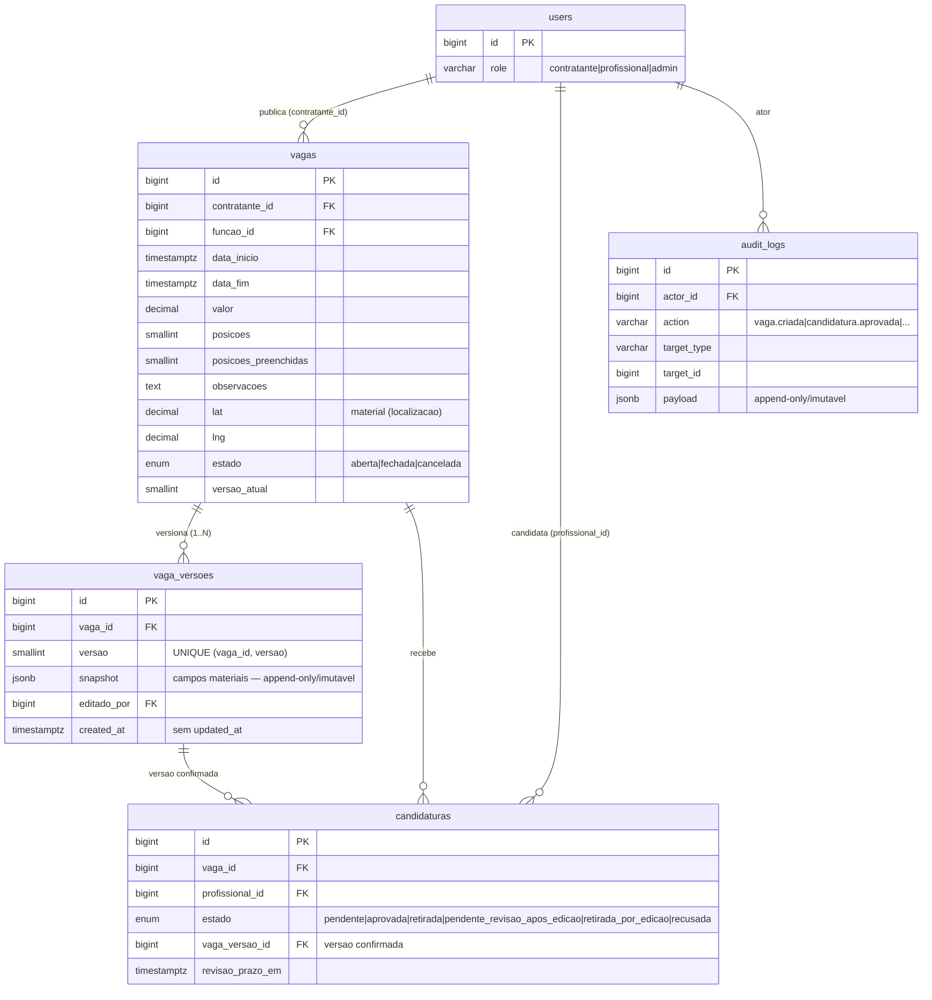
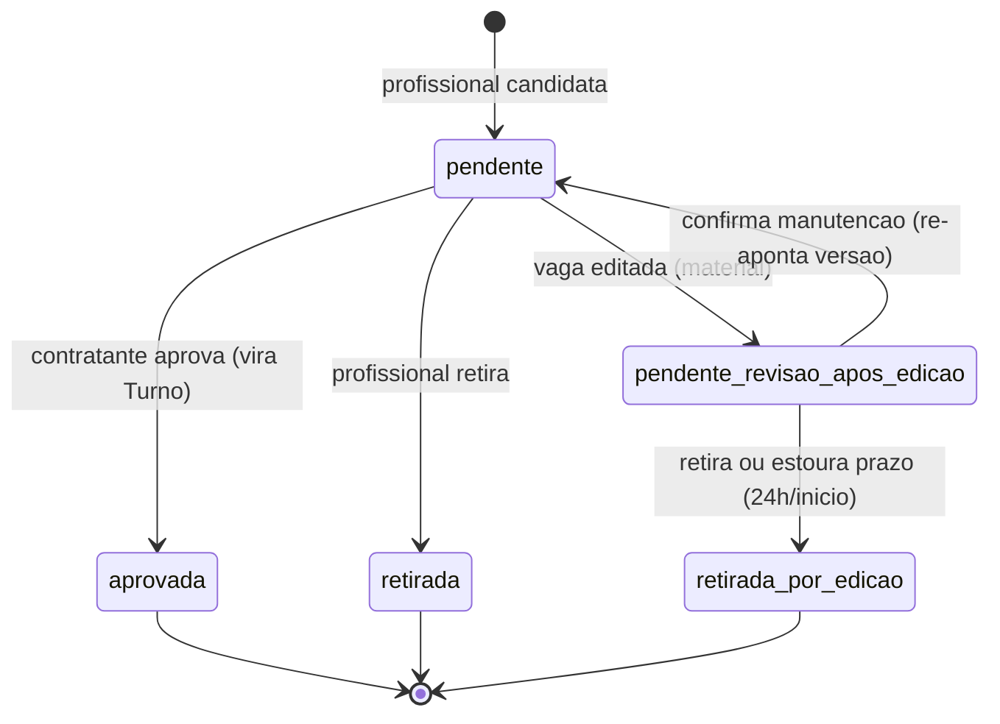

# ADR-013 — Modelo de dados Vaga + Candidatura + snapshot de edição material

## Contexto

O EPIC-001 fechou o funil de identidade: usuários `ativo` com RBAC vivo (Policies + Global Scopes, ADR-009 Decisão 3), audit log de admin imutável (ADR-009 Decisão 4) e aceite eletrônico imutável (ADR-010). O EPIC-002 entrega o **primeiro encontro** entre contratante e profissional: vaga publicada → feed → candidatura → painel de candidatos. Para isso existir, o banco precisa de três agregados novos — **Vaga**, **Candidatura** e o **snapshot de versão de vaga** que o PDR-009 exige — além dos estados/transições de cada um. Sem este modelo fixado em ADR, cada estória de implementação (STORY-046..054) inventaria o seu schema e o épico ficaria sem referência arquitetural coerente.

As restrições que chegam consolidadas:

- **`domain/vaga.md`** — Vaga é a oferta do contratante para um ou mais turnos idênticos. Atributos obrigatórios: `estabelecimento` (contratante dono), `funcao` (lista canônica do Core FHP), `data_inicio`, `data_fim`, `valor`, `posicoes` (1+). Opcionais: `valor_hora` (derivado), `observacoes`. Estados `aberta | fechada | cancelada`. Quando `posicoes > 1`, cada aprovação consome uma posição; ao preencher a última, a vaga vai automaticamente para `fechada`. Visibilidade do feed: `aberta` + função do profissional bate + dentro do raio declarado + data/hora futura.
- **`domain/candidatura.md`** — Candidatura é manifestação de interesse por uma vaga aberta. Estados `pendente | aprovada | retirada | pendente_revisao_apos_edicao | retirada_por_edicao | recusada`. Pré-condições (gate) na criação: profissional `ativo`, sem turno pendente de avaliação (PDR-005), vaga `aberta`, sem conflito de horário com outra candidatura/turno, e regra de habitualidade (PDR-002 / `domain/compliance.md`). Unicidade: não pode candidatar 2× na mesma vaga.
- **PDR-009** (edição de vaga pós-candidatura) — Edição é permitida após a primeira candidatura. Alteração **material** (função, data início/fim, valor, número de posições, localização, observações) registra um snapshot (versão original + nova), notifica candidatos pendentes com diff antes/depois, e move cada candidatura `pendente` para `pendente_revisao_apos_edicao` com prazo de 24h ou até o início do turno. Sem confirmação no prazo → retirada automática. Edição **não material** (ortografia/formatação) não gera versão nem notifica.
- **PDR-005** (avaliação recíproca obrigatória e bloqueante) — profissional só candidata e contratante só publica após avaliar turnos finalizados pendentes. É um **gate de ação** na criação de candidatura/vaga — o modelo precisa permitir a consulta, mas a aplicação do gate é da estória de implementação (STORY-050), não deste spike.
- **PDR-008** (geofencing alerta-e-registra) — a medição geo do check-in é do EPIC-003; aqui ela só importa por antecipar a pergunta "PostGIS ou não?", porque o feed filtra por raio.
- **ADR-009** — padrão de modelagem do projeto: PK `bigint` autoincremento (`$table->id()`), FK via `foreignId()->constrained()`, dados sensíveis com Encrypted Cast, imutabilidade garantida no banco por trigger + `REVOKE`, RBAC por Policies + Global Scopes em `packages/domain`. **Não reabrimos nada de ADR-009.**
- **ADR-010** — imutabilidade do aceite eletrônico por trigger `BEFORE UPDATE OR DELETE → RAISE EXCEPTION` + `REVOKE`. Mesmo padrão se aplica ao snapshot append-only desta ADR.
- **non-functional.md** — caminho crítico do WebApp p95 ≤ 800ms; carregamento de feed ≤ 1.5s (p95). O feed do profissional é o caminho mais sensível deste épico.
- **Critério herdado F-NB-1 (EPIC-000)** — migrações com lógica de negócio reversíveis com `php artisan migrate:rollback` em homolog.

Há uma imprecisão de nomenclatura a resolver: CA-6 fala em `audit_logs` "herdado do EPIC-001", mas o EPIC-001 criou `admin_audit_log`, deliberadamente escopado a **ações de admin** (ADR-009 Decisão 4). Eventos de ciclo de vida de vaga/candidatura são executados por contratante/profissional, não por admin. Esta ADR resolve o ponto na Decisão 5.

## Forças (drivers) da decisão

- **F1 — Coerência com o padrão de modelagem (ADR-009/ADR-010):** o modelo precisa reusar PK bigint, FK constrained, e o padrão de imutabilidade por trigger+REVOKE. Divergir sem motivo gera incoerência estrutural cara de reverter. Peso: **alto**.
- **F2 — Snapshot fiel e inviolável (PDR-009):** o candidato decide manter/retirar olhando o "antes" e o "depois". Se o histórico de versões puder ser alterado, a decisão do candidato perde lastro. A imutabilidade precisa ser garantida no banco, não por convenção. Peso: **alto**.
- **F3 — Feed performático (non-functional.md):** o feed do profissional (função + raio + `aberta` + data futura) é o caminho crítico do épico; o índice precisa sustentar p95 ≤ 800ms com folga. Peso: **alto**.
- **F4 — Invariantes no banco, não só no código (princípio #9):** `posicoes ≥ 1`, `data_fim > data_inicio`, unicidade de candidatura por par (vaga, profissional) e append-only do snapshot são invariantes que devem ser garantidas mecanicamente. Peso: **alto**.
- **F5 — Transições testáveis e evolutivas (princípio #10):** a máquina de estados de vaga e de candidatura vai crescer (turno, disputa nos próximos épicos). Precisa ser fácil de testar (TDD) e de evoluir. Peso: **alto**.
- **F6 — Simplicidade Postgres-first (princípios #1 e #3):** não adicionar extensão (PostGIS) nem armazenamento extra antes de provar com números que o Postgres "puro" não dá conta. Peso: **médio**.
- **F7 — Reversibilidade da migração (F-NB-1, princípio #7):** `up()`/`down()` simétricos; rollback limpo em homolog. Peso: **médio**.

---

## Decisão 1 — Representação do snapshot de edição material (`vaga_versoes`)

> Decisão de fundo confirmada com o humano antes da redação (sessão 2026-06-02).

### Opção 1A — `vaga_versoes` append-only com `snapshot jsonb` + trigger de imutabilidade (escolhida)
- **Resumo:** uma tabela `vaga_versoes`, uma linha por versão material. Cada linha guarda `snapshot jsonb` com os campos materiais daquela versão + metadados (`versao`, `editado_por`, `created_at`). Imutável por trigger `BEFORE UPDATE OR DELETE → RAISE EXCEPTION` + `REVOKE UPDATE, DELETE` do role de runtime (mesmo padrão da AceiteEletronico, ADR-010). O diff antes/depois é computado entre as versões consecutivas `N-1` e `N`.
- **Como atende aos princípios:**
  - ✅ Simplicidade (1): uma tabela, um cast `array`/`AsArrayObject` no Eloquent; captura o conjunto material sem schema rígido.
  - ✅ Postgres-first (3): `jsonb` nativo, sem armazenamento extra.
  - ✅ Imutabilidade (F2): trigger + REVOKE garante no banco — bug de app ou SQL cru não corrompe o histórico.
  - ✅ Reversibilidade (7): `drop table vaga_versoes` no rollback.
- **Prós:** acrescentar/remover um campo material no futuro não exige migração da tabela de histórico; o snapshot reflete exatamente o que o candidato viu.
- **Contras:** campos dentro do `jsonb` não são queryáveis por coluna nativa (aceitável — o histórico é lido por vaga, não filtrado por campo material).

### Opção 1B — Tabela espelho com colunas tipadas
- **Resumo:** `vaga_versoes` duplica cada campo material da `vagas` em colunas tipadas.
- **Contras:** duplica o schema da `vagas`; toda vez que um campo material muda de tipo/constraint, duas migrações; rigidez sem ganho real para um histórico que é lido inteiro por vaga. Type-safety marginal aqui.

### Decisão 1 — **Opção 1A.** `vaga_versoes` append-only, `snapshot jsonb`, imutável por trigger + REVOKE.

---

## Decisão 2 — Onde encravar a máquina de estados (transições)

### Opção 2A — Transições na camada de domínio Eloquent; enum Postgres restringe só o conjunto de valores (escolhida)
- **Resumo:** os estados são tipos enum **nativos** do Postgres (`vaga_estado`, `candidatura_estado`) — CA-4 — o que garante o **conjunto** de valores válidos no banco. As **transições** válidas (ex.: `aberta→fechada` ok, `fechada→cancelada` proibida) são guardadas na camada de domínio: um pequeno state-machine por agregado em `packages/domain` com testes unitários cobrindo cada transição permitida/proibida. Trigger fica **reservado exclusivamente para imutabilidade** (o append-only de `vaga_versoes`), mantendo o padrão atual do projeto.
- **Como atende aos princípios:**
  - ✅ TDD (10) / F5: transição é código de domínio testável (`assertTransition`, `assertThrows`), versionável e fácil de evoluir quando turno/disputa entrarem.
  - ✅ Coesão (5): a regra de transição vive junto do modelo que ela protege, não dispersa em PL/pgSQL.
  - ✅ Simplicidade (1): nenhum gatilho de lógica de negócio para depurar no banco.
- **Contras:** a garantia de transição não é à prova de SQL cru fora do domínio. Mitigação: todo acesso de escrita passa pelos modelos/serviços de `packages/domain` (mesma premissa que sustenta os Global Scopes da ADR-009); o enum já barra valores impossíveis.

### Opção 2B — Trigger Postgres bloqueando transições inválidas
- **Resumo:** além do enum, um trigger `BEFORE UPDATE` valida `OLD.estado → NEW.estado`.
- **Contras:** lógica de negócio em PL/pgSQL é difícil de testar e de evoluir; foge do padrão do projeto (até aqui o trigger só serve imutabilidade); a matriz de transições muda a cada épico e viveria longe do código de domínio.

### Decisão 2 — **Opção 2A.** Enum nativo restringe valores; transições na camada de domínio com testes. Trigger só para imutabilidade.

---

## Decisão 3 — Filtro geográfico do feed (raio)

### Opção 3A — `lat`/`lng` snapshot na vaga + prefiltro bounding-box (btree) + refino Haversine; sem PostGIS (escolhida)
- **Resumo:** a `localizacao` é um dos campos materiais (PDR-009), então a vaga carrega `lat`/`lng` (snapshot da localização do estabelecimento no momento da publicação, mais `cidade`/`uf` para exibição). O feed filtra primeiro por bounding-box (`lat BETWEEN ? AND ?` e `lng BETWEEN ? AND ?`, derivado do raio do profissional) sobre um índice btree, e refina a distância com Haversine na aplicação/SQL. **Sem habilitar PostGIS.**
- **Como atende aos princípios:**
  - ✅ Postgres-first (3, F6): não adiciona extensão antes de prova de necessidade; o conjunto candidato já é minúsculo após filtrar por função + `aberta` + data futura.
  - ✅ Reversibilidade (7): adicionar PostGIS depois é aditivo (não destrói nada).
- **Contras:** Haversine no refino é aproximação esférica (erro < 0.5%, irrelevante para "raio de deslocamento"); não há `ST_DWithin` pronto. Aceitável no MVP.

### Opção 3B — Habilitar PostGIS agora (geography + GiST + `ST_DWithin`)
- **Contras:** adiciona extensão e dependência de provisionamento (superuser para `CREATE EXTENSION`) antes de prova de necessidade; o ganho só se materializa em escala muito acima do MVP. Quando o geofencing do check-in (PDR-008, EPIC-003) chegar com requisito real, reabrimos com números — gatilho explícito.

### Decisão 3 — **Opção 3A.** `lat`/`lng` na vaga + bbox/btree + Haversine; PostGIS adiado para quando PDR-008 (EPIC-003) provar necessidade.

---

## Decisão 4 — Estados, transições e invariantes

### Estados (enum Postgres nativo — CA-4)

```sql
CREATE TYPE vaga_estado        AS ENUM ('aberta', 'fechada', 'cancelada');
CREATE TYPE candidatura_estado AS ENUM ('pendente', 'aprovada', 'retirada',
                                        'pendente_revisao_apos_edicao',
                                        'retirada_por_edicao', 'recusada');
```

> Nota de coerência: a `users.status` (ADR-009) ficou `VARCHAR` por receio de `ALTER TYPE` futuro. Aqui o CA-4 (decisão do PO) manda enum **nativo** — honramos. `ALTER TYPE ... ADD VALUE` cobre a evolução comum (acrescentar estado); reordenar/remover valor é raro e fica documentado como custo conhecido.

### Transições válidas (guardadas no domínio — Decisão 2)

**Vaga:**
- `aberta → fechada` — automática quando a última posição é preenchida (`posicoes_preenchidas = posicoes`).
- `aberta → cancelada` — explícita pelo contratante; candidaturas pendentes encerradas/notificadas.
- `fechada → cancelada` — **proibida** (`domain/vaga.md`); cancelar turnos confirmados é fluxo do turno (EPIC-003).

**Candidatura:**
- `pendente → aprovada` — contratante aceita; decrementa posição (vira Turno no EPIC-003).
- `pendente → retirada` — profissional retira voluntariamente.
- `pendente → pendente_revisao_apos_edicao` — edição material da vaga (PDR-009).
- `pendente_revisao_apos_edicao → pendente` — profissional confirma manutenção (re-aponta para a versão nova).
- `pendente_revisao_apos_edicao → retirada_por_edicao` — profissional retira ou estoura o prazo (24h / início do turno).
- `* → recusada` — reservado (estado existe no enum por `candidatura.md`, mas o MVP não recusa explicitamente; ver §Fora de escopo).

### Invariantes duras no banco (CA-5)

- `vagas`: `CHECK (posicoes >= 1)`; `CHECK (data_fim > data_inicio)`; `CHECK (posicoes_preenchidas BETWEEN 0 AND posicoes)`.
- `candidaturas`: `UNIQUE (vaga_id, profissional_id)` — não candidata 2× na mesma vaga.
- `vaga_versoes`: append-only por trigger `BEFORE UPDATE OR DELETE → RAISE EXCEPTION` + `REVOKE UPDATE, DELETE` do role de runtime; `UNIQUE (vaga_id, versao)`.

> **Conflito de horário** (`candidatura.md` pré-condição 4) e o **gate PDR-005/PDR-002** não são constraint de tabela única — abrangem múltiplas linhas/tabelas (outras candidaturas e turnos do profissional). São aplicados na **criação da candidatura** (STORY-050) consultando `data_inicio`/`data_fim`. O modelo provê os dados; a regra é de domínio.

---

## Decisão 5 — Audit log dos eventos de domínio (`audit_logs`)

ADR-009 escopou `admin_audit_log` deliberadamente a **ações de admin** (trilha de evidência legal/operacional, com perfil de retenção próprio). Os eventos de vaga/candidatura têm como ator o **contratante/profissional** e volume muito maior. Misturá-los no `admin_audit_log` poluiria a trilha de admin e mudaria seu perfil de retenção.

**Decisão:** introduzir uma tabela **irmã** `audit_logs` (geral, ator = qualquer `users.id`), com o **mesmo padrão de imutabilidade** (trigger + REVOKE) do `admin_audit_log`. `admin_audit_log` permanece intocado — **isto não reabre a ADR-009**; é uma terceira trilha distinta, coerente com a separação que a ADR-008 já fez entre log estruturado (stdout) e audit log de admin.

### Eventos de domínio registrados (CA-6 — contrato com as estórias de implementação)

| Evento (`action`) | Quando | `target_type` | `target_id` | `payload` mínimo |
|---|---|---|---|---|
| `vaga.criada` | Contratante publica vaga | `"Vaga"` | vaga.id | `{ "funcao_id": N, "posicoes": N }` |
| `vaga.editada_material` | Edição material (gera versão) | `"Vaga"` | vaga.id | `{ "versao": N, "campos": ["valor","data_inicio"] }` |
| `vaga.cancelada` | Contratante cancela | `"Vaga"` | vaga.id | `{ "candidaturas_pendentes": N }` |
| `candidatura.criada` | Profissional se candidata | `"Candidatura"` | candidatura.id | `{ "vaga_id": N }` |
| `candidatura.aprovada` | Contratante aprova | `"Candidatura"` | candidatura.id | `{ "vaga_id": N, "posicoes_restantes": N }` |
| `candidatura.retirada_por_edicao` | Retirada por edição/prazo | `"Candidatura"` | candidatura.id | `{ "vaga_id": N, "versao": N }` |

---

## Decisão proposta (consolidada)

> **O modelo do EPIC-002 consiste em três agregados — `vagas`, `vaga_versoes`, `candidaturas` — mais a trilha `audit_logs`, com estados em enum nativo, transições no domínio, snapshot append-only imutável e geo sem PostGIS.**

### Tabela `vagas`

| Coluna | Tipo | Constraint / nota |
|---|---|---|
| `id` | bigint PK | `$table->id()` |
| `contratante_id` | bigint FK → `users(id)` | `restrictOnDelete`; dono da vaga (ownership ADR-009) |
| `funcao_id` | bigint FK → `funcoes(id)` | material; lista canônica (Core FHP) |
| `data_inicio` | timestamptz | material |
| `data_fim` | timestamptz | material; `CHECK (data_fim > data_inicio)` |
| `valor` | decimal(10,2) | material; valor que o profissional recebe |
| `valor_hora` | decimal(10,2) nullable | derivado/exibição (`vaga.md`) |
| `posicoes` | smallint | material; `CHECK (posicoes >= 1)` |
| `posicoes_preenchidas` | smallint default 0 | `CHECK (BETWEEN 0 AND posicoes)`; ao igualar `posicoes` → `aberta→fechada` |
| `observacoes` | text nullable | material |
| `lat` | decimal(10,7) nullable | material (localização); snapshot do estabelecimento |
| `lng` | decimal(10,7) nullable | material (localização) |
| `cidade` | varchar(120) nullable | exibição |
| `uf` | char(2) nullable | exibição |
| `estado` | `vaga_estado` default `'aberta'` | enum nativo |
| `versao_atual` | smallint default 1 | espelha a última `vaga_versoes.versao` |
| `publicada_em` | timestamptz | observabilidade do funil |
| `fechada_em` | timestamptz nullable | transição |
| `cancelada_em` | timestamptz nullable | transição |
| `created_at` / `updated_at` | timestamptz | |

**Índices:**
- `idx_vagas_feed` parcial: `(funcao_id, data_inicio) WHERE estado = 'aberta'` — sustenta função + data futura + aberta.
- `(lat, lng)` btree — prefiltro bounding-box do raio.
- `(contratante_id, estado)` — "minhas vagas" do contratante (STORY-047).

### Tabela `vaga_versoes` (append-only, imutável)

| Coluna | Tipo | Constraint / nota |
|---|---|---|
| `id` | bigint PK | |
| `vaga_id` | bigint FK → `vagas(id)` | `cascadeOnDelete` |
| `versao` | smallint | `UNIQUE (vaga_id, versao)`; 1 = original na publicação |
| `snapshot` | jsonb | campos materiais daquela versão |
| `editado_por` | bigint FK → `users(id)` nullable | contratante que editou |
| `created_at` | timestamptz default NOW() | **sem `updated_at`** — append-only |

Imutabilidade: trigger `prevent_vaga_versoes_mutation` (`BEFORE UPDATE OR DELETE → RAISE EXCEPTION`) + `REVOKE UPDATE, DELETE ON vaga_versoes FROM <runtime>`.

**Política de snapshot (CA-1/CA-2):** na publicação, grava `versao = 1` com os valores materiais iniciais. A cada edição **material** (mudança em qualquer dos 6 campos materiais do PDR-009 — ver abaixo), grava nova `versao = N`, incrementa `vagas.versao_atual`, e move toda candidatura `pendente` daquela vaga para `pendente_revisao_apos_edicao` (com prazo). Edição **não material** não cria versão nem notifica.

**Campos materiais (PDR-009) — CA-2.** O PDR-009 define **6 dimensões materiais**; elas mapeiam para **7 colunas** porque "data e hora (início ou fim)" cobre duas colunas:

1. `funcao_id` · 2. `data_inicio` · 3. `data_fim` · 4. `valor` · 5. `posicoes` · 6. `lat`/`lng` (+`cidade`/`uf`) · 7. `observacoes`.

Alteração em qualquer uma dispara snapshot + `pendente_revisao_apos_edicao`. (Esclarece a aparente divergência "6 campos" no enunciado vs. 7 colunas listadas no CA-2: são 6 dimensões, 7 colunas.)

### Tabela `candidaturas`

| Coluna | Tipo | Constraint / nota |
|---|---|---|
| `id` | bigint PK | |
| `vaga_id` | bigint FK → `vagas(id)` | `restrictOnDelete` |
| `profissional_id` | bigint FK → `users(id)` | `restrictOnDelete` |
| `estado` | `candidatura_estado` default `'pendente'` | enum nativo |
| `vaga_versao_id` | bigint FK → `vaga_versoes(id)` nullable | versão que o profissional viu/confirmou (PDR-009) |
| `revisao_prazo_em` | timestamptz nullable | prazo de confirmação após edição material |
| `aprovada_em` | timestamptz nullable | transição |
| `retirada_em` | timestamptz nullable | transição |
| `created_at` / `updated_at` | timestamptz | |

**Constraints/índices:** `UNIQUE (vaga_id, profissional_id)`; `(vaga_id, estado)` (painel de candidatos, STORY-051); `(profissional_id, estado)` ("candidatadas" + consulta de conflito/habitualidade).

> O **score de match** **não** é modelado aqui — estratégia de cálculo/cache é STORY-045 (ver §Fora de escopo). A coluna entra quando aquela ADR decidir on-demand vs. cache.

## Justificativa

A escolha honra o princípio #4 (frameworks opinativos) usando só mecanismos nativos de Laravel/Postgres, e o #5 (coesão) dando a cada agregado razão única para mudar. O snapshot `jsonb` append-only com imutabilidade no banco (F2) replica o padrão já provado em ADR-010, sem inventar abstração. Pôr as transições no domínio (F5/#10) mantém a máquina de estados testável e pronta para crescer com turno/disputa, enquanto o enum nativo (CA-4) barra valores impossíveis no banco. Adiar PostGIS (F6/#3) é a aplicação direta de "prove com números antes de adicionar armazenamento": o conjunto candidato do feed já é pequeno após função + aberta + data futura, e o bbox/btree dá folga sobre o p95 ≤ 800ms. A trilha `audit_logs` irmã (Decisão 5) satisfaz CA-6 sem reabrir nem poluir o `admin_audit_log` da ADR-009.

## Diagrama



### Transições de candidatura sob edição material (PDR-009)



## Consequências

### Positivas (o que ganhamos)
- Três agregados coerentes com ADR-009/ADR-010; nenhuma abstração nova.
- Snapshot fiel e inviolável — o candidato decide sobre o que realmente viu.
- Feed indexado para folga sobre o p95, sem custo de extensão/infra.
- Invariantes-chave garantidas no banco; transições testáveis no domínio.
- `audit_logs` destrava a observabilidade de ciclo de vida do épico sem tocar a trilha de admin.

### Negativas / trade-offs aceitos
- `UNIQUE (vaga_id, profissional_id)` impede re-candidatura após `retirada` no MVP (aceitável; re-candidatura não está em `candidatura.md`).
- Transição não é à prova de SQL cru fora do domínio (mitigado: toda escrita passa por `packages/domain`, premissa já assumida na ADR-009).
- Haversine é aproximação esférica (erro desprezível para raio de deslocamento).
- `audit_logs` é uma terceira tabela de trilha (estruturado/stdout + admin_audit_log + audit_logs) — a separação é intencional (perfis de retenção/ator distintos), não redundância.

### Neutras
- Enum nativo diverge do `VARCHAR` de `users.status` (ADR-009); divergência consciente por mandato do CA-4, com `ALTER TYPE ADD VALUE` cobrindo a evolução comum.

### Para o time
- **Impacto em estórias:** destrava STORY-045 (match), 046 (publicar), 047 (minhas vagas/cancelar), 048 (feed/tuning), 050 (candidatura+gates), 051 (painel candidatos), 052+. A implementação desta própria STORY-044 cria as migrações `2026_06_*_create_vagas_table`, `..._create_vaga_versoes_table`, `..._create_candidaturas_table`, `..._create_audit_logs_table`, os modelos Eloquent + state-machine de domínio (testes ≥ 95%), `VagasSeeder` e `VagasStressSeeder`.
- **ADRs/PDRs relacionados:** consome ADR-009 (padrão), ADR-010 (imutabilidade); honra PDR-009, PDR-005, antecipa PDR-008.
- **Necessidade de spike de validação:** não — os mecanismos são padrão Laravel/Postgres já usados no projeto. A evidência empírica (EXPLAIN, rollback) vem na implementação desta estória.

## Plano de verificação

- **Conformidade do schema:** as 4 migrações criam as tabelas/enums/triggers conforme esta ADR; `migrate` + `migrate:rollback` verdes em homolog (CA-3, F-NB-1).
- **Imutabilidade do snapshot:** teste de integração — `VagaVersao::find(x)->update([...])` e `->delete()` lançam exceção de banco; conectar com role de runtime e confirmar `permission denied` no `UPDATE`.
- **Invariantes:** testes de banco — `posicoes = 0`, `data_fim <= data_inicio` e candidatura duplicada `(vaga_id, profissional_id)` rejeitadas.
- **Transições:** testes unitários do state-machine de domínio cobrindo cada transição permitida e cada proibida (ex.: `fechada→cancelada` bloqueada). Cobertura ≥ 95% nos modelos (núcleo).
- **Microbenchmark do feed (CA-8) — VERIFICADO:** `VagasStressSeeder` com 1.000 vagas abertas; `EXPLAIN (ANALYZE, BUFFERS)` da query candidata (função primária + bbox do raio + `aberta` + `data_inicio > NOW()`). Plano: **`Index Scan using idx_vagas_feed`** (`Index Cond: funcao_id = ? AND data_inicio > now()`; bbox lat/lng como `Filter`; o predicado `estado = 'aberta'` é absorvido pelo índice parcial). **Execution Time: 0,042 ms** (alvo < 100 ms — folga de ~3 ordens de grandeza). Exercitado em `turni_test` (Postgres real) em 2026-06-02.
- **Reversibilidade (CA-3 / F-NB-1) — VERIFICADO:** `migrate:rollback --step=4` desfez as 4 migrações na ordem inversa e `migrate` as reaplicou, sem erro (down() simétrico, inclusive `DROP TYPE` dos enums). Exercitado em `turni_test` em 2026-06-02.
- **Sinais de revisão (quando reabrir):**
  - Se o geofencing do check-in (PDR-008, EPIC-003) exigir consultas geo ricas → reabrir Decisão 3 (PostGIS) com números.
  - Se o feed não sustentar o p95 com volume real → revisar índice/estratégia em STORY-048 (tuning).
  - Se re-candidatura após retirada virar requisito → revisar a UNIQUE.

## Fora de escopo (cabe a STORY-045 / outras) — CA-9

- **Algoritmo de match e estratégia de cálculo do score** (on-demand vs. cache) → STORY-045; só então entra coluna/serviço de score na candidatura.
- **Eventos de telemetria** (`feed:vaga_apresentada`, `match:candidatura_*`) e **shape do payload de breakdown** do match → STORY-045.
- **Estado `recusada` explícito** pelo contratante → futuro (`candidatura.md` §lacunas); o valor existe no enum, sem transição implementada no MVP.
- **Tabela de notificações** ao candidato → STORY-053.
- **Endpoints HTTP** de Vaga/Candidatura e **UI** → estórias 046+.

---

## Aprovação humana

> Esta seção é o registro formal do aceite. Não preencher sozinho — preencher quando Alexandro aprovar.

- **Status final:** ✅ aceita
- **Aprovado por:** Alexandro
- **Data:** 2026-06-02
- **Forma do aceite:** aprovado em chat (sessão de 2026-06-02); commit direto na `main`
- **Condicionantes do aceite — SATISFEITAS (STORY-044, 2026-06-02):** o feed entregou `Index Scan using idx_vagas_feed` com **Execution Time 0,042 ms** sobre 1.000 vagas (CA-8) e o `migrate:rollback`/`migrate` rodou verde (CA-3 / F-NB-1). Números no Plano de verificação. Nenhuma reabertura da Decisão 3 necessária.

### Em caso de rejeição
- **Motivo:** …
- **Próximos passos sugeridos:** …

---

## Histórico

- 2026-06-02 — criada como `proposed` por Arquiteto (STORY-044, claude-opus-4-8-arquiteto-2026-06-02). Decisões de fundo (snapshot jsonb append-only; transições no domínio + enum nativo; geo sem PostGIS) confirmadas com Alexandro em chat antes da redação. Cobre: `vagas`, `vaga_versoes`, `candidaturas`, `audit_logs`; estados/transições; invariantes duras; política de snapshot PDR-009; índice do feed; lista de eventos auditáveis.
- 2026-06-02 — `accepted` por Alexandro (aprovação em chat). Aceite com condicionante: implementação deve comprovar `EXPLAIN < 100ms` do feed (CA-8) e `migrate:rollback` verde (CA-3) antes do merge; falha no benchmark reabre apenas a Decisão 3/índice.
