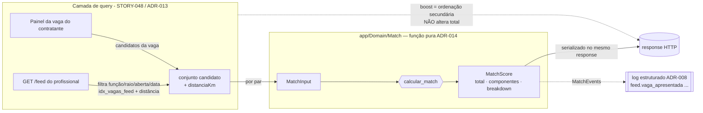

# ADR-014 — Algoritmo de Match: função pura, cálculo on-demand e eventos de telemetria

## Contexto

A STORY-044 (ADR-013) fechou o **modelo de dados** de Vaga + Candidatura + snapshot. O EPIC-002 agora precisa do **algoritmo de Match** — o pilar "Match IA" prometido na landing. O algoritmo em si já está fixado pelo produto e **não se reabre aqui**: `docs/especificacao/domain/match.md` e `business-rules.md` (seção Match) definem 4 componentes somados com cap em 100 — **Função 40**, **Distância 20**, **Histórico de score 30**, **Nível 10**. O que falta decidir é **arquitetura**, não fórmula: (a) **onde** o score é calculado (on-demand a cada consulta × pré-computado em job × híbrido) sem estourar o **p95 ≤ 800 ms** do feed com **1k vagas** (`non-functional.md`); (b) **onde mora o breakdown** explicável (computado a cada request × persistido em cache); (c) o **contrato** da função e do payload `MatchBreakdown`; (d) os **eventos de telemetria** que `match.md` lista.

As forças que moldam a decisão são as mesmas de sempre no Turni: **time minúsculo**, **fase pré-receita**, **Postgres-first** e **simples é o belo** (princípios #1, #3, #11). O volume real do MVP é modesto e conhecido: ~**1k vagas** abertas e ~**100 profissionais** ativos em homolog. A consequência de errar aqui é concreta e dupla: decisão pró-performance prematura (cache/pré-cálculo) introduz **inconsistência** entre o score que o profissional vê no feed e o que o contratante vê no painel — exatamente o que `match.md` proíbe ("o cálculo é aberto"); decisão ingênua de performance mata o **p95** do feed.

Há duas restrições herdadas que esta ADR consome sem reabrir. **ADR-008** já fixou o canal de telemetria do MVP: **log JSON estruturado em stdout → Cloud Logging**, com o campo `event` nomeando o acontecimento e `context` carregando o payload — **não há tabela de eventos** no MVP. **ADR-013** já entregou o índice `idx_vagas_feed (funcao_id, data_inicio) WHERE estado='aberta'` e a query candidata do feed (`EXPLAIN` 0,042 ms / 1k vagas): a **filtragem e a distância geográfica** acontecem na **camada de query**, não no cálculo do score. A presente ADR descreve o que roda **depois** que a query devolveu o conjunto candidato de vagas.

Esta é uma ADR de **contrato + estratégia de cálculo** (não de persistência nova nem de stack). Ela fixa o contrato da função e dos eventos, e a política de "calcular agora, não cachear"; a query SQL do feed (STORY-048) e a UI do breakdown (STORY-049) ficam fora.

## Forças (drivers) da decisão

- **F1 — Consistência do score (princípio do domínio "cálculo aberto", `match.md`):** peso **alto**. O score visto pelo profissional e pelo contratante para o mesmo par tem que ser **idêntico**, sempre derivado dos dados correntes. Qualquer cache abre janela de divergência.
- **F2 — p95 ≤ 800 ms no feed (`non-functional.md`):** peso **alto**. O cálculo não pode ser o gargalo do feed com 1k vagas.
- **F3 — Simplicidade / time minúsculo (princípios #1, #5):** peso **alto**. Nada de job de pré-cálculo, fila de invalidação ou tabela de cache sem dor real comprovada.
- **F4 — Testabilidade e determinismo (princípio #10, `quality-standards.md` — núcleo ≥ 98%):** peso **alto**. O coração de regra de negócio precisa ser **função pura** — sem banco, sem relógio — para cobrir 100% dos ramos sem heroísmo.
- **F5 — Refinabilidade futura (telemetria, `match.md` "Lacunas conhecidas"):** peso **médio**. Os eventos precisam existir desde já para alimentar o ajuste do algoritmo na onda 2, mesmo que ninguém os consuma ainda.
- **F6 — Custo / Postgres-first (princípios #3, #11):** peso **médio**. Sem armazenamento novo, sem peça móvel nova, dentro do que ADR-008/ADR-013 já montaram.
- **F7 — Reversibilidade (princípio #7):** peso **médio**. Se o volume crescer, dá para introduzir cache **depois** sem reescrever o algoritmo — desde que o cálculo nasça isolado atrás de um contrato.

## Opções consideradas

A fórmula é dada; o que se escolhe é a **estratégia de cálculo** (onde/quando o score roda e se há cache).

### Opção A — On-demand, sem cache, função pura atrás de contrato — **escolhida**

- **Resumo:** O score é calculado **no momento da consulta** — no `GET /feed` do profissional e no painel da vaga do contratante — para o conjunto de vagas/candidatos que a **query já filtrou** (ADR-013). O resultado (`total` + `componentes` + `breakdown`) é **serializado no mesmo response**. **Não há tabela de cache** nem job de pré-cálculo. O núcleo é uma **função pura** `calcular_match` (sem banco, sem relógio) num módulo isolado `app/Domain/Match/`, chamada em loop sobre o conjunto candidato.
- **Como atende aos princípios:**
  - ✅ **Consistência (F1):** uma única fonte — sempre os dados correntes. Profissional e contratante chamam a **mesma** função pura; impossível divergir.
  - ✅ **Simplicidade (F3, #1):** zero peça nova — nem tabela, nem fila de invalidação, nem job agendado.
  - ✅ **Testabilidade (F4, #10):** função pura → 100% dos ramos cobertos com entradas explícitas; benchmark isola o custo.
  - ✅ **Custo/Postgres-first (F6, #3):** nenhum armazenamento novo.
  - ✅ **Reversibilidade (F7):** o cálculo nasce atrás de um contrato; cache vira **decorator** futuro sem tocar a regra.
- **Prós concretos:** consistência por construção; nada para invalidar; cabe no p95 com folga (benchmark CA-7 prova ≤ 200 ms para 1k vagas, gate de CI em 500 ms); núcleo testável a 98%+.
- **Contras concretos:** recalcula a cada request — desperdício *teórico* se a mesma combinação for pedida muitas vezes. No volume do MVP (1k vagas × ~100 profissionais, score barato) o desperdício é irrelevante; registrado como sinal de revisão.

### Opção B — Pré-computado em job (tabela `match_scores`)

- **Resumo:** Um job recalcula e persiste o score de cada par profissional×vaga numa tabela; feed e painel leem a tabela.
- **Como atende aos princípios:** ⚠️ leitura O(1); ❌ **Consistência (F1):** a tabela fica **velha** entre execuções — score do profissional muda (novo turno, nova avaliação, mudança de nível), vaga é editada (PDR-009 dispara snapshot) ou o raio muda, e o cache diverge até o próximo job; ❌ **Simplicidade (F3):** introduz tabela + job agendado + **lógica de invalidação** disparada por N gatilhos (avaliação, XP, edição de vaga, mudança de raio) — exatamente a complexidade que o princípio #1 desqualifica sem dor real; ❌ **Custo (F6):** ~100 × 1k = **100k linhas** girando para servir ~100 profissionais.
- **Razão de não ser a escolhida:** paga complexidade e risco de inconsistência **adiantado**, contra um problema de performance que **não temos** no volume do MVP. Reabrível por evolução quando o volume justificar (sinal de revisão abaixo).

### Opção C — Híbrido (cache com TTL curto + cálculo on-demand no miss)

- **Resumo:** Calcula on-demand e guarda em cache (Redis/tabela) com TTL curto; serve do cache enquanto quente.
- **Como atende aos princípios:** ⚠️ alivia recomputação; ❌ **Postgres-first/Custo (F6, #3):** Redis seria **peça nova** proibida sem números (princípio #3); ❌ **Consistência (F1):** TTL = janela de divergência, pequena mas real; ❌ **Simplicidade (F3):** chave de cache, invalidação e TTL para um custo de cálculo que o benchmark mostra ser **trivial**.
- **Razão de não ser a escolhida:** resolve um gargalo inexistente adicionando peça e janela de inconsistência. É a evolução natural **se e quando** A não bastar.

### Opção D — Status quo (sem algoritmo)

- **Consequência se mantivermos:** não há feed ranqueado nem painel ordenado — o entregável central do EPIC-002 não existe.
- **Custo de adiar:** bloqueia STORY-048/049/051. Descartada.

## Matriz comparativa

| Critério (força) | Peso | A — On-demand s/ cache | B — Pré-computado (job) | C — Híbrido (TTL) |
|---|---|---|---|---|
| F1 — Consistência do score | alto | ✅ idêntico por construção | ❌ janela de staleness | ⚠️ janela = TTL |
| F2 — p95 ≤ 800 ms | alto | ✅ ≤ 200 ms / 1k (CA-7) | ✅ leitura O(1) | ✅ |
| F3 — Simplicidade / time pequeno | alto | ✅ zero peça nova | ❌ tabela + job + invalidação | ❌ cache + invalidação |
| F4 — Testabilidade / determinismo | alto | ✅ função pura, 98%+ | ⚠️ idem núcleo, + infra de job | ✅ núcleo + camada cache |
| F6 — Custo / Postgres-first | médio | ✅ nada novo | ❌ 100k linhas girando | ❌ Redis (peça nova) |
| F7 — Reversibilidade | médio | ✅ cache vira decorator depois | ⚠️ difícil desfazer tabela/job | ⚠️ |

> A Opção A vence por **eliminar a inconsistência por construção** (F1) e **não adicionar nenhuma peça móvel** (F3/F6), enquanto o benchmark (CA-7) prova que performance **não é problema** no volume do MVP — então B e C otimizam um gargalo que não existe, ao custo de complexidade e divergência. E A é a mais reversível: o cálculo nasce atrás de um contrato, então cache vira um *decorator* futuro sem tocar a regra.

## Decisão proposta

> **Optamos pela Opção A.**

O Match do Turni é **calculado on-demand, sem cache**, por uma **função pura** isolada, e seus eventos são emitidos como **log estruturado** (ADR-008). Concretamente:

### Decisão 1 — Estratégia: on-demand, sem cache (CA-1)

O score é calculado **no momento da consulta** — `GET /feed` do profissional e painel da vaga do contratante — apenas sobre o **conjunto já filtrado pela query** (ADR-013: filtro por função/raio/`aberta`/data futura). O `total`, os `componentes` e o `breakdown` são **serializados no mesmo response**. **Não há tabela de cache nem job de pré-cálculo.** Justificativa de volume: ~1k vagas × ~100 profissionais ativos, com um cálculo de 4 somas por par — o benchmark (Decisão 5) prova que isso cabe no p95 com folga, então cache só adicionaria inconsistência e peça nova sem ganho real.

### Decisão 2 — Contrato da função pura `calcular_match` (CA-2, CA-4)

Núcleo no módulo isolado **`app/Domain/Match/`** (coesão alta, acoplamento baixo — princípio #5), **sem dependência de Eloquent, banco ou relógio**. Contrato:

```
calcular_match(MatchInput $input): MatchScore
```

- **`MatchInput`** — value object montado pelo *caller* a partir das entidades de domínio (ProfissionalProfile + Vaga) e da **distância já computada pela query** (ver nota geográfica abaixo). Campos explícitos: `funcaoPrimariaVagaId`, `funcaoPrimariaProfId`, `funcoesSecundariasProfIds[]`, `distanciaKm` (`?float`), `raioMaxKm` (`int`), `scoreHistorico` (`?float`, 0–5★), `turnosRealizados` (`int`), `nivel` (`NivelProfissional`). Tudo derivado de dados que a entidade já carrega — nada lido de banco dentro do cálculo.
- **`MatchScore`** — value object de saída: `total: int`, `componentes: { funcao: int, distancia: int, historico: int, nivel: int }`, `breakdown: { funcao: BreakdownItem, distancia: BreakdownItem, historico: BreakdownItem, nivel: BreakdownItem }`.
- **`BreakdownItem`** — `pontos: int`, `pontos_max: int`, `estado: EstadoComponente`, `descricao: string`.
- **`EstadoComponente`** — enum `ok | partial | miss`.

Para honrar a assinatura `calcular_match(profissional, vaga)` que a estória cita, o módulo expõe também um **facade fino** `MatchCalculator::paraEntidades(ProfissionalProfile $p, Vaga $v, ?float $distanciaKm): MatchScore` que monta o `MatchInput` e delega à função pura. A regra de negócio vive **só** na função pura; o facade é cola sem lógica.

**Fórmula (de `match.md` / `business-rules.md` — não reaberta):**

| Componente | Máx | Regra | Estado |
|---|---|---|---|
| **Função** | 40 | 40 se função primária do prof == função da vaga; **25** se uma secundária bate; 0 senão | `ok` / `partial` / `miss` |
| **Distância** | 20 | 20 se `distanciaKm ≤ raioMaxKm`; 0 senão (ou `distanciaKm == null`) | `ok` / `miss` |
| **Histórico** | 30 | `turnosRealizados == 0` → 0; senão `round(clamp(scoreHistorico − 4.0, 0, 1.0) × 30)` | `ok` se 30 · `partial` se 1–29 · `miss` se 0 |
| **Nível** | 10 | Iniciante 0 · Confiável 3 · Destaque 6 · Elite 10 | `ok` se 10 · `partial` se 3/6 · `miss` se 0 |

**Cap (CA-3):** cada componente é clampado ao seu máximo **e** o `total` é clampado a **100** dentro do construtor de `MatchScore` (invariante defensiva). Com os pesos canônicos o máximo teórico é exatamente 40+20+30+10 = 100, então o cap raramente dispara em produção — por isso o teste do cap injeta **componentes sintéticos somando 110** direto no value object para exercer o clamp (a regra de negócio garante ≤ 100; o cap protege contra futura mudança de pesos e contra erro de arredondamento).

**Nota geográfica (decisão do arquiteto):** a distância **não** é computada dentro da função pura — a **query do feed já a calcula** (bbox/Haversine na camada de dados, ADR-013) para filtrar por raio, e o painel do contratante a calcula uma vez por candidato. Recomputar Haversine dentro do cálculo seria duplicar trabalho e, pior, exigiria ler/relê coordenadas (quebrando a pureza). Então `distanciaKm` entra **explícita** no `MatchInput`. Persistir `lat/lng` do profissional (hoje há `cidade/bairro` e `raio_max_km`, falta geocodificação) é **pré-requisito de STORY-048** (camada de query), não desta estória — aqui as factories de teste fornecem a distância diretamente. `raioMaxKm` é parâmetro do profissional (já em entidade), satisfazendo CA-4.

### Decisão 3 — Boost de plano não afeta o score (CA-5)

O **boost de plano** (Turni Ads / Turnificado) é de **visibilidade no ranking**, não de score (`match.md`). Portanto **não entra na função pura nem no `total`** — é aplicado na **camada de query** (STORY-048) como **ordenação secundária**: `ORDER BY score_match DESC, boost_plano DESC, …`. O modelo `ProfissionalProfile` ainda **não modela planos**; o acessor de boost é um **stub que retorna `null`**, e o feed trata `null` como "sem boost". Registrado: score reflete fit objetivo; boost reflete escolha comercial — separação proposital do domínio.

### Decisão 4 — Eventos de telemetria por log estruturado (CA-6)

Os eventos são emitidos como **log JSON estruturado** (ADR-008: campo `event` nomeia, `context` carrega o payload), **sem tabela própria** no MVP. Helper **`app/Support/Telemetry/MatchEvents.php`** expõe os 4 métodos abaixo; cada um escreve uma linha de log `severity: INFO`, `service: api`, com PII mascarada pelo formatter de ADR-008. **Nomes exatos** (notação com ponto, conforme CA-6) e **payload mínimo fixado**:

| `event` | Quando | `context` (payload mínimo) |
|---|---|---|
| `feed.vaga_apresentada` | vaga entrou no feed do profissional com um score | `vaga_id`, `profissional_id`, `score_total`, `componentes{funcao,distancia,historico,nivel}` |
| `feed.vaga_filtrada` | vaga ficou de fora pelo filtro | `vaga_id`, `profissional_id`, `motivo_filtro` ∈ `funcao_fora \| fora_raio \| conflito_horario \| gate_avaliacao` |
| `match.candidatura_enviada` | profissional se candidatou; score do momento | `vaga_id`, `profissional_id`, `candidatura_id`, `score_total`, `componentes` |
| `match.candidatura_aprovada` | contratante aprovou; score do momento | `vaga_id`, `profissional_id`, `candidatura_id`, `score_total`, `componentes` |

> Nota: `match.md` grafa esses eventos com dois-pontos (`feed:vaga_apresentada`); a forma canônica de implementação é a com **ponto** (`feed.vaga_apresentada`), que CA-6 fixa e casa com o namespacing de `event` do ADR-008. A divergência é só de notação; o significado é o mesmo.

A integração é testada **capturando o log** (`Log::fake()` / handler de teste) e asseverando `event` + `context`. Persistir esses eventos como métricas reais no Cloud Monitoring (log-based metrics) é trabalho de épico posterior (EPIC-003+), fora daqui — esta ADR fixa o **contrato do evento**, não o dashboard.

### Decisão 5 — Benchmark de guarda no CI (CA-7)

`tests/Performance/MatchBenchmarkTest.php` roda `calcular_match` em loop sobre **1k vagas** e assevera **≤ 500 ms** (folga 2,5× sobre o alvo de 200 ms). Marcado para o **CI** (grupo `performance`), **fora do pré-commit** — garante que a função em si nunca vira gargalo do feed, sem onerar o ciclo local. Não é o tempo do feed inteiro (query + serialização ficam em STORY-048), só do cálculo.

### Decisão 6 — Fora de escopo, explícito (CA-8)

Permanecem como **"Lacunas conhecidas"** de `match.md`, **fora do MVP**: distância como **decay contínuo** (hoje binária dentro/fora do raio); **afinidade histórica** (par prof×estabelecimento); **penalização por padrões ruins** (cancelamento/no-show — depende do motor de PDR-007); **cold start** do Iniciante (hoje 0 em histórico com 0 turnos); e **A/B testing** do algoritmo. Todos reabríveis por evolução; nada nesta ADR os impede.

## Justificativa

A Opção A é a única que **elimina a inconsistência por construção** (F1) — profissional e contratante chamam a mesma função pura sobre os mesmos dados correntes, sem janela de staleness — e o faz **sem adicionar nenhuma peça móvel** (F3/F6): nem tabela, nem job, nem Redis, nem lógica de invalidação. O argumento de performance que normalmente justificaria pré-cálculo (B) ou cache (C) **não se aplica** no volume do MVP, e o benchmark da Decisão 5 transforma isso de afirmação em **gate de CI**. O preço honesto de A é recalcular a cada request — desperdício real, porém irrelevante no volume atual e barato de reverter: como o cálculo nasce **puro e atrás de um contrato** (`MatchInput`/`MatchScore`), introduzir cache no futuro é envolver o `MatchCalculator` num *decorator*, sem tocar a regra de negócio. Os eventos reusam o canal que ADR-008 já montou (log estruturado), cumprindo a refinabilidade (F5) a custo zero de infraestrutura nova. E a separação **score (função pura) × boost (camada de query)** mantém o domínio fiel ao princípio do "cálculo aberto" de `match.md`.

## Diagrama



## Consequências

### Positivas (o que ganhamos)
- **Consistência garantida** entre feed e painel — mesma função, mesmos dados, zero janela de divergência (F1, fiel a `match.md`).
- **Nenhuma peça nova** — sem tabela de cache, sem job, sem Redis; só uma função pura e um helper de log (F3/F6).
- **Núcleo testável a 98%+** com entradas explícitas, e um benchmark que vira **gate de CI** contra regressão de performance (F4).
- **Telemetria desde o dia 1** reusando ADR-008, alimentando o refino do algoritmo na onda 2 (F5).
- **Reversível:** cache futuro entra como decorator sem reescrever a regra (F7).

### Negativas / trade-offs aceitos
- **Recálculo a cada request** — desperdício real, aceitável no volume do MVP; registrado como sinal de revisão.
- **Distância vem de fora** da função pura (`MatchInput.distanciaKm`) — exige que a camada de query (STORY-048) calcule e injete a distância, e que o profissional ganhe `lat/lng` lá; a pureza é preservada ao custo de um acoplamento de contrato com o caller.
- **Eventos só em log** (sem tabela) — consultá-los é via Cloud Logging, não SQL; suficiente para o MVP, alinhado a ADR-008.

### Neutras
- Notação de evento muda de `:` (em `match.md`) para `.` (canônico, CA-6) — só grafia.
- O boost de plano fica modelado como stub `null` até o épico de monetização — o feed já trata a ausência.

### Para o time
- **Impacto em estórias existentes:** destrava **STORY-048** (feed consome a função e injeta `distanciaKm`; precisa persistir geo do profissional e aplicar boost na ordenação), **STORY-049** (UI usa o `breakdown`), **STORY-051** (painel do contratante ordena por score), **STORY-050** (persiste `score_no_momento` na candidatura usando esta função). 
- **ADRs/PDRs relacionados:** consome **ADR-008** (canal de eventos) e **ADR-013** (query/índice/distância); cruza **PDR-009** (edição material muda a vaga → próximo cálculo on-demand já reflete, sem invalidação — vantagem da Opção A).
- **Necessidade de spike de validação:** **não** — a própria materialização da função pura + benchmark nesta estória é a validação empírica.

## Plano de verificação

- **Como verificar conformidade:**
  - Testes unitários do módulo `Match` cobrem **100% dos ramos** da tabela (`match.md`/`business-rules.md`): função primária bate / secundária bate / não bate; dentro / fora do raio; histórico 4.0★/4.5★/5.0★/sem histórico (0 turnos); nível Iniciante/Confiável/Destaque/Elite; **cap em 100** (componentes sintéticos somando 110). Cobertura do módulo **≥ 98%**.
  - Função **pura/determinística**: teste que a executa duas vezes com a mesma entrada e compara saída; ausência de import de Eloquent/`now()`/DB no módulo (verificável por teste de arquitetura/grep).
  - `MatchEvents` emite os **4 eventos** com `event` e `context` exatos — teste com `Log::fake()`.
  - **Benchmark** verde no CI (≤ 500 ms / 1k vagas), no grupo `performance` fora do pré-commit.
- **Sinais de revisão (quando reabrir esta decisão):**
  - **p95 do feed > 800 ms** (`non-functional.md`) atribuível ao cálculo → considerar Opção C (cache/decorator).
  - **Volume** ultrapassa ~10k vagas abertas **ou** ~1k profissionais ativos simultâneos → reavaliar on-demand.
  - Necessidade de **rankear offline** (notificações push proativas a fit alto, SLA de match `business-rules.md`) → pode justificar pré-cálculo parcial (Opção B) para esse caminho específico.
- **Spike de validação proposto:** nenhum — esta estória já materializa a função e o benchmark.

---

## Aprovação humana

> Esta seção é o registro formal do aceite. Não preencher sozinho — preencher quando o humano aprovar no chat ou via PR.

- **Status final:** ✅ aceita
- **Aprovado por:** Alexandro
- **Data:** 2026-06-02
- **Forma do aceite:** aprovado em chat (sessão de 2026-06-02)
- **Condicionantes do aceite:** nenhuma.

### Em caso de rejeição
- **Motivo:** ...
- **Próximos passos sugeridos:** ...

### Em caso de superseding
- **Substituída por:** ADR-YYY
- **Razão da substituição:** ...

---

## Histórico

- 2026-06-02 — criada como `proposed` por Arquiteto (STORY-045). Estratégia on-demand sem cache; função pura `calcular_match` em `app/Domain/Match/` com `MatchInput`/`MatchScore`/`BreakdownItem`; boost fora do score (camada de query); 4 eventos de telemetria por log estruturado (ADR-008) via `MatchEvents`; benchmark de guarda no CI; lacunas de `match.md` fora do MVP. Aguardando aprovação do PO.
- 2026-06-02 — `accepted` por Alexandro (aprovação em chat). Destrava a materialização do módulo `app/Domain/Match` (Programador).
