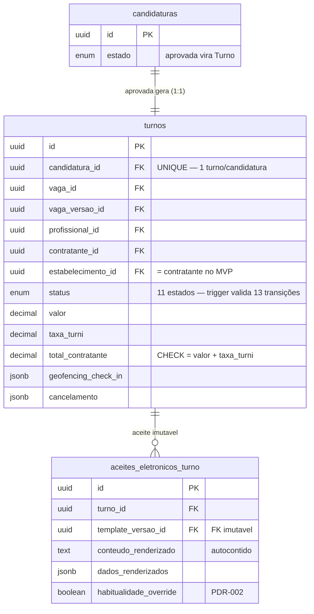
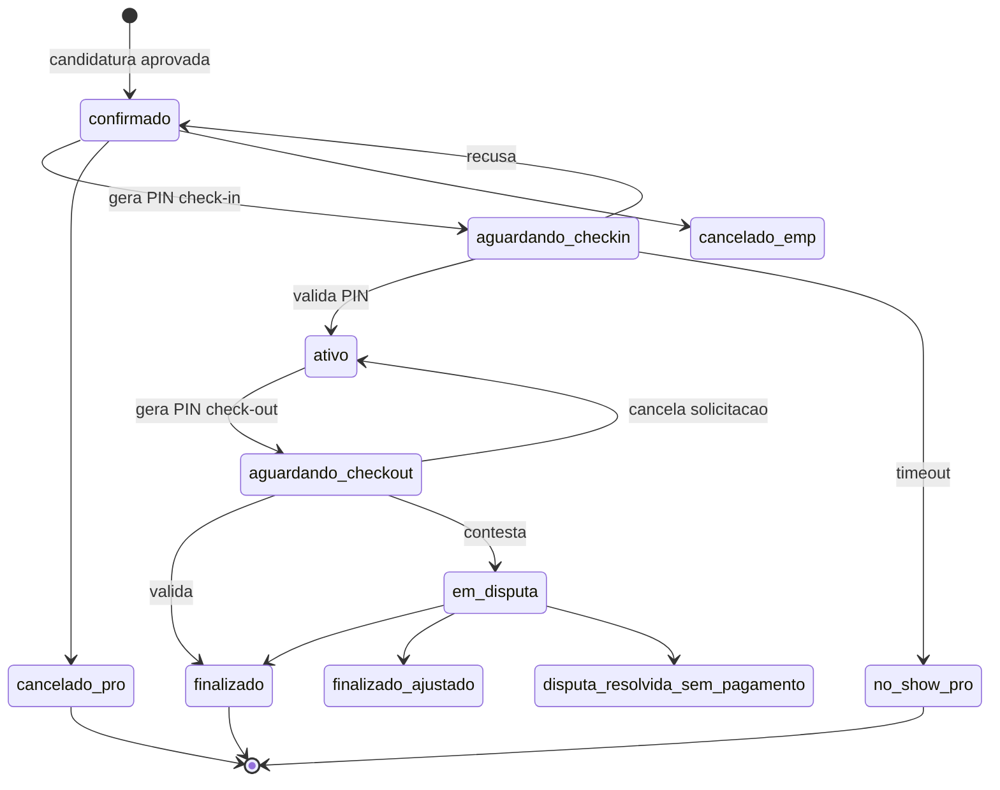

# ADR-015 — Modelo Turno + AceiteEletronicoTurno imutável + máquina de estados como invariante de banco

## Contexto

O EPIC-002 fechou o **primeiro encontro** (vaga → feed → candidatura → painel de candidatos), com o modelo Vaga/Candidatura/snapshot fixado em **ADR-013**. O EPIC-003 entrega o **ciclo do turno** — o coração da promessa pública do Turni: aceite → pré-autorização → PIN bilateral de check-in → `ativo` com cronômetro → PIN de check-out → captura → Pix. Para isso existir, o banco precisa de **Turno** com máquina de estados explícita e de um **AceiteEletronico por turno** imutável (espelhando o que ADR-010 fez para a adesão do usuário no EPIC-001, mas agora por turno e com a cláusula adicional de override de habitualidade PJ — PDR-002).

Sem este modelo fixado em ADR, cada estória de implementação (STORY-058..067) inventaria o seu schema e o épico ficaria sem referência arquitetural coerente — e, pior, sem a garantia de que `confirmado → ativo → finalizado` seja sempre coerente (dois check-outs no mesmo turno, AceiteEletronico editado depois, salto de estados). A garantia jurídica e operacional do produto vive aqui.

As restrições que chegam consolidadas:

- **`domain/turno.md`** — Turno é a unidade central. Máquina de estados de **11 estados** com o caminho feliz linear `confirmado → aguardando_checkin → ativo → aguardando_checkout → finalizado`, mais ramos ortogonais (cancelamento a partir de `confirmado`, `no_show_pro` por timeout, disputa a partir de `aguardando_checkout`). Atributos financeiros congelados no aceite (`valor`, `taxa_turni`, `total_contratante`), timestamps de check-in/out, geofencing por evento, cancelamento.
- **`domain/compliance.md` §"Aceite eletrônico por turno"** — a cada criação de turno o sistema gera um documento de aceite com identificação completa, modelo contratual conforme o tipo de pessoa (PF/MEI/PJ), valores, cláusula de natureza eventual, timestamp, IP, fingerprint e — quando 3ª alocação semanal de PJ com override — **cláusula adicional** de aceite de risco. Aponta para a `TemplateVersao` vigente no momento; imutável após criação.
- **`domain/pagamento.md`** (PDR-004) — `total_contratante = valor + taxa_turni` (taxa 15% no MVP); pré-autoriza em `confirmado`, captura em `finalizado`, libera em cancelamento/`no_show_pro`.
- **PDR-002 / ADR-006** — habitualidade: 2 alocações/semana corrida por par profissional × estabelecimento; a **tabela-alvo** do índice composto de ADR-006 é o **turno**, e ela passa a existir aqui (CA-5).
- **PDR-007** — cancelamento permitido **apenas** em `confirmado`; `no_show_pro` por timeout; versão mínima sem motor de penalidade.
- **PDR-008** — geofencing alerta-e-registra (não bloqueia); o evento de check-in carrega flag + distância.
- **ADR-009** — padrão de modelagem (FK constrained, dados sensíveis Encrypted, imutabilidade por trigger + REVOKE no role de runtime). **Não reabrimos nada.**
- **ADR-010** — imutabilidade do AceiteEletronico (trigger `BEFORE UPDATE OR DELETE → RAISE EXCEPTION` + REVOKE). Mesmo padrão se aplica ao aceite por turno. ADR-010 §Decisão 4 chegou a antecipar `ALTER TABLE aceites_eletronicos ADD COLUMN turno_id` para o EPIC-003 — esta ADR **revê esse hint** (Decisão 3).
- **ADR-013** — modelo Vaga/Candidatura; o Turno **consome** uma `Candidatura` aprovada. ADR-013 §Decisão 2 pôs as transições de Vaga/Candidatura **na camada de domínio** (enum nativo só restringe valores; trigger só para imutabilidade). Esta ADR **diverge conscientemente** para o Turno (Decisão 2) por mandato do CA-4.
- **ADR-018** — UUIDv7 em PKs/FKs de domínio, `uuid` nativo no Postgres, gerado na aplicação. **Correção empírica de ADR-018 (STORY-069):** o trait first-class é **`HasUuids`** (não `HasVersion7Uuids`, inexistente no Laravel instalado) — e ele **já gera UUIDv7** por padrão. A STORY-055 cita `HasVersion7Uuids` em CA-2/CA-3; lê-se **`HasUuids`**.

## Forças (drivers) da decisão

- **F1 — Coerência com o padrão de modelagem (ADR-009/010/013/018):** PK/FK uuid, FK constrained, imutabilidade por trigger + REVOKE, enum nativo de estado. Divergir sem motivo gera incoerência estrutural cara. Peso: **alto**.
- **F2 — Máquina de estados à prova de SQL cru (CA-4):** "nunca dois check-outs", "nunca pular de `confirmado` para `finalizado`" é garantia jurídica/operacional do produto. Precisa valer **mecanicamente no banco**, não só por disciplina de código. Peso: **alto**.
- **F3 — Aceite por turno fiel e inviolável (compliance.md):** o aceite é prova jurídica do que foi exibido e aceito naquele turno (incluindo a cláusula de override PJ). Imutabilidade garantida no banco. Peso: **alto**.
- **F4 — Habitualidade performática no caminho de aceite (ADR-006):** a contagem por par × semana entra no fluxo de aprovação; o índice composto precisa sustentar o range scan estreito. Peso: **médio-alto**.
- **F5 — Invariantes no banco (princípio #9):** consistência financeira (`total = valor + taxa`), ordem de datas, 1 turno por candidatura — garantidas mecanicamente. Peso: **médio-alto**.
- **F6 — Transições testáveis e evolutivas (princípio #10):** a máquina de estados cresce (disputa no EPIC-005). Precisa ser fácil de testar (TDD) e evoluir. Peso: **médio**.
- **F7 — Reversibilidade da migração (F-NB-1):** `up()`/`down()` simétricos; rollback limpo. Peso: **médio**.

---

## Decisão 1 — Schema do `Turno` e a referência ao estabelecimento

### Decisão

Tabela `turnos` com PK `uuid` (`HasUuids`/ADR-018) e as colunas de CA-2. Estados em **enum nativo** `turno_status` (CA-2), coerente com ADR-013 (`vaga_estado`/`candidatura_estado`). Financeiro congelado no aceite; geofencing e cancelamento em `jsonb`.

**Referência ao estabelecimento (ponto que exigia decisão).** Não existe entidade `Estabelecimento` separada no MVP — o estabelecimento **é o contratante** (`contratante_profiles` é 1:1 com `users`), e essa convenção já está codificada no `GateHabitualidade` (STORY-050): *"no MVP, estabelecimento = `contratante_id` da vaga"*. Honramos a convenção **e** materializamos `estabelecimento_id` como **coluna separada** (FK → `users`), igual a `contratante_id` no MVP, por três razões: (a) honra literalmente o **par de habitualidade** de ADR-006/PDR-002 `(estabelecimento, profissional)`; (b) deixa o índice composto de CA-5 exatamente como ADR-006 especificou; (c) prepara multi-unidade (rede com N estabelecimentos — `compliance.md` §lacunas) sem migração destrutiva.

**Invariantes duras no banco (Decisão 5/CA-2):** `CHECK (total_contratante = valor + taxa_turni)` (a regra dos 15% vive no domínio, não na constraint), `CHECK (valor >= 0 AND taxa_turni >= 0)`, `CHECK (data_fim > data_inicio)`, `UNIQUE (candidatura_id)` (1 turno por candidatura aprovada).

### Tabela `turnos`

| Coluna | Tipo | Constraint / nota |
|---|---|---|
| `id` | uuid PK | `HasUuids` (UUIDv7), gerado na aplicação |
| `candidatura_id` | uuid FK → `candidaturas` | `restrictOnDelete`; `UNIQUE` — 1 turno/candidatura |
| `vaga_id` | uuid FK → `vagas` | `restrictOnDelete` |
| `vaga_versao_id` | uuid FK → `vaga_versoes` nullable | versão vigente no aceite (snapshot PDR-009) |
| `profissional_id` | uuid FK → `users` | `restrictOnDelete` |
| `contratante_id` | uuid FK → `users` | `restrictOnDelete` |
| `estabelecimento_id` | uuid FK → `users` | `restrictOnDelete`; = `contratante_id` no MVP |
| `status` | `turno_status` default `'confirmado'` | enum nativo (11 estados) |
| `valor` | decimal(10,2) | o que o profissional recebe |
| `taxa_turni` | decimal(10,2) | taxa do contratante (15% MVP) |
| `total_contratante` | decimal(10,2) | `CHECK (= valor + taxa_turni)`; pré-autorizado |
| `data_inicio` / `data_fim` | timestamptz | `CHECK (data_fim > data_inicio)` |
| `check_in_at` / `check_out_at` | timestamptz nullable | carimbados nas transições |
| `geofencing_check_in` / `geofencing_check_out` | jsonb nullable | `{ ok, distancia_metros, capturado_em, razao? }` (PDR-008) |
| `cancelamento` | jsonb nullable | `{ lado, motivo?, antecedencia_horas, em }` (PDR-007) |
| `created_at` / `updated_at` | timestamptz | UTC; UI delega a IDR-026 |

Model `Turno` (`app/Models/Turno.php`) com `HasUuids`; cast de `status` para o enum PHP `TurnoStatus`.

---

## Decisão 2 — Máquina de estados como **invariante de banco** (divergência consciente de ADR-013)

### Opção 2A — Trigger Postgres valida as transições + enum PHP espelha (escolhida)

- **Resumo:** o tipo enum nativo `turno_status` garante o **conjunto** de valores. As **transições** válidas são guardadas em **duas camadas**: (1) um trigger `BEFORE UPDATE` `enforce_turno_transition` que valida `OLD.status → NEW.status` contra a matriz das 13 transições e levanta exceção em qualquer par não listado (a garantia **dura**, à prova de SQL cru — CA-4); (2) o enum PHP `TurnoStatus::canTransitionTo()` que espelha a mesma matriz, usado por `Turno::transitionTo()` para falhar cedo (`DomainException`) e carimbar timestamps. As duas camadas devem concordar; divergência é bug coberto por teste.
- **Por que diverge de ADR-013 Decisão 2:** lá as transições ficaram **só** no domínio (trigger reservado a imutabilidade) porque a garantia jurídica de Vaga/Candidatura era mais branda. Aqui o CA-4 é explícito: a máquina de estados do turno deve ser **invariante de banco**. A defensibilidade do produto ("impossível pular para `finalizado`", "impossível dois check-outs") não pode depender de todo acesso passar pelo domínio. Defesa em profundidade: trigger (dura) + enum (ergonômica).
- **Como atende aos princípios:** ✅ Postgres-first (3) — `plpgsql` nativo; ✅ Fail-secure (F2) — trigger barra mesmo SQL cru; ✅ TDD (10/F6) — a matriz vive também no enum, testável puro; ✅ Reversível (7) — `DROP TRIGGER`/`DROP FUNCTION` no `down()`.
- **Contra:** a matriz existe em dois lugares (trigger + enum). Mitigação: um teste percorre as 13 válidas pelo trigger e o enum tem teste exaustivo; a contagem "exatamente 13" trava divergências.

### Opção 2B — Só no domínio (como ADR-013)
- **Contra:** viola o CA-4 (mandato explícito de invariante de banco). Descartada por mandato do PO.

### Opção 2C — Só trigger (sem enum espelho)
- **Contra:** perde a ergonomia e a testabilidade pura da transição no domínio; `transitionTo` teria que descobrir validade só batendo no banco (exceção tardia). A camada ergonômica vale o custo.

### Decisão 2 — **Opção 2A.** Trigger é a invariante dura (CA-4); enum PHP espelha para domínio/testes.

### As 13 transições válidas (domain/turno.md)

```
confirmado          → aguardando_checkin        (profissional gera PIN check-in)
confirmado          → cancelado_pro             (profissional cancela — PDR-007)
confirmado          → cancelado_emp             (contratante cancela — PDR-007)
aguardando_checkin  → ativo                     (contratante valida o PIN)
aguardando_checkin  → confirmado                (contratante recusa; pro gera novo PIN)
aguardando_checkin  → no_show_pro               (timeout sem check-in — Decisão 6)
ativo               → aguardando_checkout       (profissional gera PIN check-out)
aguardando_checkout → finalizado                (contratante valida; captura + Pix)
aguardando_checkout → em_disputa                (contratante contesta — EPIC-005)
aguardando_checkout → ativo                     (profissional cancela a solicitação)
em_disputa          → finalizado                (admin resolve: paga integral)
em_disputa          → finalizado_ajustado       (admin resolve: paga parcial)
em_disputa          → disputa_resolvida_sem_pagamento (admin resolve: sem pagamento)
```

Terminais (sem saída): `finalizado`, `finalizado_ajustado`, `disputa_resolvida_sem_pagamento`, `cancelado_pro`, `cancelado_emp`, `no_show_pro`. As 3 transições a partir de `em_disputa` e a entrada `aguardando_checkout → em_disputa` são **modeladas** (estados e trigger as aceitam) mas **não implementadas na W28** — a disputa é EPIC-005/PDR-006. Modelá-las agora evita uma migração de `ALTER TYPE` depois.

---

## Decisão 3 — `AceiteEletronicoTurno` como tabela **separada** (revê o hint de ADR-010)

### Decisão

Tabela própria `aceites_eletronicos_turno`, **separada** de `aceites_eletronicos` (aceite de adesão do usuário, EPIC-001). ADR-010 §Decisão 4 antecipou `ALTER TABLE aceites_eletronicos ADD COLUMN turno_id` para o EPIC-003; **revemos** esse hint porque o CA-3 pede explicitamente uma entidade por turno e os dois artefatos são **conceitualmente distintos**:

- O aceite de **adesão** (EPIC-001) é assinado **uma vez** pelo usuário ao completar cadastro; aponta para `user_id`.
- O aceite de **turno** é emitido **a cada aprovação de candidatura**; aponta para `turno_id`, carrega placeholders do turno (`{{turno.valor}}`, `{{turno.data_inicio}}`, …) e a **cláusula de override de habitualidade** (`habitualidade_override` — PDR-002).

Misturar os dois numa só tabela com colunas mutuamente nuláveis (`user_id` XOR `turno_id`, `habitualidade_override` só faz sentido no turno) seria polimorfismo disfarçado, contra o princípio #1. Duas tabelas, cada uma com razão única de existir (princípio #5).

**Convenção de nome (latitude do arquiteto — story §"Liberdade técnica"):** o campo que `compliance.md` chama de `timestamp` vira a coluna **`aceito_em`** — `timestamp` é palavra reservada SQL e `aceito_em` espelha `aceites_eletronicos` (ADR-010).

### Tabela `aceites_eletronicos_turno`

| Coluna | Tipo | Constraint / nota |
|---|---|---|
| `id` | uuid PK | `HasUuids` |
| `turno_id` | uuid FK → `turnos` | `restrictOnDelete` |
| `template_versao_id` | uuid FK → `template_versoes` | **FK imutável** (ADR-010) |
| `conteudo_renderizado` | text | documento integral autocontido |
| `dados_renderizados` | jsonb | mapa placeholder→valor (IDs como string UUID) |
| `aceito_em` | timestamptz default NOW() | `compliance.md` `timestamp` |
| `ip` | inet | |
| `fingerprint` | text | sha256(user_agent:ip:date) — ADR-010 |
| `habitualidade_override` | boolean default false | true na 3ª alocação PJ com override (PDR-002) |

Sem `updated_at`/`created_at`: insert-only. Model `AceiteEletronicoTurno` com `HasUuids`, `UPDATED_AT = CREATED_AT = null`.

---

## Decisão 4 — Imutabilidade do aceite de turno (trigger + REVOKE — padrão ADR-010)

Trigger `prevent_aceite_turno_mutation` (`BEFORE UPDATE OR DELETE → RAISE EXCEPTION`) + `REVOKE UPDATE, DELETE ON aceites_eletronicos_turno FROM <runtime>`. Dupla camada (F3): bug de app não corrompe; trigger removido por acidente, o REVOKE segura.

> **Nota de gotcha herdada (migration 2026_06_03_140000):** o REVOKE de `vaga_versoes` quebrou INSERTs de candidatura em Cloud SQL porque `vaga_versoes` é **tabela-pai** de uma FK e a validação da FK exige privilégio UPDATE. `aceites_eletronicos_turno` **não é referenciada por nenhuma FK** (não é tabela-pai), então o REVOKE de UPDATE/DELETE **não** esbarra nesse lock — seguro. `turnos`, ao contrário, **é** tabela-pai (`aceites_eletronicos_turno.turno_id`), mas `turnos` é mutável (o runtime mantém UPDATE — o trigger de transição é que regula o conteúdo), então também sem problema.

---

## Decisão 5 — Índices (CA-5)

- `idx_turnos_profissional_status` = `(profissional_id, status)` — "Meus turnos" do profissional por estado (STORY-059).
- `idx_turnos_contratante_status` = `(contratante_id, status)` — "Vagas confirmadas" do contratante por estado (STORY-059).
- `idx_turnos_habitualidade` = `(estabelecimento_id, profissional_id, data_inicio)` — o índice composto de **ADR-006** sobre a tabela-alvo (turno). Sustenta a contagem de habitualidade por par × semana corrida no caminho de aceite (range scan estreito sobre `data_inicio`).

`EXPLAIN ANALYZE` do caminho de aceite anexado ao Plano de verificação (Index Only Scan, 0,050 ms).

---

## Decisão 6 — Limite numérico de `no_show_pro` (lacuna de turno.md)

`domain/turno.md` §lacunas pede um spike para "quantas horas após o início previsto sem check-in viram no-show". Esta ADR **não trava** o número (é parâmetro operacional de produto, não de schema): o modelo já suporta a transição `aguardando_checkin → no_show_pro`, disparada por um job de timeout que a **STORY-066** implementará. **Proposta do arquiteto:** tolerância de **2 horas** após `data_inicio` sem check-in validado → `no_show_pro` (alinhado ao princípio de "uso eventual" e a turnos típicos de 6h). O valor exato fica **parametrizável** (config) e a confirmação final é do PO na STORY-066 — não bloqueia este spike.

---

## Decisão proposta (consolidada)

> **O modelo do EPIC-003 acrescenta dois agregados — `turnos` e `aceites_eletronicos_turno` — com PK/FK uuid (ADR-018), estado em enum nativo, máquina de estados de 11 estados / 13 transições garantida por trigger no banco (CA-4) + enum espelho no domínio, aceite por turno imutável (trigger + REVOKE), invariantes financeiras/temporais no banco, e os 3 índices de CA-5 incluindo o composto de habitualidade de ADR-006. Estabelecimento = contratante no MVP, com coluna `estabelecimento_id` separada para o par de habitualidade e multi-unidade futura.**

## Diagrama





## Justificativa

A escolha honra o princípio #4 (frameworks opinativos) usando só mecanismos nativos de Laravel/Postgres, e o #5 (coesão) dando a cada agregado razão única para mudar. A imutabilidade do aceite por turno replica o padrão provado em ADR-010 sem inventar abstração. A divergência de ADR-013 (máquina de estados no banco, não só no domínio) é **mandato do CA-4** e é arquiteturalmente correta para o turno: a defensibilidade jurídica do ciclo não pode depender de todo acesso passar pelo domínio — o trigger barra até SQL cru, e o enum espelho preserva a ergonomia/testabilidade. A tabela de aceite separada (Decisão 3) evita o polimorfismo disfarçado que o `turno_id` em `aceites_eletronicos` traria. O índice de habitualidade materializa ADR-006 sobre a tabela que ela sempre teve como alvo.

## Consequências

### Positivas
- Dois agregados coerentes com ADR-009/010/013/018; nenhuma abstração nova.
- Máquina de estados **inviolável** no banco (CA-4) — impossível pular estados ou dois check-outs, mesmo via SQL cru.
- Aceite por turno fiel e imutável, com a cláusula de override de habitualidade registrada (defensibilidade jurídica PDR-002).
- Habitualidade indexada (Index Only Scan, 0,050 ms) — folga de ordens de grandeza sobre o caminho de aceite.
- Disputa (EPIC-005) já modelada no enum/trigger — nenhuma migração de `ALTER TYPE` depois.

### Negativas / trade-offs aceitos
- A matriz de transições vive em dois lugares (trigger plpgsql + enum PHP). Mitigado por testes (13 válidas pelo trigger; enum exaustivo; "exatamente 13" trava divergência).
- `estabelecimento_id` duplica `contratante_id` no MVP. Aceito: honra ADR-006 e prepara multi-unidade sem custo de migração futura.
- Trigger de transição é lógica de negócio em plpgsql (diverge da postura "trigger só para imutabilidade" de ADR-013). Aceito por mandato do CA-4 e contido (uma matriz declarativa, testada).

### Neutras
- `no_show_pro` numérico não travado aqui (Decisão 6) — parâmetro de produto confirmado na STORY-066.
- Aceite por turno é a 4ª trilha imutável do sistema (admin_audit_log, audit_logs, aceites_eletronicos, aceites_eletronicos_turno) — separação intencional, não redundância.

### Para o time
- **Destrava:** STORY-058 (aceitar candidatura + aceite + pré-autorização), STORY-059/060 (listas/detalhe), STORY-061..065 (PIN/cronômetro/captura), STORY-066 (cancelamento + no_show), STORY-067 (notificações).
- **Artefatos desta estória:** migrations `2026_06_03_150000_create_turnos_table`, `..._150001_create_aceites_eletronicos_turno_table`; models `Turno`, `AceiteEletronicoTurno`; enum `TurnoStatus`; factories; `TurnosSeeder` (11 estados); suíte de testes.
- **Necessidade de spike de validação:** não — mecanismos padrão Laravel/Postgres já usados no projeto. Evidência empírica no Plano de verificação.

## Plano de verificação

- **Conformidade do schema — VERIFICADO:** as 2 migrações criam tabelas/enum/triggers/índices conforme esta ADR; `migrate:fresh` verde (`turni_test`, Postgres 18) em 2026-06-03.
- **Reversibilidade (CA-6 / F-NB-1) — VERIFICADO:** `migrate:rollback --step=2` desfez as 2 migrações na ordem inversa (drop trigger → function → table → type) e `migrate` as reaplicou, sem erro. `turni_test`, 2026-06-03. Procedimento de homolog registrado em `runbook-homolog.md` §6.
- **Máquina de estados como invariante de banco (CA-4) — VERIFICADO:** teste de integração percorre as **13 transições válidas** via SQL cru (todas passam pelo trigger) e rejeita as inválidas (`confirmado→finalizado`, `confirmado→ativo`, `terminal→*`); UPDATE que não muda `status` passa livre. Enum coberto por teste puro exaustivo (núcleo **100%**).
- **Imutabilidade do aceite (CA-3) — VERIFICADO:** `UPDATE`/`DELETE` (SQL e Eloquent) sobre `aceites_eletronicos_turno` lançam exceção do banco.
- **Invariantes (CA-2) — VERIFICADO:** rejeitados `total_contratante ≠ valor + taxa`, `data_fim ≤ data_inicio`, valores negativos, e 2º turno na mesma candidatura.
- **Seeders dos 11 estados (CA-7) — VERIFICADO:** `TurnosSeeder` cria exatamente 1 turno por estado (11) + 1 aceite cada; idempotente; o `confirmado` demonstra override de habitualidade.
- **Microbenchmark de habitualidade (CA-5) — VERIFICADO:** `EXPLAIN (ANALYZE, BUFFERS)` da contagem por `(estabelecimento_id, profissional_id, data_inicio BETWEEN ...)`:
  ```
  Aggregate (actual time=0.029..0.029 rows=1)
    -> Index Only Scan using idx_turnos_habitualidade on turnos (actual time=0.025..0.027 rows=11)
         Index Cond: (estabelecimento_id = ... AND profissional_id = ... AND data_inicio >= ... AND data_inicio <= ...)
  Execution Time: 0.050 ms
  ```
  **Index Only Scan** — o índice cobre o shape inteiro da query. Precedente empírico coerente: ADR-006/STORY-044 mediu 0,042 ms sobre 1.000 linhas com a mesma estratégia de índice composto.
- **Cobertura (CA-8) — VERIFICADO:** suíte completa da `api` **597 testes verdes**, cobertura global **93,4%** (gate ≥80%); núcleo da máquina de estados (`TurnoStatus`) e `Turno`/`TurnosSeeder` em **100%** (gate ≥98% do núcleo). `pint --test` verde.
- **Sinais de revisão (quando reabrir):**
  - Se a disputa (EPIC-005) exigir sub-estados ou transições novas → estender o enum + a matriz do trigger (ADR nova ou emenda).
  - Se multi-estabelecimento (rede) virar requisito → `estabelecimento_id` passa a referenciar uma entidade `Estabelecimento` própria; o índice já está pronto.
  - Se a contagem de habitualidade não sustentar o p95 com volume real → revisar índice/estratégia (precedente ADR-006 dá folga grande).

## Fora de escopo

- Implementação de qualquer caminho de aceite/check-in/check-out — só modelo + migração + seeders (STORY-058+).
- ACL Pagar.me / pré-autorização / captura / idempotência / webhook → STORY-056 / **ADR-016**.
- Tempo real do cronômetro + geolocalização Haversine → STORY-057 / **ADR-017**.
- Motor de penalidade de cancelamento/no-show (PDR-007 guarda só os dados) → futuro.
- Fluxo de disputa (PDR-006) → EPIC-005; aqui só o estado/transições são modelados.
- UI de qualquer tela.

---

## Aprovação humana

> Esta seção é o registro formal do aceite. Não preencher sozinho — preencher quando Alexandro aprovar no chat ou via PR.

- **Status final:** ✅ aceita
- **Aprovado por:** Alexandro
- **Data:** 2026-06-03
- **Forma do aceite:** aprovado em chat (sessão de 2026-06-03 com PO/Claude); três pontos confirmados — (1) máquina de estados como invariante de banco (trigger + enum espelho, CA-4); (2) `aceites_eletronicos_turno` em tabela separada (revê o hint de ADR-010); (3) ADR pronta para `accepted` + commit direto na `main`.
- **Condicionantes do aceite:** nenhuma.

### Em caso de rejeição
- **Motivo:** …
- **Próximos passos sugeridos:** …

---

## Histórico

- 2026-06-03 — `accepted` por Alexandro (aprovação em chat). Três pontos de divergência de ADRs anteriores confirmados explicitamente (máquina de estados no banco; aceite por turno em tabela separada; commit na main). Nenhuma condicionante.
- 2026-06-03 — criada como `proposed` por Arquiteto (STORY-055, claude-opus-4-8-arquiteto-2026-06-03). Cobre: `turnos`, `aceites_eletronicos_turno`; 11 estados / 13 transições; máquina de estados como invariante de banco (trigger + enum espelho — divergência consciente de ADR-013 por mandato do CA-4); aceite por turno separado e imutável (revê o hint `turno_id` de ADR-010); invariantes financeiras/temporais; índices CA-5 incl. habitualidade de ADR-006; `estabelecimento = contratante` no MVP. Migrações + modelos + seeder + testes implementados e verdes (597 testes, 93,4% cobertura, núcleo 100%); rollback exercido; `EXPLAIN` Index Only Scan 0,050 ms. Aguarda aprovação do Alexandro para `accepted`.
