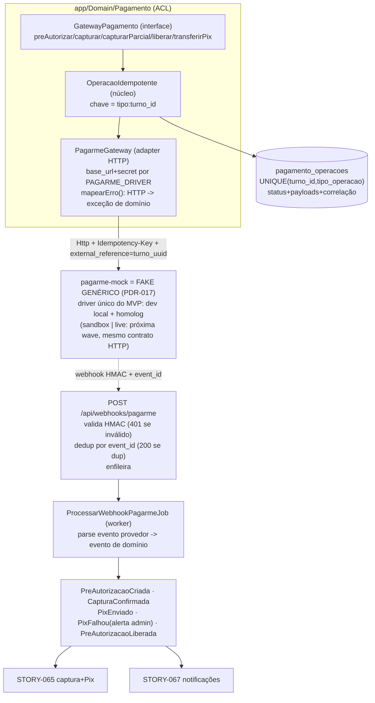

# ADR-016 — Implementação concreta da ACL de pagamento (fake genérico no MVP)

> **⚠️ Revisão (2026-06-04) — PDR-017 aplicada.** A integração Pagar.me em sandbox **saiu do MVP** (decisão de produto: a habilitação operacional do provedor não chega a tempo da WAVE-2026-01). O desenho desta ADR **permanece o mesmo** — interface, adapter único, idempotência, webhook HMAC, eventos de domínio —, mas o **destino do adapter muda**: o container `pagarme-mock` deixa de ser "mock só de dev local" e passa a ser o **fake genérico**, driver único em **todos** os ambientes do MVP (dev local **e** homolog). O contract test contra o sandbox real (antiga seção *h* / STORY-056-B) **sai por perda de objeto**. Quando a integração real entrar (próxima wave, épico dedicado), ela volta **atrás desta mesma ACL** — só configuração de driver + contract test; o domínio do Turno não muda.

## Contexto

A **ADR-005** (`accepted`, 2026-05-27) fixou a **estratégia de alto nível** da integração financeira: Anti-Corruption Layer no módulo `Pagamento`, mock dedicado em container, idempotência por chave de operação, fluxo pré-autorização → captura → Pix com webhook entrante validado, e contract test contra o sandbox no CI noturno (Opção A da ADR-005). Esta ADR **não reabre** nada disso — ela **aterrissa** a estratégia em schema, classes, contrato HTTP e rotas concretas, para que STORY-058 (pré-autorização no aceite), STORY-065 (captura + Pix) e STORY-066 (liberação no cancelamento) tenham fundação executável e testável **sem internet**.

A **PDR-017** (`accepted`, 2026-06-04) mudou o **escopo de produto** sobre o qual esta ADR aterrissa: o PSP real (Pagar.me) é **adiado para a próxima wave**; o MVP roda 100% sobre o fake genérico atrás da mesma ACL, com banner global "Ambiente de teste — pagamentos simulados" em homolog (STORY-075). Esta ADR foi revisada para refletir isso: nada do desenho técnico mudou — a Opção A da ADR-005 (mock que fala o **mesmo contrato HTTP** do provedor) é exatamente o que torna o pivô barato. O que mudou foi o **papel** do mock (de duble de dev local a gateway efetivo do MVP) e a **remoção** do contract test contra sandbox (não há sandbox no MVP).

As restrições já fixadas que esta ADR herda sem discutir: a integração roda em **jobs assíncronos no `worker`** sobre a fila `database` e o **webhook entra no `api`** (ADR-002); **segredos no Secret Manager**, webhook público em `southamerica-east1` (ADR-004); **log JSON em stdout com `request_id` propagado `api`→fila→`worker`** e log-based metrics (ADR-008); **PKs e FKs em UUIDv7**, com `external_reference` carregando o UUID do turno como string (ADR-018); o **modelo de Turno e a máquina de estados** já existem (ADR-015); a **falha de Pix é uma tentativa + alerta admin, sem retry automático** (PDR-010); e o **modelo financeiro** é `total_contratante = valor + taxa_turni`, com a `taxa_turni` ficando na conta Turni (PDR-004, `domain/pagamento.md`).

O que **falta decidir** (e esta ADR decide) são as escolhas concretas que terão impacto transversal — outros agentes vão se basear nelas: (1) a **forma da interface** `GatewayPagamento` (vocabulário, assinaturas, tipos de retorno e de erro); (2) **onde mora a correlação** com os identificadores do Pagar.me e **como a idempotência é persistida** (uma tabela ou duas; qual chave; o que curto-circuita); (3) o **contrato HTTP** que o adapter fala e que o mock simula; (4) a **forma do webhook entrante** (validação, deduplicação, processamento assíncrono) e **quais eventos de domínio** ele emite para STORY-065/067; (5) a **seleção de driver** (`mock|sandbox|live`) sem `if` espalhado pelo código.

Esta é a estória **L** de maior risco da WAVE-2026-01. Conforme o gatilho de quebra da STORY-056, ela foi dividida: **STORY-056-A** (esta ADR + a implementação local completa — interface, adapter, fake, idempotência, webhook, observabilidade) e **STORY-056-B** (o contract test consumer-driven contra o sandbox real no CI noturno + alerta de divergência, CA-8). **Pós-PDR-017, a STORY-056-B foi abandonada por perda de objeto** — não há sandbox no MVP. O desenho do contract test fica registrado nesta ADR (seção *h*) como **legado para a próxima wave**: é o que o épico de integração real reativa, junto com o contrato versionado em `integrations/pagarme/contract.md`.

## Forças (drivers) da decisão

- **F1 — Isolamento do provedor (princípio #5, F1 da ADR-005):** peso **alto**. Nenhum `order_id`/`charge_id`/status do Pagar.me pode vazar para o modelo de Turno ou para os controllers. A interface fala vocabulário Turni; o adapter é o único que conhece o provedor.
- **F2 — Idempotência à prova de clique-duplo e retry (PDR-004, F3 da ADR-005):** peso **alto**. Dinheiro não pode mover duas vezes. Aprovar a candidatura duas vezes, o worker retentar um job, ou o Pagar.me reenviar o webhook **não** pode duplicar pré-autorização/captura/Pix.
- **F3 — Local 100% sem internet (princípio #6, F2 da ADR-005):** peso **alto**. `docker compose up` roda o ciclo financeiro inteiro contra o mock, inclusive recebendo o webhook de volta. `make setup` continua hermético.
- **F4 — Testabilidade do núcleo (princípio #10, `quality-standards.md`):** peso **alto**. Idempotência, parsing/validação do webhook e mapeamento de erro são o núcleo financeiro — exigem ≥ 98% de cobertura. O desenho tem que permitir testar essas três peças **sem** subir container e **sem** rede.
- **F5 — Webhook seguro e idempotente (`integration-architecture.md` §webhook, F3 da ADR-005):** peso **alto**. Assinatura HMAC validada; duplicata por `event_id` responde 200 sem reprocessar; recepção rápida + processamento assíncrono.
- **F6 — Observabilidade financeira com PII mascarada (ADR-008, F6 da ADR-005):** peso **médio**. Cada operação emite uma linha JSON correlacionável por `request_id`; a chave Pix **nunca** aparece em claro.
- **F7 — Simplicidade / não-antecipação (princípio #1, F7 da ADR-005):** peso **alto**. Uma tabela em vez de duas se uma resolve; nenhum broker; idempotência sobre o Postgres que já temos; captura parcial exposta na interface (para o EPIC-005) mas **não** implementada além do necessário.

## Opções consideradas

A maioria das tensões já foi resolvida pela ADR-005 (ACL vs cliente direto, mock em container vs `Http::fake`, sandbox como CI noturno vs como dev local). Restam **três decisões locais reais**, cada uma com uma escolha não-óbvia.

### Decisão 1 — Correlação + idempotência: uma tabela ou duas?

A ADR-005 menciona em alto nível uma **tabela de correlação** (`pagamento_externo_ref`) e uma **chave idempotente** registrada localmente. A CA-1 da STORY-056 lista "tabela de correlação (turno_id ↔ order_id/charge_id)" **e** "tabela de idempotência (chave + status + payload)" — pode soar como duas tabelas. A CA-5 só exige **uma**: `pagamento_operacoes`.

- **Opção 1A — Uma tabela `pagamento_operacoes` (escolhida).** Linha por operação financeira, chaveada por `(turno_id, tipo_operacao)` único. Guarda `idempotencia_chave`, `status`, `request_payload` e `response_payload` (jsonb) **e** colunas desnormalizadas de correlação (`pagarme_order_id`, `pagarme_charge_id`, `pagarme_transfer_id`) extraídas da resposta para consulta direta. A correlação é uma **projeção** da resposta, não uma tabela à parte.
  - ✅ Simplicidade (#1/F7): um turno tem ≤ 5 operações financeiras na vida; não há cardinalidade que justifique normalizar a correlação numa tabela própria. Um `JOIN` a menos, uma migração a menos, uma fonte de verdade.
  - ✅ Idempotência (F2): o índice único `(turno_id, tipo_operacao)` **é** a garantia de não-duplicação — o banco recusa a segunda pré-autorização do mesmo turno.
  - ✅ Auditoria (ADR-015/`compliance.md`): request e response ficam imutáveis na própria linha que prova a operação.
- **Opção 1B — Duas tabelas (`pagamento_externo_ref` + `pagamento_operacoes`).** Separa a correlação (1 linha por id de provedor) do log de operação.
  - ⚠️ Normalização que não paga: a relação é praticamente 1:1 entre operação e id de correlação; separar cria FK e JOIN sem ganho de integridade real no MVP.
  - ❌ Mais superfície (duas migrações, dois modelos, dois triggers de imutabilidade) contra o princípio #1.

> **Decisão óbvia (1A):** com ≤ 5 operações por turno e relação ~1:1 com os ids do provedor, normalizar a correlação numa segunda tabela é complexidade sem dor real. Uma tabela com colunas de correlação desnormalizadas atende CA-1 e CA-5 e respeita o princípio #1. Caso o EPIC-005 (disputa: captura parcial + estorno) revele necessidade de N operações do mesmo tipo por turno, a chave `(turno_id, tipo_operacao)` evolui para incluir uma sequência — gatilho registrado em "Plano de verificação".

### Decisão 2 — Seleção de driver (`mock|sandbox|live`): subclasses ou base_url por config?

A ADR-005 fixou `PAGARME_DRIVER=mock|sandbox|live`. Como isso vira código?

- **Opção 2A — Um único `PagarmeGateway`, `base_url` + credenciais resolvidas por config (escolhida).** Existe **um** adapter. O `config/services.php` mapeia o driver para `base_url` (mock → `http://pagarme-mock:8080`; sandbox/live → host do Pagar.me) e para a chave secreta correspondente. O fake fala o **mesmo contrato HTTP** do Pagar.me real (é o ponto inteiro da Opção A da ADR-005), então não há ramificação de código por driver.
  - ✅ Isolamento (F1) e simplicidade (F7): zero `if ($driver === 'mock')` no adapter; o driver só troca um endereço e uma credencial.
  - ✅ Fidelidade (F5): como o mesmo código fala com fake e com sandbox/live, quando a integração real entrar (próxima wave) o contract test exercitará exatamente o caminho de produção.
- **Opção 2B — Uma implementação de `GatewayPagamento` por driver (`MockGateway`, `PagarmeGateway`).** O binding troca a classe inteira.
  - ❌ Viola F5: o `MockGateway` seria um caminho de código **diferente** do que roda em produção — o contract test deixaria de guardar o código real. Reintroduz o problema que a ADR-005 rejeitou ao recusar o `Http::fake` (Opção B de lá).

> **Decisão óbvia (2A):** o fake é um **container que fala o protocolo**, não um duble de objeto. Logo há um só adapter; o driver é só endereço + credencial em config. Isso é o que mantém o contract test futuro honesto.
>
> **Nota pós-PDR-017:** no MVP, `mock` é o **driver único em todos os ambientes** (dev local e homolog) — é o fake genérico da PDR-017. O nome do driver permanece `mock` (alinhado ao container `pagarme-mock` e aos testes existentes; renomear para `fake` seria churn sem ganho). Os mapeamentos `sandbox|live` permanecem em `config/services.php` sem custo: são o destino do épico de integração real da próxima wave — trocar de fake para Pagar.me real será **só configuração** (driver + credenciais no Secret Manager), exatamente o que esta decisão comprou. A Decisão 2B teria tornado o pivô da PDR-017 caro; a 2A o tornou trivial.

### Decisão 3 — Forma do erro e do retorno da interface

- **Opção 3A — Retorno: um value object `ResultadoOperacao`; erro: exceções de domínio tipadas (escolhida).** Cada operação devolve um `ResultadoOperacao` imutável (tipo, status, ids de correlação, payload bruto). Falhas **fatais de negócio** (recusa de pré-autorização, dados inválidos, chave Pix inválida) viram `PreAutorizacaoNegada`, `CapturaFalhou`, `PixFalhou`, `LiberacaoFalhou` (todas estendendo `OperacaoPagamentoException`). Falhas **recuperáveis** (timeout, 5xx, rede) viram `GatewayIndisponivel` — sinal para o worker retentar com backoff. Nenhum `HTTP 4xx/5xx` do Pagar.me sobe.
  - ✅ F1: o domínio só vê exceções dele. O mapeamento HTTP→exceção mora num lugar (o adapter).
  - ✅ F4: o mapeamento de erro é uma função pura testável com `Http::fake` — entra no núcleo de 98%.
- **Opção 3B — Retorno `Result<T,E>` (sem exceções).** Mais funcional, mas estranho ao idioma Laravel já adotado no resto do `api` (services lançam exceções de domínio — ver `Cadastro`, `Candidatura`). Inconsistência transversal sem ganho.

> **Decisão óbvia (3A):** espelha o idioma já usado nos outros módulos de domínio do `api` (exceções de domínio), mantém o externo isolado e deixa o mapeamento de erro testável como função.

## Decisão proposta

> **Optamos por: uma tabela `pagamento_operacoes` (1A), um adapter `PagarmeGateway` com driver por config (2A), e retorno por value object + exceções de domínio tipadas (3A) — tudo dentro do módulo `app/Domain/Pagamento`. No MVP (PDR-017), o driver é `mock` em todos os ambientes: o container `pagarme-mock` é o fake genérico que processa todo o ciclo financeiro, inclusive em homolog.**

### (a) Interface `GatewayPagamento` (CA-2)

Vive em `app/Domain/Pagamento/GatewayPagamento.php`. Cinco operações, vocabulário Turni, **sem** vazar conceito do provedor. Valores monetários trafegam como **string decimal** (`"123.45"`) — coerente com o cast `decimal:2` do `Turno` (ADR-015) e à prova do erro de ponto flutuante; o adapter converte para centavos inteiros na fronteira.

```php
interface GatewayPagamento
{
    public function preAutorizar(string $turnoId, string $totalContratante, string $meioPagamentoToken): ResultadoOperacao;
    public function capturar(string $turnoId): ResultadoOperacao;
    public function capturarParcial(string $turnoId, string $valorRevisado): ResultadoOperacao; // EPIC-005, exposto desde já
    public function liberar(string $turnoId): ResultadoOperacao;
    public function transferirPix(string $turnoId, string $valorProfissional, string $chavePix): ResultadoOperacao;
}
```

`ResultadoOperacao` é um value object imutável: `tipo` (enum `TipoOperacaoPagamento`), `status` (enum `StatusOperacaoPagamento`), `pagarmeOrderId`/`pagarmeChargeId`/`pagarmeTransferId` (nullable, **identificadores opacos**, não PII), e `raw` (array da resposta para a trilha). O `meioPagamentoToken` na pré-autorização é o token do meio de pagamento do contratante — **fornecido pela STORY-058**; nesta estória existe só na assinatura e no mock.

> **Refinamento sobre a ADR-005:** a ADR-005 escreveu as assinaturas como `preAutorizar(turno, totalContratante)`. Esta ADR passa **`string $turnoId` + valores primitivos** em vez do modelo Eloquent `Turno`, para não acoplar a ACL à camada de persistência e manter o núcleo testável sem banco (F1/F4). É refinamento de vocabulário, não mudança de estratégia.

### (b) Idempotência sobre `pagamento_operacoes` (CA-5, Decisão 1A)

Tabela nova (migração + modelo `App\Models\PagamentoOperacao`), seguindo ADR-018:

| Coluna | Tipo | Papel |
|---|---|---|
| `id` | `uuid` (UUIDv7) PK | ADR-018 |
| `turno_id` | `foreignUuid` → `turnos` | correlação com o turno |
| `tipo_operacao` | `text` (enum) | `pre_autorizacao`, `captura`, `captura_parcial`, `liberacao`, `pix` |
| `idempotencia_chave` | `text` único | `"{tipo}:{turno_id}"`, determinística (ADR-005 d) |
| `status` | `text` (enum) | `pendente`, `concluida`, `falhou` |
| `request_payload` | `jsonb` | enviado ao provedor (sem PII em claro) |
| `response_payload` | `jsonb` nullable | recebido do provedor |
| `pagarme_order_id` / `pagarme_charge_id` / `pagarme_transfer_id` | `text` nullable | correlação desnormalizada |
| `erro` | `text` nullable | mensagem da falha |
| timestamps | | `created_at`/`updated_at` |

Índice **único composto** `(turno_id, tipo_operacao)` — é a barreira de hardware contra duplicação. O runner `OperacaoIdempotente` (núcleo, 98%): se já existe linha `concluida` para a chave → devolve o `ResultadoOperacao` reconstruído **sem** chamar o Pagar.me; caso contrário grava `pendente`, chama o gateway enviando a `idempotencia_chave` também como header `Idempotency-Key` (defesa dupla — o provedor deduplica do lado dele), e grava `concluida`+resposta ou `falhou`+erro. Corrida de inserção é resolvida pelo índice único: violação → recarrega a linha existente. Teste de **clique-duplo** garante exatamente uma chamada ao provedor.

A tabela **não** é imutável por trigger (diferente do `aceites_eletronicos_turno`): uma operação `pendente`→`concluida` precisa de `UPDATE`. A imutabilidade do *registro financeiro* é responsabilidade da trilha de auditoria do turno (ADR-015), não desta tabela operacional.

### (c) Adapter `PagarmeGateway` + seleção de driver (CA-3, CA-4, Decisão 2A)

`app/Domain/Pagamento/Pagarme/PagarmeGateway.php` implementa `GatewayPagamento` usando o client `Http` do Laravel (ADR-001). Lê `base_url`, `secret_key` e `timeout` de `config('services.pagarme')`, que resolve a partir de `PAGARME_DRIVER`. Segredos **só** via env/Secret Manager (ADR-004) — nunca em código. O `external_reference` enviado em toda operação carrega o **UUID do turno como string** (ADR-018, CA-5). O mapeamento HTTP→exceção (Decisão 3A) é a função `mapearErro()`, testável isoladamente. Binding `GatewayPagamento → PagarmeGateway` num `PagamentoServiceProvider`. O nome `PagarmeGateway` **permanece** pós-PDR-017: o adapter fala o contrato HTTP no formato Pagar.me (que o fake simula), e é esse contrato que a próxima wave exercita contra o provedor real.

### (d) Fake genérico em container que devolve o webhook (CA-4, CA-7; PDR-017)

O serviço `pagarme-mock` (já no `docker-compose.yml` desde STORY-006) ganha **rotas funcionais** espelhando o contrato HTTP do Pagar.me: criação de order com pré-autorização, captura, transfer (Pix), e estorno/void (liberação). Ao completar cada operação, o fake **emite o webhook de volta** para `http://api:8000/api/webhooks/pagarme`, assinado com o mesmo segredo HMAC (`PAGARME_WEBHOOK_SECRET`), com `event_id` único e payload no formato do provedor. Loga `[MOCK]` (ADR-005) e versiona qual versão do contrato simula. Isso fecha o ciclo pré-auth → captura → Pix → webhook **sem internet** (CA-7).

**Pós-PDR-017, este container é o gateway efetivo do MVP** — deployado também em **homolog**, não só no dev local. Consequências operacionais: (1) o fake processa no **SLA configurado (~30s)** no caminho feliz — é a base da métrica revisada do EPIC-003 ("fake processa em SLA configurado em 100% dos turnos") e mantém a promessa "Pix em 15 min" como simulação honesta (banner global da STORY-075 explicita); (2) o fake é **configurável para caminhos de exceção** (falha de captura, falha de Pix, atraso), o que permite testar o alerta admin do PDR-010 com determinismo — coisa que o sandbox real não dava; (3) o segredo HMAC do webhook em homolog é compartilhado entre fake e `api` via Secret Manager (ADR-004), mesmo mecanismo previsto para o provedor real.

### (e) Webhook entrante validado (CA-6, Decisão da F5)

Rota pública `POST /api/webhooks/pagarme` (fora de `auth`/`FunnelGuard`/`WebAppOnly`), no `api`. O `PagarmeWebhookController`: (1) valida a **assinatura HMAC** (`hash_hmac('sha256', body, secret)` comparada com `hash_equals` — `PagarmeWebhookValidator`, núcleo 98%); assinatura inválida → **401**, sem processar; (2) deduplica por **`event_id`** numa tabela `webhook_eventos_pagarme` (event_id único) — duplicata responde **200** sem reprocessar; (3) persiste o evento e **enfileira** `ProcessarWebhookPagarmeJob`, respondendo **200** rápido. O job (no `worker`) faz o parsing do tipo de evento do Pagar.me → **evento de domínio canônico** e atualiza a `pagamento_operacoes` correspondente.

### (f) Eventos de domínio emitidos (CA-6)

O parsing mapeia o evento do provedor para um destes eventos de domínio (em `App\Events\Pagamento`), consumidos por STORY-065 (captura+Pix) e STORY-067 (notificações):

| Evento Pagar.me (exemplo) | Evento de domínio | Consumidor |
|---|---|---|
| `charge.pending` / order autorizada | `PreAutorizacaoCriada` | STORY-067 |
| `charge.captured` / `charge.paid` | `CapturaConfirmada` | STORY-065/067 |
| `transfer.paid` (Pix) | `PixEnviado` | STORY-065/067 |
| `transfer.failed` | `PixFalhou` | STORY-065/067 + **alerta admin (PDR-010)** |
| `charge.refunded` / `charge.canceled` | `PreAutorizacaoLiberada` | STORY-066/067 |

`PixFalhou` é o gancho do PDR-010: **uma tentativa, alerta no admin, sem retry automático** — a *policy* de alerta é wirada na STORY-065; aqui o evento já nasce.

### (g) Observabilidade financeira (CA-9)

`App\Support\Telemetry\PagamentoEvents` emite uma linha JSON por operação (espelhando `MatchEvents`/ADR-008), com `event`, `operacao`, `turno_id`, `idempotencia_chave`, `pagarme_id`, `latencia_ms`, `resultado`. **Mascarado/omitido:** chave Pix, dados bancários (a chave Pix nunca entra no log — `Pii`/ADR-008). O `request_id` propaga `api`→fila→`worker` (mecanismo do ADR-008). As log-based metrics (taxa de erro ≤ 1%, latência p95 de captura e de webhook) são **definidas** em `docs/operacao/` para o Terraform da STORY-007 wirar; a métrica vive no mecanismo do ADR-008.

### (h) Contract test no CI noturno — ~~STORY-056-B~~ adiado para a próxima wave (PDR-017)

~~O contract test consumer-driven contra o sandbox real, o job de `cron` noturno no GitHub Actions e o alerta de divergência (canal do ADR-008) são o escopo da **STORY-056-B**.~~ **Removido do MVP pela PDR-017** — sem sandbox, o contract test perde objeto; a STORY-056-B foi abandonada e as credenciais sandbox deixaram de ser pré-requisito.

O **desenho fica registrado como legado para o épico de integração real da próxima wave**: o contrato esperado já está versionado junto da ACL (`docs/project-state/integrations/pagarme/contract.md` — request/response/erros por operação, "simula API vX capturada em <data>") e é o documento que **guia o fake hoje e o adapter contra o sandbox real amanhã**. Quando aquele épico ativar: job de `cron` noturno fora do caminho de PR (não depende de internet no push, princípio #6), divergência fake↔sandbox notificando Alexandro pelo canal do ADR-008, credenciais sandbox no Secret Manager como pré-requisito.

## Diagrama



## Consequências

### Positivas (o que ganhamos)
- STORY-058/065/066 ganham uma interface estável e um ciclo financeiro que roda **local sem internet** (fake em container devolvendo o webhook) — e o **mesmo fake roda em homolog**, então o ciclo demonstrável ponta a ponta não depende de fornecedor externo (PDR-017).
- Não-duplicação garantida pelo índice único `(turno_id, tipo_operacao)` **mais** o `Idempotency-Key` enviado ao gateway — defesa em duas camadas (o fake deduplica pelo header como o provedor real faria).
- Núcleo financeiro (idempotência, parsing/validação de webhook, mapeamento de erro) testável sem container e sem rede → cobertura ≥ 98% realista.
- Um só caminho de código fala com fake e (futuramente) sandbox/live → a troca para o PSP real na próxima wave é **configuração**, não código de domínio; o contract test daquele épico guardará exatamente o código de produção.
- Fake configurável para caminhos de exceção (falha de captura/Pix, atraso) → PDR-010 testável com determinismo, melhor que a variabilidade do sandbox.
- Captura parcial já exposta na interface (EPIC-005) sem custo de antecipação real.

### Negativas / trade-offs aceitos
- **O ciclo end-to-end não é exercitado contra rede externa real no MVP** (trade-off central aceito na PDR-017): surpresas de integração (autenticação, formato fino de payload, semântica de webhook reentrante, idempotência do provedor real) só aparecem no épico de integração da próxima wave. Custo localizado no adapter/configuração — o domínio do Turno não muda.
- **Manutenção do fake** quando o contrato Pagar.me mudar (herdado da ADR-005). Sem contract test no MVP, a divergência fake↔provedor real só é detectada na próxima wave — o contrato versionado (`integrations/pagarme/contract.md`) registra qual versão da API o fake simula.
- **Card/meio de pagamento real** da pré-autorização fica para STORY-058 — nesta estória o `meioPagamentoToken` existe na assinatura e é honrado pelo fake; o fluxo de tokenização real do contratante fica para a wave da integração real.
- Colunas de correlação desnormalizadas em `pagamento_operacoes` pressupõem ≤ 1 operação por `(turno, tipo)`; o EPIC-005 pode forçar uma sequência na chave (ver Plano de verificação).

### Neutras
- A `pagamento_operacoes` é mutável (`pendente`→`concluida`), diferente do `aceites_eletronicos_turno` imutável — a imutabilidade financeira mora na trilha de auditoria do turno (ADR-015), não aqui.
- O `worker` que processa o webhook é o mesmo da ADR-002/004 (GCE `e2-micro`) — sem impacto novo de infra.

### Para o time
- **Impacto em estórias:** destrava STORY-058 (`preAutorizar`), STORY-065 (`capturar`+`transferirPix`+webhook), STORY-066 (`liberar`) — todas via fake, sem dependência de credenciais externas. Define o contrato dos eventos de domínio que STORY-067 consome. STORY-075 (banner global em homolog) é a contraparte de produto da PDR-017 — ortogonal a esta ADR.
- **ADRs/PDRs:** detalha ADR-005 (estratégia da ACL — segue válida; ver nota PDR-017 lá); aplica PDR-017 (fake genérico no MVP); consome ADR-002/004/008/015/018; implementa PDR-004; respeita PDR-010 (`PixFalhou` sem retry) e PDR-006 (`capturarParcial` exposta).
- **Spike de validação:** não. A fidelidade ao provedor real deixa de ser guardada continuamente no MVP (sem STORY-056-B); o contrato versionado é a referência estática até o épico de integração real reativar o contract test.

## Plano de verificação

- **Como verificar conformidade:**
  - **Lint arquitetural:** nenhum import do client/SDK Pagar.me fora de `app/Domain/Pagamento/Pagarme`; nenhuma coluna `order_id`/`charge_id` no modelo `Turno` (vivem em `pagamento_operacoes`).
  - **Idempotência:** teste reexecuta a mesma operação com a mesma chave e confirma **uma** chamada ao provedor (mock/`Http::fake`); webhook duplicado por `event_id` não reprocessa.
  - **Local sem internet:** `docker compose up` com `PAGARME_DRIVER=mock` roda pré-auth→captura→Pix→webhook sem rede externa (CA-7 / STORY-006).
  - **Homolog com fake (PDR-017):** fake deployado e respondendo em homolog; ciclo completo demonstrável com banner global "Ambiente de teste — pagamentos simulados" visível (STORY-075); SLA do fake (~30s) cumprido no caminho feliz.
  - **Observabilidade:** eventos `pagamento.*`/`pix.*` no log JSON com `request_id` correlacionado e **sem** chave Pix em claro (teste do `PagamentoEvents`/`Pii`).
- **Sinais de revisão (quando reabrir):**
  - Se o EPIC-005 exigir **N operações do mesmo tipo** por turno (estornos parciais sucessivos) → a chave `(turno_id, tipo_operacao)` ganha uma sequência; reabre a Decisão 1.
  - Quando o **épico de integração Pagar.me real** ativar (próxima wave) → nova ADR (do adapter real contra sandbox + contract test + setup operacional + go-live); esta ADR e o contrato versionado são os insumos. Se aquela ADR descobrir que o contrato simulado divergiu do real em ponto estrutural (não só payload), reabre as Decisões 2/3.
  - Se durante EPIC-003/005 o fake **esconder decisão de produto não tomada** (ex.: captura confirma mas Pix falha em janela específica) → parar e escalar como PDR novo (sinal da PDR-017), não decidir no código.
  - Se **erro de transação > 1%** ou **falha de Pix > 1%** → reabre política de retry/circuit breaker (na ADR-005/PDR-010, não aqui).
- **Spike de validação proposto:** nenhum dedicado; ~~STORY-056-B (contract test) é a guarda contínua~~ — removido pela PDR-017; a guarda contínua volta com o épico de integração real.

---

## Aprovação humana

> Esta seção é o registro formal do aceite. Não preencher sozinho — preencher quando o humano aprovar no chat ou via PR.

- **Status final:** ✅ aceita
- **Aprovado por:** Alexandro
- **Data:** 2026-06-04
- **Forma do aceite:** aprovado em chat (sessão de 2026-06-04), já sobre a versão revisada pós-PDR-017; commit direto na `main`
- **Condicionantes do aceite:** nenhuma.

### Em caso de rejeição
- **Motivo:** ...
- **Próximos passos sugeridos:** ...

### Em caso de superseding
- **Substituída por:** ADR-YYY
- **Razão da substituição:** ...

---

## Histórico

- 2026-06-04 — criada como `proposed` por Arquiteto (STORY-056-A). Detalha a ADR-005: interface `GatewayPagamento` (valores como string decimal, ids opacos no `ResultadoOperacao`), tabela única `pagamento_operacoes` com correlação desnormalizada e índice único `(turno_id, tipo_operacao)` (Decisão 1A), adapter único com driver por config (Decisão 2A), erro por exceção de domínio tipada (Decisão 3A), mock em container devolvendo webhook, webhook entrante HMAC + dedup por `event_id` + processamento assíncrono, 5 eventos de domínio canônicos, observabilidade com chave Pix mascarada. Contract test no CI noturno delegado à STORY-056-B (quebra da estória L).
- 2026-06-04 — **revisada pelo Arquiteto pós-PDR-017** (Pagar.me sai do MVP; fake genérico atrás da mesma ACL). Título/slug: "ACL Pagar.me" → "ACL de pagamento + fake genérico" (history no frontmatter). O desenho técnico não mudou (Decisões 1A/2A/3A intactas — a 2A é o que tornou o pivô trivial); mudou o papel do `pagarme-mock`: de mock de dev local a **fake genérico, driver único do MVP, deployado também em homolog**. Seção (h) (contract test sandbox) marcada como adiada para a próxima wave (STORY-056-B abandonada); credenciais sandbox deixam de ser pré-requisito; consequências e sinais de revisão atualizados. Permanece `proposed` aguardando aprovação do Alexandro.
- 2026-06-04 — **`accepted` por Alexandro** (aprovação em chat sobre a versão revisada pós-PDR-017; commit direto na `main`).
