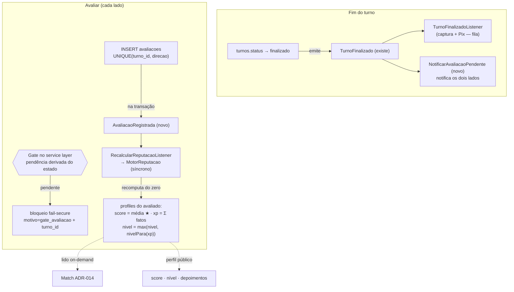
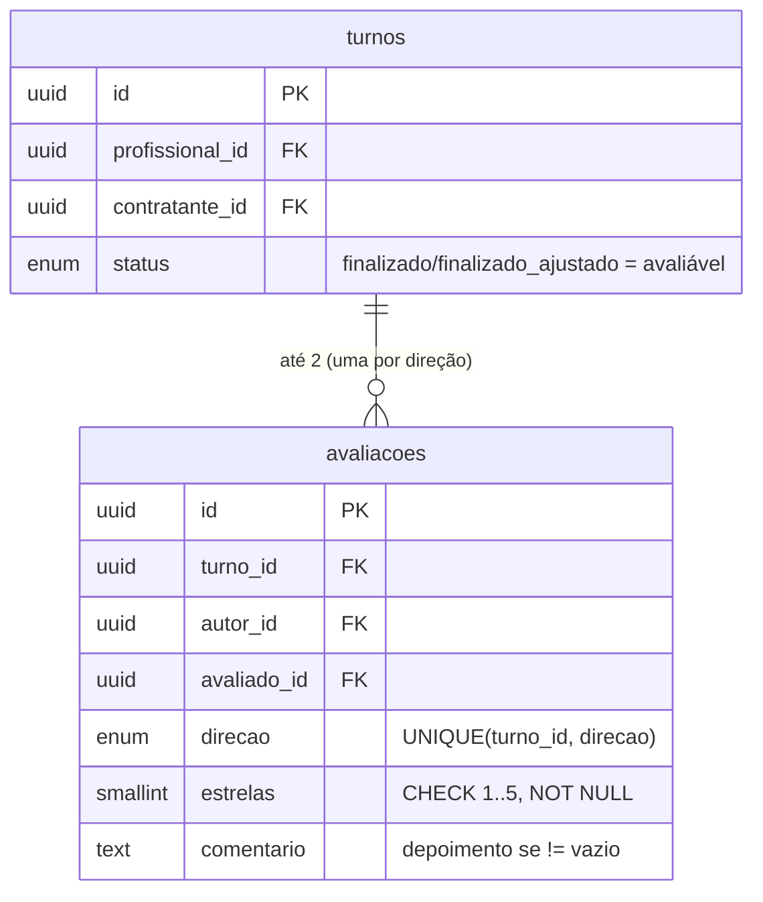

# ADR-019 — Avaliação recíproca: modelo, eventos, motor de reputação e ponto do gate

## Contexto

O EPIC-003 fechou o ciclo do turno até `finalizado` (ADR-015: modelo Turno + máquina de estados como invariante de banco). Hoje o turno termina e **nada acontece**: não há avaliação, o XP/score do profissional não acumula, a trilha de níveis não anda e o algoritmo de Match (ADR-014) — que lê `score`, `turnos_realizados` e `nivel` do `profissional_profiles` — fica alimentado só pelo seed. O EPIC-004 fecha esse ciclo com **avaliação recíproca obrigatória** (PDR-005): após cada turno `finalizado`/`finalizado_ajustado`, os dois lados são bloqueados em nova ação até avaliarem; a avaliação recebida atualiza XP/score/nível; reputação fica visível no perfil.

Antes de implementar (STORY-085/086), o `epic.md` exige fixar **três decisões arquiteturais** mais uma quarta correlata: (1) **modelo de dados** da avaliação; (2) **eventos de domínio** que disparam o fluxo e a atualização de reputação, e o mecanismo (síncrono vs. fila); (3) **ponto e estratégia do gate bloqueante** — fail-secure, nos dois papéis; (4) **onde vive o motor de XP/score/nível e sua idempotência** (risco explícito do sprint: reprocessar um evento somar XP em dobro).

As restrições que chegam consolidadas:

- **`domain/niveis-e-score.md`** — Score = média das avaliações (1–5★) recebidas, exibido com 1 casa; viés leve para recentes ("detalhe exato fica para spike"). XP por evento (turno +30, 5★ +10, 4★ +3, 3★ 0, 1–2★ −5; cancelamento/no-show placeholders — PDR-007). Trilha 0–499 / 500–999 / 1000–2999 / 3000+; **subida automática**; **descida não acontece** no MVP — "XP pode ficar negativo localmente sem rebaixar o profissional". Reciprocidade: contratante também tem score (média das avaliações que recebeu), sem nível no MVP.
- **`domain/turno.md` §Avaliação** — em `finalizado`/`finalizado_ajustado`, ambos avaliam; estrelas (1–5) obrigatórias, comentário opcional; o spec esboça os dados como atributos do turno (`avaliacao_profissional`/`avaliacao_contratante`). Profissional não candidata e contratante não publica até avaliar.
- **`business-rules.md`** — concentra os números (XP por evento, limiares de nível, "obrigatória/bloqueante"). São **parâmetros de produto ajustáveis em operação** (não os reabro aqui).
- **PDR-005** (avaliação obrigatória e bloqueante) — base do épico. **PDR-007** — motor de penalidade de cancelamento/no-show fica **fora do MVP**; o modelo guarda só os placeholders.
- **ADR-014** (Match on-demand, sem cache, idempotente por construção) — precedente direto da postura "derive, não cacheie". O Match **consome** a reputação que este épico passa a manter.
- **ADR-015** (modelo Turno) — `turnos` com `profissional_id`, `contratante_id`, `status` enum; estados `finalizado` e `finalizado_ajustado` são os gatilhos da avaliação. **ADR-009/013/018** — padrão de modelagem (FK constrained, PK/FK `uuid` UUIDv7 via `HasUuids`, enum nativo de estado, agregados próprios em vez de jsonb para dado de domínio consultável). **ADR-007** (RBAC) e **ADR-008** (telemetria por log estruturado).

**Estado do código que esta ADR herda** (e que estreita as decisões):

- As **costuras do gate já existem** como classes de domínio stub-honestas, criadas no EPIC-002 justamente para este momento: `App\Domain\Avaliacao\AvaliacoesPendentesProfissional::podeCandidatar(User): bool` e `AvaliacoesPendentesContratante::para(User): {pending, turnos[]}`. A do profissional já está **ligada** ao caminho de candidatura via `App\Domain\Candidatura\Gates\GateAvaliacao` dentro de `CriarCandidaturaService` (com o slot `turno_id` do deep-link reservado, hoje `null`). A do contratante **ainda não está ligada** ao `PublicarVagaService` — só a um endpoint de leitura.
- `profissional_profiles` **já tem** `nivel` (string(20) nullable), `score` (decimal(5,2) default 0), `xp` (**`unsignedInteger`** default 0) e `turnos_realizados` (unsignedInteger default 0). `contratante_profiles` **não tem** coluna de score.
- O **event auto-discovery está desligado** (`bootstrap/app.php`: `->withEvents(discover: false)`); listeners são registrados **explicitamente** no `AppServiceProvider` e os eventos de domínio são despachados **síncronos dentro da transação** que os origina (padrão STORY-053/065). O evento **`App\Events\TurnoFinalizado`** já existe (carrega `turnoId` string; hoje dispara o ciclo financeiro).

Esta é uma ADR de **persistência + contrato de eventos + estratégia de cálculo + ponto de gate**. Ela fixa modelo, eventos, motor e camada do gate; **não escreve código de produção** (STORY-085/086) nem decide UX/visibilidade de depoimentos (DDR-004 / STORY-084).

## Forças (drivers) da decisão

- **F1 — Idempotência do motor (risco explícito do sprint; `quality-standards.md` núcleo ≥98%):** peso **alto**. Reprocessar um evento (re-fila, retry, replay) **não pode** somar XP/score em dobro. A garantia precisa ser estrutural, não disciplina de código.
- **F2 — Gate fail-secure nos dois papéis, sem regressão nem vazamento entre papéis (PDR-005, ADR-007):** peso **alto**. Bloquear candidatura (profissional) e publicação (contratante) com avaliação pendente, sem quebrar os caminhos já entregues (W26/W28) nem confundir papéis.
- **F3 — Reputação consultável e correta (`niveis-e-score.md`):** peso **alto**. Score = média das recebidas; depoimentos = N mais recentes recebidos por um usuário, através de todos os turnos. Precisa ser uma query barata e correta.
- **F4 — Simplicidade / time minúsculo / Postgres-first (princípios #1, #3, #5):** peso **alto**. Nada de tabela de fila de pendências, ledger de eventos ou peça nova sem dor real comprovada.
- **F5 — Consistência com ADR-014/015/013 (coesão; "derive, não cacheie"):** peso **médio-alto**. O Match já lê reputação on-demand; manter a reputação por recomputação fecha o ciclo coerentemente e mantém os agregados próprios (não jsonb solto).
- **F6 — "Subida sem descida" do nível (`niveis-e-score.md`):** peso **médio**. XP pode cair (1–2★), mas o nível **nunca rebaixa** no MVP — invariante que o motor precisa garantir mesmo recomputando.
- **F7 — Reversibilidade / refinabilidade (princípio #7; placeholders PDR-007):** peso **médio**. Pesos de XP, viés de recência e o motor de penalidade são ajustáveis depois sem reescrever o modelo.

---

## Decisão 1 — Modelo: tabela `avaliacoes` separada (diverge do esboço jsonb de `turno.md`)

### Opção 1A — Tabela `avaliacoes` própria, uma linha por direção/turno (**escolhida**)

Agregado próprio `avaliacoes`, no padrão ADR-009/013/015 (PK/FK `uuid`, FK constrained, enum nativo de direção):

| Coluna | Tipo | Constraint / nota |
|---|---|---|
| `id` | uuid PK | `HasUuids` (UUIDv7), gerado na aplicação |
| `turno_id` | uuid FK → `turnos` | `restrictOnDelete` |
| `autor_id` | uuid FK → `users` | `restrictOnDelete` — quem avaliou |
| `avaliado_id` | uuid FK → `users` | `restrictOnDelete` — quem recebeu |
| `direcao` | `avaliacao_direcao` | enum nativo: `contratante_para_profissional` \| `profissional_para_contratante` |
| `estrelas` | smallint | `CHECK (estrelas BETWEEN 1 AND 5)`, NOT NULL (obrigatória — PDR-005) |
| `comentario` | text nullable | depoimento quando não-vazio |
| `created_at` / `updated_at` | timestamptz | UTC; UI delega a IDR-026 |

**Invariantes duras no banco:** `UNIQUE (turno_id, direcao)` — **uma avaliação por direção por turno** (CA-1), fail-secure contra avaliação dupla mesmo via SQL cru. `CHECK (autor_id <> avaliado_id)` — ninguém se autoavalia. `estrelas` obrigatória por NOT NULL + CHECK de faixa.

**Índices:** `idx_avaliacoes_avaliado_recente = (avaliado_id, created_at DESC)` — serve **tanto** a recomputação de score (média das recebidas) **quanto** a query de depoimentos (N mais recentes recebidos), num único índice. `idx_avaliacoes_autor = (autor_id)` — "minhas avaliações dadas". O `UNIQUE (turno_id, direcao)` já cobre lookup por turno.

`autor_id`/`avaliado_id` são **deriváveis** de `turno + direcao`, mas materializados porque **toda** consulta de reputação parte de "avaliações recebidas por X" — sem a coluna, todo cálculo de score viraria join com `turnos` e um `CASE` sobre direção. Materializar troca 2 colunas por queries triviais e índice de cobertura. O `direcao` em enum nativo (não em `autor`/`avaliado` apenas) deixa o `UNIQUE (turno_id, direcao)` exprimir literalmente a regra "uma por direção".

**Mutabilidade:** linha **mutável** no MVP (sem trigger de imutabilidade, diferente de `aceites_eletronicos*`). A avaliação não é prova jurídica como o aceite; moderação de abuso é caso-a-caso pelo admin (sem UI — `epic.md`), e um `UPDATE` pontual via tinker é aceitável. Não pagar o custo de um trigger+REVOKE aqui honra o princípio #1.

### Opção 1B — Atributos `jsonb` no próprio `turno` (esboço de `turno.md`)

`turnos.avaliacao_profissional` / `avaliacao_contratante` como jsonb `{stars, comment, criado_em}`.

- ❌ **Reputação consultável (F3):** "3 depoimentos mais recentes recebidos por X através de todos os turnos" exige varrer `turnos` filtrando por `profissional_id`/`contratante_id` e desempacotar jsonb dos dois lados — sem índice natural; média de score idem. É exatamente o anti-padrão "jsonb para dado de domínio consultável" que ADR-013/015 evitam.
- ❌ **Unicidade/obrigatoriedade no banco:** "1 por direção" e "estrelas 1–5 obrigatórias" viram disciplina de aplicação, não constraint.
- ⚠️ `turnos` é tabela com máquina de estados e trigger de transição (ADR-015); `UPDATE` de avaliação no mesmo agregado mistura responsabilidades (princípio #5).
- **Razão de não escolher:** o esboço de `turno.md` é spec funcional, não lei de schema. A latitude de modelagem é do arquiteto (ADR-015 já divergiu de hints anteriores). A tabela separada é a forma correta para dado de reputação consultável.

### Decisão 1 — **Opção 1A.** Tabela `avaliacoes` separada, uma linha por direção/turno, com `UNIQUE (turno_id, direcao)` e índice de cobertura `(avaliado_id, created_at DESC)`.

---

## Decisão 2 — Pendência de avaliação **derivada do estado**, não materializada

### Decisão

Não existe tabela nem coluna de "pendência". Um turno está **pendente de avaliação para uma direção** se, e somente se, ele está em estado terminal-avaliável (`finalizado` ou `finalizado_ajustado`) e **não existe** linha em `avaliacoes` para aquele `(turno_id, direcao)`. A pendência é uma **query**, não um registro — espelho direto da postura "calcular, não cachear" de ADR-014, e coerente com as costuras stub que o EPIC-002 já deixou (que sempre foram pensadas como queries derivadas).

```
-- profissional tem pendência?
EXISTS (
  SELECT 1 FROM turnos t
  WHERE t.profissional_id = :user
    AND t.status IN ('finalizado','finalizado_ajustado')
    AND NOT EXISTS (
      SELECT 1 FROM avaliacoes a
      WHERE a.turno_id = t.id AND a.direcao = 'profissional_para_contratante'
    )
)
```
(simétrico para o contratante com `direcao = 'contratante_para_profissional'`). O índice `idx_turnos_profissional_status`/`idx_turnos_contratante_status` (ADR-015) sustenta o range por `(papel_id, status)`; o `UNIQUE (turno_id, direcao)` sustenta o anti-join.

**Por que não materializar** (a linguagem do épico fala em "criar as duas pendências"): uma tabela de pendências precisaria ser criada na finalização **e apagada** na avaliação — duas escritas, uma janela de inconsistência e um estado redundante que o banco já sabe derivar. Derivar é idempotente por construção (F1), sem peça nova (F4) e impossível de divergir do estado real do turno. O `epic.md` descreve o **efeito** ("ambos ficam pendentes"), não obriga uma tabela.

**O evento `turno_finalizado` continua existindo** — mas seu papel aqui é **notificar** ("avalie seu turno"), não criar pendência (Decisão 3). O gate lê a pendência derivada na hora da ação.

---

## Decisão 3 — Eventos de domínio: reusar `TurnoFinalizado` (notificação) + novo `AvaliacaoRegistrada` (motor), síncronos na transação

### Decisão

Dois eventos, ambos despachados **síncronos dentro da transação** que os origina (padrão do projeto — discovery off, registro explícito no `AppServiceProvider`), com **payload mínimo de IDs string UUID** (o listener recarrega o agregado — padrão ADR-018/STORY-064, seguro para fila futura):

1. **`App\Events\TurnoFinalizado`** (**já existe**; `turnoId`). Ganha **um novo listener** que cria a notificação in-app + e-mail "avalie seu turno" para **os dois lados** (mesmo mecanismo de `App\Services\Notificacao` / fila de e-mail usado na STORY-067). **Não cria pendência** (Decisão 2). Não altera o listener financeiro existente (`TurnoFinalizadoListener`) — só soma um segundo listener ao mesmo evento.

2. **`App\Events\AvaliacaoRegistrada`** (**novo**; `avaliacaoId`, `avaliadoId`, `turnoId`). Despachado **dentro** da transação que insere a linha em `avaliacoes`. Listener **`RecalcularReputacaoListener`** roda o **Motor de Reputação** (Decisão 4) **síncrono**: recomputa e persiste a reputação do `avaliadoId`. Opcionalmente cria a notificação "você foi avaliado" (in-app; e-mail fica a critério da STORY-085, fora do caminho crítico). 

**Síncrono, não em fila — por quê.** O motor é **barato** (duas agregações sobre `avaliacoes` + uma escrita no profile do `avaliado`), e a métrica do épico exige reputação visível em **≤1s**. Rodar síncrono dentro da transação garante: (a) consistência transacional (avaliação e reputação commitam juntas ou nada); (b) idempotência trivial porque o motor **recomputa** (Decisão 4) — um reprocesso produz o mesmo resultado. Isso difere do ciclo financeiro (que vai para a fila `database`) porque aquele é **pesado e externo** (Pagar.me, HTTP, Pix); reputação é **local e leve**, como o cálculo de Match (ADR-014) que também roda inline. Se um dia o motor crescer (ex.: recompute caro com histórico longo), vira job sem mudar o contrato do evento — reversível (F7).

### Resumo dos eventos

| Evento | Estado | Quando | Payload | Listener(s) |
|---|---|---|---|---|
| `TurnoFinalizado` (existente) | — | `aguardando_checkout → finalizado` (e via disputa) | `turnoId` | `TurnoFinalizadoListener` (financeiro, existente) **+** `NotificarAvaliacaoPendente` (novo: notifica os dois lados) |
| `AvaliacaoRegistrada` (novo) | — | insert em `avaliacoes` (dentro da transação) | `avaliacaoId`, `avaliadoId`, `turnoId` | `RecalcularReputacaoListener` (motor síncrono) [+ notificação "você foi avaliado"] |

> Nota: a transição via disputa (`em_disputa → finalizado_ajustado`) é EPIC-005 e hoje não dispara o evento na prática; quando entrar, ela também emite `TurnoFinalizado` e o fluxo de avaliação se aplica sem mudança (ambos os estados são avaliáveis — Decisão 2).

---

## Decisão 4 — Motor de reputação por **recomputação idempotente** + nível como *high-water-mark*

### Opção 4A — Recomputar a partir dos fatos canônicos (**escolhida**)

O motor é um **domain service** `App\Domain\Avaliacao\MotorReputacao` (coesão alta; sem dependência de relógio para a regra — testável a 98%+). A cada `AvaliacaoRegistrada`, ele **recomputa do zero** a reputação do `avaliado` a partir das fontes de verdade e **persiste** no profile (denormalização que o Match lê):

- **Score** (`avaliado` em qualquer papel) = média aritmética de `estrelas` de **todas** as avaliações recebidas (`WHERE avaliado_id = X`), arredondada para persistir; exibição com 1 casa. **Viés de recência** (`niveis-e-score.md`: "leve viés", "detalhe exato fica para spike") fica como **hook documentado fora do MVP** — adiciona complexidade de cálculo sem mudar gate/nível; o MVP usa média simples e o ponto de extensão é o próprio `MotorReputacao::score()`. (Decisão de produto a confirmar com o PO — ver Plano de verificação.)
- **XP** (só quando `avaliado` é profissional) = `30 × turnos_realizados` + Σ bônus por estrela das avaliações recebidas (5★ +10, 4★ +3, 3★ 0, 1–2★ −5) − placeholders de penalidade (cancelamento/no-show — **0 no MVP**, PDR-007). `turnos_realizados` é recomputado como contagem de turnos `finalizado`/`finalizado_ajustado` do profissional. Tudo derivado; **nada incremental**.
- **Nível** = ***high-water-mark***: `nivel = max(nivel_atual, nivelPara(xp))`, onde `nivelPara` aplica os limiares 0–499/500–999/1000–2999/3000+. Isso honra **"sobe automático, nunca rebaixa"** (F6) mesmo que o XP recomputado caia abaixo de um limiar por avaliações ruins.

**Idempotência por construção (F1):** como score/xp/turnos são **funções puras do conjunto atual** de fatos (não somas incrementais), processar o mesmo `AvaliacaoRegistrada` duas vezes (retry, replay) produz **o mesmo** profile — sem ledger de eventos processados, sem chave de idempotência, sem risco de "XP em dobro". O nível só cresce, então recomputar nunca o reduz. É o mesmo princípio que torna o Match de ADR-014 idempotente: derive, não acumule.

**Schema que o motor exige (a migração é da STORY-085):**
- **`profissional_profiles.xp` muda de `unsignedInteger` → `integer` (signed).** O spec é explícito: "XP pode ficar negativo localmente sem rebaixar". A coluna atual rejeitaria o negativo. Migração simples de tipo (reversível).
- **`contratante_profiles` ganha `score decimal(5,2) default 0`** — reciprocidade (`niveis-e-score.md`); contratante tem score, sem nível/XP no MVP.
- **Recomenda-se um enum `App\Enums\NivelProfissional`** dono dos limiares e da função `nivelPara(int $xp)` + ordem (para o `max`). Centraliza o que hoje o `MatchCalculator` resolve por string ad-hoc; o Match pode adotá-lo depois (não obrigatório nesta ADR — não forço refactor do Match).

### Opção 4B — Incremental com ledger de idempotência

Cada evento aplica um **delta** (`xp += bonus`); para não somar em dobro num replay, precisa de uma tabela/coluna de "eventos já processados" (chave de idempotência) consultada antes de aplicar.

- ❌ **Simplicidade (F4):** introduz ledger + checagem + a pergunta "o que é a chave?" — peça e disciplina novas para um problema (replay) que o recompute elimina de graça.
- ⚠️ Score como média **não é** naturalmente incremental (precisa de soma+contagem mantidas à parte, mais estado para divergir).
- **Razão de não escolher:** paga complexidade para emular uma propriedade (idempotência) que a Opção 4A tem por construção. Reabrível só se o recompute virar caro (sinal de revisão).

### Decisão 4 — **Opção 4A.** Motor recomputa score/XP/turnos do conjunto de fatos (idempotente por construção); nível é *high-water-mark* (sobe, nunca desce). XP vira `integer` signed; contratante ganha `score`; enum de nível recomendado.

---

## Decisão 5 — Gate bloqueante no **service layer**, fail-secure, simétrico, reusando as costuras existentes

### Decisão

O gate é uma **pré-condição de negócio na camada de serviço** da ação mutante — **não** middleware nem policy. Razão: a checagem precisa de contexto de domínio (qual usuário, query derivada da Decisão 2) e deve ficar **co-locada com a mutação que protege**, exatamente como o `GateAvaliacao` já faz para a candidatura. É **ortogonal ao RBAC** (ADR-007): a policy decide *se o papel pode* candidatar/publicar; o gate decide *se há pendência bloqueando agora*. Os dois coexistem.

- **Profissional (candidatar) — já ligado, falta encher o stub.** `CriarCandidaturaService` já chama `GateAvaliacao → AvaliacoesPendentesProfissional::podeCandidatar()`. A STORY-086 troca o stub (`return true`) pela **query derivada** da Decisão 2 e preenche o slot `turno_id` (hoje `null`) com o turno pendente mais antigo, para o deep-link da tela de avaliação. O contrato de bloqueio (`gate_avaliacao`, mensagem, `turno_id`) **já existe** — não muda.
- **Contratante (publicar vaga) — falta ligar.** `AvaliacoesPendentesContratante::para()` deixa de ser stub (`pending: 0`) e passa a contar pelos turnos do contratante (Decisão 2). A STORY-086 **adiciona** a checagem no início de `PublicarVagaService::publicar()` (antes de criar a vaga): se `pending > 0`, aborta com bloqueio fail-secure (mesma forma do gate de candidatura — mensagem clara + `turno_id` do turno pendente para deep-link). Não toca `EditarVagaService`/`CancelarVagaService` (o gate é sobre **publicar nova** vaga — `epic.md`).

**Fail-secure (F2):** em qualquer ambiguidade (erro na query, estado inesperado), o gate **bloqueia** — o caminho de "não tenho certeza" nunca libera a ação. **Sem vazamento entre papéis:** cada gate consulta turnos do **próprio** usuário pelo seu papel (`profissional_id` × `contratante_id`); a direção da avaliação (`profissional_para_contratante` × `contratante_para_profissional`) separa o que cada lado deve a quem. **Sem regressão:** os caminhos de candidatura/publicação entregues (W26/W28) seguem; o gate só **adiciona** uma pré-condição que hoje é stub-aberta.

**Manifestação para o cliente:** bloqueio devolve o motivo `gate_avaliacao`, uma mensagem pt-BR clara e o `turno_id` pendente — o WebApp (STORY-088) usa o `turno_id` para o deep-link à tela de avaliação (STORY-087). O gate **bloqueia a AÇÃO, não a VISIBILIDADE**: o feed continua visível ao profissional (ADR-014 já trata `motivo_filtro = gate_avaliacao` como caso de telemetria, não de ocultar o feed).

---

## Decisão proposta (consolidada)

> **A avaliação recíproca ganha um agregado próprio `avaliacoes` (uma linha por direção/turno, `UNIQUE (turno_id, direcao)`, índice de cobertura `(avaliado_id, created_at DESC)`). A pendência de avaliação é derivada do estado do turno — não materializada. Dois eventos síncronos na transação conduzem o fluxo: o já existente `TurnoFinalizado` ganha um listener de notificação ("avalie seu turno", os dois lados) e o novo `AvaliacaoRegistrada` dispara o `MotorReputacao`, que recomputa score/XP/`turnos_realizados` do `avaliado` a partir dos fatos canônicos (idempotente por construção) e sobe o nível como high-water-mark (nunca rebaixa). O gate bloqueante vive no service layer das ações mutantes (`CriarCandidaturaService` já ligado; `PublicarVagaService` a ligar), fail-secure e simétrico, reusando as costuras `AvaliacoesPendentes*` que o EPIC-002 deixou prontas. Schema: `profissional_profiles.xp` passa a `integer` signed; `contratante_profiles` ganha `score`; recomenda-se um enum `NivelProfissional` dono dos limiares.**

## Justificativa

Cada decisão escolhe a forma que torna a propriedade crítica **estrutural em vez de disciplinar**, no grão arquitetural já provado do Turni. O agregado próprio (D1) é a única forma que torna a reputação **consultável e correta por construção** (média e depoimentos viram queries com índice de cobertura) e exprime "uma por direção / estrelas obrigatórias" como **invariante de banco** — o jsonb no turno (1B) jogaria isso para disciplina de aplicação e viraria o anti-padrão que ADR-013/015 já recusaram. Derivar a pendência (D2) e recomputar a reputação (D4) eliminam **por construção** os dois riscos do sprint — inconsistência de pendência e XP em dobro — sem nenhuma peça nova (sem tabela de pendências, sem ledger), exatamente como ADR-014 eliminou a inconsistência do Match derivando-o on-demand; o preço (recomputar a cada avaliação) é trivial no volume do MVP e reversível para job se um dia pesar. O nível como high-water-mark é o jeito direto de honrar "sobe, nunca desce" mesmo recomputando. Eventos síncronos na transação (D3) dão consistência transacional e ≤1s sem fila, coerentes com como o projeto já despacha eventos de domínio, e distintos do ciclo financeiro porque reputação é local e leve. E o gate no service layer (D5) reusa literalmente as costuras que o EPIC-002 deixou prontas para este momento, mantém o RBAC ortogonal e é fail-secure. O custo honesto é a divergência consciente do esboço de `turno.md` (atributos no turno) — assumida porque a latitude de modelagem é do arquiteto e a tabela separada é a forma correta.

## Diagrama





## Consequências

### Positivas (o que ganhamos)
- **Idempotência por construção** (F1): recompute + high-water-mark → reprocessar evento nunca soma XP/score em dobro nem rebaixa nível; zero ledger.
- **Reputação consultável e correta** (F3): média e depoimentos são queries triviais sobre um índice de cobertura; "uma por direção" e "estrelas obrigatórias" são invariantes de banco.
- **Nenhuma peça nova** (F4): sem tabela de pendências, sem fila para o motor, sem ledger — só um agregado, um evento novo e dois listeners.
- **Gate reusa costuras prontas** (F2/F5): `GateAvaliacao` + `AvaliacoesPendentes*` já existem; STORY-086 enche stubs e liga o lado do contratante. RBAC intacto.
- **Coerente com ADR-014/015** ("derive, não cacheie"; agregados próprios) e **reversível** (motor vira job sem mudar contrato; viés de recência e penalidades são hooks).

### Negativas / trade-offs aceitos
- **Diverge do esboço de `turno.md`** (atributos jsonb no turno → tabela separada). Assumido: latitude do arquiteto; `turno.md` é spec funcional, não lei de schema. A spec do fluxo (`flows/avaliacao-reciproca.md`) registra a forma canônica.
- **Recompute a cada avaliação** — desperdício teórico (relê o conjunto de recebidas). Irrelevante no volume do MVP; sinal de revisão registrado.
- **Migração de tipo de `xp`** (`unsignedInteger → integer`) e nova coluna em `contratante_profiles` — duas alterações de schema na STORY-085, ambas reversíveis.
- **Score sem viés de recência no MVP** (média simples) — diverge levemente da letra de `niveis-e-score.md` ("leve viés"); registrado como decisão de produto a confirmar e como hook no motor.

### Neutras
- Avaliação é **mutável** (sem trigger de imutabilidade), diferente de `aceites_eletronicos*` — proposital (não é prova jurídica; moderação é admin caso-a-caso).
- A transição via disputa (EPIC-005) reusa o mesmo fluxo sem mudança (ambos os estados finalizados são avaliáveis).

### Para o time
- **Destrava:** **STORY-085** (migração `avaliacoes` + enum direção + alteração `xp` + `score` do contratante + `MotorReputacao` + evento `AvaliacaoRegistrada` + listeners) e **STORY-086** (encher `AvaliacoesPendentes*` com a query derivada + ligar o gate no `PublicarVagaService`). Alimenta **STORY-087/088** (telas) e o que **STORY-084/DDR-004** decidir sobre visibilidade de depoimentos (este ADR fixa que o dado **existe e é consultável**; a visibilidade é do Designer).
- **Gatilho de quebra de STORY-085 (L):** se modelo+migração+evento (parte a) + motor (parte b) não couber numa sessão, separe exatamente nessas duas — o evento `AvaliacaoRegistrada` é a fronteira limpa. Escale ao PO antes de inflar.
- **ADRs/PDRs:** consome ADR-014 (Match lê a reputação), ADR-015 (estados avaliáveis), ADR-009/013/018 (padrão de modelagem), ADR-008 (notificação/telemetria), ADR-007 (RBAC ortogonal ao gate); honra PDR-005 (obrigatória/bloqueante) e PDR-007 (penalidade só placeholder).
- **Necessidade de spike de validação:** **não** — mecanismos padrão Laravel/Postgres já usados no projeto; a STORY-085/086 materializam e validam empiricamente (testes + EXPLAIN do gate + idempotência por replay).

## Plano de verificação

- **Como verificar conformidade:**
  - **Idempotência (F1, CA-2):** teste que dispara `AvaliacaoRegistrada` **duas vezes** para a mesma avaliação e assevera profile inalterado na 2ª; teste que recompute após uma avaliação 1–2★ **não rebaixa** o nível (high-water-mark). Núcleo do `MotorReputacao` ≥98%.
  - **Modelo (CA-1):** migração cria `avaliacoes` + enum + constraints; teste rejeita 2ª avaliação na mesma `(turno_id, direcao)` (UNIQUE), `estrelas` fora de 1–5 (CHECK) e `autor = avaliado` (CHECK). `migrate:fresh` + `rollback` verdes.
  - **Pendência derivada (D2):** teste de que turno `finalizado` sem linha de avaliação na direção conta como pendente, e deixa de contar após o insert; EXPLAIN do gate usando os índices de ADR-015.
  - **Gate fail-secure e simétrico (F2, CA-3):** testes de candidatura bloqueada (profissional pendente) e publicação bloqueada (contratante pendente), com `turno_id` no payload; teste de não-vazamento (pendência de um papel não bloqueia o outro); caminho de erro → bloqueia.
  - **Eventos (CA-2):** registro explícito no `AppServiceProvider` (discovery off); teste de que `TurnoFinalizado` aciona os **dois** listeners (financeiro existente + notificação nova) e `AvaliacaoRegistrada` aciona o motor — síncronos na transação.
- **Sinais de revisão (quando reabrir):**
  - Recompute do motor atribuível a degradação de latência (perfis com histórico muito longo) → mover o motor para job (D3 já reversível) ou manter soma+contagem materializadas no profile.
  - Volume/abuso exigir **moderação por UI** ou edição auditável de avaliação → reintroduzir imutabilidade/auditoria (hoje fora do MVP).
  - PO decidir ligar o **viés de recência** ou o **motor de penalidade** (PDR-007) → estender `MotorReputacao` (hooks já previstos), sem mudar schema.
- **Spike de validação proposto:** nenhum — STORY-085/086 são a materialização.

---

## Aprovação humana

> Esta seção é o registro formal do aceite. Não preencher sozinho — preencher quando Alexandro aprovar no chat ou via PR.

- **Status final:** ✅ aceita
- **Aprovado por:** Alexandro
- **Data:** 2026-06-09
- **Forma do aceite:** aprovado em chat (sessão de 2026-06-09 com PO/Claude) — "adr aprovada", sobre a versão `proposed` integral (5 decisões), incluindo a média simples no MVP (viés de recência como hook fora do MVP).
- **Condicionantes do aceite:** nenhuma.

### Em caso de rejeição
- **Motivo:** …
- **Próximos passos sugeridos:** …

---

## Histórico

- 2026-06-09 — `accepted` por Alexandro (aprovação em chat, "adr aprovada"), sem condicionantes. Destrava STORY-085 (modelo+motor) e STORY-086 (gate).
- 2026-06-09 — criada como `proposed` por Arquiteto (STORY-083, claude-opus-4-8-arquiteto-2026-06-09). Cinco decisões: (1) tabela `avaliacoes` separada com `UNIQUE(turno_id, direcao)` e índice de cobertura — diverge do esboço jsonb de `turno.md`; (2) pendência derivada do estado, não materializada; (3) eventos síncronos na transação — reusa `TurnoFinalizado` (notificação) + novo `AvaliacaoRegistrada` (motor); (4) motor de reputação por recomputação idempotente + nível high-water-mark; `xp` vira signed, contratante ganha `score`, enum `NivelProfissional` recomendado; (5) gate no service layer, fail-secure e simétrico, reusando as costuras `AvaliacoesPendentes*`. Aguarda aprovação do Alexandro para `accepted`.
