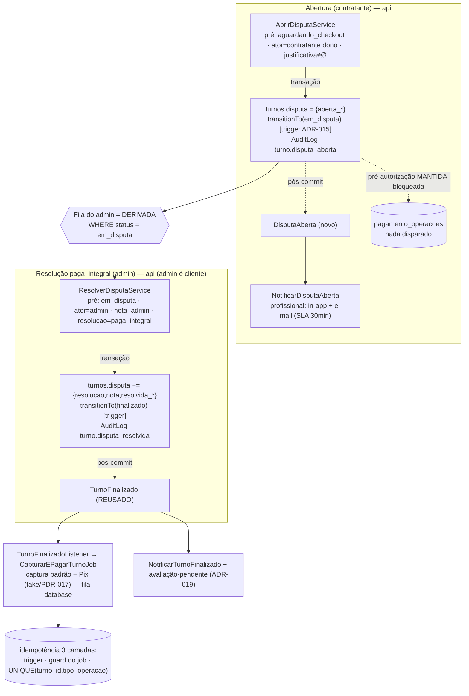

# ADR-020 — Modelo de disputa, transições e comando de captura do admin

## Contexto

O EPIC-005 fecha a WAVE-2026-01 entregando o **caminho de exceção do check-out**: quando o contratante recusa validar o turno no ponto de check-out, o turno entra em `em_disputa` e a equipe Turni resolve no backoffice. Hoje esse caminho não existe — `ValidarCheckoutService::recusar()` (STORY-064) leva o turno de volta a `ativo` ("PIN errado / peça um novo") e tem um comentário explícito *"NUNCA `em_disputa` — EPIC-005 fora de escopo"*. Sem modelo fixado, a recusa por mérito (contestar o valor/desempenho) vira estado fantasma: turno preso, ninguém pago, ninguém notificado, admin sem ferramenta. Este é o **caminho de exceção mais crítico** do produto (PDR-006), e é a primeira vez que a disputa toca o backoffice de forma **transacional** (move dinheiro).

Antes de qualquer código (STORY-092/093/096 ficam `blocked` até este ADR estar `accepted`), é preciso fixar quatro coisas: **(1)** onde mora a disputa (atributos embutidos no turno vs entidade própria); **(2)** as transições `aguardando_checkout → em_disputa` (abertura) e `em_disputa → finalizado` (resolução `paga_integral`); **(3) — crítico —** como o **admin** dispara a captura padrão + Pix fora do fluxo normal de check-out, já que (a) o admin é um **app separado** (`apps/admin`, Laravel+Livewire sobre o mesmo banco) e (b) no MVP o pagamento passa por um **fake genérico atrás da ACL** (PDR-017), reusando a idempotência financeira (ADR-016); **(4)** o(s) evento(s) de domínio que notificam o profissional na abertura e na resolução, reusando o padrão da ADR-019.

As restrições que chegam consolidadas:

- **`domain/disputa.md`** — a disputa nasce **apenas** no check-out, com `justificativa_contratante` **obrigatória** (sem ela, o caminho é validar). Atributos anexados ao turno: `aberta_em`, `aberta_por` (sempre o contratante no MVP), `justificativa_contratante`, `resolucao`, `valor_revisado` (só em `paga_parcial`), `nota_admin`, `resolvida_em`, `resolvida_por`. SLA público de **30 min**. O admin vê **chat, geofencing, checklist, cronômetro, justificativa, vaga original** para decidir.
- **`domain/turno.md`** — a máquina de estados lista `disputa` como atributo do turno (`{ aberta_em, justificativa_contratante, resolucao?, valor_revisado? }`, no mesmo grão de `cancelamento`); a transição `aguardando_checkout → em_disputa` ("contratante contesta") e `em_disputa → finalizado` ("paga integral") **já estão modeladas** no enum/trigger.
- **`domain/pagamento.md` §Disputa** — em `em_disputa` a pré-autorização permanece **bloqueada**; `paga_integral` → "captura igual ao fluxo normal".
- **ADR-015** — a máquina de estados é **invariante de banco** (trigger `enforce_turno_transition` + enum PHP `TurnoStatus` espelho). As 13 transições válidas **já incluem** `aguardando_checkout → em_disputa` e `em_disputa → finalizado` — foram modeladas na W28 *"para evitar uma migração de `ALTER TYPE` depois"*. **`turnos` ainda não tem coluna `disputa`** (tem `cancelamento` e `geofencing_*` jsonb).
- **ADR-016** — máquina financeira: `GatewayPagamento` (interface), `CapturarEPagarTurnoJob` (fila `database`, no worker), idempotência por índice único `(turno_id, tipo_operacao)` em `pagamento_operacoes` + `Idempotency-Key`. `capturarParcial` **já exposta** na interface (reservada ao EPIC-005), mas não implementada. PDR-017: driver é o **fake** em todos os ambientes do MVP.
- **ADR-019** — padrão de eventos de domínio: discovery off, registro **explícito** no `AppServiceProvider`, payload mínimo de IDs string UUID (o listener recarrega o agregado). `TurnoFinalizado` **já existe** e, ao ser emitido, dispara (a) o ciclo financeiro (`TurnoFinalizadoListener` → captura+Pix) e (b) a notificação. A ADR-019 já **antecipou** (linha §Resumo dos eventos) que *"a transição via disputa também emite `TurnoFinalizado` e o fluxo se aplica sem mudança"*.
- **ADR-018** (UUIDv7), **ADR-007** (RBAC), **ADR-008** (log estruturado / audit). **PDR-010** — Pix uma tentativa + alerta admin, sem retry.

**Estado do código que este ADR herda** (e que estreita as decisões):

- `ValidarCheckoutService` faz `aguardando_checkout → finalizado` **na transação** (com `AuditLog turno.checkout_validado`) e emite `TurnoFinalizado::dispatch($turno->id)` **pós-commit**. O `recusar()` faz `aguardando_checkout → ativo` com motivo **opcional** (é o "peça novo PIN", não a disputa).
- `CapturarEPagarTurnoJob::handle()` **re-verifica** `status === Finalizado` e faz no-op caso contrário (guard CA-9 da STORY-065) — ou seja, a captura é uma função do **estado terminal** do turno, disparada por evento, idempotente por operação.
- O backoffice `apps/admin` lê/escreve o **mesmo banco** via Eloquent próprio; a fila `PixFalhas` (Livewire) resolve casos **escritos pelo worker da api** (snapshot IDR-028) — o admin faz leitura + resolução **não-financeira** (marca um snapshot resolvido), **nunca** move dinheiro diretamente.

Este é um ADR de **modelo de dados + transições + ponto de disparo da captura + contrato de eventos**. Ele **não escreve código de produção** (STORY-092/093/096) nem decide telas/textos (STORY-091 — Designer).

## Forças (drivers) da decisão

- **F1 — Não criar caminho financeiro novo (PDR-017, ADR-016; risco do sprint "captura via fake diverge do check-out feliz"):** peso **alto**. A resolução `paga_integral` deve reusar **literalmente** a mesma máquina de captura+Pix do check-out feliz — outro caminho seria uma segunda fonte de bugs financeiros.
- **F2 — Idempotência financeira (risco explícito do sprint "reprocesso captura/paga em dobro"; `quality-standards.md` núcleo ≥98%):** peso **alto**. Admin clicar "pagar integral" duas vezes, retry de job ou reenvio de evento **não** pode capturar/pagar em dobro. Garantia estrutural, não disciplina.
- **F3 — Sem estado fantasma / dinheiro single-sourced (PDR-006; risco "backoffice transacional pela 1ª vez"):** peso **alto**. A finalização da disputa **tem que** disparar a captura — não pode existir "finalizado mas nunca capturado". O dono da máquina de estados e da máquina financeira é a **api**; o admin não pode duplicá-las.
- **F4 — Simplicidade / não-antecipação (princípio #1; lição W30 "derive, não materialize"):** peso **alto**. Nada de tabela de fila de disputas, nem entidade nova, se o estado do turno já deriva tudo o que o MVP precisa.
- **F5 — Coerência com ADR-015/016/019 (defesa em profundidade; "derive, não cacheie"):** peso **médio-alto**. Transição como invariante de banco (trigger), eventos síncronos no padrão do projeto, reuso de `TurnoFinalizado`, fila derivada do estado.
- **F6 — Auditabilidade completa (`disputa.md`, `compliance.md`):** peso **médio-alto**. Abertura (justificativa, quem, quando) e resolução (admin, decisão, nota, quando) precisam de trilha à prova de adulteração — e o admin precisa ver a trilha **completa** do turno para decidir.
- **F7 — Reversibilidade / ponto de extensão para a WAVE-2026-02 (princípio #7):** peso **médio**. `paga_parcial`/`sem_pagamento` ficam fora do MVP, mas o modelo não pode fechar a porta para elas (EPIC-007).

---

## Decisão 1 — A disputa mora **embutida no turno** (`turnos.disputa` jsonb), não em tabela própria

### Opção 1A — `disputa` como coluna `jsonb` em `turnos` (**escolhida**)

Adiciona `turnos.disputa jsonb nullable` (migração da STORY-092), no mesmo grão de `cancelamento` e `geofencing_*` (ADR-015). Forma do documento:

```jsonc
{
  "aberta_em":  "2026-06-10T14:03:00Z",   // timestamp da recusa por mérito
  "aberta_por": "<uuid do contratante>",   // sempre o contratante no MVP
  "justificativa_contratante": "texto livre, OBRIGATÓRIO e não-vazio",
  "resolucao":  "paga_integral",           // null enquanto aberta; só paga_integral no MVP
  "nota_admin": "justificativa da decisão",  // null enquanto aberta
  "resolvida_em":  "2026-06-10T14:21:00Z",   // null enquanto aberta
  "resolvida_por": "<uuid do admin>"         // null enquanto aberta
}
```

`valor_revisado` (de `disputa.md`) **não entra no MVP** — só existiria em `paga_parcial` (fora de escopo, Decisão 5). A **obrigatoriedade** da justificativa e a **validade** de `resolucao` são garantidas no **comando de domínio** (Decisões 2 e 3), não por constraint de banco — jsonb não comporta CHECK sobre chave interna, e a porta de entrada é sempre o service (a transição é invariante de banco pelo trigger; o conteúdo da disputa é validado na aplicação, como `cancelamento` já é).

**Por que embutir, e não uma tabela** (a precedente ADR-019 escolheu *tabela* para `avaliacoes`): a regra que separa as duas formas no Turni é **"é consultado/agregado entre turnos, com constraints duras e cardinalidade > 1?"**.

| Critério | `avaliacoes` (ADR-019 → **tabela**) | `disputa` (aqui → **jsonb**) | `cancelamento` (ADR-015 → **jsonb**) |
|---|---|---|---|
| Cardinalidade por turno | 2 (uma por direção) | **≤ 1** | ≤ 1 |
| Consulta cross-turno (agregação) | sim (score, depoimentos) | **não no MVP** (padrões de abuso são análise **manual/futura** — `disputa.md`) | não |
| Constraints duras de banco | sim (UNIQUE, CHECK estrelas) | **não** (validação no comando) | não |
| Acesso | sempre "recebidas por X" | sempre **no contexto de UM turno** (fila = estado; caso = 1 turno) | no contexto de 1 turno |

A disputa cai inteira do lado de `cancelamento`: **1:1, contextual, sem agregação cross-turno no MVP, sem constraint dura**. `disputa.md` e `turno.md` já a descrevem como **atributo do turno**. Embutir honra o princípio #1 (sem tabela/modelo/trigger novos) e mantém a coesão do agregado Turno. A **auditabilidade** (F6) não depende da forma da coluna: vem de duas entradas imutáveis em `audit_logs` (`turno.disputa_aberta`, `turno.disputa_resolvida`, Decisões 2/3) — mesmo mecanismo que prova `cancelamento` hoje.

### Opção 1B — Tabela própria `disputas`

- ⚠️ **Normalização que não paga (F4):** 1:1 com o turno, sem cardinalidade nem agregação que a justifique no MVP — JOIN, migração, modelo e (se quiséssemos imutabilidade) trigger novos, contra o princípio #1.
- ⚠️ Replicaria o raciocínio de `avaliacoes` **sem** os motivos que o sustentaram lá (cross-query + constraints + N linhas).
- **Razão de não escolher:** paga estrutura por uma queryabilidade que o MVP não exerce. **Ponto de extensão registrado:** se a WAVE-2026-02 precisar de analytics de disputa (detecção de abuso automatizada, recurso do profissional, anexos/evidências), promover `disputa` para tabela é uma migração **localizada** (extrair o jsonb), sem tocar a máquina de estados nem a financeira.

### Decisão 1 — **Opção 1A.** `disputa` é uma coluna `jsonb` em `turnos` (grão de `cancelamento`); obrigatoriedade/validade no comando de domínio; auditabilidade via `audit_logs`.

---

## Decisão 2 — Abertura: comando próprio `AbrirDisputaService`, transição `aguardando_checkout → em_disputa`

### Decisão

A abertura é um **comando de domínio novo na api** — `App\Services\AbrirDisputaService` (STORY-092) —, **distinto** do `ValidarCheckoutService::recusar()` existente. Razão: hoje "recusar" devolve o turno a `ativo` (peça novo PIN, motivo **opcional**); abrir disputa é o **outro** ramo de `aguardando_checkout` (contestar por mérito, justificativa **obrigatória**) que a máquina de estados já prevê. São duas ações distintas do contratante no ponto de check-out — qual affordance de UI mapeia para cada uma é decisão do Designer (STORY-091/094); o ADR só fixa que são **comandos separados**.

**Pré-condições (fail-secure, F3):**
- turno em `aguardando_checkout`;
- ator = **contratante dono da vaga** do turno (`turno.contratante_id`) — RBAC ortogonal (ADR-007): a policy diz *se o papel pode*, o serviço confere *se é o dono daquele turno*;
- `justificativa_contratante` **não-vazia** (após `trim`) — sem ela o serviço aborta com erro de domínio (`DisputaSemJustificativaException` ou validação equivalente); o caminho alternativo é validar o check-out.

**Efeito (em uma transação):**
1. grava `turnos.disputa = { aberta_em: now(), aberta_por: contratante_id, justificativa_contratante, resolucao: null, nota_admin: null, resolvida_em: null, resolvida_por: null }`;
2. `transitionTo(TurnoStatus::EmDisputa)` — passa pelo trigger `enforce_turno_transition` (invariante de banco, ADR-015); um 2º clique encontra o turno já em `em_disputa` e a transição falha (idempotência de abertura por construção);
3. `AuditLog turno.disputa_aberta` (`actor_id = contratante_id`, payload com a justificativa + ip/user-agent), no padrão de `ValidarCheckoutService`.

**A pré-autorização permanece bloqueada:** nada financeiro é disparado na abertura. Coerente com a máquina existente — a captura só ocorre via `TurnoFinalizado`/estado `finalizado` (guard CA-9 do `CapturarEPagarTurnoJob`); em `em_disputa` não há evento financeiro, logo a pré-autorização Pagar.me/fake fica intacta (`domain/pagamento.md`).

**Evento de domínio:** após o commit (espelhando o ponto onde `ValidarCheckoutService` emite `TurnoFinalizado`), o serviço emite **`App\Events\DisputaAberta($turnoId)`** (payload: UUID string; o listener recarrega o agregado — padrão ADR-018/019). Pós-commit, não dentro da transação, para não notificar sobre uma transição que pode dar rollback. Ver Decisão 4 para o listener.

---

## Decisão 3 — Resolução `paga_integral`: comando do admin na **api**, reusando `TurnoFinalizado` + a máquina financeira existente

Esta é a decisão central do ADR (CA-3) e o ponto onde o backoffice toca a disputa de forma **transacional**.

### Opção 3A — A resolução é um **comando da api** (`ResolverDisputaService`) que reusa `TurnoFinalizado`; o admin é cliente (**escolhida**)

A resolução "pagar integral" executa como um comando de domínio **na api** — `App\Services\ResolverDisputaService` (STORY-093) —, exposto por um **endpoint autenticado de admin** que o backoffice (STORY-096) invoca. O admin **não** escreve a transição nem dispara a captura direto no banco.

**Efeito (em uma transação na api):**
1. pré-condições (fail-secure): turno em `em_disputa`; ator = **admin** (RBAC ADR-007); `nota_admin` presente (a trilha precisa da história — mesmo princípio do `PixFalhas`); `resolucao = paga_integral` (único valor aceito no MVP — Decisão 5);
2. atualiza `turnos.disputa` com `resolucao: 'paga_integral'`, `nota_admin`, `resolvida_em: now()`, `resolvida_por: admin_id`;
3. `transitionTo(TurnoStatus::Finalizado)` — passa pelo trigger (`em_disputa → finalizado` é transição válida, ADR-015);
4. `AuditLog turno.disputa_resolvida` (`actor_id = admin_id`, payload com `resolucao` + `nota_admin` truncado/ref + ip/user-agent).
5. **pós-commit:** emite **`TurnoFinalizado::dispatch($turnoId)`** — o **mesmo** evento do check-out feliz.

A partir daí, **nada novo acontece**: `TurnoFinalizado` já dispara `TurnoFinalizadoListener → CapturarEPagarTurnoJob` (captura padrão + Pix via fake, no worker, fila `database`) **e** `NotificarTurnoFinalizado` **e** o listener de avaliação-pendente (ADR-019). A captura é a **mesma máquina** do check-out feliz, agora disparada por comando do admin — exatamente o que `pagamento.md §Disputa` pede ("captura igual ao fluxo normal") e o que a ADR-019 antecipou.

**Idempotência financeira em três camadas (F2):**
1. **trigger de transição** — `em_disputa → finalizado` só ocorre uma vez; um 2º "pagar integral" encontra o turno já `finalizado`, a transição falha → nenhum evento extra;
2. **guard do job** — `CapturarEPagarTurnoJob` re-verifica `status === Finalizado` (no-op caso contrário);
3. **índice único `(turno_id, tipo_operacao)`** em `pagamento_operacoes` (ADR-016) + `OperacaoIdempotente` curto-circuitam captura/Pix repetidos, mesmo sob retry de job ou reenvio de webhook.

**Por que comando da api e não escrita direta do admin no banco (F1/F3):** o backoffice compartilha o banco e já faz resoluções **não-financeiras** direto (PixFalhas marca um snapshot resolvido). Mas a resolução de disputa **move dinheiro**, e a captura é disparada por um **evento in-process da api** (`TurnoFinalizado`) que um processo separado (admin) **não consegue emitir**. Se o admin apenas virasse `turnos.status` no banco, **nenhum evento dispararia** → "finalizado mas nunca capturado" — precisamente o estado fantasma que o épico existe para matar. Portanto a máquina financeira fica **single-sourced na api**: a api é a única que transita o turno e dispara a captura; o admin é um **cliente** desse comando. O **mecanismo** do canal admin→api (endpoint HTTP autenticado por sessão de admin vs serviço-a-serviço) é detalhe de implementação de STORY-093/096 — registrar como **IDR** —; o ADR fixa o **princípio**: comando da api, não escrita direta.

### Opção 3B — O admin escreve a transição no banco compartilhado e dispara o job

- ❌ **Acopla os apps:** o admin precisaria do `CapturarEPagarTurnoJob` (classe da api) ou montar o payload serializado do job na tabela `jobs` — frágil e duplicado.
- ❌ **Risco de fantasma (F3):** virar `status` sem o evento = finalizado sem captura; reintroduzir um caminho financeiro fora da api viola F1.
- **Razão de não escolher:** quebra o single-sourcing do dinheiro pela conveniência de não criar um canal admin→api — exatamente o trade-off errado num caminho que move dinheiro.

### Opção 3C — Materializar a captura por observação de estado (poll/DB-trigger no banco)

- ❌ Reintroduz peça materializada/polling que o projeto evita; o evento in-process é mais simples e já existe.

### Decisão 3 — **Opção 3A.** Resolução é comando da **api** (`ResolverDisputaService`), reusa `TurnoFinalizado` → captura+Pix existentes, idempotente em três camadas; admin é cliente via endpoint autenticado (mecanismo do canal = IDR de implementação).

---

## Decisão 4 — Eventos/notificação e a **fila do admin derivada do estado**

### Decisão

**Abertura — evento novo `DisputaAberta`.** Listener **`NotificarDisputaAberta`** (registrado **explicitamente** no `AppServiceProvider` — discovery off, ADR-019) notifica **o profissional** via in-app **+ e-mail**, reusando `App\Services\Notificacao` / a fila de e-mail (mecanismo da STORY-067): *"valor em disputa — mediação em até 30 min"* (SLA público de `disputa.md`). O texto exato é do Designer (STORY-091/095); o ADR fixa o gatilho, o destinatário e os canais.

**Resolução — reuso de `TurnoFinalizado` (sem evento novo).** A notificação de resolução ao profissional é a **mesma** disparada pela finalização do check-out feliz (`NotificarTurnoFinalizado` — "turno finalizado/pago" + avaliação pendente). Criar um `DisputaResolvida` separado seria redundante: do ponto de vista do profissional, `paga_integral` é um turno que finalizou e foi pago. Menos peças (F4), coerente com a ADR-019.

**Fila do admin = DERIVADA do estado (preferido — lição W30).** Não há tabela nem coluna de "fila de disputas". O caso está na fila se, e somente se, `turnos.status = 'em_disputa'`; o admin o resolve e ele **sai** da fila ao transitar para `finalizado`. Espelha a postura "derive, não materialize" (ADR-014/019) e evita a janela de inconsistência de uma fila materializada (criar na abertura, apagar na resolução). Difere do `pix_falhas` (que **é** snapshot materializado escrito pelo worker) porque ali o caso **não** é derivável de um estado do turno — uma falha de Pix é um evento pontual sem estado-espelho; a disputa **é** um estado do turno. **Volume/índice:** disputa é evento raro (SLA 30 min, baixo volume); a query `WHERE status = 'em_disputa'` (sem prefixo de papel) varre pouco no MVP — os índices `(papel_id, status)` de ADR-015 não a cobrem por papel-líder, mas um **índice parcial** `WHERE status = 'em_disputa'` é o ponto de extensão **se** a fila crescer (não criar agora — princípio #1).

### Resumo dos eventos

| Evento | Novo? | Quando | Payload | Listener(s) |
|---|---|---|---|---|
| `DisputaAberta` | **novo** | pós-commit de `aguardando_checkout → em_disputa` | `turnoId` | `NotificarDisputaAberta` (in-app + e-mail ao profissional) |
| `TurnoFinalizado` | **reusado** | pós-commit de `em_disputa → finalizado` (resolução) | `turnoId` | `TurnoFinalizadoListener` (captura+Pix, existente) **+** `NotificarTurnoFinalizado` (existente) **+** avaliação-pendente (ADR-019) |

---

## Decisão 5 — O que fica **fora do MVP** (e o ponto de extensão)

Ficam **fora do EPIC-005/MVP**, com os motivos:

- **Resoluções `paga_parcial` e `sem_pagamento`** — e portanto os estados `finalizado_ajustado` e `disputa_resolvida_sem_pagamento`. Os estados/transições **já existem** no enum/trigger (ADR-015 os modelou), mas os **comandos** que os disparam não entram. `resolucao` no MVP aceita **só** `paga_integral`.
- **Captura/estorno parcial** — `capturarParcial` está **exposta** na interface `GatewayPagamento` (ADR-016) mas **não** é implementada além do happy path; `liberar` (sem pagamento) idem. `valor_revisado` na `disputa` não é gravado no MVP.
- **Penalidade automática de score** por disputa — `disputa.md` é explícito: no MVP basta o registro; penalização é manual/futura.
- **Recurso do profissional, anexos/evidências, janela máxima para abrir disputa, comunicação automatizada entre as partes** — todas listadas como lacunas em `disputa.md`, fora do MVP.

**Ponto de extensão (WAVE-2026-02 / EPIC-007):** adicionar `paga_parcial`/`sem_pagamento` é **incremental e sem migração de `ALTER TYPE`** (os estados existem): novos comandos `ResolverDisputaParcial`/`ResolverDisputaSemPagamento` na api, usando `capturarParcial`/`liberar` (já na ACL) e gravando `valor_revisado`. Se aquele épico precisar de analytics/recurso/anexos, promover `disputa` (jsonb) para tabela é migração localizada (Decisão 1).

---

## Decisão 6 — Trilha de leitura do admin: **agregação de leitura sobre dados existentes**, sem contrato de domínio novo (CA-6)

O admin precisa ver a **trilha completa** para decidir: **chat, geofencing, checklist, cronômetro, justificativa, vaga original, histórico de ambos** (`disputa.md`). **Todos esses dados já existem** no agregado Turno e ao redor dele — geofencing (`turnos.geofencing_check_in/out` jsonb), cronômetro (`check_in_at`/`check_out_at`), vaga original (snapshot `vaga_versao_id`, ADR-013/015), justificativa (`turnos.disputa` — Decisão 1), chat/checklist (entidades/colunas do turno), e a trilha imutável (`audit_logs`, incl. `turno.disputa_aberta`/`turno.disputa_resolvida`).

**Decisão:** a tela de caso do admin é uma **agregação de leitura nova no backoffice** (STORY-096) que **reusa dados existentes** — **nenhum** novo contrato de domínio, escrita ou endpoint de mutação além do comando da Decisão 3. O ADR fixa apenas a **fronteira de dados** (o que a leitura compõe e de onde vem); a **forma** dessa leitura — endpoint de leitura na api consumido pelo admin **vs** o admin lendo o banco compartilhado direto (como já faz para `PixFalhas`/listas) — é detalhe de STORY-096 (**IDR**), coerente com a Decisão 3 (só a **mutação financeira** exige o comando da api; **leitura** pode seguir o padrão de banco compartilhado já usado no backoffice). O ADR **não** inventa contrato de UI (telas/textos são da STORY-091/096).

---

## Decisão proposta (consolidada)

> **A disputa vive embutida no turno como `turnos.disputa` (jsonb, grão de `cancelamento`) — não tabela própria —, com obrigatoriedade da justificativa e validade da resolução garantidas nos comandos de domínio e auditabilidade via `audit_logs`. A abertura é um comando próprio da api (`AbrirDisputaService`), distinto do `recusar()` existente: `aguardando_checkout → em_disputa` (trigger/ADR-015), justificativa obrigatória, pré-autorização mantida bloqueada, emitindo o evento novo `DisputaAberta` que notifica o profissional (in-app + e-mail, SLA 30 min). A resolução `paga_integral` é um comando da api (`ResolverDisputaService`) invocado pelo backoffice como cliente — nunca escrita direta do admin no banco —, que transita `em_disputa → finalizado` e emite o `TurnoFinalizado` já existente, reusando integralmente a máquina de captura+Pix do check-out feliz (fake/PDR-017), idempotente em três camadas (trigger + guard do job + índice único de `pagamento_operacoes`). A fila do admin é derivada do estado `em_disputa` (não materializada). `paga_parcial`/`sem_pagamento` ficam fora do MVP (estados já modelados; comandos adiados ao EPIC-007). A trilha de leitura do admin é uma agregação de dados já existentes no turno — sem contrato de domínio novo.**

## Diagrama



## Consequências

### Positivas (o que ganhamos)
- **Zero caminho financeiro novo (F1):** `paga_integral` reusa `TurnoFinalizado` → a captura+Pix do check-out feliz; o fake (PDR-017) e a idempotência (ADR-016) valem sem mudança.
- **Idempotência por construção (F2):** três camadas (trigger + guard + índice único) → "pagar integral" duas vezes, retry de job ou reenvio de webhook nunca capturam/pagam em dobro.
- **Sem estado fantasma + dinheiro single-sourced (F3):** a finalização sempre dispara a captura, e a máquina financeira fica só na api; o admin é cliente, não duplica.
- **Nenhuma peça nova (F4):** sem tabela de disputa, sem fila materializada, sem entidade — uma coluna jsonb, um comando de abertura, um comando de resolução, um evento novo e um listener.
- **Auditabilidade completa (F6):** abertura e resolução em `audit_logs` imutáveis; trilha de leitura reusa dados já existentes no turno.
- **Coerente com ADR-015/016/019** e **reversível (F7):** `paga_parcial`/`sem_pagamento` entram depois sem `ALTER TYPE`; jsonb→tabela é migração localizada se a próxima onda precisar.

### Negativas / trade-offs aceitos
- **`disputa` em jsonb não é consultável por SQL indexado** (padrões de abuso cross-turno). Aceito: análise de abuso é manual/futura no MVP (`disputa.md`); ponto de extensão registrado.
- **Validade da `resolucao` e obrigatoriedade da justificativa vivem no comando, não em constraint** (jsonb não comporta CHECK de chave interna). Aceito: a porta de entrada é sempre o service; mesma postura de `cancelamento`. Mitigação: testes de borda no núcleo (≥98%).
- **Primeiro canal transacional admin→api** (mutação financeira via comando da api, não escrita direta). Custo: um endpoint/canal novo a definir (IDR de STORY-093/096). Aceito: é o preço de manter o dinheiro single-sourced — o trade-off certo.
- **Fila do admin sem índice dedicado no MVP** (`WHERE status='em_disputa'` não casa o líder dos índices de papel). Aceito no volume do MVP; índice parcial é o gatilho de revisão.

### Neutras
- A `disputa` é **mutável** (abertura→resolução faz `UPDATE` do jsonb), como `cancelamento` e diferente de `aceites_eletronicos_turno`; a imutabilidade da história vive em `audit_logs`.
- A leitura do caso do admin pode seguir o padrão de **banco compartilhado** já usado no backoffice (só a mutação financeira exige a api) — decisão fina de STORY-096.

### Para o time
- **Destrava:** **STORY-092** (migração `turnos.disputa` + `AbrirDisputaService` + transição + evento `DisputaAberta` + `NotificarDisputaAberta`) e **STORY-093** (`ResolverDisputaService` + reuso de `TurnoFinalizado` + endpoint de admin). **STORY-096** (backoffice: fila derivada + caso + chamar a resolução) destrava transitivamente via 093. **STORY-094/095** (frontends) consomem o estado/justificativa.
- **Gatilho de quebra de STORY-092 (L):** se modelo+transição+justificativa (parte a) + evento+notificação (parte b) não couber numa sessão, separe **exatamente** nessas duas — o evento `DisputaAberta` é a fronteira limpa (mesmo padrão que ADR-019 deu para STORY-085). Escale ao PO antes de inflar.
- **IDR(s) esperados de implementação:** (1) **mecanismo do canal admin→api** para a resolução (endpoint HTTP autenticado por sessão de admin vs serviço-a-serviço) — Decisão 3; (2) **forma da leitura do caso** (endpoint de leitura na api vs banco compartilhado) — Decisão 6.
- **ADRs/PDRs:** consome ADR-015 (transições/trigger), ADR-016 (captura/idempotência/fake), ADR-019 (eventos/notificação), ADR-018 (UUID), ADR-007 (RBAC), ADR-008 (audit/log); honra PDR-006 (disputa via admin, SLA 30 min), PDR-017 (fake), PDR-004/010 (modelo financeiro/Pix sem retry).
- **Necessidade de spike de validação:** **não** — mecanismos padrão Laravel/Postgres já no projeto; STORY-092/093/096 materializam e validam (testes + idempotência por replay + EXPLAIN da fila).

## Plano de verificação

- **Como verificar conformidade:**
  - **Modelo (CA-1):** migração adiciona `turnos.disputa jsonb nullable`; `migrate:fresh` + `rollback` verdes; o jsonb carrega exatamente os atributos do MVP.
  - **Abertura (CA-2):** teste de `aguardando_checkout → em_disputa` via `AbrirDisputaService` (ator contratante dono, justificativa obrigatória) grava `disputa` + `AuditLog turno.disputa_aberta`; rejeita justificativa vazia, ator não-dono e turno fora de `aguardando_checkout`; assevera **nenhuma** operação em `pagamento_operacoes` (pré-autorização intacta); o trigger rejeita a transição a partir de estado inválido (SQL cru).
  - **Resolução + idempotência (CA-3, F2 — núcleo ≥98%):** teste de `em_disputa → finalizado` por `ResolverDisputaService` (ator admin, `nota_admin`, `resolucao=paga_integral`) emite `TurnoFinalizado` e produz **exatamente uma** captura + um Pix; **2ª** resolução / **replay** do evento → transição falha e/ou índice único curto-circuita → **sem** captura/Pix em dobro; guard do job no-op para turno não-`finalizado`.
  - **Eventos/notificação (CA-4):** registro explícito no `AppServiceProvider` (discovery off); `DisputaAberta` aciona `NotificarDisputaAberta` (in-app + e-mail ao profissional); `TurnoFinalizado` (via resolução) aciona os três listeners existentes. Fila do admin = query `WHERE status='em_disputa'` (sem tabela), com EXPLAIN no volume do MVP.
  - **Fora do MVP (CA-5):** `ResolverDisputaService` recusa `resolucao ≠ paga_integral`; `capturarParcial`/`liberar` não são chamadas no caminho da disputa.
  - **Trilha de leitura (CA-6):** a composição do caso reusa colunas/entidades existentes do turno + `disputa` + `audit_logs`; nenhum contrato de domínio/escrita novo além do comando de resolução.
- **Sinais de revisão (quando reabrir):**
  - WAVE-2026-02 ligar `paga_parcial`/`sem_pagamento`, recurso, anexos ou analytics de abuso → adicionar comandos (sem `ALTER TYPE`) e, se preciso queryabilidade, promover `disputa` para tabela.
  - Volume da fila de disputa degradar a query por status → índice parcial `WHERE status='em_disputa'`.
  - O canal admin→api (IDR) revelar necessidade de transação distribuída/consistência mais forte → reabrir o ponto de disparo (hoje: evento in-process na api é suficiente).

## Fora de escopo

- Qualquer código de produção, migração ou teste (é da STORY-092/093/096).
- Telas, layout, textos (STORY-091 — Designer).
- Modelar/implementar `paga_parcial`/`sem_pagamento` (fora do MVP — Decisão 5).
- Reabrir PDR-006/PDR-017 — decisões de produto vigentes; este ADR vive dentro delas.

---

## Aprovação humana

> Esta seção é o registro formal do aceite. Não preencher sozinho — preencher quando Alexandro aprovar no chat ou via PR.

- **Status final:** ✅ aceita
- **Aprovado por:** Alexandro
- **Data:** 2026-06-10
- **Forma do aceite:** aprovado em chat (sessão de 2026-06-10 com PO/Claude) — "aprovada", sobre a versão `proposed` integral (6 decisões).
- **Condicionantes do aceite:** nenhuma.

### Em caso de rejeição
- **Motivo:** …
- **Próximos passos sugeridos:** …

---

## Histórico

- 2026-06-10 — `accepted` por Alexandro (aprovação em chat, "aprovada"), sem condicionantes. Destrava STORY-092 (abertura) e STORY-093 (resolução); STORY-096 (backoffice) via 093.
- 2026-06-10 — criada como `proposed` por Arquiteto (STORY-090, claude-opus-4-8-arquiteto-2026-06-10). Seis decisões: (1) `disputa` embutida em `turnos` (jsonb, grão de `cancelamento`) — diverge da forma-tabela de `avaliacoes`/ADR-019 por ser 1:1/contextual/sem agregação cross-turno; (2) abertura via comando próprio `AbrirDisputaService` (`aguardando_checkout → em_disputa`, justificativa obrigatória, pré-autorização mantida), distinto do `recusar()` existente; (3) resolução `paga_integral` como comando da **api** (`ResolverDisputaService`) reusando `TurnoFinalizado` + a máquina de captura+Pix existente, idempotente em três camadas — admin é cliente, nunca escrita direta no banco; (4) evento novo `DisputaAberta` (notifica profissional) + reuso de `TurnoFinalizado` na resolução; fila do admin **derivada** do estado `em_disputa`; (5) `paga_parcial`/`sem_pagamento` fora do MVP (estados já modelados; comandos ao EPIC-007); (6) trilha de leitura do admin = agregação de dados já existentes, sem contrato de domínio novo. Aguarda aprovação do Alexandro para `accepted`.
